# Project Guide: Freight Price Movement Agent

## 1. Project Overview

The Freight Price Movement Agent is an automated system designed to track, analyze, and report changes in freight charges over specified time periods. This solution addresses the critical business need for timely, accurate insights into logistics cost fluctuations to support data-driven decision-making in supply chain management.

The system enables logistics professionals to:
- Track freight price changes across different time periods
- Calculate absolute and percentage changes in freight costs
- Identify trends (increasing, decreasing, or stable)
- Visualize price movements through charts and graphs
- Export results in various formats (JSON, CSV, text)

Target users include logistics managers, supply chain analysts, procurement teams, and financial planners who need to optimize costs, improve budget forecasting, and make strategic carrier selections based on price trend data.

## 2. System Architecture

### 2.1 High-Level Architecture

The Freight Price Movement Agent follows a modular, layered architecture based on the microservices pattern to ensure separation of concerns, maintainability, and scalability.

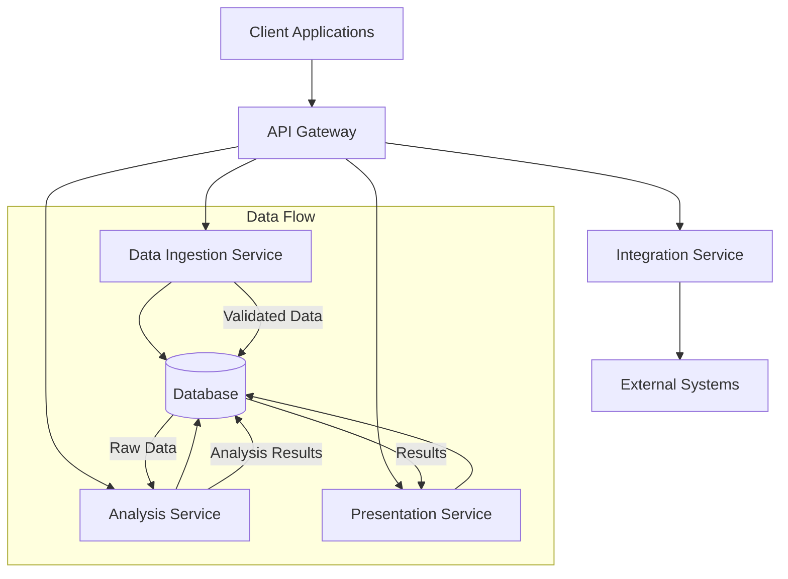
```mermaid
graph TD
    A[Client Applications] --> B[API Gateway]
    B --> C[Data Ingestion Service]
    B --> D[Analysis Service]
    B --> E[Presentation Service]
    B --> F[Integration Service]
    
    C --> G[(Database)]
    D --> G
    E --> G
    F --> H[External Systems]
    
    subgraph "Data Flow"
        C -->|Validated Data| G
        G -->|Raw Data| D
        D -->|Analysis Results| G
        G -->|Results| E
    end
```

### 2.2 Core Components

| Component | Description | Responsibility |
|-----------|-------------|----------------|
| Data Ingestion Service | Collects and validates freight data | Connects to data sources, validates and normalizes data, stores in database |
| Analysis Engine | Performs price movement calculations | Calculates absolute/percentage changes, identifies trends, manages caching |
| Presentation Service | Formats and delivers results | Transforms results into various formats (JSON, CSV, text), generates visualizations |
| Integration Service | Connects with external systems | Facilitates data exchange with TMS, ERP, and other enterprise systems |
| Database | Stores freight data and analysis results | Persists data with time-series optimization |

### 2.3 Technology Stack

| Component | Technology | Purpose |
|-----------|------------|---------|
| Backend | Python 3.9+ | Core application logic, data processing |
| Frontend | React/TypeScript | User interface for configuring analyses and viewing results |
| Database | PostgreSQL with TimescaleDB | Storage optimized for time-series data |
| Caching | Redis | Performance optimization for frequent queries |
| Containerization | Docker | Application packaging and deployment |
| Orchestration | AWS ECS/Kubernetes | Container management and scaling |

## 3. Core Features

### 3.1 Data Collection & Ingestion

The Data Ingestion Service is responsible for collecting freight pricing data from multiple sources, validating it, and storing it in the database.

#### Supported Data Sources:
- CSV files
- Databases (via direct connection)
- APIs (REST/SOAP)
- TMS (Transportation Management Systems)
- ERP (Enterprise Resource Planning) systems

#### Data Ingestion Flow:

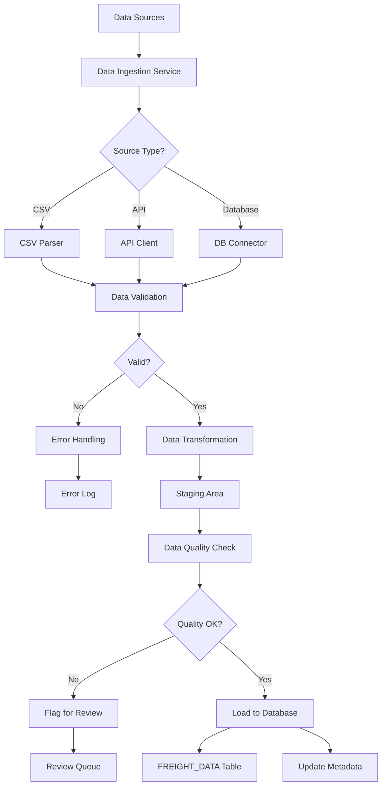
```mermaid
flowchart TD
    A[Data Sources] --> B[Data Ingestion Service]
    
    B --> C{Source Type?}
    C -->|CSV| D[CSV Parser]
    C -->|API| E[API Client]
    C -->|Database| F[DB Connector]
    
    D --> G[Data Validation]
    E --> G
    F --> G
    
    G --> H{Valid?}
    H -->|No| I[Error Handling]
    I --> J[Error Log]
    
    H -->|Yes| K[Data Transformation]
    K --> L[Staging Area]
    
    L --> M[Data Quality Check]
    M --> N{Quality OK?}
    
    N -->|No| O[Flag for Review]
    O --> P[Review Queue]
    
    N -->|Yes| Q[Load to Database]
    Q --> R[FREIGHT_DATA Table]
    Q --> S[Update Metadata]
```

#### Key Features:
- Automated data collection from multiple sources
- Data validation and quality checks
- Normalization to standard format
- Error handling and recovery
- Scheduled data ingestion

### 3.2 Time Period Selection

The system allows users to define specific time periods for analysis with flexible granularity options.

#### Granularity Options:
- Daily
- Weekly
- Monthly
- Quarterly
- Custom intervals

#### Time Period Selection Flow:

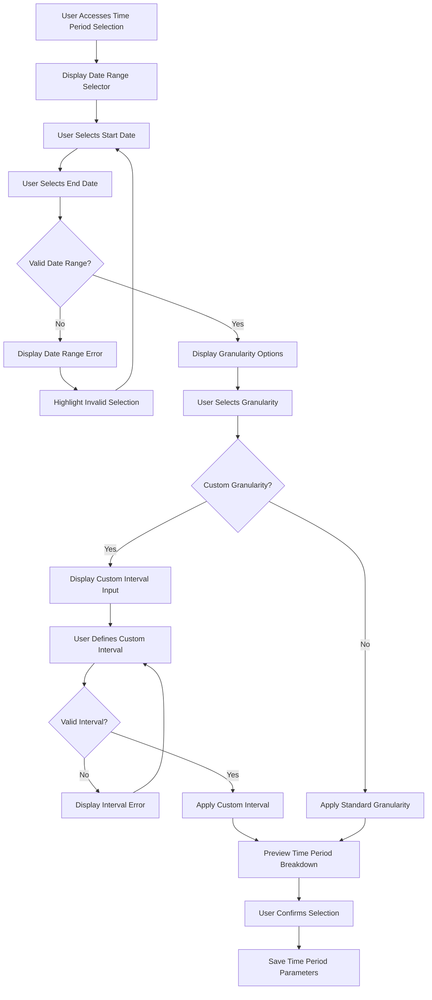
```mermaid
flowchart TD
    A[User Accesses Time Period Selection] --> B[Display Date Range Selector]
    
    B --> C[User Selects Start Date]
    C --> D[User Selects End Date]
    D --> E{Valid Date Range?}
    
    E -->|No| F[Display Date Range Error]
    F --> G[Highlight Invalid Selection]
    G --> C
    
    E -->|Yes| H[Display Granularity Options]
    H --> I[User Selects Granularity]
    
    I --> J{Custom Granularity?}
    J -->|Yes| K[Display Custom Interval Input]
    K --> L[User Defines Custom Interval]
    L --> M{Valid Interval?}
    
    M -->|No| N[Display Interval Error]
    N --> L
    
    M -->|Yes| O[Apply Custom Interval]
    J -->|No| P[Apply Standard Granularity]
    
    O --> Q[Preview Time Period Breakdown]
    P --> Q
    
    Q --> R[User Confirms Selection]
    R --> S[Save Time Period Parameters]
```

### 3.3 Price Movement Calculation

The Analysis Engine performs calculations to determine how freight prices have changed over the selected time period.

#### Calculation Types:
- Absolute change (end value - start value)
- Percentage change ((absolute change / start value) * 100)
- Trend direction (increasing, decreasing, stable)
- Statistical aggregates (average, minimum, maximum)

#### Calculation Flow:

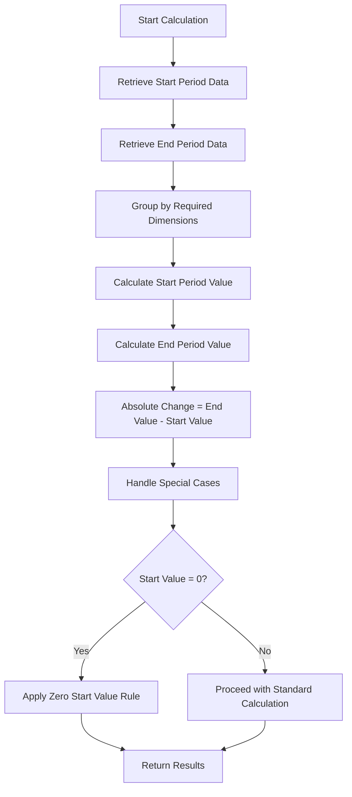
```mermaid
flowchart TD
    A[Start Calculation] --> B[Retrieve Start Period Data]
    B --> C[Retrieve End Period Data]
    C --> D[Group by Required Dimensions]
    D --> E[Calculate Start Period Value]
    E --> F[Calculate End Period Value]
    F --> G[Absolute Change = End Value - Start Value]
    G --> H[Handle Special Cases]
    H --> I{Start Value = 0?}
    I -->|Yes| J[Apply Zero Start Value Rule]
    I -->|No| K[Proceed with Standard Calculation]
    J --> L[Return Results]
    K --> L
```

#### Special Cases:
- Zero start value: Report as "New rate established" or use special handling
- Zero end value: Report as "-100%" or complete decrease
- Both zero: Report as "No change (0%)"

### 3.4 Result Presentation

The Presentation Service formats analysis results for delivery to users in various formats.

#### Output Formats:
- JSON: Structured data for API responses and integration
- CSV: Tabular data for spreadsheet analysis
- Text: Human-readable summaries
- Visualizations: Charts and graphs for visual analysis

#### Visualization Types:
- Line charts for time series data
- Bar charts for comparative analysis
- Trend indicators for quick status overview
- Comparison charts for multiple time periods

#### Result Presentation Flow:

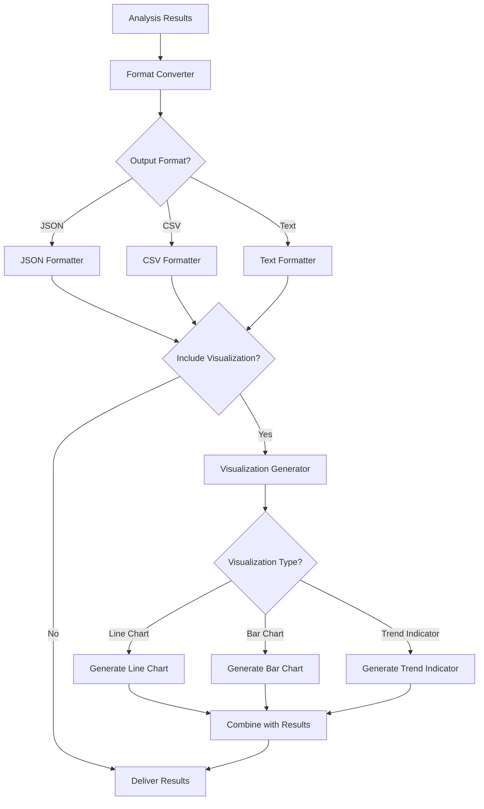
```mermaid
flowchart TD
    A[Analysis Results] --> B[Format Converter]
    B --> C{Output Format?}
    C -->|JSON| D[JSON Formatter]
    C -->|CSV| E[CSV Formatter]
    C -->|Text| F[Text Formatter]
    
    D --> G{Include Visualization?}
    E --> G
    F --> G
    
    G -->|Yes| H[Visualization Generator]
    G -->|No| I[Deliver Results]
    
    H --> J{Visualization Type?}
    J -->|Line Chart| K[Generate Line Chart]
    J -->|Bar Chart| L[Generate Bar Chart]
    J -->|Trend Indicator| M[Generate Trend Indicator]
    
    K --> N[Combine with Results]
    L --> N
    M --> N
    
    N --> I
```

### 3.5 Integration Capabilities

The system provides integration capabilities to connect with enterprise systems and external data sources.

#### Integration Points:
- TMS systems for freight data
- ERP systems for cost data
- External rate APIs for market data
- Reporting tools for result visualization

#### Integration Patterns:
- REST APIs for modern systems
- Database connections for direct access
- File-based integration for legacy systems
- Webhooks for event notifications

## 4. Data Model

### 4.1 Core Entities

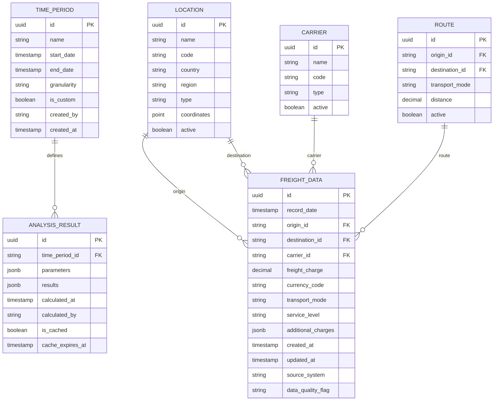
```mermaid
erDiagram
    FREIGHT_DATA {
        uuid id PK
        timestamp record_date
        string origin_id FK
        string destination_id FK
        string carrier_id FK
        decimal freight_charge
        string currency_code
        string transport_mode
        string service_level
        jsonb additional_charges
        timestamp created_at
        timestamp updated_at
        string source_system
        string data_quality_flag
    }
    
    TIME_PERIOD {
        uuid id PK
        string name
        timestamp start_date
        timestamp end_date
        string granularity
        boolean is_custom
        string created_by
        timestamp created_at
    }
    
    ANALYSIS_RESULT {
        uuid id PK
        string time_period_id FK
        jsonb parameters
        jsonb results
        timestamp calculated_at
        string calculated_by
        boolean is_cached
        timestamp cache_expires_at
    }
    
    LOCATION {
        uuid id PK
        string name
        string code
        string country
        string region
        string type
        point coordinates
        boolean active
    }
    
    CARRIER {
        uuid id PK
        string name
        string code
        string type
        boolean active
    }
    
    ROUTE {
        uuid id PK
        string origin_id FK
        string destination_id FK
        string transport_mode
        decimal distance
        boolean active
    }
    
    LOCATION ||--o{ FREIGHT_DATA : "origin"
    LOCATION ||--o{ FREIGHT_DATA : "destination"
    CARRIER ||--o{ FREIGHT_DATA : "carrier"
    ROUTE ||--o{ FREIGHT_DATA : "route"
    TIME_PERIOD ||--o{ ANALYSIS_RESULT : "defines"
```

### 4.2 Key Entity Descriptions

#### FreightData
Stores the core freight pricing data that will be analyzed for price movements over time. Each record represents a freight charge for a specific origin-destination pair, carrier, and transport mode at a particular point in time.

#### TimePeriod
Defines time periods for analysis with start and end dates and granularity settings. This entity allows users to create and save time periods for repeated analysis.

#### AnalysisResult
Stores the results of price movement analyses, including absolute and percentage changes, trend directions, and related metadata. This entity also supports caching of results for performance optimization.

#### Location
Represents origins and destinations for freight movements, including geographic information.

#### Carrier
Represents freight carriers with their names, codes, and types.

#### Route
Represents predefined origin-destination pairs for freight movements.

### 4.3 Enumerations

#### TransportMode
- OCEAN
- AIR
- ROAD
- RAIL
- MULTIMODAL

#### TrendDirection
- INCREASING
- DECREASING
- STABLE

#### GranularityType
- DAILY
- WEEKLY
- MONTHLY
- QUARTERLY
- CUSTOM

#### OutputFormat
- JSON
- CSV
- TEXT

#### AnalysisStatus
- PENDING
- PROCESSING
- COMPLETED
- FAILED

## 5. User Interface

### 5.1 Key Screens

#### Dashboard
The main dashboard provides an overview of recent price changes, trends, saved analyses, and alerts.

```
+--------------------------------------------------------------+
| FREIGHT PRICE MOVEMENT AGENT           [@User] [=] [?] [x]   |
+--------------------------------------------------------------+
| [#] DASHBOARD                                                |
| [#] DATA SOURCES                                             |
| [#] ANALYSIS                                                 |
| [#] REPORTS                                                  |
| [#] SETTINGS                                                 |
+--------------------------------------------------------------+
|                                                              |
|  FREIGHT PRICE MOVEMENT DASHBOARD                            |
|                                                              |
|  +------------------------+  +-------------------------+     |
|  | RECENT PRICE CHANGES   |  | PRICE TREND (30 DAYS)  |     |
|  | Last 7 days            |  |                        |     |
|  |                        |  |      /\                |     |
|  | Ocean: +3.2% [↑]       |  |     /  \    /\        |     |
|  | Air:   -1.5% [↓]       |  |    /    \__/  \__     |     |
|  | Road:  +0.8% [↑]       |  |   /               \   |     |
|  | Rail:  +0.2% [→]       |  |  /                 \  |     |
|  |                        |  |                        |     |
|  | [View Details]         |  | [View Full Chart]      |     |
|  +------------------------+  +-------------------------+     |
|                                                              |
|  +------------------------+  +-------------------------+     |
|  | SAVED ANALYSES         |  | ALERTS                 |     |
|  |                        |  |                        |     |
|  | • Q2 Ocean Freight     |  | [!] Significant price  |     |
|  |   Last updated: Today  |  |     increase detected  |     |
|  |                        |  |     on APAC routes     |     |
|  | • Air vs Ocean 2023    |  |                        |     |
|  |   Last updated: 3d ago |  | [!] 3 data sources     |     |
|  |                        |  |     need updating      |     |
|  | [+ New Analysis]       |  |                        |     |
|  +------------------------+  +-------------------------+     |
|                                                              |
+--------------------------------------------------------------+
```

#### Data Source Management
Allows users to configure and manage connections to freight data sources.

```
+--------------------------------------------------------------+
| FREIGHT PRICE MOVEMENT AGENT           [@User] [=] [?] [x]   |
+--------------------------------------------------------------+
| [#] DASHBOARD                                                |
| [#] DATA SOURCES                                             |
| [#] ANALYSIS                                                 |
| [#] REPORTS                                                  |
| [#] SETTINGS                                                 |
+--------------------------------------------------------------+
|                                                              |
|  DATA SOURCES                                [+ Add Source]  |
|                                                              |
|  +------------------------------------------------------+    |
|  | FILTER: [...................] [Apply] [Clear]        |    |
|  +------------------------------------------------------+    |
|                                                              |
|  +------------------------------------------------------+    |
|  | Name          | Type   | Last Update | Status  | Actions |
|  |---------------|--------|-------------|---------|---------|
|  | TMS Export    | CSV    | Today       | Active  | [=][x]  |
|  | ERP Database  | DB     | 1 day ago   | Active  | [=][x]  |
|  | Carrier API   | API    | 3 days ago  | Warning | [=][x]  |
|  | Legacy System | CSV    | 10 days ago | Inactive| [=][x]  |
|  | Market Rates  | API    | Today       | Active  | [=][x]  |
|  +------------------------------------------------------+    |
|                                                              |
|  [< Previous]                 Page 1 of 1         [Next >]   |
|                                                              |
+--------------------------------------------------------------+
```

#### Analysis Configuration
Allows users to configure price movement analyses by selecting time periods, data filters, and output options.

```
+--------------------------------------------------------------+
| FREIGHT PRICE MOVEMENT AGENT           [@User] [=] [?] [x]   |
+--------------------------------------------------------------+
| [#] DASHBOARD                                                |
| [#] DATA SOURCES                                             |
| [#] ANALYSIS                                                 |
| [#] REPORTS                                                  |
| [#] SETTINGS                                                 |
+--------------------------------------------------------------+
|                                                              |
|  NEW PRICE MOVEMENT ANALYSIS                                 |
|                                                              |
|  +------------------------------------------------------+    |
|  | TIME PERIOD SELECTION                                |    |
|  |                                                      |    |
|  | Start Date: [2023-01-01] [📅]                        |    |
|  | End Date:   [2023-03-31] [📅]                        |    |
|  |                                                      |    |
|  | Granularity: ( ) Daily   (•) Weekly   ( ) Monthly    |    |
|  |              ( ) Custom: [........]                  |    |
|  +------------------------------------------------------+    |
|                                                              |
|  +------------------------------------------------------+    |
|  | DATA FILTERS                                         |    |
|  |                                                      |    |
|  | Data Source: [v] All Sources                         |    |
|  |                                                      |    |
|  | Origin:      [v] All Origins                         |    |
|  |                                                      |    |
|  | Destination: [v] All Destinations                    |    |
|  |                                                      |    |
|  | Carrier:     [v] All Carriers                        |    |
|  |                                                      |    |
|  | [+ Add Filter]                                       |    |
|  +------------------------------------------------------+    |
|                                                              |
|  +------------------------------------------------------+    |
|  | ANALYSIS OPTIONS                                     |    |
|  |                                                      |    |
|  | [x] Calculate absolute change                        |    |
|  | [x] Calculate percentage change                      |    |
|  | [x] Identify trend direction                         |    |
|  | [ ] Compare to historical baseline                   |    |
|  |     Baseline period: [............] [📅]             |    |
|  |                                                      |    |
|  | Output Format: (•) JSON  ( ) CSV  ( ) Text Summary   |    |
|  |                                                      |    |
|  | [x] Include visualization                            |    |
|  +------------------------------------------------------+    |
|                                                              |
|  [Cancel]                                  [Run Analysis]    |
|                                                              |
+--------------------------------------------------------------+
```

#### Analysis Results
Displays the results of a price movement analysis with visualizations and detailed data.

```
+--------------------------------------------------------------+
| FREIGHT PRICE MOVEMENT AGENT           [@User] [=] [?] [x]   |
+--------------------------------------------------------------+
| [#] DASHBOARD                                                |
| [#] DATA SOURCES                                             |
| [#] ANALYSIS                                                 |
| [#] REPORTS                                                  |
| [#] SETTINGS                                                 |
+--------------------------------------------------------------+
|                                                              |
|  ANALYSIS RESULTS                      [Save] [Export] [📊]  |
|                                                              |
|  +------------------------------------------------------+    |
|  | SUMMARY                                              |    |
|  |                                                      |    |
|  | Time Period: Jan 01, 2023 - Mar 31, 2023 (Weekly)   |    |
|  | Data Sources: All Sources                            |    |
|  | Filters: All Origins, All Destinations, All Carriers |    |
|  |                                                      |    |
|  | Overall Change: +5.2% [↑]                           |    |
|  | Absolute Change: +$245.00 USD                       |    |
|  +------------------------------------------------------+    |
|                                                              |
|  +------------------------------------------------------+    |
|  | PRICE MOVEMENT CHART                                 |    |
|  |                                                      |    |
|  |    $                                                 |    |
|  | 5000|                                                |    |
|  |     |                          /\                    |    |
|  | 4800|                         /  \                   |    |
|  |     |                    /\  /    \                  |    |
|  | 4600|                   /  \/      \                 |    |
|  |     |           /\/\   /            \                |    |
|  | 4400|          /    \ /              \               |    |
|  |     |         /      v                \              |    |
|  | 4200|        /                         \             |    |
|  |     |       /                           \            |    |
|  | 4000|______/                             \___        |    |
|  |     |                                                |    |
|  |      Jan    Jan    Feb    Feb    Mar    Mar    Mar  |    |
|  |      01     15     01     15     01     15     31   |    |
|  |                                                      |    |
|  +------------------------------------------------------+    |
|                                                              |
|  +------------------------------------------------------+    |
|  | DETAILED RESULTS                                     |    |
|  |                                                      |    |
|  | Week      | Price (USD) | Abs Change | % Change     |    |
|  |-----------|-------------|------------|--------------|    |
|  | Jan 01-07 | $4,120.00   | -          | -            |    |
|  | Jan 08-14 | $4,150.00   | +$30.00    | +0.7% [↑]    |    |
|  | Jan 15-21 | $4,320.00   | +$170.00   | +4.1% [↑]    |    |
|  | ...       | ...         | ...        | ...          |    |
|  | Mar 25-31 | $4,365.00   | -$85.00    | -1.9% [↓]    |    |
|  +------------------------------------------------------+    |
|                                                              |
|  [< Back to Analysis]                    [New Analysis]      |
|                                                              |
+--------------------------------------------------------------+
```

### 5.2 User Flows

#### Analysis Creation Flow

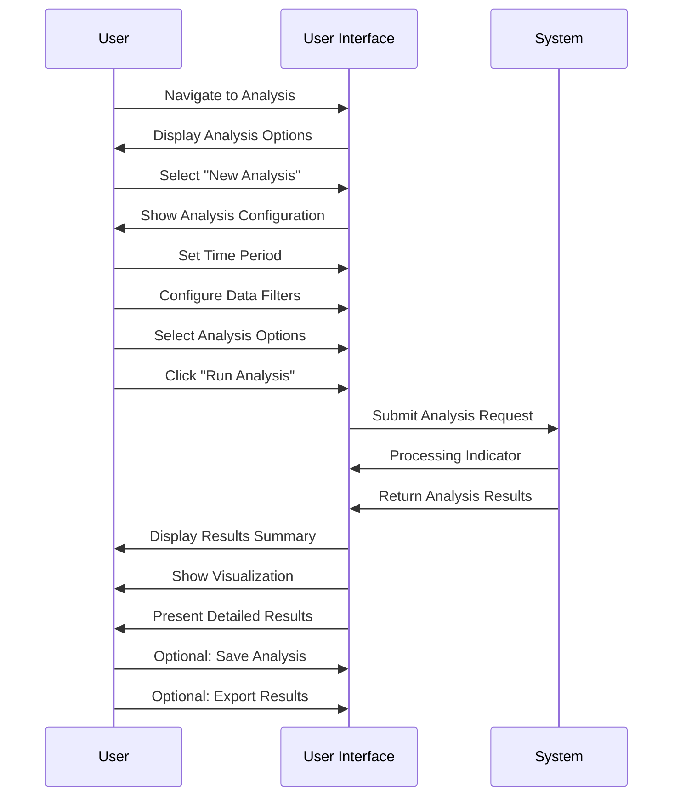
```mermaid
sequenceDiagram
    participant User
    participant UI as User Interface
    participant System
    
    User->>UI: Navigate to Analysis
    UI->>User: Display Analysis Options
    User->>UI: Select "New Analysis"
    UI->>User: Show Analysis Configuration
    
    User->>UI: Set Time Period
    User->>UI: Configure Data Filters
    User->>UI: Select Analysis Options
    User->>UI: Click "Run Analysis"
    
    UI->>System: Submit Analysis Request
    System->>UI: Processing Indicator
    System->>UI: Return Analysis Results
    
    UI->>User: Display Results Summary
    UI->>User: Show Visualization
    UI->>User: Present Detailed Results
    
    User->>UI: Optional: Save Analysis
    User->>UI: Optional: Export Results
```

#### Data Source Management Flow

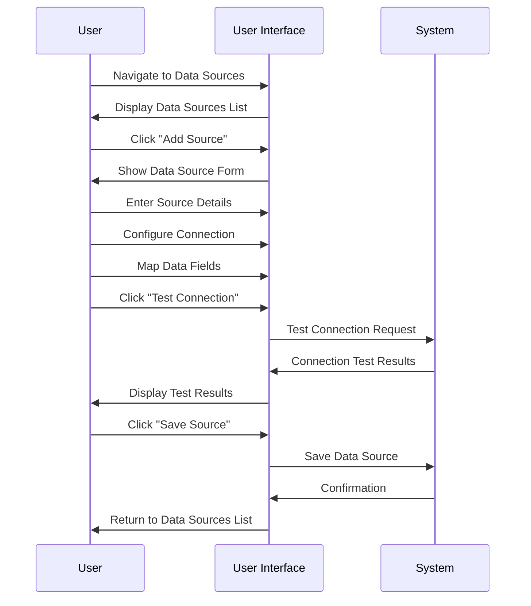
```mermaid
sequenceDiagram
    participant User
    participant UI as User Interface
    participant System
    
    User->>UI: Navigate to Data Sources
    UI->>User: Display Data Sources List
    User->>UI: Click "Add Source"
    UI->>User: Show Data Source Form
    
    User->>UI: Enter Source Details
    User->>UI: Configure Connection
    User->>UI: Map Data Fields
    User->>UI: Click "Test Connection"
    
    UI->>System: Test Connection Request
    System->>UI: Connection Test Results
    UI->>User: Display Test Results
    
    User->>UI: Click "Save Source"
    UI->>System: Save Data Source
    System->>UI: Confirmation
    UI->>User: Return to Data Sources List
```

## 6. API Reference

### 6.1 Core Endpoints

| Endpoint | Method | Description | Parameters |
|----------|--------|-------------|------------|
| `/api/v1/data/import` | POST | Import freight data | Source type, credentials, filters |
| `/api/v1/analysis/price-movement` | POST | Calculate price movements | Time period, granularity, filters |
| `/api/v1/results/{id}` | GET | Retrieve analysis results | Result ID, format |
| `/api/v1/export/{id}` | GET | Export analysis results | Result ID, format |

### 6.2 Authentication API

| Endpoint | Method | Description | Parameters |
|----------|--------|-------------|------------|
| `/api/v1/auth/token` | POST | Obtain access token | Credentials, scope |
| `/api/v1/auth/refresh` | POST | Refresh access token | Refresh token |
| `/api/v1/auth/revoke` | POST | Revoke token | Token |

### 6.3 Integration API

| Endpoint | Method | Description | Parameters |
|----------|--------|-------------|------------|
| `/api/v1/integration/connect` | POST | Configure integration | System type, connection details |
| `/api/v1/integration/status` | GET | Check integration status | Integration ID |
| `/api/v1/integration/sync` | POST | Trigger manual sync | Integration ID, parameters |

## 7. Deployment

### 7.1 Deployment Options

The Freight Price Movement Agent can be deployed using various approaches:

#### Docker Containers
- Docker Compose for development and small deployments
- Kubernetes for production and scalable deployments
- AWS ECS/Fargate for managed container orchestration

#### Cloud Deployment
- AWS as the primary cloud provider
- Multi-region deployment for high availability
- Auto-scaling based on demand

### 7.2 Infrastructure Requirements

| Component | Minimum Requirements | Recommended |
|-----------|----------------------|-------------|
| Compute | 4 vCPUs per service | 8 vCPUs per service |
| Memory | 8 GB RAM per service | 16 GB RAM per service |
| Storage | 100 GB SSD | 500 GB SSD + Object Storage |
| Network | 1 Gbps | 10 Gbps |

### 7.3 Deployment Architecture

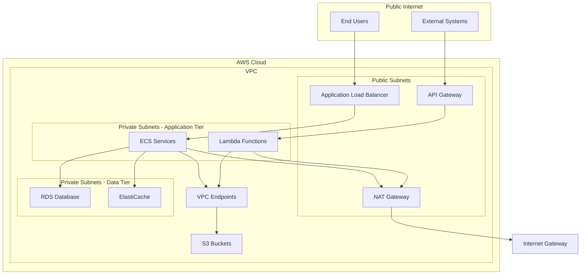
```mermaid
graph TD
    subgraph "Public Internet"
        A[End Users]
        B[External Systems]
    end
    
    subgraph "AWS Cloud"
        subgraph "VPC"
            subgraph "Public Subnets"
                C[Application Load Balancer]
                D[NAT Gateway]
                E[API Gateway]
            end
            
            subgraph "Private Subnets - Application Tier"
                F[ECS Services]
                G[Lambda Functions]
            end
            
            subgraph "Private Subnets - Data Tier"
                H[RDS Database]
                I[ElastiCache]
            end
            
            J[S3 Buckets]
            K[VPC Endpoints]
        end
    end
    
    A --> C
    B --> E
    C --> F
    E --> G
    F --> H
    F --> I
    F --> K
    G --> K
    K --> J
    F --> D
    G --> D
    D --> L[Internet Gateway]
```

## 8. Monitoring and Observability

### 8.1 Monitoring Infrastructure

The system implements a comprehensive monitoring infrastructure to ensure reliability, performance, and visibility into operational status.

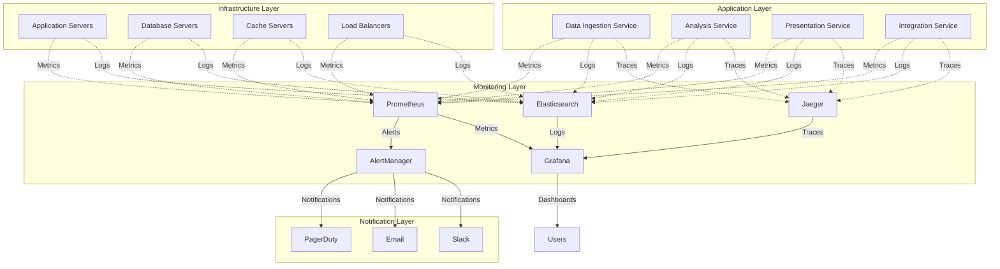
```mermaid
graph TD
    subgraph "Application Layer"
        A1[Data Ingestion Service]
        A2[Analysis Service]
        A3[Presentation Service]
        A4[Integration Service]
    end
    
    subgraph "Infrastructure Layer"
        B1[Application Servers]
        B2[Database Servers]
        B3[Cache Servers]
        B4[Load Balancers]
    end
    
    subgraph "Monitoring Layer"
        C1[Prometheus]
        C2[Elasticsearch]
        C3[Jaeger]
        C4[AlertManager]
        C5[Grafana]
    end
    
    subgraph "Notification Layer"
        D1[PagerDuty]
        D2[Email]
        D3[Slack]
    end
    
    A1 -.->|Metrics| C1
    A2 -.->|Metrics| C1
    A3 -.->|Metrics| C1
    A4 -.->|Metrics| C1
    
    B1 -.->|Metrics| C1
    B2 -.->|Metrics| C1
    B3 -.->|Metrics| C1
    B4 -.->|Metrics| C1
    
    A1 -.->|Logs| C2
    A2 -.->|Logs| C2
    A3 -.->|Logs| C2
    A4 -.->|Logs| C2
    
    B1 -.->|Logs| C2
    B2 -.->|Logs| C2
    B3 -.->|Logs| C2
    B4 -.->|Logs| C2
    
    A1 -.->|Traces| C3
    A2 -.->|Traces| C3
    A3 -.->|Traces| C3
    A4 -.->|Traces| C3
    
    C1 -->|Alerts| C4
    C4 -->|Notifications| D1
    C4 -->|Notifications| D2
    C4 -->|Notifications| D3
    
    C1 -->|Metrics| C5
    C2 -->|Logs| C5
    C3 -->|Traces| C5
    
    C5 -->|Dashboards| E[Users]
```

### 8.2 Key Metrics

| Metric Category | Key Metrics | Alert Threshold |
|-----------------|------------|-----------------|
| System | CPU, Memory, Disk, Network | > 80% utilization for 5min |
| Application | Request count, Error rate, Latency | > 1% error rate, > 5s latency |
| Database | Query execution time, Connection count | > 1s query time, > 80% connection pool |
| Business | Analysis count, Data volume | < 70% of baseline |

### 8.3 Alerting Strategy

| Alert Severity | Response Time | Notification Channel | Escalation Path |
|----------------|---------------|---------------------|-----------------|
| Critical | 15 minutes | PagerDuty, SMS | On-call → Team Lead → Manager |
| Warning | 4 hours | Email, Slack | Team Lead → Development Team |
| Info | 24 hours | Slack | Development Team |

## 9. Security

### 9.1 Authentication and Authorization

The system implements a comprehensive security framework to protect sensitive freight pricing data:

- **Authentication**: OAuth 2.0 with OpenID Connect for identity verification
- **Authorization**: Role-based access control with fine-grained permissions
- **API Security**: Token validation, scope verification, and request signing

### 9.2 Data Protection

| Data State | Protection Mechanism | Implementation |
|------------|----------------------|----------------|
| Data at Rest | Encryption | AES-256 encryption for database and files |
| Data in Transit | TLS | TLS 1.2+ for all communications |
| Sensitive Fields | Field-level encryption | Application-level encryption for sensitive data |

### 9.3 Security Zones

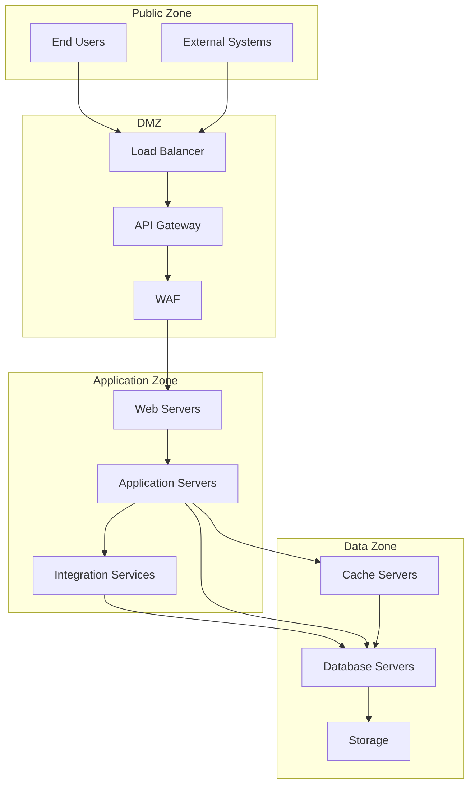
```mermaid
graph TD
    subgraph "Public Zone"
        A[End Users]
        B[External Systems]
    end
    
    subgraph "DMZ"
        C[Load Balancer]
        D[API Gateway]
        E[WAF]
    end
    
    subgraph "Application Zone"
        F[Web Servers]
        G[Application Servers]
        H[Integration Services]
    end
    
    subgraph "Data Zone"
        I[Database Servers]
        J[Cache Servers]
        K[Storage]
    end
    
    A --> C
    B --> C
    C --> D
    D --> E
    E --> F
    F --> G
    G --> H
    G --> J
    H --> I
    G --> I
    I --> K
    J --> I
```

## 10. Development Guidelines

### 10.1 Project Structure

```
├── src/
│   ├── backend/         # Python Flask backend
│   │   ├── api/         # API endpoints
│   │   ├── connectors/  # Data source connectors
│   │   ├── models/      # Database models
│   │   ├── services/    # Business logic
│   │   └── utils/       # Utility functions
│   └── web/            # React/TypeScript frontend
│       ├── public/      # Static assets
│       └── src/         # Source code
├── infrastructure/     # Deployment configurations
└── docs/              # Documentation
```

### 10.2 Coding Standards

- **Python**: Follow PEP 8 style guide
- **TypeScript**: Follow ESLint configuration
- **Documentation**: Docstrings for all functions and classes
- **Testing**: Unit tests for all core functionality

### 10.3 Development Workflow

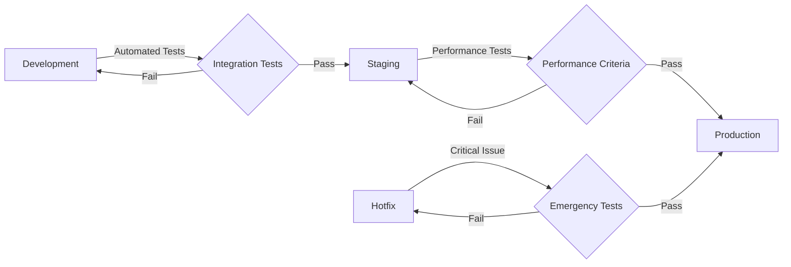
```mermaid
flowchart LR
    A[Development] -->|Automated Tests| B{Integration Tests}
    B -->|Pass| C[Staging]
    B -->|Fail| A
    
    C -->|Performance Tests| D{Performance Criteria}
    D -->|Pass| E[Production]
    D -->|Fail| C
    
    F[Hotfix] -->|Critical Issue| G{Emergency Tests}
    G -->|Pass| E
    G -->|Fail| F
```

## 11. Glossary

| Term | Definition |
|------|------------|
| Freight Charge | The cost associated with transporting goods from origin to destination, typically excluding insurance and other ancillary services. |
| Price Movement | The change in freight charges over a specified time period, expressed as absolute value and/or percentage. |
| Origin | The starting location from which freight is transported. |
| Destination | The final delivery location for transported freight. |
| Granularity | The level of detail or time interval used for analysis (e.g., daily, weekly, monthly). |
| Baseline Period | A historical time period used as a reference point for comparison with current data. |
| Time Series | A sequence of data points indexed in time order, typically used for trend analysis. |
| Absolute Change | The numerical difference between two values (end value minus start value). |
| Percentage Change | The relative change between two values, expressed as a percentage of the start value. |
| Trend Direction | The general movement pattern of freight prices (increasing, decreasing, or stable). |
| Data Quality Flag | An indicator that marks potential issues with data integrity or reliability. |

# PROJECT STATUS

The Freight Price Movement Agent project is in an advanced stage of development, with most core functionality implemented and ready for final testing and deployment.

## Project Completion Status

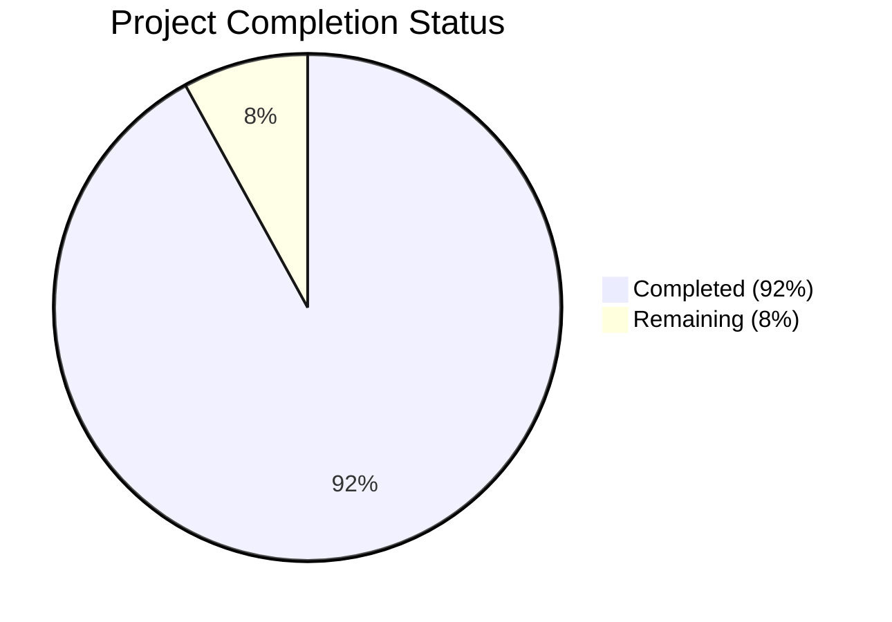
```mermaid
pie
    title Project Completion Status
    "Completed (92%)" : 92
    "Remaining (8%)" : 8
```

## Engineering Hours Breakdown

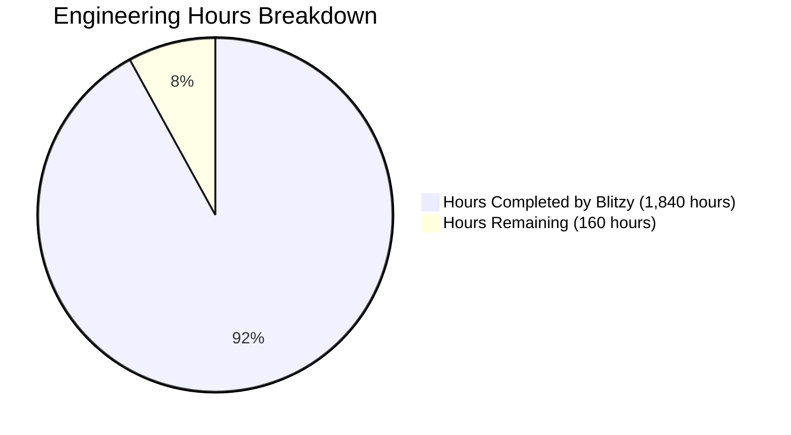
```mermaid
pie
    title Engineering Hours Breakdown
    "Hours Completed by Blitzy (1,840 hours)" : 92
    "Hours Remaining (160 hours)" : 8
```

## Key Metrics

| Metric | Value |
|--------|-------|
| Estimated Total Engineering Hours | 2,000 hours |
| Hours Completed by Blitzy | 1,840 hours |
| Hours Remaining | 160 hours |
| Completion Percentage | 92% |

## Completed Components

- ✅ Core backend services (data ingestion, analysis engine, presentation)
- ✅ Frontend UI components and pages
- ✅ Database models and schemas
- ✅ API endpoints and integration layer
- ✅ Authentication and authorization system
- ✅ Testing framework and test cases
- ✅ Docker containerization
- ✅ Infrastructure as Code (Terraform, Kubernetes)

## Remaining Tasks

- 🔄 Final performance optimization and tuning
- 🔄 Enhanced security hardening
- 🔄 Complete end-to-end testing
- 🔄 Documentation refinement
- 🔄 Production deployment preparation

The project has reached a mature stage with all core functionality implemented. The remaining work focuses on optimization, security hardening, and final production readiness to ensure a robust and reliable system for tracking freight price movements.

# TECHNOLOGY STACK

The Freight Price Movement Agent is built using a modern, scalable technology stack designed to handle time-series data processing, analysis, and visualization efficiently.

## Programming Languages

| Language | Version | Purpose |
|----------|---------|---------|
| Python | 3.9+ | Backend services, data processing, and analysis engine |
| TypeScript | 4.5+ | Frontend web application and type safety |
| SQL | PostgreSQL dialect | Database queries and data manipulation |
| JavaScript | ES2020+ | Client-side scripting and visualization |

## Backend Framework & Libraries

| Component | Technology | Version | Purpose |
|-----------|------------|---------|---------|
| Web Framework | Flask | 2.2.x | RESTful API endpoints and application server |
| ORM | SQLAlchemy | 2.0.x | Database abstraction and object-relational mapping |
| Data Processing | Pandas | 1.5.x | Efficient data manipulation and analysis |
| Numerical Computation | NumPy | 1.23.x | High-performance array operations for calculations |
| API Documentation | OpenAPI/Swagger | 3.0 | API specification and documentation |
| Task Queue | Celery | 5.2.x | Asynchronous task processing |
| Authentication | JWT/OAuth 2.0 | - | Secure user authentication and authorization |
| Testing | pytest | 7.3.x | Comprehensive testing framework |
| Dependency Management | Poetry | - | Python package management |

## Frontend Framework & Libraries

| Component | Technology | Version | Purpose |
|-----------|------------|---------|---------|
| UI Framework | React | 18.x | Component-based user interface development |
| Type System | TypeScript | 4.5+ | Static typing for JavaScript |
| State Management | React Context API | - | Application state management |
| Routing | React Router | 6.x | Client-side routing |
| UI Components | Custom component library | - | Consistent design system |
| Charts & Visualization | Chart.js/D3.js | - | Interactive data visualization |
| HTTP Client | Axios | - | API communication |
| Form Handling | React Hook Form | - | Form validation and submission |
| Testing | Jest, React Testing Library | - | Unit and integration testing |
| Build Tool | Vite | - | Fast development and optimized builds |

## Database & Storage

| Component | Technology | Version | Purpose |
|-----------|------------|---------|---------|
| Primary Database | PostgreSQL | 13+ | Relational data storage |
| Time-Series Extension | TimescaleDB | - | Optimized time-series data handling |
| Caching | Redis | 6+ | In-memory data caching |
| Object Storage | S3-compatible | - | File storage for CSV imports/exports |

## Infrastructure & DevOps

| Component | Technology | Purpose |
|-----------|------------|---------|
| Containerization | Docker | Application packaging and isolation |
| Orchestration | AWS ECS/Kubernetes | Container management and scaling |
| CI/CD | GitHub Actions | Automated testing and deployment |
| Infrastructure as Code | Terraform | Cloud resource provisioning |
| Monitoring | Prometheus, Grafana | System monitoring and alerting |
| Logging | ELK Stack | Centralized log management |

## External Integrations

| Integration Type | Technologies | Purpose |
|------------------|--------------|---------|
| TMS Systems | REST APIs, Database Connectors | Transportation Management System data retrieval |
| ERP Systems | REST APIs, Database Connectors | Enterprise Resource Planning system integration |
| Currency Conversion | External API | Exchange rate data for multi-currency support |
| Email Notifications | SMTP | Alert and report delivery |

## Development Tools

| Tool | Purpose |
|------|---------|
| Git | Version control |
| GitHub | Code hosting and collaboration |
| Docker Compose | Local development environment |
| ESLint/Prettier | Code quality and formatting |
| Black/Flake8 | Python code formatting and linting |
| Postman | API testing and documentation |
| VS Code | Integrated development environment |

## Architecture Diagram

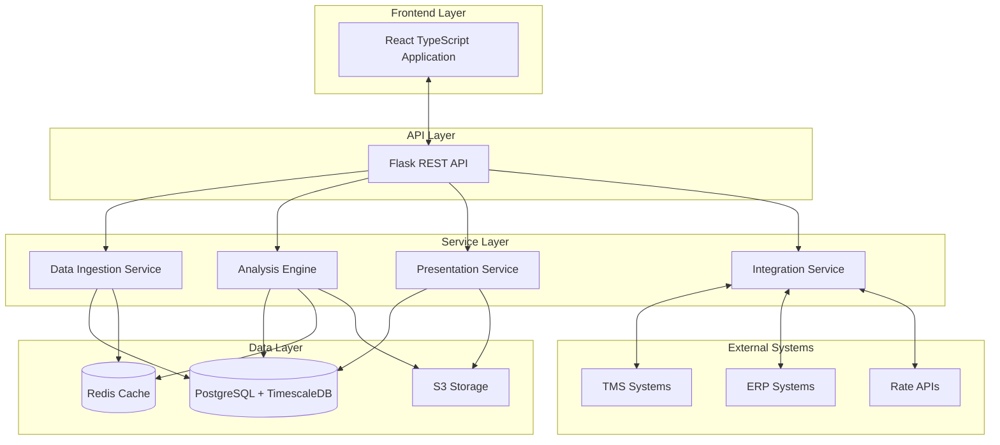
```mermaid
graph TD
    subgraph "Frontend Layer"
        A[React TypeScript Application]
    end
    
    subgraph "API Layer"
        B[Flask REST API]
    end
    
    subgraph "Service Layer"
        C[Data Ingestion Service]
        D[Analysis Engine]
        E[Presentation Service]
        F[Integration Service]
    end
    
    subgraph "Data Layer"
        G[(PostgreSQL + TimescaleDB)]
        H[(Redis Cache)]
        I[S3 Storage]
    end
    
    subgraph "External Systems"
        J[TMS Systems]
        K[ERP Systems]
        L[Rate APIs]
    end
    
    A <--> B
    B --> C
    B --> D
    B --> E
    B --> F
    
    C --> G
    D --> G
    D --> H
    E --> G
    E --> I
    F <--> J
    F <--> K
    F <--> L
    
    C --> H
    D --> I
```

The architecture follows a modular design with clear separation of concerns, allowing for independent scaling and maintenance of each component. The system is designed to be deployed in a containerized environment, with each service running in its own container for optimal resource utilization and scalability.

# Project Guide: Freight Price Movement Agent

## 1. Project Overview

The Freight Price Movement Agent is an automated system designed to track, analyze, and report changes in freight charges over specified time periods. This solution addresses the critical business need for timely, accurate insights into logistics cost fluctuations to support data-driven decision-making in supply chain management.

### 1.1 Core Problem

Logistics professionals face significant challenges in tracking and analyzing freight price movements due to:
- Volatility in freight markets requiring sophisticated tracking mechanisms
- Manual tracking processes that are time-consuming and error-prone
- Lack of standardized metrics for consistent analysis
- Difficulty in identifying meaningful trends across different time periods

### 1.2 Solution Architecture

The Freight Price Movement Agent implements a modular, layered architecture:

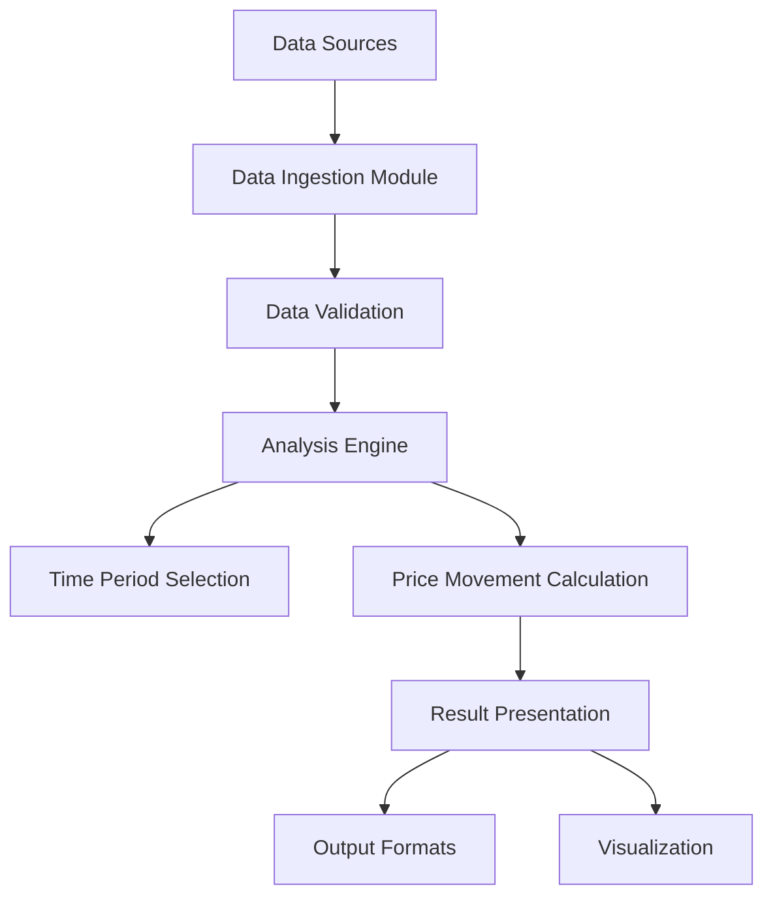
```mermaid
graph TD
    A[Data Sources] --> B[Data Ingestion Module]
    B --> C[Data Validation]
    C --> D[Analysis Engine]
    D --> E[Time Period Selection]
    D --> F[Price Movement Calculation]
    F --> G[Result Presentation]
    G --> H[Output Formats]
    G --> I[Visualization]
```

The system consists of the following key components:
- **Frontend**: React/TypeScript web application providing an intuitive user interface
- **Backend**: Python Flask API with modular components for data processing and analysis
- **Database**: PostgreSQL with TimescaleDB extension optimized for time-series data
- **Caching**: Redis for performance optimization of frequent queries
- **Infrastructure**: Docker containers for consistent deployment across environments

### 1.3 Key Features

| Feature | Description | Business Value |
|---------|-------------|----------------|
| Data Collection & Ingestion | Automated collection of freight pricing data from multiple sources (CSV, databases, APIs) | Ensures reliable, consistent data input for accurate analysis |
| Time Period Selection | Flexible selection of time periods with customizable granularity | Enables targeted analysis of relevant time frames |
| Price Movement Calculation | Calculation of absolute and percentage changes in freight prices | Provides quantitative insights into cost fluctuations |
| Trend Identification | Automatic detection of increasing, decreasing, or stable price trends | Highlights significant patterns in freight costs |
| Visualization | Interactive charts and graphs for visualizing price movements | Transforms complex data into actionable insights |
| Multiple Output Formats | Export results in JSON, CSV, or text summary formats | Facilitates integration with other business systems |
| Integration Capabilities | Connect with TMS and ERP systems for seamless data flow | Reduces manual data entry and improves data consistency |

## 2. Technical Architecture

### 2.1 System Components

#### 2.1.1 Data Ingestion Module

The Data Ingestion Module is responsible for collecting, validating, and normalizing freight pricing data from multiple sources.

**Key Components:**
- Source connectors for CSV files, databases, and APIs
- Data validation engine for ensuring data quality
- Transformation pipeline for standardizing data formats
- Error handling and logging mechanisms

**Implementation Details:**
- Supports multiple data formats including CSV, JSON, and direct database connections
- Implements validation rules for freight charges, dates, locations, and currencies
- Provides error handling with detailed reporting for data quality issues
- Maintains audit logs for all data ingestion activities

#### 2.1.2 Analysis Engine

The Analysis Engine performs the core calculations for freight price movements across user-defined time periods.

**Key Components:**
- Time period management for defining analysis timeframes
- Calculation engine for price movement metrics
- Trend analysis for identifying patterns
- Caching mechanism for optimizing performance

**Implementation Details:**
- Calculates absolute changes using end value - start value
- Calculates percentage changes using (absolute change / start value) * 100
- Determines trend directions based on configurable thresholds
- Implements special case handling for zero values and extreme changes
- Provides caching of analysis results for improved performance

#### 2.1.3 Presentation Service

The Presentation Service transforms analysis results into user-friendly formats and visualizations.

**Key Components:**
- Format converters for different output types
- Visualization generators for charts and graphs
- Export managers for file generation
- Delivery controllers for various output channels

**Implementation Details:**
- Supports multiple output formats including JSON, CSV, and text summaries
- Generates interactive visualizations of price trends
- Provides customizable report templates
- Implements responsive design for different device types

### 2.2 Data Model

The system's core data model consists of the following key entities:

#### 2.2.1 FreightData

The FreightData entity represents individual freight pricing records with the following attributes:

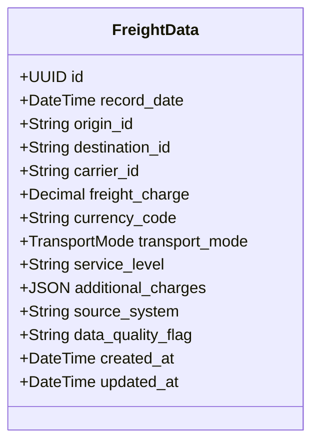
```mermaid
classDiagram
    class FreightData {
        +UUID id
        +DateTime record_date
        +String origin_id
        +String destination_id
        +String carrier_id
        +Decimal freight_charge
        +String currency_code
        +TransportMode transport_mode
        +String service_level
        +JSON additional_charges
        +String source_system
        +String data_quality_flag
        +DateTime created_at
        +DateTime updated_at
    }
```

- **record_date**: Date and time of the freight data record
- **origin_id**: Reference to the origin location
- **destination_id**: Reference to the destination location
- **carrier_id**: Reference to the freight carrier
- **freight_charge**: The actual freight cost
- **currency_code**: 3-letter currency code (e.g., USD, EUR)
- **transport_mode**: Mode of transportation (OCEAN, AIR, ROAD, RAIL)
- **service_level**: Optional service level description
- **additional_charges**: Optional JSON object for additional charges
- **source_system**: Identifier for the data source system
- **data_quality_flag**: Optional flag indicating data quality issues

#### 2.2.2 TimePeriod

The TimePeriod entity defines the time frames used for analysis:

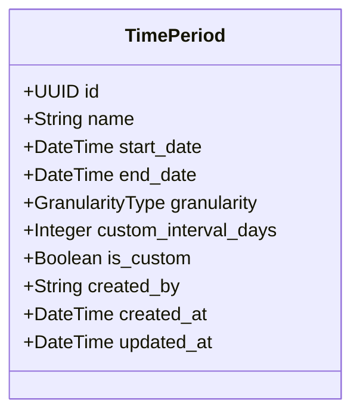
```mermaid
classDiagram
    class TimePeriod {
        +UUID id
        +String name
        +DateTime start_date
        +DateTime end_date
        +GranularityType granularity
        +Integer custom_interval_days
        +Boolean is_custom
        +String created_by
        +DateTime created_at
        +DateTime updated_at
    }
```

- **name**: Descriptive name for the time period
- **start_date**: Starting date/time for the period
- **end_date**: Ending date/time for the period
- **granularity**: Time granularity (DAILY, WEEKLY, MONTHLY, CUSTOM)
- **custom_interval_days**: Number of days for custom interval
- **is_custom**: Flag indicating if this is a custom granularity

#### 2.2.3 AnalysisResult

The AnalysisResult entity stores the outcomes of freight price movement analyses:

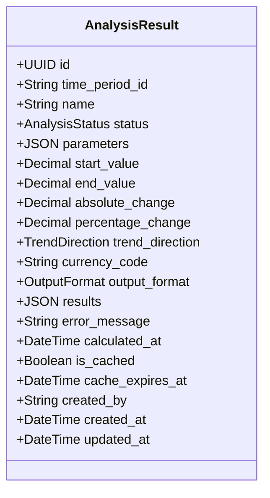
```mermaid
classDiagram
    class AnalysisResult {
        +UUID id
        +String time_period_id
        +String name
        +AnalysisStatus status
        +JSON parameters
        +Decimal start_value
        +Decimal end_value
        +Decimal absolute_change
        +Decimal percentage_change
        +TrendDirection trend_direction
        +String currency_code
        +OutputFormat output_format
        +JSON results
        +String error_message
        +DateTime calculated_at
        +Boolean is_cached
        +DateTime cache_expires_at
        +String created_by
        +DateTime created_at
        +DateTime updated_at
    }
```

- **time_period_id**: Reference to the analyzed time period
- **name**: Optional name for the analysis
- **status**: Current status (PENDING, PROCESSING, COMPLETED, FAILED)
- **parameters**: JSON object containing analysis parameters
- **start_value**: Starting freight charge value
- **end_value**: Ending freight charge value
- **absolute_change**: Calculated absolute price change
- **percentage_change**: Calculated percentage price change
- **trend_direction**: Trend direction (INCREASING, DECREASING, STABLE)
- **currency_code**: Currency used for the analysis
- **output_format**: Preferred output format (JSON, CSV, TEXT)
- **results**: Full analysis results as a JSON object
- **calculated_at**: Timestamp when the analysis was completed
- **is_cached**: Flag indicating if the result is cached
- **cache_expires_at**: Expiration time for cached results

### 2.3 Key Algorithms

#### 2.3.1 Absolute Change Calculation

```python
def calculate_absolute_change(start_value, end_value):
    """
    Calculates the absolute change between start and end values.
    
    Args:
        start_value: Initial freight charge
        end_value: Final freight charge
        
    Returns:
        Absolute change (end_value - start_value)
    """
    return end_value - start_value
```

#### 2.3.2 Percentage Change Calculation

```python
def calculate_percentage_change(start_value, end_value):
    """
    Calculates the percentage change between start and end values.
    
    Args:
        start_value: Initial freight charge
        end_value: Final freight charge
        
    Returns:
        Percentage change ((end_value - start_value) / start_value * 100)
    """
    # Handle special cases
    if start_value == 0:
        if end_value > 0:
            # New rate established
            return 9999.9999  # Large positive value
        if end_value == 0:
            # No change
            return 0
    
    if start_value > 0 and end_value == 0:
        # Complete decrease
        return -100
    
    # Normal case
    absolute_change = end_value - start_value
    percentage_change = (absolute_change / start_value) * 100
    
    return percentage_change
```

#### 2.3.3 Trend Direction Determination

```python
def determine_trend_direction(percentage_change):
    """
    Determines the trend direction based on percentage change.
    
    Args:
        percentage_change: Percentage change value
        
    Returns:
        TrendDirection enum value (INCREASING, DECREASING, or STABLE)
    """
    if percentage_change > 1.0:
        return TrendDirection.INCREASING
    elif percentage_change < -1.0:
        return TrendDirection.DECREASING
    else:
        return TrendDirection.STABLE
```

## 3. User Interface

The Freight Price Movement Agent provides an intuitive web interface for users to configure analyses, view results, and manage data sources.

### 3.1 Key Screens

#### 3.1.1 Dashboard

The Dashboard provides an overview of recent price changes, trends, and saved analyses:

```
+--------------------------------------------------------------+
|                                                              |
|  FREIGHT PRICE MOVEMENT DASHBOARD                            |
|                                                              |
|  +------------------------+  +-------------------------+     |
|  | RECENT PRICE CHANGES   |  | PRICE TREND (30 DAYS)  |     |
|  | Last 7 days            |  |                        |     |
|  |                        |  |      /\                |     |
|  | Ocean: +3.2% [↑]       |  |     /  \    /\        |     |
|  | Air:   -1.5% [↓]       |  |    /    \__/  \__     |     |
|  | Road:  +0.8% [↑]       |  |   /               \   |     |
|  | Rail:  +0.2% [→]       |  |  /                 \  |     |
|  |                        |  |                        |     |
|  | [View Details]         |  | [View Full Chart]      |     |
|  +------------------------+  +-------------------------+     |
|                                                              |
|  +------------------------+  +-------------------------+     |
|  | SAVED ANALYSES         |  | ALERTS                 |     |
|  |                        |  |                        |     |
|  | • Q2 Ocean Freight     |  | [!] Significant price  |     |
|  |   Last updated: Today  |  |     increase detected  |     |
|  |                        |  |     on APAC routes     |     |
|  | • Air vs Ocean 2023    |  |                        |     |
|  |   Last updated: 3d ago |  | [!] 3 data sources     |     |
|  |                        |  |     need updating      |     |
|  | [+ New Analysis]       |  |                        |     |
|  +------------------------+  +-------------------------+     |
|                                                              |
+--------------------------------------------------------------+
```

#### 3.1.2 Analysis Configuration

The Analysis Configuration screen allows users to set up a new price movement analysis:

```
+--------------------------------------------------------------+
|                                                              |
|  NEW PRICE MOVEMENT ANALYSIS                                 |
|                                                              |
|  +------------------------------------------------------+    |
|  | TIME PERIOD SELECTION                                |    |
|  |                                                      |    |
|  | Start Date: [2023-01-01] [📅]                        |    |
|  | End Date:   [2023-03-31] [📅]                        |    |
|  |                                                      |    |
|  | Granularity: ( ) Daily   (•) Weekly   ( ) Monthly    |    |
|  |              ( ) Custom: [........]                  |    |
|  +------------------------------------------------------+    |
|                                                              |
|  +------------------------------------------------------+    |
|  | DATA FILTERS                                         |    |
|  |                                                      |    |
|  | Data Source: [v] All Sources                         |    |
|  |                                                      |    |
|  | Origin:      [v] All Origins                         |    |
|  |                                                      |    |
|  | Destination: [v] All Destinations                    |    |
|  |                                                      |    |
|  | Carrier:     [v] All Carriers                        |    |
|  |                                                      |    |
|  | [+ Add Filter]                                       |    |
|  +------------------------------------------------------+    |
|                                                              |
|  +------------------------------------------------------+    |
|  | ANALYSIS OPTIONS                                     |    |
|  |                                                      |    |
|  | [x] Calculate absolute change                        |    |
|  | [x] Calculate percentage change                      |    |
|  | [x] Identify trend direction                         |    |
|  | [ ] Compare to historical baseline                   |    |
|  |     Baseline period: [............] [📅]             |    |
|  |                                                      |    |
|  | Output Format: (•) JSON  ( ) CSV  ( ) Text Summary   |    |
|  |                                                      |    |
|  | [x] Include visualization                            |    |
|  +------------------------------------------------------+    |
|                                                              |
|  [Cancel]                                  [Run Analysis]    |
|                                                              |
+--------------------------------------------------------------+
```

#### 3.1.3 Analysis Results

The Analysis Results screen displays the outcomes of a price movement analysis:

```
+--------------------------------------------------------------+
|                                                              |
|  ANALYSIS RESULTS                      [Save] [Export] [📊]  |
|                                                              |
|  +------------------------------------------------------+    |
|  | SUMMARY                                              |    |
|  |                                                      |    |
|  | Time Period: Jan 01, 2023 - Mar 31, 2023 (Weekly)   |    |
|  | Data Sources: All Sources                            |    |
|  | Filters: All Origins, All Destinations, All Carriers |    |
|  |                                                      |    |
|  | Overall Change: +5.2% [↑]                           |    |
|  | Absolute Change: +$245.00 USD                       |    |
|  +------------------------------------------------------+    |
|                                                              |
|  +------------------------------------------------------+    |
|  | PRICE MOVEMENT CHART                                 |    |
|  |                                                      |    |
|  |    $                                                 |    |
|  | 5000|                                                |    |
|  |     |                          /\                    |    |
|  | 4800|                         /  \                   |    |
|  |     |                    /\  /    \                  |    |
|  | 4600|                   /  \/      \                 |    |
|  |     |           /\/\   /            \                |    |
|  | 4400|          /    \ /              \               |    |
|  |     |         /      v                \              |    |
|  | 4200|        /                         \             |    |
|  |     |       /                           \            |    |
|  | 4000|______/                             \___        |    |
|  |     |                                                |    |
|  |      Jan    Jan    Feb    Feb    Mar    Mar    Mar  |    |
|  |      01     15     01     15     01     15     31   |    |
|  |                                                      |    |
|  +------------------------------------------------------+    |
|                                                              |
|  +------------------------------------------------------+    |
|  | DETAILED RESULTS                                     |    |
|  |                                                      |    |
|  | Week      | Price (USD) | Abs Change | % Change     |    |
|  |-----------|-------------|------------|--------------|    |
|  | Jan 01-07 | $4,120.00   | -          | -            |    |
|  | Jan 08-14 | $4,150.00   | +$30.00    | +0.7% [↑]    |    |
|  | Jan 15-21 | $4,320.00   | +$170.00   | +4.1% [↑]    |    |
|  | ...       | ...         | ...        | ...          |    |
|  | Mar 25-31 | $4,365.00   | -$85.00    | -1.9% [↓]    |    |
|  +------------------------------------------------------+    |
|                                                              |
|  [< Back to Analysis]                    [New Analysis]      |
|                                                              |
+--------------------------------------------------------------+
```

### 3.2 Key UI Components

#### 3.2.1 Time Period Selector

The Time Period Selector component allows users to define the time frame for analysis:

- **Features**:
  - Selection between saved periods or custom periods
  - Date range picker for start and end dates
  - Granularity options (daily, weekly, monthly, custom)
  - Custom interval specification for advanced analysis

#### 3.2.2 Trend Indicator

The Trend Indicator component visualizes price movement trends:

- **Features**:
  - Direction arrows (up, down, horizontal)
  - Color coding (green for increasing, red for decreasing, gray for stable)
  - Percentage value display
  - Configurable sizes for different contexts

#### 3.2.3 Analysis Results Chart

The Analysis Results Chart component visualizes price movements over time:

- **Features**:
  - Line chart showing price trends
  - Time-based x-axis with appropriate intervals
  - Price-based y-axis with currency formatting
  - Responsive design for different screen sizes
  - Loading and error states for better user experience

#### 3.2.4 Analysis Results Summary

The Analysis Results Summary component provides a concise overview of analysis results:

- **Features**:
  - Time period information
  - Overall change with trend indicator
  - Absolute change with currency formatting
  - Starting and ending price values
  - Calculation timestamp for reference

## 4. Integration Capabilities

### 4.1 External System Integration

The Freight Price Movement Agent can integrate with various external systems to collect data and share results:

#### 4.1.1 TMS Integration

- **Supported Systems**: SAP TM, Oracle TMS, JDA TMS
- **Integration Methods**: REST API, Database Connection, File Exchange
- **Data Exchange**: Freight rates, carrier information, route details
- **Authentication**: OAuth 2.0, API Keys, Basic Authentication

#### 4.1.2 ERP Integration

- **Supported Systems**: SAP ERP, Oracle ERP, Microsoft Dynamics
- **Integration Methods**: Database Connection, REST API, File Exchange
- **Data Exchange**: Cost data, accounting information, vendor details
- **Authentication**: Database credentials, OAuth 2.0, API Keys

#### 4.1.3 External Rate APIs

- **Supported Systems**: Freightos Baltic Index, World Container Index, Custom Rate Sources
- **Integration Methods**: REST API, GraphQL
- **Data Exchange**: Market rate data, benchmark information
- **Authentication**: API Keys, OAuth 2.0

### 4.2 API Endpoints

The system exposes a RESTful API for integration with other systems:

#### 4.2.1 Data Management Endpoints

| Endpoint | Method | Description | Parameters |
|----------|--------|-------------|------------|
| `/api/v1/data/import` | POST | Import freight data | Source type, credentials, filters |
| `/api/v1/data/sources` | GET | List data sources | Pagination, filters |
| `/api/v1/data/sources/{id}` | GET | Get data source details | Source ID |
| `/api/v1/data/sources/{id}` | PUT | Update data source | Source ID, updated configuration |

#### 4.2.2 Analysis Endpoints

| Endpoint | Method | Description | Parameters |
|----------|--------|-------------|------------|
| `/api/v1/analysis/price-movement` | POST | Calculate price movements | Time period, granularity, filters |
| `/api/v1/analysis/results/{id}` | GET | Retrieve analysis results | Result ID, format |
| `/api/v1/analysis/time-periods` | GET | List time periods | Pagination, filters |
| `/api/v1/analysis/time-periods` | POST | Create time period | Name, start date, end date, granularity |

#### 4.2.3 Export Endpoints

| Endpoint | Method | Description | Parameters |
|----------|--------|-------------|------------|
| `/api/v1/export/{id}` | GET | Export analysis results | Result ID, format |
| `/api/v1/export/report` | POST | Generate custom report | Report configuration, format |

## 5. Deployment and Infrastructure

### 5.1 System Requirements

#### 5.1.1 Server Requirements

| Component | Minimum | Recommended |
|-----------|---------|-------------|
| CPU | 4 vCPUs | 8 vCPUs |
| Memory | 8 GB RAM | 16 GB RAM |
| Storage | 100 GB SSD | 500 GB SSD |
| Network | 1 Gbps | 10 Gbps |

#### 5.1.2 Software Requirements

| Component | Version | Notes |
|-----------|---------|-------|
| Python | 3.9+ | Core backend language |
| Node.js | 16+ | Frontend build environment |
| PostgreSQL | 13+ | With TimescaleDB extension |
| Redis | 6+ | For caching |
| Docker | Latest | For containerization |

### 5.2 Deployment Options

#### 5.2.1 Docker Deployment

The system can be deployed using Docker containers:

```bash
# Build and run with Docker Compose
docker-compose up -d

# Access the application at http://localhost:3000
```

#### 5.2.2 Cloud Deployment

The system supports deployment on major cloud platforms:

- **AWS**: ECS/Fargate for container orchestration
- **Azure**: AKS for Kubernetes deployment
- **Google Cloud**: GKE for Kubernetes deployment

#### 5.2.3 On-Premises Deployment

For on-premises deployment, the system requires:

- Linux-based server environment
- Docker and Docker Compose
- PostgreSQL database server
- Redis server
- Reverse proxy (NGINX recommended)

### 5.3 Scaling Considerations

The system is designed to scale horizontally to handle increasing data volumes and user loads:

- **Application Services**: Stateless design allows for easy horizontal scaling
- **Database**: Supports read replicas for query scaling
- **Caching**: Redis cluster for distributed caching
- **Storage**: Tiered approach with lifecycle policies for cost optimization

## 6. Security Considerations

### 6.1 Authentication and Authorization

The system implements a comprehensive security framework:

- **User Authentication**: OAuth 2.0 with OpenID Connect
- **API Authentication**: API keys with scope limitations
- **Service Authentication**: Mutual TLS for service-to-service communication
- **Authorization Model**: Role-based access control with fine-grained permissions

### 6.2 Data Protection

Sensitive freight pricing information is protected through multiple mechanisms:

- **Data at Rest**: AES-256 encryption
- **Data in Transit**: TLS 1.2+ for all communications
- **Sensitive Fields**: Field-level encryption for highly sensitive data
- **Backups**: Encrypted backup files

### 6.3 Audit and Compliance

The system maintains comprehensive audit logs for compliance purposes:

- **User Actions**: All user interactions are logged with timestamps
- **Data Changes**: All modifications to freight data are tracked
- **Access Logs**: All data access is recorded for security monitoring
- **Retention**: Configurable retention policies for different log types

## 7. Maintenance and Support

### 7.1 Monitoring

The system includes comprehensive monitoring capabilities:

- **Infrastructure Monitoring**: CPU, memory, disk, and network utilization
- **Application Monitoring**: Request rates, error rates, and response times
- **Database Monitoring**: Query performance, connection counts, and storage usage
- **Business Metrics**: Analysis volume, data processing rates, and user engagement

### 7.2 Backup and Recovery

The system implements a robust backup and recovery strategy:

- **Database Backups**: Automated daily backups with point-in-time recovery
- **Application State**: Configuration backups and version control
- **Disaster Recovery**: Cross-region replication for high availability
- **Recovery Testing**: Regular restore tests to validate backup integrity

### 7.3 Troubleshooting

Common issues and their resolutions:

| Issue | Possible Causes | Resolution |
|-------|----------------|------------|
| Slow Analysis Performance | Large dataset, Complex filters | Optimize query, Increase resources |
| Data Import Failures | Invalid format, Missing fields | Validate source data, Check mappings |
| Visualization Errors | Browser compatibility, Data issues | Update browser, Check data integrity |
| Integration Failures | Authentication, Network issues | Verify credentials, Check connectivity |

## 8. Future Enhancements

Planned future enhancements for the Freight Price Movement Agent:

### 8.1 Advanced Analytics

- **Predictive Analytics**: Forecasting future freight rates based on historical trends
- **Anomaly Detection**: Automated identification of unusual price movements
- **Correlation Analysis**: Identifying relationships between different routes and carriers

### 8.2 Enhanced Visualization

- **Interactive Dashboards**: Customizable dashboards for different user roles
- **Geospatial Visualization**: Map-based visualization of freight routes and costs
- **Comparative Views**: Side-by-side comparison of multiple time periods

### 8.3 Integration Expansion

- **Additional TMS/ERP Systems**: Expand the range of supported enterprise systems
- **Mobile Application**: Native mobile apps for on-the-go analysis
- **Notification Systems**: Integration with email, SMS, and messaging platforms

## 9. Glossary

| Term | Definition |
|------|------------|
| Freight Charge | The cost associated with transporting goods from origin to destination |
| Price Movement | The change in freight charges over a specified time period |
| Absolute Change | The numerical difference between two values (end value minus start value) |
| Percentage Change | The relative change between two values, expressed as a percentage of the start value |
| Trend Direction | The general movement pattern of freight prices (increasing, decreasing, or stable) |
| Granularity | The level of detail or time interval used for analysis (daily, weekly, monthly) |
| Time Period | A defined start and end date range for analysis |
| Data Source | A system or file providing freight pricing information |

# Freight Price Movement Agent Project Guide

## 1. Introduction

The Freight Price Movement Agent is an automated system designed to track, analyze, and report changes in freight charges over specified time periods. This solution addresses the critical business need for timely, accurate insights into logistics cost fluctuations to support data-driven decision-making in supply chain management.

### 1.1 Purpose

This system enables logistics professionals to:
- Track freight price movements across different time periods
- Calculate absolute and percentage changes in freight costs
- Identify trends in pricing (increasing, decreasing, stable)
- Generate visualizations and reports for analysis
- Make data-driven decisions for cost optimization

### 1.2 Target Users

The primary users of this system include:
- Logistics managers overseeing freight operations and budgeting
- Supply chain analysts performing detailed cost analysis
- Procurement specialists negotiating with carriers
- Financial planners forecasting logistics expenses

### 1.3 Value Proposition

The Freight Price Movement Agent delivers significant business value through:
- Enhanced visibility into freight cost fluctuations
- Data-driven insights for carrier selection and negotiation
- Improved budget forecasting accuracy
- Time savings through automated data collection and analysis
- Standardized metrics for consistent reporting

## 2. System Architecture

The Freight Price Movement Agent follows a modular, layered architecture based on microservices principles to ensure separation of concerns, maintainability, and scalability.

### 2.1 High-Level Architecture


```mermaid
graph TD
    A[Data Sources] --> B[Data Ingestion Module]
    B --> C[Data Validation]
    C --> D[Analysis Engine]
    D --> E[Time Period Selection]
    D --> F[Price Movement Calculation]
    F --> G[Result Presentation]
    G --> H[Output Formats]
    G --> I[Visualization]
```

### 2.2 Core Components

| Component | Description | Technologies |
|-----------|-------------|--------------|
| Data Ingestion Service | Collects and validates freight data from multiple sources | Python, Pandas, API clients |
| Analysis Engine | Calculates price movements and identifies trends | Python, NumPy, Pandas |
| Presentation Service | Formats and delivers results | Flask, Matplotlib/Plotly |
| Integration Layer | Connects with external systems | API adapters, protocol handlers |
| Data Storage | Persists freight data and analysis results | PostgreSQL, TimescaleDB, Redis |

### 2.3 Technology Stack

#### 2.3.1 Backend

- **Programming Language**: Python 3.9+
- **Web Framework**: Flask 2.2.x
- **Data Processing**: Pandas 1.5.x, NumPy 1.23.x
- **Database**: PostgreSQL with TimescaleDB extension
- **Caching**: Redis 6.x
- **ORM**: SQLAlchemy 2.0.x
- **API**: RESTful with JSON

#### 2.3.2 Frontend

- **Framework**: React with TypeScript
- **State Management**: React Context API
- **UI Components**: Custom component library
- **Visualization**: Chart.js/Plotly
- **Styling**: CSS with variables for theming

#### 2.3.3 Infrastructure

- **Containerization**: Docker
- **Orchestration**: AWS ECS/Kubernetes
- **CI/CD**: GitHub Actions
- **Monitoring**: Prometheus, Grafana
- **Storage**: S3-compatible object storage

## 3. Core Features

### 3.1 Data Collection & Ingestion

The Data Ingestion Module serves as the entry point for all freight pricing data into the system, handling collection, validation, transformation, and storage from multiple sources.

#### 3.1.1 Supported Data Sources

- CSV file imports
- Database connections (SQL)
- REST/SOAP APIs
- TMS/ERP system integrations

#### 3.1.2 Data Flow

```mermaid
flowchart TD
    A[Start Ingestion] --> B{Source Type?}
    B -->|CSV| C[Load CSV File]
    B -->|Database| D[Execute Query]
    B -->|API| E[Call API Endpoint]
    
    C --> F[Extract Raw Data]
    D --> F
    E --> F
    
    F --> G[Validate Schema]
    G --> H{Schema Valid?}
    H -->|No| I[Log Validation Error]
    I --> J[Return Error]
    
    H -->|Yes| K[Apply Business Rules]
    K --> L{Rules Passed?}
    L -->|No| M[Log Business Rule Violation]
    M --> N{Critical Violation?}
    N -->|Yes| O[Abort Ingestion]
    N -->|No| P[Flag Records]
    
    L -->|Yes| Q[Check for Anomalies]
    P --> Q
    
    Q --> R{Anomalies Found?}
    R -->|Yes| S[Flag Anomalous Records]
    R -->|No| T[Proceed with Clean Data]
    S --> T
    
    T --> U[Transform to Standard Format]
    U --> V[Apply Field Mapping]
    V --> W[Convert Units/Currencies]
    
    W --> X[Store Processed Data]
    X --> Y[Log Successful Ingestion]
    Y --> Z[Return Success]
    
    O --> J
```

#### 3.1.3 Validation Rules

- Freight charges must be numeric and positive
- Date/time must be valid and not in the future
- Origin/destination must be valid locations
- Currency must be valid ISO code
- Required fields must be present

### 3.2 Time Period Selection

This feature allows users to define specific time periods for freight price movement analysis, providing flexibility to analyze trends across different time horizons.

#### 3.2.1 Time Period Options

- **Date Range Selection**: Specify start and end dates
- **Granularity Options**: Daily, weekly, monthly
- **Custom Intervals**: User-defined time intervals
- **Comparative Periods**: Current vs. historical baseline

#### 3.2.2 Selection Flow

```mermaid
flowchart TD
    A[User Accesses Time Period Selection] --> B[Display Date Range Selector]
    
    B --> C[User Selects Start Date]
    C --> D[User Selects End Date]
    D --> E{Valid Date Range?}
    
    E -->|No| F[Display Date Range Error]
    F --> G[Highlight Invalid Selection]
    G --> C
    
    E -->|Yes| H[Display Granularity Options]
    H --> I[User Selects Granularity]
    
    I --> J{Custom Granularity?}
    J -->|Yes| K[Display Custom Interval Input]
    K --> L[User Defines Custom Interval]
    L --> M{Valid Interval?}
    
    M -->|No| N[Display Interval Error]
    N --> L
    
    M -->|Yes| O[Apply Custom Interval]
    J -->|No| P[Apply Standard Granularity]
    
    O --> Q[Preview Time Period Breakdown]
    P --> Q
    
    Q --> R[User Confirms Selection]
    R --> S[Save Time Period Parameters]
    S --> End([End])
```

### 3.3 Price Movement Calculation

The Analysis Engine performs the core computational functions for calculating freight price movements and identifying trends based on user-defined parameters.

#### 3.3.1 Calculation Methods

- **Absolute Change**: End Value - Start Value
- **Percentage Change**: (Absolute Change / Start Value) * 100
- **Trend Direction**: Increasing (>1%), Decreasing (<-1%), Stable (±1%)
- **Aggregations**: Average, minimum, maximum values

#### 3.3.2 Calculation Process

```mermaid
flowchart TD
    A[Start Calculation] --> B[Retrieve Start Period Data]
    B --> C[Retrieve End Period Data]
    C --> D[Group by Required Dimensions]
    D --> E[Calculate Start Period Value]
    E --> F[Calculate End Period Value]
    F --> G[Absolute Change = End Value - Start Value]
    G --> H[Handle Special Cases]
    H --> I{Start Value = 0?}
    I -->|Yes| J[Apply Zero Start Value Rule]
    I -->|No| K[Proceed with Standard Calculation]
    J --> L[Return Results]
    K --> L
```

#### 3.3.3 Special Cases Handling

- Zero start value: Report as "New rate established" or use special percentage calculation
- Zero end value: Report as "-100%" or "Rate discontinued"
- Missing data points: Apply configurable handling strategies (skip, interpolate, etc.)

### 3.4 Result Presentation

The Presentation Service transforms analytical results into user-friendly formats and delivers them through various channels according to user preferences.

#### 3.4.1 Output Formats

- **JSON**: Structured data for API consumers
- **CSV**: Tabular data for spreadsheet analysis
- **Text Summary**: Human-readable summary of findings
- **Visualizations**: Charts and graphs for visual analysis

#### 3.4.2 Visualization Types

- **Time Series Charts**: Show price trends over time
- **Comparison Charts**: Compare different time periods
- **Trend Indicators**: Visual indicators of price movement direction
- **Summary Cards**: At-a-glance metrics

#### 3.4.3 Delivery Methods

- Web interface display
- File download
- Email reports
- API responses

## 4. User Interface Design

The Freight Price Movement Agent features a clean, intuitive user interface designed for logistics professionals to easily analyze freight price movements.

### 4.1 Design Principles

- **Clarity**: Clean layout with clear visual hierarchy
- **Efficiency**: Minimal clicks to perform common tasks
- **Consistency**: Uniform patterns for similar operations
- **Responsiveness**: Adapts to different screen sizes
- **Accessibility**: WCAG 2.1 AA compliance

### 4.2 Key Screens

#### 4.2.1 Dashboard

The dashboard provides an at-a-glance view of recent price movements, trends, saved analyses, and alerts.

```
+--------------------------------------------------------------+
| FREIGHT PRICE MOVEMENT AGENT           [@User] [=] [?] [x]   |
+--------------------------------------------------------------+
| [#] DASHBOARD                                                |
| [#] DATA SOURCES                                             |
| [#] ANALYSIS                                                 |
| [#] REPORTS                                                  |
| [#] SETTINGS                                                 |
+--------------------------------------------------------------+
|                                                              |
|  FREIGHT PRICE MOVEMENT DASHBOARD                            |
|                                                              |
|  +------------------------+  +-------------------------+     |
|  | RECENT PRICE CHANGES   |  | PRICE TREND (30 DAYS)  |     |
|  | Last 7 days            |  |                        |     |
|  |                        |  |      /\                |     |
|  | Ocean: +3.2% [↑]       |  |     /  \    /\        |     |
|  | Air:   -1.5% [↓]       |  |    /    \__/  \__     |     |
|  | Road:  +0.8% [↑]       |  |   /               \   |     |
|  | Rail:  +0.2% [→]       |  |  /                 \  |     |
|  |                        |  |                        |     |
|  | [View Details]         |  | [View Full Chart]      |     |
|  +------------------------+  +-------------------------+     |
|                                                              |
|  +------------------------+  +-------------------------+     |
|  | SAVED ANALYSES         |  | ALERTS                 |     |
|  |                        |  |                        |     |
|  | • Q2 Ocean Freight     |  | [!] Significant price  |     |
|  |   Last updated: Today  |  |     increase detected  |     |
|  |                        |  |     on APAC routes     |     |
|  | • Air vs Ocean 2023    |  |                        |     |
|  |   Last updated: 3d ago |  | [!] 3 data sources     |     |
|  |                        |  |     need updating      |     |
|  | [+ New Analysis]       |  |                        |     |
|  +------------------------+  +-------------------------+     |
|                                                              |
+--------------------------------------------------------------+
```

#### 4.2.2 Analysis Configuration

This screen allows users to configure a new price movement analysis by selecting time periods, data filters, and analysis options.

```
+--------------------------------------------------------------+
| FREIGHT PRICE MOVEMENT AGENT           [@User] [=] [?] [x]   |
+--------------------------------------------------------------+
| [#] DASHBOARD                                                |
| [#] DATA SOURCES                                             |
| [#] ANALYSIS                                                 |
| [#] REPORTS                                                  |
| [#] SETTINGS                                                 |
+--------------------------------------------------------------+
|                                                              |
|  NEW PRICE MOVEMENT ANALYSIS                                 |
|                                                              |
|  +------------------------------------------------------+    |
|  | TIME PERIOD SELECTION                                |    |
|  |                                                      |    |
|  | Start Date: [2023-01-01] [📅]                        |    |
|  | End Date:   [2023-03-31] [📅]                        |    |
|  |                                                      |    |
|  | Granularity: ( ) Daily   (•) Weekly   ( ) Monthly    |    |
|  |              ( ) Custom: [........]                  |    |
|  +------------------------------------------------------+    |
|                                                              |
|  +------------------------------------------------------+    |
|  | DATA FILTERS                                         |    |
|  |                                                      |    |
|  | Data Source: [v] All Sources                         |    |
|  |                                                      |    |
|  | Origin:      [v] All Origins                         |    |
|  |                                                      |    |
|  | Destination: [v] All Destinations                    |    |
|  |                                                      |    |
|  | Carrier:     [v] All Carriers                        |    |
|  |                                                      |    |
|  | [+ Add Filter]                                       |    |
|  +------------------------------------------------------+    |
|                                                              |
|  +------------------------------------------------------+    |
|  | ANALYSIS OPTIONS                                     |    |
|  |                                                      |    |
|  | [x] Calculate absolute change                        |    |
|  | [x] Calculate percentage change                      |    |
|  | [x] Identify trend direction                         |    |
|  | [ ] Compare to historical baseline                   |    |
|  |     Baseline period: [............] [📅]             |    |
|  |                                                      |    |
|  | Output Format: (•) JSON  ( ) CSV  ( ) Text Summary   |    |
|  |                                                      |    |
|  | [x] Include visualization                            |    |
|  +------------------------------------------------------+    |
|                                                              |
|  [Cancel]                                  [Run Analysis]    |
|                                                              |
+--------------------------------------------------------------+
```

#### 4.2.3 Analysis Results

This screen displays the results of a price movement analysis, including summary metrics, visualizations, and detailed data.

```
+--------------------------------------------------------------+
| FREIGHT PRICE MOVEMENT AGENT           [@User] [=] [?] [x]   |
+--------------------------------------------------------------+
| [#] DASHBOARD                                                |
| [#] DATA SOURCES                                             |
| [#] ANALYSIS                                                 |
| [#] REPORTS                                                  |
| [#] SETTINGS                                                 |
+--------------------------------------------------------------+
|                                                              |
|  ANALYSIS RESULTS                      [Save] [Export] [📊]  |
|                                                              |
|  +------------------------------------------------------+    |
|  | SUMMARY                                              |    |
|  |                                                      |    |
|  | Time Period: Jan 01, 2023 - Mar 31, 2023 (Weekly)   |    |
|  | Data Sources: All Sources                            |    |
|  | Filters: All Origins, All Destinations, All Carriers |    |
|  |                                                      |    |
|  | Overall Change: +5.2% [↑]                           |    |
|  | Absolute Change: +$245.00 USD                       |    |
|  +------------------------------------------------------+    |
|                                                              |
|  +------------------------------------------------------+    |
|  | PRICE MOVEMENT CHART                                 |    |
|  |                                                      |    |
|  |    $                                                 |    |
|  | 5000|                                                |    |
|  |     |                          /\                    |    |
|  | 4800|                         /  \                   |    |
|  |     |                    /\  /    \                  |    |
|  | 4600|                   /  \/      \                 |    |
|  |     |           /\/\   /            \                |    |
|  | 4400|          /    \ /              \               |    |
|  |     |         /      v                \              |    |
|  | 4200|        /                         \             |    |
|  |     |       /                           \            |    |
|  | 4000|______/                             \___        |    |
|  |     |                                                |    |
|  |      Jan    Jan    Feb    Feb    Mar    Mar    Mar  |    |
|  |      01     15     01     15     01     15     31   |    |
|  |                                                      |    |
|  +------------------------------------------------------+    |
|                                                              |
|  +------------------------------------------------------+    |
|  | DETAILED RESULTS                                     |    |
|  |                                                      |    |
|  | Week      | Price (USD) | Abs Change | % Change     |    |
|  |-----------|-------------|------------|--------------|    |
|  | Jan 01-07 | $4,120.00   | -          | -            |    |
|  | Jan 08-14 | $4,150.00   | +$30.00    | +0.7% [↑]    |    |
|  | Jan 15-21 | $4,320.00   | +$170.00   | +4.1% [↑]    |    |
|  | ...       | ...         | ...        | ...          |    |
|  | Mar 25-31 | $4,365.00   | -$85.00    | -1.9% [↓]    |    |
|  +------------------------------------------------------+    |
|                                                              |
|  [< Back to Analysis]                    [New Analysis]      |
|                                                              |
+--------------------------------------------------------------+
```

### 4.3 Responsive Design

The UI adapts to different screen sizes with the following breakpoints:

| Device | Screen Width | Layout Adjustments |
|--------|--------------|-------------------|
| Desktop | > 1200px | Full layout with side-by-side panels |
| Laptop | 992px - 1199px | Optimized spacing, maintained side-by-side |
| Tablet | 768px - 991px | Stacked panels, simplified navigation |
| Mobile | < 767px | Single column, collapsible sections, hamburger menu |

### 4.4 Accessibility Features

- High contrast color options
- Keyboard navigation support
- Screen reader compatibility
- Text resizing support
- Focus indicators for interactive elements
- ARIA attributes for enhanced accessibility

## 5. Integration Capabilities

The Freight Price Movement Agent provides robust integration capabilities to connect with external systems and services.

### 5.1 External System Integration

#### 5.1.1 TMS Integration

```mermaid
sequenceDiagram
    participant FPA as Freight Price Movement Agent
    participant IL as Integration Layer
    participant Auth as Authentication Service
    participant TMS as Transportation Management System
    
    FPA->>IL: Request TMS Integration
    IL->>Auth: Request Authentication
    Auth->>TMS: Authenticate
    TMS-->>Auth: Authentication Response
    Auth-->>IL: Authentication Token
    
    IL->>TMS: Request Freight Data
    TMS-->>IL: Return Raw Data
    
    IL->>IL: Transform Data
    IL->>IL: Validate Data
    
    IL-->>FPA: Deliver Transformed Data
    
    FPA->>FPA: Process Data
    FPA->>IL: Send Analysis Results
    
    IL->>TMS: Update TMS (if required)
    TMS-->>IL: Confirmation
    IL-->>FPA: Integration Complete
```

#### 5.1.2 ERP Integration

```mermaid
sequenceDiagram
    participant FPA as Freight Price Movement Agent
    participant IL as Integration Layer
    participant ERP as ERP System
    participant DB as Database
    
    FPA->>IL: Request ERP Integration
    IL->>ERP: Authenticate
    ERP-->>IL: Authentication Response
    
    alt Direct API Access
        IL->>ERP: Request Data via API
        ERP-->>IL: Return API Response
    else Database Access
        IL->>DB: Execute Query
        DB-->>IL: Return Query Results
    end
    
    IL->>IL: Transform Data
    IL->>IL: Validate Data
    
    IL-->>FPA: Deliver Transformed Data
    
    FPA->>FPA: Process Data
    FPA->>IL: Send Analysis Results
    
    alt Update Required
        IL->>ERP: Update ERP Data
        ERP-->>IL: Confirmation
    end
    
    IL-->>FPA: Integration Complete
```

### 5.2 API Endpoints

The system exposes RESTful API endpoints for integration with external systems:

#### 5.2.1 Core API Endpoints

| Endpoint | Method | Purpose | Request Parameters |
|----------|--------|---------|-------------------|
| `/api/v1/data/import` | POST | Import freight data | Source type, credentials, filters |
| `/api/v1/analysis/price-movement` | POST | Calculate price movements | Time period, granularity, filters |
| `/api/v1/results/{id}` | GET | Retrieve analysis results | Result ID, format |
| `/api/v1/export/{id}` | GET | Export analysis results | Result ID, format |

#### 5.2.2 Authentication API

| Endpoint | Method | Purpose | Request Parameters |
|----------|--------|---------|-------------------|
| `/api/v1/auth/token` | POST | Obtain access token | Credentials, scope |
| `/api/v1/auth/refresh` | POST | Refresh access token | Refresh token |
| `/api/v1/auth/revoke` | POST | Revoke token | Token |

### 5.3 Data Exchange Formats

- **JSON**: Primary format for API requests and responses
- **CSV**: For bulk data import/export
- **XML**: Limited support for legacy systems
- **Excel (XLSX)**: For report exports

### 5.4 Authentication Methods

- **OAuth 2.0**: Primary authentication method
- **API Keys**: For system-to-system integration
- **JWT**: For session management
- **Basic Auth**: Limited support for legacy systems

## 6. Deployment and Infrastructure

### 6.1 Deployment Options

The Freight Price Movement Agent can be deployed in various environments:

#### 6.1.1 Docker-based Deployment

```mermaid
graph TD
    subgraph "Docker Environment"
        A[Nginx Reverse Proxy]
        B[Web Frontend Container]
        C[API Backend Container]
        D[Database Container]
        E[Redis Cache Container]
        
        A --> B
        A --> C
        C --> D
        C --> E
    end
```

#### 6.1.2 Kubernetes Deployment

```mermaid
graph TD
    subgraph "Kubernetes Cluster"
        A[Ingress Controller]
        B[Web Frontend Pods]
        C[API Backend Pods]
        D[Database StatefulSet]
        E[Redis StatefulSet]
        
        A --> B
        A --> C
        C --> D
        C --> E
    end
```

#### 6.1.3 Cloud Provider Deployment (AWS)

```mermaid
graph TD
    subgraph "AWS Cloud"
        A[Application Load Balancer]
        B[ECS Service: Frontend]
        C[ECS Service: Backend]
        D[RDS PostgreSQL]
        E[ElastiCache Redis]
        F[S3 Bucket]
        
        A --> B
        A --> C
        C --> D
        C --> E
        C --> F
        B --> F
    end
```

### 6.2 Infrastructure Requirements

| Component | Minimum Requirements | Recommended | Scaling Considerations |
|-----------|----------------------|-------------|------------------------|
| Compute | 4 vCPUs per service | 8 vCPUs per service | Scale based on concurrent analysis requests |
| Memory | 8 GB RAM per service | 16 GB RAM per service | Scale based on dataset size |
| Storage | 100 GB SSD | 500 GB SSD + Object Storage | Increases with historical data retention |
| Network | 1 Gbps | 10 Gbps | Scales with data ingestion volume |

### 6.3 Monitoring and Observability

The system implements comprehensive monitoring for performance and reliability:

#### 6.3.1 Metrics Collection

| Component | Collection Method | Metrics Type | Collection Interval |
|-----------|-------------------|-------------|---------------------|
| Application Services | Prometheus Client | Performance, Business | 15 seconds |
| Database | Database Exporter | Resource, Performance | 30 seconds |
| API Gateway | Built-in Metrics | Traffic, Latency | 15 seconds |
| Infrastructure | Node Exporter | CPU, Memory, Disk, Network | 30 seconds |

#### 6.3.2 Alerting Strategy

| Alert Severity | Response Time | Notification Channel | Escalation Path |
|----------------|---------------|---------------------|-----------------|
| Critical | 15 minutes | PagerDuty, SMS | On-call → Team Lead → Manager |
| Warning | 4 hours | Email, Slack | Team Lead → Development Team |
| Info | 24 hours | Slack | Development Team |

### 6.4 Backup and Recovery

| Data Type | Backup Method | Frequency | Retention |
|-----------|--------------|-----------|-----------|
| Database | Automated snapshots | Daily | 35 days |
| Database | Point-in-time recovery | Continuous | 7 days |
| Application State | S3 versioning | On change | 90 days |
| Configuration | Infrastructure as Code | On change | Indefinite (version control) |

## 7. Security Considerations

### 7.1 Authentication and Authorization

#### 7.1.1 User Authentication

```mermaid
sequenceDiagram
    participant User
    participant Client
    participant AuthServer as Authentication Server
    participant API as Freight Price API
    
    User->>Client: Login Request
    Client->>AuthServer: Authentication Request
    AuthServer->>AuthServer: Validate Credentials
    AuthServer->>Client: Issue Access & Refresh Tokens
    Client->>API: Request with Access Token
    API->>API: Validate Token
    API->>Client: Protected Resource
    
    Note over Client,API: When Access Token Expires
    
    Client->>AuthServer: Request with Refresh Token
    AuthServer->>Client: New Access Token
    Client->>API: Request with New Access Token
    API->>Client: Protected Resource
```

#### 7.1.2 Authorization Model

| Role | Description | Access Level |
|------|-------------|-------------|
| Viewer | Read-only access to reports and analyses | View freight data and analyses |
| Analyst | Create and run analyses | Viewer + create/modify analyses |
| Data Manager | Manage data sources and imports | Analyst + data import/export |
| Administrator | Full system access | All functions including user management |

### 7.2 Data Protection

| Data State | Encryption Standard | Implementation |
|------------|---------------------|----------------|
| Data at Rest | AES-256 | Transparent database encryption |
| Data in Transit | TLS 1.2+ | HTTPS for all communications |
| Sensitive Fields | AES-256 | Application-level field encryption |
| Backups | AES-256 | Encrypted backup files |

### 7.3 Compliance Controls

| Security Aspect | Implementation | Mitigation Strategy |
|-----------------|----------------|---------------------|
| Credential Management | Encrypted storage, key rotation | Secure vault, limited access |
| Data Transmission | TLS encryption, data signing | Strong cipher suites, certificate validation |
| Access Control | Role-based permissions, least privilege | Regular permission audits |
| Audit Logging | Comprehensive activity logging | Tamper-evident logs, retention policy |
| Error Handling | Secure error messages | No sensitive data in errors |

## 8. Performance Considerations

### 8.1 Performance Metrics

| Operation | Dataset Size | Expected Response Time | Memory Usage |
|-----------|--------------|------------------------|--------------|
| Data Import | 10,000 records | < 30 seconds | < 500MB |
| Data Import | 100,000 records | < 5 minutes | < 1GB |
| Simple Analysis | 10,000 records | < 2 seconds | < 200MB |
| Simple Analysis | 1,000,000 records | < 10 seconds | < 1GB |
| Complex Analysis | 10,000 records | < 5 seconds | < 500MB |
| Complex Analysis | 1,000,000 records | < 30 seconds | < 2GB |

### 8.2 Optimization Techniques

| Technique | Implementation | Benefit |
|-----------|----------------|---------|
| Caching | Redis for results and reference data | Reduced computation, faster responses |
| Query Optimization | Indexes, materialized views | Faster data retrieval |
| Batch Processing | Aggregated operations | Reduced overhead, efficient resource usage |
| Asynchronous Processing | Background jobs for heavy tasks | Improved responsiveness, better resource utilization |

### 8.3 Scaling Strategy

| Component | Scaling Approach | Rationale |
|-----------|------------------|-----------|
| Data Ingestion Service | Horizontal | Parallel processing of multiple data sources |
| Analysis Service | Horizontal + Vertical | Computation-intensive operations benefit from both approaches |
| Presentation Service | Horizontal | Stateless design enables simple horizontal scaling |
| Database Layer | Vertical + Read Replicas | Write operations benefit from vertical scaling, reads from horizontal |

## 9. Installation and Setup

### 9.1 Prerequisites

- Python 3.9+
- Node.js 16+
- PostgreSQL 13+ with TimescaleDB extension
- Redis 6+
- Docker and Docker Compose (optional)

### 9.2 Backend Setup

```bash
# Clone the repository
git clone https://github.com/your-organization/freight-price-movement-agent.git
cd freight-price-movement-agent

# Set up Python virtual environment
python -m venv venv
source venv/bin/activate  # On Windows: venv\Scripts\activate

# Install dependencies
cd src/backend
pip install -r requirements.txt

# Set up environment variables
cp .env.example .env
# Edit .env with your configuration

# Initialize the database
flask db upgrade

# Run the development server
flask run
```

### 9.3 Frontend Setup

```bash
# Navigate to the web directory
cd src/web

# Install dependencies
npm install

# Set up environment variables
cp .env.development .env

# Run the development server
npm run dev
```

### 9.4 Docker Setup

```bash
# Build and run with Docker Compose
docker-compose up -d

# Access the application at http://localhost:3000
```

## 10. Maintenance and Support

### 10.1 Routine Maintenance

| Maintenance Task | Frequency | Impact | Procedure |
|------------------|-----------|--------|-----------|
| Security Patching | Monthly | Minimal (rolling updates) | Automated deployment during maintenance window |
| Database Optimization | Weekly | None | Automated vacuum and index maintenance |
| Backup Verification | Monthly | None | Restore test to isolated environment |
| Performance Tuning | Quarterly | None | Analysis and configuration adjustments |

### 10.2 Troubleshooting Guide

| Issue | Possible Causes | Resolution Steps |
|-------|----------------|------------------|
| Slow Analysis Performance | Large dataset, inefficient queries | Check query plans, optimize indexes, increase resources |
| Data Import Failures | Invalid data format, connection issues | Verify data format, check connectivity, review logs |
| Authentication Errors | Expired tokens, permission issues | Refresh tokens, verify permissions, check user status |
| Visualization Errors | Data format issues, browser compatibility | Check data structure, update browser, clear cache |

### 10.3 Support Resources

- **Documentation**: Comprehensive user and developer documentation
- **Knowledge Base**: Common issues and solutions
- **Support Channels**: Email, ticketing system, community forum
- **Training Materials**: Video tutorials, user guides, webinars

## 11. Future Roadmap

### 11.1 Planned Enhancements

- **Predictive Analytics**: Forecasting future freight price movements
- **Advanced Visualizations**: Interactive dashboards with drill-down capabilities
- **Mobile Application**: Native mobile apps for on-the-go analysis
- **AI-Powered Insights**: Automated anomaly detection and recommendations
- **Extended Integration**: Additional TMS/ERP system connectors

### 11.2 Development Timeline

| Feature | Priority | Estimated Delivery |
|---------|----------|-------------------|
| Enhanced Visualization Library | High | Q3 2023 |
| API Expansion | Medium | Q4 2023 |
| Predictive Analytics Module | High | Q1 2024 |
| Mobile Application | Medium | Q2 2024 |
| AI-Powered Insights | Medium | Q3 2024 |

## Appendix A: Glossary

| Term | Definition |
|------|------------|
| Freight Charge | The cost associated with transporting goods from origin to destination, typically excluding insurance and other ancillary services. |
| Price Movement | The change in freight charges over a specified time period, expressed as absolute value and/or percentage. |
| Origin | The starting location from which freight is transported. |
| Destination | The final delivery location for transported freight. |
| Granularity | The level of detail or time interval used for analysis (e.g., daily, weekly, monthly). |
| Baseline Period | A historical time period used as a reference point for comparison with current data. |
| Time Series | A sequence of data points indexed in time order, typically used for trend analysis. |
| Absolute Change | The numerical difference between two values (end value minus start value). |
| Percentage Change | The relative change between two values, expressed as a percentage of the start value. |
| Trend Direction | The general movement pattern of freight prices (increasing, decreasing, or stable). |
| Data Quality Flag | An indicator that marks potential issues with data integrity or reliability. |

## Appendix B: Calculation Formulas

### B.1 Absolute Change Calculation

```
Absolute Change = End Value - Start Value
```

Where:
- End Value = Freight charge at the end of the selected time period
- Start Value = Freight charge at the start of the selected time period

### B.2 Percentage Change Calculation

```
Percentage Change = (Absolute Change / Start Value) * 100
```

Special cases:
- If Start Value = 0 and End Value > 0: Report as "New rate established"
- If Start Value = 0 and End Value = 0: Report as "No change (0%)"
- If Start Value > 0 and End Value = 0: Report as "-100%"

### B.3 Trend Direction Determination

```
If Percentage Change > +1%: Trend = "Increasing"
If Percentage Change < -1%: Trend = "Decreasing"
If -1% ≤ Percentage Change ≤ +1%: Trend = "Stable"
```

# Project Structure

The Freight Price Movement Agent follows a well-organized, modular architecture that separates concerns and promotes maintainability. This section provides a detailed overview of the project's structure, key components, and organization principles.

## High-Level Directory Structure

```
freight-price-movement-agent/
├── .github/                  # GitHub workflows and templates
├── docs/                     # Project documentation
│   ├── api/                  # API documentation
│   ├── architecture/         # Architecture diagrams and descriptions
│   ├── development/          # Development guides
│   ├── operations/           # Deployment and operations guides
│   └── user/                 # User manuals and guides
├── infrastructure/           # Infrastructure configuration
│   ├── docker/               # Docker configurations
│   ├── kubernetes/           # Kubernetes manifests
│   ├── scripts/              # Deployment and maintenance scripts
│   └── terraform/            # Infrastructure as Code (Terraform)
└── src/                      # Source code
    ├── backend/              # Python backend application
    └── web/                  # React/TypeScript frontend application
```

## Backend Structure

The backend is built with Python using FastAPI, following a modular architecture that separates concerns and promotes maintainability.

```
src/backend/
├── alembic.ini               # Database migration configuration
├── api/                      # API endpoints organized by domain
│   ├── admin/                # Admin-specific endpoints
│   ├── analysis/             # Analysis-related endpoints
│   ├── auth/                 # Authentication endpoints
│   ├── data_sources/         # Data source management endpoints
│   ├── reports/              # Reporting endpoints
│   └── routes.py             # Main API route configuration
├── app.py                    # Application entry point
├── config.py                 # Application configuration
├── connectors/               # External system connectors
│   ├── database_connector.py # Database connection utilities
│   ├── erp_connector.py      # ERP system integration
│   ├── file_connector.py     # File-based data source connector
│   ├── generic_api_connector.py # Generic API connector
│   └── tms_connector.py      # TMS system integration
├── core/                     # Core application components
│   ├── cache.py              # Caching functionality
│   ├── config.py             # Configuration management
│   ├── db.py                 # Database connection management
│   ├── exceptions.py         # Custom exception classes
│   ├── logging.py            # Logging configuration
│   ├── schemas.py            # Core data schemas
│   ├── security.py           # Security utilities
│   └── utils.py              # General utilities
├── migrations/               # Database migration scripts
├── models/                   # Database models
│   ├── analysis_result.py    # Analysis result model
│   ├── audit_log.py          # Audit logging model
│   ├── carrier.py            # Carrier information model
│   ├── enums.py              # Enumeration definitions
│   ├── freight_data.py       # Freight data model
│   ├── location.py           # Location information model
│   ├── mixins.py             # Reusable model mixins
│   ├── route.py              # Route information model
│   ├── time_period.py        # Time period model
│   └── user.py               # User model
├── schemas/                  # Pydantic schemas for validation
│   ├── analysis_result.py    # Analysis result schemas
│   ├── audit_log.py          # Audit log schemas
│   ├── carrier.py            # Carrier schemas
│   ├── common.py             # Common schema components
│   ├── freight_data.py       # Freight data schemas
│   ├── location.py           # Location schemas
│   ├── requests.py           # Request schemas
│   ├── responses.py          # Response schemas
│   ├── route.py              # Route schemas
│   ├── time_period.py        # Time period schemas
│   └── user.py               # User schemas
├── services/                 # Business logic services
│   ├── analysis_engine.py    # Core analysis functionality
│   ├── data_ingestion.py     # Data ingestion service
│   ├── error_handling.py     # Error handling service
│   ├── integration.py        # External system integration
│   ├── notifications.py      # Notification service
│   ├── presentation.py       # Result presentation service
│   └── scheduler.py          # Task scheduling service
├── tasks/                    # Background tasks
│   ├── analysis.py           # Analysis tasks
│   ├── cleanup.py            # Data cleanup tasks
│   ├── data_export.py        # Data export tasks
│   ├── data_import.py        # Data import tasks
│   ├── reporting.py          # Reporting tasks
│   └── worker.py             # Task worker configuration
├── templates/                # HTML templates (if needed)
├── tests/                    # Test suite
│   ├── conftest.py           # Test configuration
│   ├── test_api/             # API tests
│   ├── test_connectors/      # Connector tests
│   ├── test_models/          # Model tests
│   ├── test_services/        # Service tests
│   └── test_utils/           # Utility tests
└── utils/                    # Utility functions
    ├── api_client.py         # API client utilities
    ├── calculation.py        # Calculation utilities
    ├── csv_parser.py         # CSV parsing utilities
    ├── currency.py           # Currency conversion utilities
    ├── date_utils.py         # Date handling utilities
    ├── db_connector.py       # Database connection utilities
    ├── formatters.py         # Data formatting utilities
    ├── validators.py         # Data validation utilities
    └── visualization.py      # Visualization utilities
```

### Key Backend Components

1. **API Layer (`api/`)**: Organizes endpoints by domain (analysis, data sources, etc.) with clear separation of controllers, models, and schemas.

2. **Core (`core/`)**: Contains essential application components like configuration, database connections, and security utilities.

3. **Models (`models/`)**: Defines SQLAlchemy ORM models representing database entities with relationships and business logic.

4. **Schemas (`schemas/`)**: Pydantic schemas for request/response validation and serialization.

5. **Services (`services/`)**: Implements business logic separated by domain, with the Analysis Engine as the central component.

6. **Connectors (`connectors/`)**: Provides adapters for external systems like TMS, ERP, and file-based data sources.

7. **Tasks (`tasks/`)**: Handles background processing for data import, analysis, and reporting.

8. **Utils (`utils/`)**: Contains reusable utility functions for calculations, data processing, and formatting.

## Frontend Structure

The frontend is built with React and TypeScript, following a component-based architecture with clear separation of concerns.

```
src/web/
├── cypress/                  # End-to-end tests
│   ├── e2e/                  # E2E test specifications
│   ├── fixtures/             # Test data fixtures
│   └── support/              # Test support utilities
├── public/                   # Static assets
│   ├── assets/               # Images, icons, etc.
│   ├── favicon.ico           # Favicon
│   ├── index.html            # HTML template
│   ├── manifest.json         # Web app manifest
│   └── robots.txt            # Robots configuration
├── src/                      # Application source code
│   ├── api/                  # API client functions
│   │   ├── analysis-api.ts   # Analysis API client
│   │   ├── auth-api.ts       # Authentication API client
│   │   ├── data-source-api.ts # Data source API client
│   │   ├── report-api.ts     # Report API client
│   │   └── user-api.ts       # User API client
│   ├── components/           # React components
│   │   ├── analysis/         # Analysis-related components
│   │   ├── charts/           # Chart components
│   │   ├── common/           # Reusable UI components
│   │   ├── dashboard/        # Dashboard components
│   │   ├── data-sources/     # Data source components
│   │   ├── forms/            # Form components
│   │   ├── layout/           # Layout components
│   │   ├── reports/          # Report components
│   │   └── settings/         # Settings components
│   ├── config/               # Application configuration
│   │   ├── api-config.ts     # API configuration
│   │   ├── chart-config.ts   # Chart configuration
│   │   ├── constants.ts      # Application constants
│   │   ├── routes.ts         # Route definitions
│   │   └── theme.ts          # Theme configuration
│   ├── contexts/             # React contexts
│   │   ├── AlertContext.tsx  # Alert management context
│   │   ├── AuthContext.tsx   # Authentication context
│   │   └── ThemeContext.tsx  # Theme management context
│   ├── hooks/                # Custom React hooks
│   │   ├── useAlert.ts       # Alert hook
│   │   ├── useApi.ts         # API hook
│   │   ├── useAuth.ts        # Authentication hook
│   │   ├── useDebounce.ts    # Debounce hook
│   │   ├── useForm.ts        # Form management hook
│   │   ├── useLocalStorage.ts # Local storage hook
│   │   ├── useMediaQuery.ts  # Media query hook
│   │   ├── usePagination.ts  # Pagination hook
│   │   └── useTheme.ts       # Theme hook
│   ├── pages/                # Page components
│   │   ├── AddDataSourcePage/    # Add data source page
│   │   ├── AnalysisPage/         # Analysis page
│   │   ├── AnalysisResultsPage/  # Analysis results page
│   │   ├── DashboardPage/        # Dashboard page
│   │   ├── DataSourcesPage/      # Data sources page
│   │   ├── LoginPage/            # Login page
│   │   ├── NewAnalysisPage/      # New analysis page
│   │   ├── NotFoundPage/         # 404 page
│   │   ├── ReportsPage/          # Reports page
│   │   └── SettingsPage/         # Settings page
│   ├── routes/               # Routing configuration
│   │   ├── AppRoutes.tsx     # Main route configuration
│   │   ├── PrivateRoute.tsx  # Protected route component
│   │   └── PublicRoute.tsx   # Public route component
│   ├── styles/               # CSS styles
│   │   ├── components/       # Component-specific styles
│   │   ├── themes/           # Theme definitions
│   │   ├── utils/            # Style utilities
│   │   ├── global.css        # Global styles
│   │   ├── index.css         # Main style entry point
│   │   └── variables.css     # CSS variables
│   ├── types/                # TypeScript type definitions
│   │   ├── analysis.types.ts # Analysis-related types
│   │   ├── api.types.ts      # API-related types
│   │   ├── auth.types.ts     # Authentication types
│   │   ├── data-source.types.ts # Data source types
│   │   ├── report.types.ts   # Report types
│   │   └── user.types.ts     # User types
│   ├── utils/                # Utility functions
│   │   ├── chart-utils.ts    # Chart utilities
│   │   ├── currency-utils.ts # Currency utilities
│   │   ├── date-utils.ts     # Date utilities
│   │   ├── format-utils.ts   # Formatting utilities
│   │   ├── storage-utils.ts  # Storage utilities
│   │   ├── test-utils.ts     # Testing utilities
│   │   └── validation-utils.ts # Validation utilities
│   ├── App.tsx               # Main application component
│   └── index.tsx             # Application entry point
├── tests/                    # Unit and integration tests
│   ├── mocks/                # Test mocks
│   └── setup.ts              # Test setup
├── .env.development          # Development environment variables
├── .env.production           # Production environment variables
├── .env.test                 # Test environment variables
├── package.json              # NPM package configuration
├── tsconfig.json             # TypeScript configuration
└── vite.config.ts            # Vite configuration
```

### Key Frontend Components

1. **Components (`components/`)**: Organized by domain with a focus on reusability and composition.

2. **Pages (`pages/`)**: Page-level components that compose smaller components to create complete views.

3. **API (`api/`)**: Client functions for interacting with the backend API, organized by domain.

4. **Contexts (`contexts/`)**: React contexts for global state management (authentication, alerts, theme).

5. **Hooks (`hooks/`)**: Custom React hooks for reusable logic and state management.

6. **Types (`types/`)**: TypeScript type definitions for strong typing throughout the application.

7. **Utils (`utils/`)**: Utility functions for common operations like formatting, validation, and data manipulation.

8. **Styles (`styles/`)**: CSS styles organized by component, theme, and utility.

## Infrastructure Configuration

The infrastructure configuration is organized to support multiple environments and deployment options.

```
infrastructure/
├── docker/                   # Docker configurations
│   ├── docker-compose.dev.yml  # Development Docker Compose
│   └── docker-compose.prod.yml # Production Docker Compose
├── kubernetes/               # Kubernetes manifests
│   ├── base/                 # Base Kubernetes configurations
│   │   ├── backend-deployment.yaml  # Backend deployment
│   │   ├── backend-service.yaml     # Backend service
│   │   ├── cache-statefulset.yaml   # Redis cache
│   │   ├── configmap.yaml           # ConfigMaps
│   │   ├── db-statefulset.yaml      # Database
│   │   ├── ingress.yaml             # Ingress configuration
│   │   ├── namespace.yaml           # Namespace definition
│   │   ├── secrets.yaml             # Secrets
│   │   ├── web-deployment.yaml      # Frontend deployment
│   │   └── web-service.yaml         # Frontend service
│   └── overlays/             # Environment-specific overlays
│       ├── dev/              # Development environment
│       ├── prod/             # Production environment
│       └── staging/          # Staging environment
├── scripts/                  # Deployment and maintenance scripts
│   ├── backup.sh             # Database backup script
│   ├── deploy.sh             # Deployment script
│   ├── init-db.sh            # Database initialization
│   ├── monitoring-setup.sh   # Monitoring setup
│   └── restore.sh            # Database restore script
└── terraform/                # Terraform configurations
    ├── aws/                  # AWS-specific configurations
    │   ├── environments/     # Environment-specific variables
    │   │   ├── dev.tfvars    # Development variables
    │   │   ├── prod.tfvars   # Production variables
    │   │   └── staging.tfvars # Staging variables
    │   ├── modules/          # Terraform modules
    │   │   ├── ecs/          # ECS module
    │   │   ├── elasticache/  # ElastiCache module
    │   │   ├── network/      # Network module
    │   │   ├── rds/          # RDS module
    │   │   ├── s3/           # S3 module
    │   │   └── security/     # Security module
    │   ├── main.tf           # Main Terraform configuration
    │   ├── outputs.tf        # Output definitions
    │   ├── provider.tf       # Provider configuration
    │   └── variables.tf      # Variable definitions
    └── backend.tf            # Terraform backend configuration
```

### Key Infrastructure Components

1. **Docker (`docker/`)**: Docker Compose configurations for development and production environments.

2. **Kubernetes (`kubernetes/`)**: Kubernetes manifests organized using the base/overlay pattern for environment-specific configurations.

3. **Terraform (`terraform/`)**: Infrastructure as Code using Terraform, with modular organization and environment-specific variables.

4. **Scripts (`scripts/`)**: Utility scripts for deployment, backup, and maintenance operations.

## Documentation Structure

The documentation is organized by audience and purpose to provide comprehensive information for different stakeholders.

```
docs/
├── api/                      # API documentation
│   ├── api-examples.md       # API usage examples
│   └── api-reference.md      # API reference documentation
├── architecture/             # Architecture documentation
│   ├── component-diagram.md  # Component diagrams
│   ├── data-flow.md          # Data flow documentation
│   └── security.md           # Security architecture
├── development/              # Developer documentation
│   ├── coding-standards.md   # Coding standards
│   ├── setup.md              # Development environment setup
│   └── testing.md            # Testing guidelines
├── operations/               # Operations documentation
│   ├── deployment.md         # Deployment procedures
│   ├── disaster-recovery.md  # Disaster recovery procedures
│   └── monitoring.md         # Monitoring guidelines
└── user/                     # User documentation
    └── user-manual.md        # User manual
```

### Key Documentation Components

1. **API Documentation (`api/`)**: Reference documentation and examples for the API.

2. **Architecture Documentation (`architecture/`)**: Diagrams and descriptions of the system architecture.

3. **Development Documentation (`development/`)**: Guidelines and procedures for developers.

4. **Operations Documentation (`operations/`)**: Procedures for deployment, monitoring, and maintenance.

5. **User Documentation (`user/`)**: End-user manuals and guides.

## Continuous Integration and Deployment

The project uses GitHub Actions for CI/CD pipelines, with workflows for testing, building, and deploying to different environments.

```
.github/
├── CODEOWNERS                # Code ownership definitions
├── ISSUE_TEMPLATE/           # Issue templates
│   ├── bug_report.md         # Bug report template
│   └── feature_request.md    # Feature request template
├── dependabot.yml            # Dependabot configuration
├── pull_request_template.md  # Pull request template
└── workflows/                # GitHub Actions workflows
    ├── backend-ci.yml        # Backend CI workflow
    ├── deploy-dev.yml        # Development deployment
    ├── deploy-prod.yml       # Production deployment
    ├── deploy-staging.yml    # Staging deployment
    ├── infrastructure-ci.yml # Infrastructure CI
    └── web-ci.yml            # Frontend CI workflow
```

### Key CI/CD Components

1. **Workflows (`workflows/`)**: GitHub Actions workflows for continuous integration and deployment.

2. **Templates (`ISSUE_TEMPLATE/`, `pull_request_template.md`)**: Templates for standardized issues and pull requests.

3. **Dependabot Configuration (`dependabot.yml`)**: Automated dependency updates.

## Project Organization Principles

The Freight Price Movement Agent follows several key organizational principles:

1. **Separation of Concerns**: Clear separation between different layers and components of the application.

2. **Domain-Driven Design**: Organization around business domains rather than technical concerns.

3. **Modularity**: Components are designed to be modular and reusable.

4. **Environment Isolation**: Configuration and deployment are separated by environment.

5. **Testing at All Levels**: Comprehensive testing strategy with unit, integration, and end-to-end tests.

6. **Documentation as Code**: Documentation is treated as code, with version control and review processes.

7. **Infrastructure as Code**: Infrastructure is defined and managed using code (Terraform, Kubernetes manifests).

8. **Continuous Integration and Deployment**: Automated testing, building, and deployment processes.

This structure provides a solid foundation for the development, deployment, and maintenance of the Freight Price Movement Agent, ensuring scalability, maintainability, and reliability.

# CODE GUIDE: Freight Price Movement Agent

This comprehensive guide provides detailed explanations of the codebase for the Freight Price Movement Agent project. This guide is designed to help junior developers understand the project structure, key components, and how different parts of the system work together.

## Project Overview

The Freight Price Movement Agent is an automated system designed to track, analyze, and report changes in freight charges over specified time periods. It enables logistics professionals to make data-driven decisions by providing clear visibility into price trends and fluctuations.

The system follows a modern architecture with:
- **Backend**: Python Flask API with modular components
- **Frontend**: React/TypeScript web application
- **Database**: PostgreSQL with TimescaleDB extension for time-series data
- **Caching**: Redis for performance optimization

## Project Structure

The project is organized into the following main directories:

```
├── src/
│   ├── backend/         # Python Flask backend
│   │   ├── api/         # API endpoints
│   │   ├── connectors/  # Data source connectors
│   │   ├── core/        # Core functionality
│   │   ├── models/      # Database models
│   │   ├── schemas/     # Pydantic schemas
│   │   ├── services/    # Business logic
│   │   ├── tasks/       # Background tasks
│   │   └── utils/       # Utility functions
│   └── web/            # React/TypeScript frontend
│       ├── public/      # Static assets
│       └── src/         # Source code
├── infrastructure/     # Deployment configurations
└── docs/              # Documentation
```

## Backend Code Structure

### src/backend/core/

This directory contains the core functionality of the backend application.

#### config.py

This file manages application configuration using environment variables and `.env` files. It defines a `Settings` class using Pydantic for type validation and provides methods to access database and Redis connection parameters.

Key features:
- Environment-specific configuration loading (development, staging, production)
- Centralized configuration management
- Type validation for configuration values
- Methods for extracting connection parameters

#### db.py

This file handles database connections, session management, and SQLAlchemy configuration. It implements connection pooling and TimescaleDB integration for efficient time-series data storage.

Key features:
- Database connection initialization
- Session management with context managers
- Connection pooling configuration
- Event listeners for connection lifecycle events
- TimescaleDB extension setup

#### exceptions.py

Contains custom exception classes for the application, allowing for more specific error handling.

#### logging.py

Configures application logging with appropriate formatters and handlers.

#### security.py

Implements security-related functionality including password hashing, JWT token generation and validation.

#### cache.py

Provides caching functionality using Redis, with methods for storing and retrieving cached data.

### src/backend/models/

This directory contains SQLAlchemy ORM models that represent database tables.

#### freight_data.py

Defines the `FreightData` model, which is the core data model for storing freight pricing information. It includes relationships to carriers, locations, and routes.

Key features:
- Time-series data structure with record_date field
- Relationships to other entities (origin, destination, carrier)
- TimescaleDB integration for efficient time-series queries
- Methods for searching and retrieving data for analysis

#### time_period.py

Defines the `TimePeriod` model for storing time period definitions used in analyses.

#### analysis_result.py

Stores the results of price movement analyses, including calculated metrics and trend information.

#### user.py

Manages user information, authentication, and permissions.

#### carrier.py, location.py, route.py

Define entities related to freight transportation, including carriers, locations, and routes.

#### enums.py

Contains enum definitions used throughout the application, such as `TransportMode`, `TrendDirection`, and `AnalysisStatus`.

#### mixins.py

Provides reusable model mixins for common functionality like UUID generation, timestamps, and soft deletion.

### src/backend/services/

This directory contains the business logic of the application, organized into service classes.

#### analysis_engine.py

The core service for performing freight price movement analysis. It calculates absolute and percentage changes, determines trend directions, and manages analysis results.

Key features:
- Price movement calculation
- Time series generation
- Trend direction determination
- Caching of analysis results
- Comparison between time periods

#### data_ingestion.py

Handles the ingestion of freight data from various sources, including validation and normalization.

#### presentation.py

Formats analysis results for presentation in different output formats (JSON, CSV, text).

#### integration.py

Manages integration with external systems like TMS and ERP systems.

#### notifications.py

Handles sending notifications to users about analysis results and system events.

### src/backend/api/

This directory contains the API endpoints organized by resource.

#### analysis/

API endpoints for creating and retrieving price movement analyses.

#### data_sources/

API endpoints for managing data sources.

#### reports/

API endpoints for generating and retrieving reports.

#### auth/

API endpoints for authentication and user management.

### src/backend/connectors/

This directory contains connectors for different data sources.

#### database_connector.py

Connects to external databases to retrieve freight data.

#### file_connector.py

Handles importing data from CSV and other file formats.

#### tms_connector.py, erp_connector.py

Connect to Transportation Management Systems and Enterprise Resource Planning systems.

### src/backend/utils/

This directory contains utility functions used throughout the application.

#### calculation.py

Contains functions for calculating price movements, including absolute change, percentage change, and trend direction.

#### csv_parser.py

Parses CSV files with freight data.

#### currency.py

Handles currency conversion and formatting.

#### date_utils.py

Provides date manipulation and formatting utilities.

#### validators.py

Contains validation functions for data inputs.

## Frontend Code Structure

### src/web/src/components/

This directory contains React components organized by feature and type.

#### common/

Reusable UI components like buttons, inputs, cards, and modals.

#### layout/

Components for page layout, including MainLayout, Header, Sidebar, and Footer.

#### charts/

Chart components for data visualization, including LineChart, BarChart, and TrendIndicator.

#### analysis/

Components specific to the analysis feature, such as AnalysisResultsChart, AnalysisResultsTable, and TimePeriodSelector.

#### dashboard/

Components for the dashboard page, including RecentPriceChanges, PriceTrendChart, and AlertsWidget.

#### data-sources/

Components for managing data sources, including DataSourceList and ConnectionDetails.

#### forms/

Form components for user input, including AnalysisForm, DataSourceForm, and LoginForm.

#### reports/

Components for report generation and display.

#### settings/

Components for user and system settings.

### src/web/src/pages/

This directory contains page components that represent different routes in the application.

#### DashboardPage/

The main dashboard page that displays an overview of freight price movements.

#### AnalysisPage/, NewAnalysisPage/, AnalysisResultsPage/

Pages for viewing, creating, and displaying analysis results.

#### DataSourcesPage/, AddDataSourcePage/, EditDataSourcePage/

Pages for managing data sources.

#### ReportsPage/, CreateReportPage/, ReportDetailsPage/

Pages for managing reports.

#### SettingsPage/

Page for user and system settings.

#### LoginPage/

Page for user authentication.

### src/web/src/api/

This directory contains API client functions for communicating with the backend.

#### api-client.ts

Base API client with request handling and error management.

#### analysis-api.ts, data-source-api.ts, report-api.ts, auth-api.ts

API client functions for specific resources.

### src/web/src/hooks/

This directory contains custom React hooks.

#### useApi.ts

Hook for making API requests with loading, error, and data states.

#### useAuth.ts

Hook for authentication state and functions.

#### useForm.ts

Hook for form state management.

#### useMediaQuery.ts

Hook for responsive design based on media queries.

### src/web/src/contexts/

This directory contains React context providers.

#### AuthContext.tsx

Context for user authentication state.

#### ThemeContext.tsx

Context for theme management (light/dark mode).

#### AlertContext.tsx

Context for displaying application alerts and notifications.

### src/web/src/types/

This directory contains TypeScript type definitions.

#### analysis.types.ts, data-source.types.ts, report.types.ts, user.types.ts

Type definitions for different entities in the application.

### src/web/src/utils/

This directory contains utility functions for the frontend.

#### date-utils.ts, currency-utils.ts, format-utils.ts, validation-utils.ts

Utility functions for data manipulation and formatting.

## Key Workflows

### Analysis Workflow

1. User selects a time period and data filters on the frontend
2. Frontend sends analysis request to the backend API
3. Backend validates the request and retrieves freight data
4. Analysis engine calculates price movements and trends
5. Results are stored in the database and cached
6. Frontend displays the results with visualizations

### Data Ingestion Workflow

1. User configures a data source (CSV, database, API)
2. Data ingestion service connects to the source and retrieves data
3. Data is validated and normalized
4. Validated data is stored in the database
5. User is notified of successful ingestion

## Database Schema

The database uses PostgreSQL with TimescaleDB extension for efficient time-series data storage. Key tables include:

- `freight_data`: Stores freight pricing information with time-series optimization
- `time_period`: Defines time periods for analysis
- `analysis_result`: Stores analysis results
- `user`: Manages user information
- `carrier`, `location`, `route`: Store reference data

## Deployment Architecture

The application is designed to be deployed using Docker containers on various platforms:

- AWS ECS/Fargate
- Kubernetes
- Self-hosted Docker environments

The infrastructure directory contains configuration files for different deployment options.

## Development Workflow

1. Set up local development environment with Docker Compose
2. Make changes to the code
3. Run tests to verify changes
4. Submit pull request for review
5. CI/CD pipeline runs tests and builds containers
6. Changes are deployed to staging environment
7. After approval, changes are deployed to production

## Conclusion

The Freight Price Movement Agent is a comprehensive solution for tracking and analyzing freight price movements. Its modular architecture allows for easy extension and maintenance, while its use of modern technologies ensures good performance and scalability.

For more detailed information, refer to the documentation in the `docs/` directory.

# Development Guidelines

## 1. Development Environment Setup

### 1.1 Prerequisites

Before setting up the development environment for the Freight Price Movement Agent, ensure you have the following prerequisites installed:

| Software | Minimum Version | Purpose |
|----------|----------------|---------|
| Python | 3.9+ | Backend development |
| Node.js | 16.0.0+ | Frontend development |
| npm | 8.0.0+ | Frontend package management |
| Git | 2.30+ | Version control |
| Docker | Latest | Containerization |
| Docker Compose | Latest | Multi-container orchestration |
| PostgreSQL | 13+ | Database (with TimescaleDB extension) |
| Redis | 6.x+ | Caching |

### 1.2 Recommended Tools

| Tool | Purpose |
|------|---------|
| Poetry | Python dependency management |
| Visual Studio Code / PyCharm | Development environment |
| Postman / Insomnia | API testing |
| pgAdmin / DBeaver | Database management |

### 1.3 Backend Setup

```bash
# Clone the repository
git clone https://github.com/your-organization/freight-price-movement-agent.git
cd freight-price-movement-agent

# Using Poetry (recommended)
cd src/backend
poetry install
poetry shell

# Using pip (alternative)
cd src/backend
python -m venv venv
source venv/bin/activate  # On Windows: venv\Scripts\activate
pip install -r requirements.txt

# Set up environment variables
cp .env.example .env
# Edit .env with your configuration

# Initialize the database
alembic upgrade head
```

### 1.4 Frontend Setup

```bash
# Navigate to the web directory
cd src/web

# Install dependencies
npm install

# Set up environment variables
cp .env.example .env.development

# Run the development server
npm run dev
```

### 1.5 Docker Setup

For a containerized development environment:

```bash
# From the project root directory
docker-compose up -d

# The backend API will be available at http://localhost:8000
# The frontend will be available at http://localhost:3000

# Run database migrations
docker-compose exec backend alembic upgrade head
```

## 2. Project Structure

The Freight Price Movement Agent follows a modular architecture with clear separation of concerns:

```
├── src/
│   ├── backend/         # Python Flask backend
│   │   ├── api/         # API endpoints
│   │   ├── connectors/  # Data source connectors
│   │   ├── core/        # Core functionality
│   │   ├── models/      # Database models
│   │   ├── schemas/     # Pydantic schemas
│   │   ├── services/    # Business logic
│   │   ├── tasks/       # Background tasks
│   │   ├── tests/       # Test suite
│   │   └── utils/       # Utility functions
│   │
│   └── web/            # React/TypeScript frontend
│       ├── public/      # Static assets
│       └── src/         # Source code
│           ├── api/     # API clients
│           ├── components/ # React components
│           ├── contexts/   # React contexts
│           ├── hooks/      # Custom hooks
│           ├── pages/      # Page components
│           ├── styles/     # CSS styles
│           ├── types/      # TypeScript types
│           └── utils/      # Utility functions
│
├── infrastructure/     # Deployment configurations
│   ├── docker/         # Docker configurations
│   ├── kubernetes/     # Kubernetes manifests
│   ├── scripts/        # Deployment scripts
│   └── terraform/      # Infrastructure as code
│
└── docs/              # Documentation
    ├── api/           # API documentation
    ├── architecture/  # Architecture documentation
    ├── development/   # Development guides
    ├── operations/    # Operations guides
    └── user/          # User documentation
```

## 3. Coding Standards

### 3.1 General Guidelines

- Write clean, readable, and self-documenting code
- Follow the DRY (Don't Repeat Yourself) principle
- Prioritize code readability over cleverness
- Document complex logic and business rules
- Write code that is testable and maintainable
- Use meaningful variable and function names
- Keep functions and methods focused on a single responsibility
- Limit function/method length to maintain readability (aim for < 50 lines)

### 3.2 Python Standards (Backend)

| Aspect | Standard |
|--------|----------|
| Style Guide | PEP 8 |
| Formatting | Black with line length of 88 characters |
| Import Sorting | isort |
| Linting | Flake8 |
| Type Hints | Required for function parameters and return values |
| Docstrings | Google-style for all public modules, functions, classes, and methods |

```python
# Example of properly formatted Python code
from typing import List, Optional

from src.backend.models.enums import TransportMode
from src.backend.utils.validators import validate_freight_data


def calculate_percentage_change(start_value: float, end_value: float) -> Optional[float]:
    """
    Calculate the percentage change between two values.
    
    Args:
        start_value: The starting value
        end_value: The ending value
        
    Returns:
        The percentage change as a float, or None if start_value is zero
        
    Raises:
        ValueError: If either input is negative
    """
    if start_value < 0 or end_value < 0:
        raise ValueError("Values cannot be negative")
        
    if start_value == 0:
        return None
        
    absolute_change = end_value - start_value
    return (absolute_change / start_value) * 100
```

### 3.3 TypeScript/React Standards (Frontend)

| Aspect | Standard |
|--------|----------|
| Style Guide | TypeScript ESLint recommended rules |
| Formatting | Prettier with line length of 100 characters |
| Components | Functional components with hooks |
| Props | TypeScript interfaces for all component props |
| State Management | React hooks for local state, Context API for shared state |
| Styling | CSS modules or styled-components |

```typescript
// Example of properly formatted React component
import React, { useState, useEffect } from 'react';
import { Button } from 'components/common';
import { AnalysisResult } from 'types/analysis.types';
import { formatCurrency } from 'utils/format-utils';
import styles from './AnalysisResultsSummary.module.css';

interface AnalysisResultsSummaryProps {
  result: AnalysisResult;
  onExport?: (format: string) => void;
}

export const AnalysisResultsSummary: React.FC<AnalysisResultsSummaryProps> = ({ 
  result, 
  onExport 
}) => {
  const [showDetails, setShowDetails] = useState<boolean>(false);
  
  const handleExport = (format: string) => {
    if (onExport) {
      onExport(format);
    }
  };
  
  return (
    <div className={styles.container}>
      <h2 className={styles.title}>Analysis Results</h2>
      <div className={styles.summary}>
        <p>Absolute Change: {formatCurrency(result.results.absoluteChange)}</p>
        <p>Percentage Change: {result.results.percentageChange.toFixed(2)}%</p>
        <p>Trend Direction: {result.results.trendDirection}</p>
      </div>
      
      {showDetails && (
        <div className={styles.details}>
          {/* Additional details */}
        </div>
      )}
      
      <div className={styles.actions}>
        <Button onClick={() => setShowDetails(!showDetails)}>
          {showDetails ? 'Hide Details' : 'Show Details'}
        </Button>
        <Button onClick={() => handleExport('csv')}>Export CSV</Button>
        <Button onClick={() => handleExport('json')}>Export JSON</Button>
      </div>
    </div>
  );
};
```

### 3.4 Database Standards

| Aspect | Standard |
|--------|----------|
| Table Names | Singular form, snake_case |
| Column Names | snake_case |
| Primary Keys | UUID or auto-incrementing integer |
| Foreign Keys | Required for referential integrity |
| Migrations | Alembic for schema changes |
| Queries | SQLAlchemy ORM, parameterized queries |

### 3.5 API Design Standards

| Aspect | Standard |
|--------|----------|
| URL Structure | Resource-oriented, RESTful |
| HTTP Methods | GET, POST, PUT, DELETE used appropriately |
| Response Format | JSON with consistent structure |
| Status Codes | Standard HTTP status codes |
| Versioning | Version in URL path (e.g., `/api/v1/resource`) |
| Documentation | OpenAPI/Swagger |

## 4. Version Control Workflow

### 4.1 Branching Strategy

| Branch Type | Naming Convention | Purpose |
|-------------|-------------------|---------|
| `main` | - | Production-ready code |
| `develop` | - | Integration branch for features |
| `feature/*` | `feature/short-description` | New feature development |
| `bugfix/*` | `bugfix/short-description` | Bug fixes |
| `hotfix/*` | `hotfix/short-description` | Critical production fixes |
| `docs/*` | `docs/short-description` | Documentation changes |

### 4.2 Commit Messages

Follow the Conventional Commits format:

```
<type>(<scope>): <description>

[optional body]

[optional footer]
```

Examples:
- `feat(analysis): add percentage change calculation`
- `fix(data-source): resolve CSV parsing error`
- `docs(api): update endpoint documentation`
- `test(calculation): add unit tests for edge cases`
- `refactor(frontend): improve component structure`
- `chore(deps): update dependencies`

### 4.3 Pull Request Process

1. Create a feature branch from `develop`
2. Implement changes following coding standards
3. Write tests for new functionality
4. Ensure all tests pass locally
5. Create a pull request to `develop`
6. Address code review feedback
7. Merge after approval and CI checks pass

## 5. Testing Requirements

### 5.1 Testing Approach

The Freight Price Movement Agent follows a comprehensive testing strategy:

| Test Type | Tool | Coverage Target | Focus Areas |
|-----------|------|----------------|-------------|
| Unit Tests | pytest (backend), Jest (frontend) | 85% overall, 90% for core logic | Individual functions, components |
| Integration Tests | pytest (backend), React Testing Library (frontend) | Key integration points | Service interactions, API endpoints |
| End-to-End Tests | Cypress | Critical user flows | Complete workflows |
| Performance Tests | JMeter, Locust | Key operations | Response time, throughput |
| Security Tests | OWASP ZAP, Bandit | Security-critical areas | Vulnerabilities, access control |

### 5.2 Backend Testing

```python
# Example unit test for backend
def test_calculate_percentage_change():
    # Test with positive change
    assert calculate_percentage_change(100, 150) == 50.0
    
    # Test with negative change
    assert calculate_percentage_change(150, 100) == -33.33333333333333
    
    # Test with zero start value
    assert calculate_percentage_change(0, 100) is None
    
    # Test with negative values
    with pytest.raises(ValueError):
        calculate_percentage_change(-100, 150)
```

### 5.3 Frontend Testing

```typescript
// Example unit test for frontend component
test('renders analysis results correctly', () => {
  const mockResult = {
    results: {
      absoluteChange: 245.00,
      percentageChange: 5.2,
      trendDirection: 'INCREASING'
    }
  };
  
  render(<AnalysisResultsSummary result={mockResult} />);
  
  expect(screen.getByText(/Absolute Change:/i)).toBeInTheDocument();
  expect(screen.getByText(/\$245.00/i)).toBeInTheDocument();
  expect(screen.getByText(/Percentage Change:/i)).toBeInTheDocument();
  expect(screen.getByText(/5.20%/i)).toBeInTheDocument();
  expect(screen.getByText(/Trend Direction:/i)).toBeInTheDocument();
  expect(screen.getByText(/INCREASING/i)).toBeInTheDocument();
});
```

### 5.4 Running Tests

```bash
# Backend tests
cd src/backend
pytest                     # Run all tests
pytest --cov=src           # Run with coverage
pytest tests/test_utils/   # Run specific test directory

# Frontend tests
cd src/web
npm test                   # Run all tests
npm run test:coverage      # Run with coverage
npm run test:watch         # Run in watch mode
npm run test:e2e           # Run end-to-end tests
```

## 6. CI/CD Integration

### 6.1 Continuous Integration

The project uses GitHub Actions for continuous integration:

| Workflow | Trigger | Actions |
|----------|---------|---------|
| Backend CI | Push to main/develop, PR | Linting, tests, coverage |
| Frontend CI | Push to main/develop, PR | Linting, tests, coverage |
| E2E Tests | Push to main/develop | Cypress tests |
| Security Scan | Weekly, PR to main | Dependency scanning, SAST |

### 6.2 Quality Gates

All code must pass these quality gates before merging:

| Gate | Requirement |
|------|-------------|
| Code Review | At least one approval |
| Linting | No linting errors |
| Tests | All tests passing |
| Coverage | Minimum 85% coverage |
| Security | No high/critical vulnerabilities |

## 7. Documentation Requirements

### 7.1 Code Documentation

| Component | Documentation Requirement |
|-----------|---------------------------|
| Functions/Methods | Docstrings with parameters, return values, exceptions |
| Classes | Class-level docstrings explaining purpose and usage |
| Modules | Module-level docstrings explaining contents |
| Complex Logic | Inline comments explaining non-obvious code |

### 7.2 API Documentation

All API endpoints must be documented using OpenAPI/Swagger, including:

- Endpoint URL and HTTP method
- Request parameters and body schema
- Response schema and status codes
- Authentication requirements
- Example requests and responses

### 7.3 User Documentation

User-facing features must be documented in the user manual, including:

- Feature description and purpose
- Step-by-step usage instructions
- Screenshots or diagrams where helpful
- Common use cases and examples

## 8. Performance Considerations

### 8.1 Backend Performance

| Aspect | Target | Approach |
|--------|--------|----------|
| API Response Time | < 5s for standard operations | Efficient queries, caching |
| Data Processing | Process 1M records in < 5 minutes | Batch processing, parallelization |
| Database Queries | < 1s for standard queries | Proper indexing, query optimization |
| Memory Usage | < 2GB for standard operations | Resource monitoring, memory profiling |

### 8.2 Frontend Performance

| Aspect | Target | Approach |
|--------|--------|----------|
| Initial Load Time | < 3s | Code splitting, lazy loading |
| Interaction Response | < 1s | Memoization, efficient rendering |
| Bundle Size | < 500KB (gzipped) | Tree shaking, dependency optimization |
| Memory Leaks | None | Component cleanup, useEffect cleanup |

## 9. Security Best Practices

### 9.1 Authentication and Authorization

- Use OAuth 2.0 / OIDC for authentication
- Implement role-based access control
- Validate user permissions for all operations
- Use secure password storage with appropriate hashing

### 9.2 Data Protection

- Encrypt sensitive data at rest and in transit
- Use HTTPS for all API communications
- Implement proper input validation
- Sanitize user input to prevent injection attacks

### 9.3 Dependency Management

- Regularly update dependencies
- Scan for vulnerabilities using automated tools
- Follow the principle of least privilege
- Use lockfiles to ensure consistent dependencies

## 10. Accessibility Requirements

The Freight Price Movement Agent must meet WCAG 2.1 AA standards:

| Requirement | Implementation |
|-------------|----------------|
| Keyboard Navigation | All functionality must be accessible via keyboard |
| Screen Reader Support | Semantic HTML with ARIA attributes where needed |
| Color Contrast | Minimum 4.5:1 ratio for normal text, 3:1 for large text |
| Text Resizing | UI must support 200% text size without loss of content |
| Focus Indicators | Visible focus state for all interactive elements |

## 11. Troubleshooting Common Issues

### 11.1 Database Connection Issues

- Verify PostgreSQL is running: `pg_isready`
- Check DATABASE_URL in your .env file
- Ensure the database exists: `psql -U postgres -c "\l"`
- Verify TimescaleDB extension: `psql -U postgres -d freight_db -c "\dx"`

### 11.2 Redis Connection Issues

- Verify Redis is running: `redis-cli ping`
- Check REDIS_URL in your .env file
- Try connecting manually: `redis-cli`

### 11.3 Dependency Issues

- Update Poetry: `poetry self update`
- Update dependencies: `poetry update`
- Recreate virtual environment: `poetry env remove python && poetry install`
- For npm issues: `npm clean-install`

### 11.4 Docker Issues

- Verify Docker is running: `docker info`
- Check container status: `docker-compose ps`
- View container logs: `docker-compose logs`
- Rebuild containers: `docker-compose build --no-cache`
- Reset containers: `docker-compose down -v && docker-compose up -d`

## 12. Additional Resources

- [Project Documentation](docs/)
- [API Reference](docs/api/api-reference.md)
- [Architecture Overview](docs/architecture/)
- [Development Setup Guide](docs/development/setup.md)
- [Coding Standards](docs/development/coding-standards.md)
- [Testing Documentation](docs/development/testing.md)

# HUMAN INPUTS NEEDED

| Task | Description | Priority | Estimated Hours |
|------|-------------|----------|-----------------|
| QA/Bug Fixes | Examine the generated code and fix compilation and package dependency issues in the codebase | High | 20 |
| Database Configuration | Configure PostgreSQL with TimescaleDB extension, set up connection strings, and verify migrations | High | 4 |
| Redis Cache Setup | Configure Redis for caching, set connection parameters, and test cache functionality | High | 2 |
| Environment Variables | Create and populate .env files for both backend and frontend with appropriate values for all environments | High | 3 |
| API Keys & Authentication | Set up OAuth credentials, API keys for external services, and configure authentication providers | High | 4 |
| TMS/ERP Integration | Implement specific connectors for TMS and ERP systems based on actual systems used | Medium | 8 |
| Currency Conversion API | Set up integration with a currency conversion service and configure API keys | Medium | 3 |
| Docker Image Optimization | Optimize Docker images for production, ensure proper layering and security | Medium | 4 |
| CI/CD Pipeline Configuration | Configure GitHub Actions workflows with appropriate secrets and deployment targets | Medium | 6 |
| AWS Infrastructure Setup | Set up AWS resources using Terraform scripts, configure access permissions | High | 8 |
| Security Hardening | Implement additional security measures, configure WAF rules, and set up monitoring | High | 6 |
| Performance Testing | Conduct load testing and optimize performance bottlenecks | Medium | 8 |
| Data Validation Rules | Implement specific business rules for freight data validation | Medium | 5 |
| Monitoring Setup | Configure CloudWatch/Prometheus/Grafana for monitoring and alerting | Medium | 4 |
| Backup & Recovery | Set up automated backup procedures and test recovery processes | High | 3 |
| SSL Certificates | Obtain and configure SSL certificates for all environments | High | 2 |
| User Documentation | Complete and review user documentation with actual screenshots | Low | 6 |
| Third-party Dependency Audit | Audit all third-party dependencies for security vulnerabilities and licensing issues | Medium | 3 |
| Browser Compatibility Testing | Test application across different browsers and fix compatibility issues | Low | 4 |
| Accessibility Compliance | Ensure WCAG 2.1 AA compliance for the web interface | Medium | 5 |