# Technical Specifications

## 1. INTRODUCTION

### 1.1 EXECUTIVE SUMMARY

The Freight Price Movement Agent is an automated system designed to track, analyze, and report changes in freight charges over specified time periods. This solution addresses the critical business need for timely, accurate insights into logistics cost fluctuations to support data-driven decision-making in supply chain management.

| Key Aspect | Description |
|------------|-------------|
| Core Problem | Lack of automated, consistent tracking of freight price movements across time periods |
| Target Users | Logistics managers, supply chain analysts, procurement teams, and financial planners |
| Value Proposition | Enable cost optimization, improved budget forecasting, and strategic carrier selection through data-driven insights |
| Primary Outcome | Reduction in logistics costs through better visibility into price trends and anomalies |

### 1.2 SYSTEM OVERVIEW

#### 1.2.1 Project Context

The Freight Price Movement Agent operates within the logistics and supply chain technology ecosystem, providing specialized analytics capabilities focused on cost monitoring and trend identification.

| Context Element | Description |
|-----------------|-------------|
| Business Context | Growing volatility in freight markets requires sophisticated tracking of price movements |
| Current Limitations | Manual tracking processes are time-consuming, error-prone, and lack standardized metrics |
| Enterprise Integration | Will connect with existing Transportation Management Systems (TMS) and Enterprise Resource Planning (ERP) platforms |

#### 1.2.2 High-Level Description

The system will function as an automated agent that ingests freight pricing data, performs temporal analysis, and delivers actionable insights on price movements.

| Component | Description |
|-----------|-------------|
| Data Ingestion Module | Collects and validates freight pricing data from multiple sources |
| Analysis Engine | Calculates absolute and percentage changes across user-defined time periods |
| Reporting Interface | Delivers formatted results with optional visualization capabilities |
| Integration Layer | Connects with existing enterprise systems for data exchange |

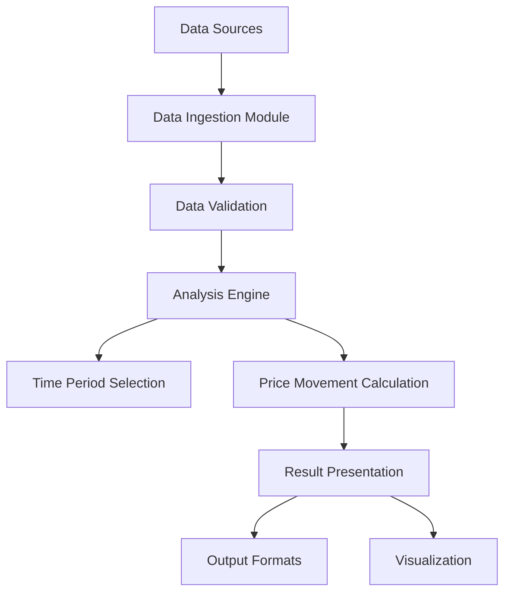
```mermaid
graph TD
    A[Data Sources] --> B[Data Ingestion Module]
    B --> C[Data Validation]
    C --> D[Analysis Engine]
    D --> E[Time Period Selection]
    D --> F[Price Movement Calculation]
    F --> G[Result Presentation]
    G --> H[Output Formats]
    G --> I[Visualization]
```

#### 1.2.3 Success Criteria

| Success Metric | Target |
|----------------|--------|
| Calculation Accuracy | 100% accuracy in price movement calculations |
| Processing Time | Analysis completed within 5 seconds for datasets up to 1M rows |
| User Adoption | 80% of target users actively utilizing the system within 3 months |
| Cost Visibility | Provide visibility into 95% of freight cost fluctuations |

### 1.3 SCOPE

#### 1.3.1 In-Scope

**Core Features and Functionalities:**
- Automated data collection from specified sources (CSV, databases, APIs)
- User-defined time period selection with flexible granularity
- Calculation of absolute and percentage changes in freight prices
- Trend direction identification (increasing, decreasing, stable)
- Formatted output delivery in multiple formats (JSON, CSV, text)
- Optional visualization capabilities for trend representation

**Implementation Boundaries:**
- Support for all major freight modes (ocean, air, road, rail)
- Integration with enterprise TMS and ERP systems
- Global geographic coverage for origin-destination pairs
- Support for multiple currencies with conversion capabilities

#### 1.3.2 Out-of-Scope

- Predictive analytics and future price forecasting
- Real-time freight market monitoring (batch processing only)
- Carrier performance analysis beyond price metrics
- Automated procurement or carrier selection functionality
- Mobile application interface (web/desktop interfaces only)
- Integration with non-logistics systems (e.g., CRM, marketing platforms)
- Regulatory compliance reporting and documentation

## 2. PRODUCT REQUIREMENTS

### 2.1 FEATURE CATALOG

#### 2.1.1 Data Collection & Ingestion

| Metadata | Details |
|----------|---------|
| Feature ID | F-001 |
| Feature Name | Data Collection & Ingestion |
| Feature Category | Data Management |
| Priority Level | Critical |
| Status | Proposed |

**Description:**
- **Overview:** Automated collection and ingestion of freight cost data from multiple sources.
- **Business Value:** Ensures reliable, consistent data input for accurate price movement analysis.
- **User Benefits:** Reduces manual data entry and standardizes data formats.
- **Technical Context:** Serves as the foundation for all subsequent analysis operations.

**Dependencies:**
- **Prerequisite Features:** None
- **System Dependencies:** Access to data storage systems
- **External Dependencies:** Data source availability and format consistency
- **Integration Requirements:** API connections to TMS/ERP systems

#### 2.1.2 Time Period Selection

| Metadata | Details |
|----------|---------|
| Feature ID | F-002 |
| Feature Name | Time Period Selection |
| Feature Category | User Interface |
| Priority Level | Critical |
| Status | Proposed |

**Description:**
- **Overview:** Allows users to define specific time periods for freight price movement analysis.
- **Business Value:** Enables targeted analysis of relevant time frames for decision-making.
- **User Benefits:** Flexibility to analyze trends across different time horizons.
- **Technical Context:** Provides temporal parameters for the analysis engine.

**Dependencies:**
- **Prerequisite Features:** F-001 (Data Collection & Ingestion)
- **System Dependencies:** Date/time handling capabilities
- **External Dependencies:** None
- **Integration Requirements:** None

#### 2.1.3 Price Movement Calculation

| Metadata | Details |
|----------|---------|
| Feature ID | F-003 |
| Feature Name | Price Movement Calculation |
| Feature Category | Analytics |
| Priority Level | Critical |
| Status | Proposed |

**Description:**
- **Overview:** Calculates absolute and percentage changes in freight prices over selected time periods.
- **Business Value:** Provides quantitative insights into cost fluctuations.
- **User Benefits:** Enables data-driven decisions based on price trend analysis.
- **Technical Context:** Core analytical functionality of the system.

**Dependencies:**
- **Prerequisite Features:** F-001, F-002
- **System Dependencies:** Computational resources
- **External Dependencies:** None
- **Integration Requirements:** None

#### 2.1.4 Result Presentation

| Metadata | Details |
|----------|---------|
| Feature ID | F-004 |
| Feature Name | Result Presentation |
| Feature Category | Reporting |
| Priority Level | High |
| Status | Proposed |

**Description:**
- **Overview:** Formats and delivers analysis results in user-specified formats.
- **Business Value:** Transforms raw data into actionable insights.
- **User Benefits:** Easily consumable information for decision-making.
- **Technical Context:** Output layer of the system.

**Dependencies:**
- **Prerequisite Features:** F-003
- **System Dependencies:** None
- **External Dependencies:** None
- **Integration Requirements:** Potential integration with visualization tools

#### 2.1.5 Data Quality Management

| Metadata | Details |
|----------|---------|
| Feature ID | F-005 |
| Feature Name | Data Quality Management |
| Feature Category | Data Management |
| Priority Level | High |
| Status | Proposed |

**Description:**
- **Overview:** Validates data completeness, format correctness, and identifies anomalies.
- **Business Value:** Ensures analysis is based on reliable, clean data.
- **User Benefits:** Reduces errors in decision-making due to data quality issues.
- **Technical Context:** Data preprocessing component.

**Dependencies:**
- **Prerequisite Features:** F-001
- **System Dependencies:** None
- **External Dependencies:** None
- **Integration Requirements:** None

#### 2.1.6 Error Handling & Logging

| Metadata | Details |
|----------|---------|
| Feature ID | F-006 |
| Feature Name | Error Handling & Logging |
| Feature Category | System Operations |
| Priority Level | Medium |
| Status | Proposed |

**Description:**
- **Overview:** Manages system errors and maintains operation logs.
- **Business Value:** Minimizes system downtime and facilitates troubleshooting.
- **User Benefits:** Improved system reliability and transparency.
- **Technical Context:** Cross-cutting concern across all system components.

**Dependencies:**
- **Prerequisite Features:** All features
- **System Dependencies:** Logging infrastructure
- **External Dependencies:** None
- **Integration Requirements:** Potential integration with monitoring systems

### 2.2 FUNCTIONAL REQUIREMENTS TABLE

#### 2.2.1 Data Collection & Ingestion Requirements

| Requirement Details | Specifications |
|---------------------|---------------|
| **F-001-RQ-001** | System must support CSV file imports |
| Description | Allow users to upload freight cost data via CSV files |
| Acceptance Criteria | Successfully import valid CSV files with all required fields |
| Priority | Must-Have |
| Complexity | Low |
| Input Parameters | CSV file with freight charge, currency, origin, destination, date/time |
| Output/Response | Confirmation of successful import with record count |
| Performance Criteria | Process 10,000 records within 30 seconds |
| Data Requirements | Standard CSV format with headers |

| Requirement Details | Specifications |
|---------------------|---------------|
| **F-001-RQ-002** | System must support database connections |
| Description | Connect to internal databases to extract freight cost data |
| Acceptance Criteria | Successfully query and retrieve data from supported database types |
| Priority | Should-Have |
| Complexity | Medium |
| Input Parameters | Connection string, credentials, query parameters |
| Output/Response | Retrieved dataset with confirmation of record count |
| Performance Criteria | Complete database queries within 10 seconds |
| Data Requirements | SQL-compatible database structure |

| Requirement Details | Specifications |
|---------------------|---------------|
| **F-001-RQ-003** | System must support API integrations |
| Description | Connect to external systems via APIs to retrieve freight cost data |
| Acceptance Criteria | Successfully authenticate and retrieve data from supported APIs |
| Priority | Should-Have |
| Complexity | High |
| Input Parameters | API endpoint, authentication credentials, request parameters |
| Output/Response | Retrieved dataset with confirmation of record count |
| Performance Criteria | Complete API requests within 15 seconds |
| Data Requirements | JSON or XML formatted response data |

#### 2.2.2 Time Period Selection Requirements

| Requirement Details | Specifications |
|---------------------|---------------|
| **F-002-RQ-001** | System must allow date range selection |
| Description | Enable users to specify start and end dates for analysis |
| Acceptance Criteria | Successfully accept and validate date range inputs |
| Priority | Must-Have |
| Complexity | Low |
| Input Parameters | Start date, end date |
| Output/Response | Confirmation of selected date range |
| Performance Criteria | Immediate response to user selection |
| Data Requirements | Valid date format (YYYY-MM-DD) |

| Requirement Details | Specifications |
|---------------------|---------------|
| **F-002-RQ-002** | System must support time granularity selection |
| Description | Allow users to select analysis granularity (daily, weekly, monthly) |
| Acceptance Criteria | Successfully apply selected granularity to analysis |
| Priority | Must-Have |
| Complexity | Medium |
| Input Parameters | Granularity selection (dropdown or radio buttons) |
| Output/Response | Confirmation of selected granularity |
| Performance Criteria | Immediate response to user selection |
| Data Requirements | None |

| Requirement Details | Specifications |
|---------------------|---------------|
| **F-002-RQ-003** | System must support custom interval definition |
| Description | Allow users to define custom time intervals for analysis |
| Acceptance Criteria | Successfully apply custom intervals to analysis |
| Priority | Should-Have |
| Complexity | Medium |
| Input Parameters | Custom interval specification |
| Output/Response | Confirmation of custom interval |
| Performance Criteria | Immediate response to user selection |
| Data Requirements | Valid interval format |

#### 2.2.3 Price Movement Calculation Requirements

| Requirement Details | Specifications |
|---------------------|---------------|
| **F-003-RQ-001** | System must calculate absolute price changes |
| Description | Calculate the difference in freight charges between time points |
| Acceptance Criteria | Correct calculation of absolute differences |
| Priority | Must-Have |
| Complexity | Low |
| Input Parameters | Freight prices at different time points |
| Output/Response | Absolute change value |
| Performance Criteria | Calculate within 1 second for standard datasets |
| Data Requirements | Numeric price data |

| Requirement Details | Specifications |
|---------------------|---------------|
| **F-003-RQ-002** | System must calculate percentage price changes |
| Description | Calculate the percentage change in freight charges between time points |
| Acceptance Criteria | Correct calculation of percentage changes |
| Priority | Must-Have |
| Complexity | Low |
| Input Parameters | Freight prices at different time points |
| Output/Response | Percentage change value |
| Performance Criteria | Calculate within 1 second for standard datasets |
| Data Requirements | Numeric price data |

| Requirement Details | Specifications |
|---------------------|---------------|
| **F-003-RQ-003** | System must identify trend direction |
| Description | Determine if prices are increasing, decreasing, or stable |
| Acceptance Criteria | Correct identification of trend direction |
| Priority | Must-Have |
| Complexity | Medium |
| Input Parameters | Calculated price changes |
| Output/Response | Trend indicator (up, down, stable) |
| Performance Criteria | Calculate within 1 second for standard datasets |
| Data Requirements | Calculated change values |

| Requirement Details | Specifications |
|---------------------|---------------|
| **F-003-RQ-004** | System must support aggregation options |
| Description | Calculate average, minimum, and maximum freight charges |
| Acceptance Criteria | Correct calculation of aggregated values |
| Priority | Should-Have |
| Complexity | Medium |
| Input Parameters | Freight prices over selected time period |
| Output/Response | Aggregated values (avg, min, max) |
| Performance Criteria | Calculate within 2 seconds for standard datasets |
| Data Requirements | Numeric price data |

#### 2.2.4 Result Presentation Requirements

| Requirement Details | Specifications |
|---------------------|---------------|
| **F-004-RQ-001** | System must support JSON output format |
| Description | Generate analysis results in JSON format |
| Acceptance Criteria | Valid, well-formed JSON output |
| Priority | Must-Have |
| Complexity | Low |
| Input Parameters | Analysis results |
| Output/Response | JSON-formatted data |
| Performance Criteria | Generate within 1 second |
| Data Requirements | Calculated analysis results |

| Requirement Details | Specifications |
|---------------------|---------------|
| **F-004-RQ-002** | System must support CSV output format |
| Description | Generate analysis results in CSV format |
| Acceptance Criteria | Valid CSV output with headers |
| Priority | Must-Have |
| Complexity | Low |
| Input Parameters | Analysis results |
| Output/Response | CSV-formatted data |
| Performance Criteria | Generate within 1 second |
| Data Requirements | Calculated analysis results |

| Requirement Details | Specifications |
|---------------------|---------------|
| **F-004-RQ-003** | System must support text summary output |
| Description | Generate human-readable text summary of analysis results |
| Acceptance Criteria | Clear, concise text summary |
| Priority | Should-Have |
| Complexity | Medium |
| Input Parameters | Analysis results |
| Output/Response | Formatted text summary |
| Performance Criteria | Generate within 1 second |
| Data Requirements | Calculated analysis results |

| Requirement Details | Specifications |
|---------------------|---------------|
| **F-004-RQ-004** | System should support basic visualization |
| Description | Generate simple time-series or bar charts for selected intervals |
| Acceptance Criteria | Clear, accurate visual representation of trends |
| Priority | Could-Have |
| Complexity | High |
| Input Parameters | Analysis results |
| Output/Response | Chart image or interactive visualization |
| Performance Criteria | Generate within 3 seconds |
| Data Requirements | Calculated analysis results |

### 2.3 FEATURE RELATIONSHIPS

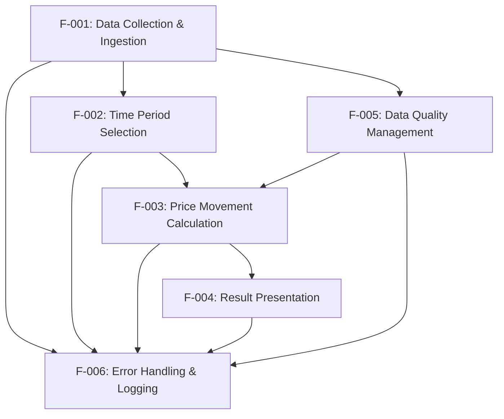
```mermaid
graph TD
    F001[F-001: Data Collection & Ingestion] --> F002[F-002: Time Period Selection]
    F001 --> F005[F-005: Data Quality Management]
    F002 --> F003[F-003: Price Movement Calculation]
    F003 --> F004[F-004: Result Presentation]
    F005 --> F003
    F001 --> F006[F-006: Error Handling & Logging]
    F002 --> F006
    F003 --> F006
    F004 --> F006
    F005 --> F006
```

#### 2.3.1 Integration Points

| Feature | Integration Points |
|---------|-------------------|
| F-001 | TMS systems, ERP systems, External APIs, Database systems |
| F-004 | Visualization tools, Reporting systems |
| F-006 | Monitoring systems, Alert management systems |

#### 2.3.2 Shared Components

| Component | Used By Features |
|-----------|------------------|
| Data Validation Engine | F-001, F-005 |
| Calculation Engine | F-003 |
| Output Formatter | F-004 |
| Error Handler | All Features |

### 2.4 IMPLEMENTATION CONSIDERATIONS

#### 2.4.1 Technical Constraints

| Feature | Technical Constraints |
|---------|----------------------|
| F-001 | Must support multiple data formats and sources |
| F-003 | Must handle currency conversions and different units |
| F-004 | Must generate standards-compliant output formats |
| F-005 | Must identify and handle anomalous data points |

#### 2.4.2 Performance Requirements

| Feature | Performance Requirements |
|---------|--------------------------|
| F-001 | Process 1M records within 5 minutes |
| F-003 | Complete calculations within 5 seconds for datasets up to 1M rows |
| F-004 | Generate outputs within 3 seconds |
| Overall | System response time under 10 seconds for standard operations |

#### 2.4.3 Scalability Considerations

| Feature | Scalability Considerations |
|---------|----------------------------|
| F-001 | Must scale to handle increasing data volumes |
| F-003 | Calculation engine must support parallel processing |
| Overall | Architecture should accommodate 25% annual growth in data volume |

#### 2.4.4 Security Implications

| Feature | Security Implications |
|---------|----------------------|
| F-001 | Must secure data during transfer and storage |
| Overall | Must implement access controls for sensitive pricing data |
| Overall | Must comply with data protection regulations |

### 2.5 TRACEABILITY MATRIX

| Requirement ID | Business Need | Feature ID | Test Case ID |
|----------------|--------------|------------|-------------|
| F-001-RQ-001 | Data Collection | F-001 | TC-001 |
| F-001-RQ-002 | Data Collection | F-001 | TC-002 |
| F-001-RQ-003 | Data Collection | F-001 | TC-003 |
| F-002-RQ-001 | Time Period Analysis | F-002 | TC-004 |
| F-002-RQ-002 | Time Period Analysis | F-002 | TC-005 |
| F-002-RQ-003 | Time Period Analysis | F-002 | TC-006 |
| F-003-RQ-001 | Price Analysis | F-003 | TC-007 |
| F-003-RQ-002 | Price Analysis | F-003 | TC-008 |
| F-003-RQ-003 | Price Analysis | F-003 | TC-009 |
| F-003-RQ-004 | Price Analysis | F-003 | TC-010 |
| F-004-RQ-001 | Result Delivery | F-004 | TC-011 |
| F-004-RQ-002 | Result Delivery | F-004 | TC-012 |
| F-004-RQ-003 | Result Delivery | F-004 | TC-013 |
| F-004-RQ-004 | Result Delivery | F-004 | TC-014 |

## 3. TECHNOLOGY STACK

### 3.1 PROGRAMMING LANGUAGES

| Language | Component | Justification |
|----------|-----------|---------------|
| Python 3.9+ | Core Application | Excellent data processing capabilities, rich ecosystem of data analysis libraries, and strong integration support for various data sources. Ideal for implementing the calculation engine and data processing pipelines. |
| SQL | Database Queries | Required for efficient data retrieval from relational databases when connecting to enterprise TMS and ERP systems. |
| JavaScript | Optional Visualizations | Necessary for implementing interactive visualizations in the web interface. |

### 3.2 FRAMEWORKS & LIBRARIES

| Framework/Library | Version | Purpose | Justification |
|-------------------|---------|---------|---------------|
| Flask | 2.2.x | Web Framework | Lightweight framework that provides the necessary functionality for API endpoints without unnecessary overhead. Suitable for the scale of this application. |
| Pandas | 1.5.x | Data Processing | Industry-standard for data manipulation and analysis in Python. Provides efficient data structures and operations for time series data. |
| NumPy | 1.23.x | Numerical Computation | Supports high-performance array operations required for price movement calculations. |
| SQLAlchemy | 2.0.x | ORM & Database Access | Provides database abstraction and connection pooling for efficient database operations across multiple database types. |
| Requests | 2.28.x | API Integration | Reliable HTTP library for external API integrations with TMS and ERP systems. |
| Matplotlib/Plotly | 3.6.x/5.11.x | Data Visualization | Libraries for generating static and interactive visualizations of price trends. |
| Pytest | 7.3.x | Testing | Comprehensive testing framework for ensuring calculation accuracy and system reliability. |

### 3.3 DATABASES & STORAGE

| Database/Storage | Purpose | Justification |
|------------------|---------|---------------|
| PostgreSQL | Primary Data Store | Robust relational database with excellent support for time-series data and complex queries. Suitable for storing historical freight pricing data. |
| Redis | Caching Layer | In-memory data store for caching frequent queries and improving response times for repeated analyses. |
| Amazon S3 | File Storage | For storing uploaded CSV files and generated reports/visualizations. Provides durability and scalability. |
| TimescaleDB (Extension) | Time-Series Data | Optional PostgreSQL extension optimized for time-series data, which aligns with the temporal nature of freight price analysis. |

### 3.4 THIRD-PARTY SERVICES

| Service | Purpose | Justification |
|---------|---------|---------------|
| Currency Conversion API | Exchange Rate Data | Required for handling multiple currencies in freight pricing data. |
| TMS/ERP API Connectors | Data Integration | Necessary for automated data collection from enterprise systems. |
| Prometheus | Monitoring | For tracking system performance metrics and ensuring response time requirements are met. |
| Grafana | Visualization | For monitoring dashboards to track system health and performance. |
| Sentry | Error Tracking | For capturing and analyzing runtime errors to improve system reliability. |

### 3.5 DEVELOPMENT & DEPLOYMENT

| Tool/Technology | Purpose | Justification |
|-----------------|---------|---------------|
| Docker | Containerization | Ensures consistent environment across development, testing, and production. |
| Docker Compose | Local Development | Simplifies management of multi-container development environment. |
| GitHub Actions | CI/CD Pipeline | Automates testing and deployment processes to ensure code quality. |
| AWS ECS/Kubernetes | Container Orchestration | Provides scalability and high availability for production deployment. |
| Terraform | Infrastructure as Code | Enables reproducible infrastructure deployment and management. |
| Poetry | Dependency Management | Modern Python dependency management for consistent package versions. |
| Black/Flake8/isort | Code Quality | Enforces code style and quality standards. |

### 3.6 ARCHITECTURE DIAGRAM

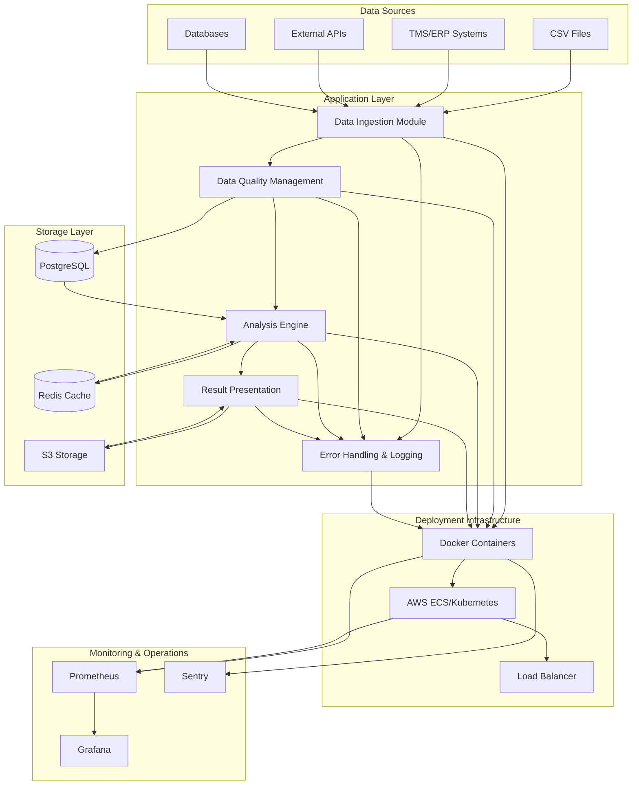
```mermaid
graph TD
    subgraph "Data Sources"
        A1[CSV Files] 
        A2[TMS/ERP Systems]
        A3[External APIs]
        A4[Databases]
    end
    
    subgraph "Application Layer"
        B1[Data Ingestion Module]
        B2[Data Quality Management]
        B3[Analysis Engine]
        B4[Result Presentation]
        B5[Error Handling & Logging]
    end
    
    subgraph "Storage Layer"
        C1[(PostgreSQL)]
        C2[(Redis Cache)]
        C3[S3 Storage]
    end
    
    subgraph "Deployment Infrastructure"
        D1[Docker Containers]
        D2[AWS ECS/Kubernetes]
        D3[Load Balancer]
    end
    
    subgraph "Monitoring & Operations"
        E1[Prometheus]
        E2[Grafana]
        E3[Sentry]
    end
    
    A1 --> B1
    A2 --> B1
    A3 --> B1
    A4 --> B1
    
    B1 --> B2
    B2 --> C1
    B2 --> B3
    B3 --> C2
    B3 --> B4
    B4 --> C3
    
    B1 --> B5
    B2 --> B5
    B3 --> B5
    B4 --> B5
    
    C1 --> B3
    C2 --> B3
    C3 --> B4
    
    B1 --> D1
    B2 --> D1
    B3 --> D1
    B4 --> D1
    B5 --> D1
    
    D1 --> D2
    D2 --> D3
    
    D1 --> E1
    D2 --> E1
    E1 --> E2
    D1 --> E3
```

### 3.7 TECHNOLOGY SELECTION RATIONALE

| Requirement | Technology Solution | Rationale |
|-------------|---------------------|-----------|
| Data Processing at Scale | Python + Pandas | Pandas provides optimized data structures for handling large datasets with time-series operations. |
| Multiple Data Source Support | SQLAlchemy + Requests | Enables standardized access to various data sources (databases, APIs, files). |
| Fast Calculation Performance | NumPy + Redis Caching | NumPy provides vectorized operations for calculations, while Redis caching improves response times for repeated queries. |
| Flexible Output Formats | Flask API + Pandas | Flask provides API endpoints for different output formats, while Pandas supports easy conversion to JSON, CSV, etc. |
| Visualization Capabilities | Matplotlib/Plotly | Industry-standard visualization libraries with support for time-series data representation. |
| Scalability | Docker + Kubernetes/ECS | Containerization enables horizontal scaling to handle increasing data volumes. |
| Monitoring & Reliability | Prometheus + Grafana + Sentry | Comprehensive monitoring and error tracking to ensure system reliability and performance. |

## 4. PROCESS FLOWCHART

### 4.1 SYSTEM WORKFLOWS

#### 4.1.1 Core Business Processes

##### Data Collection and Analysis Workflow

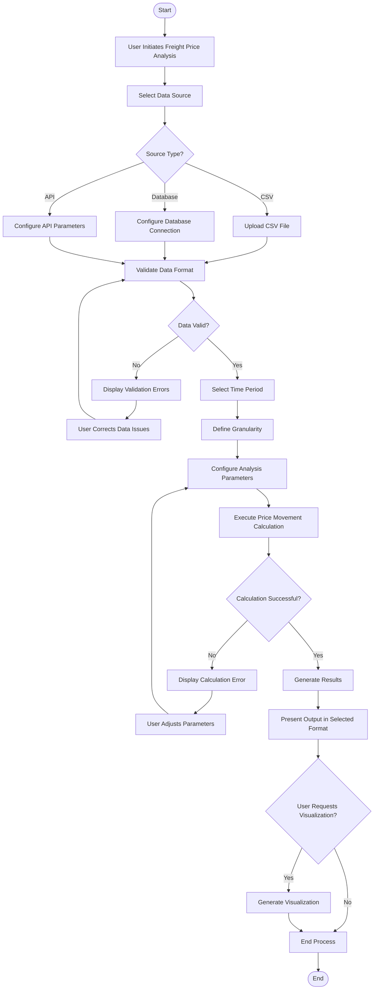
```mermaid
flowchart TD
    Start([Start]) --> A[User Initiates Freight Price Analysis]
    A --> B[Select Data Source]
    B --> C{Source Type?}
    C -->|CSV| D[Upload CSV File]
    C -->|Database| E[Configure Database Connection]
    C -->|API| F[Configure API Parameters]
    
    D --> G[Validate Data Format]
    E --> G
    F --> G
    
    G --> H{Data Valid?}
    H -->|No| I[Display Validation Errors]
    I --> J[User Corrects Data Issues]
    J --> G
    
    H -->|Yes| K[Select Time Period]
    K --> L[Define Granularity]
    L --> M[Configure Analysis Parameters]
    M --> N[Execute Price Movement Calculation]
    
    N --> O{Calculation Successful?}
    O -->|No| P[Display Calculation Error]
    P --> Q[User Adjusts Parameters]
    Q --> M
    
    O -->|Yes| R[Generate Results]
    R --> S[Present Output in Selected Format]
    S --> T{User Requests Visualization?}
    T -->|Yes| U[Generate Visualization]
    T -->|No| V[End Process]
    U --> V
    V --> End([End])
```

##### User Journey: Comparative Analysis Workflow

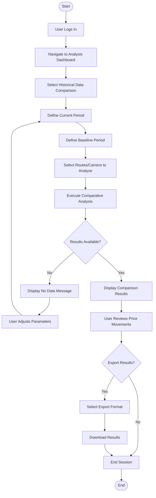
```mermaid
flowchart TD
    Start([Start]) --> A[User Logs In]
    A --> B[Navigate to Analysis Dashboard]
    B --> C[Select Historical Data Comparison]
    C --> D[Define Current Period]
    D --> E[Define Baseline Period]
    E --> F[Select Routes/Carriers to Analyze]
    F --> G[Execute Comparative Analysis]
    
    G --> H{Results Available?}
    H -->|No| I[Display No Data Message]
    I --> J[User Adjusts Parameters]
    J --> D
    
    H -->|Yes| K[Display Comparison Results]
    K --> L[User Reviews Price Movements]
    L --> M{Export Results?}
    M -->|Yes| N[Select Export Format]
    N --> O[Download Results]
    M -->|No| P[End Session]
    O --> P
    P --> End([End])
```

#### 4.1.2 Integration Workflows

##### Data Integration Flow

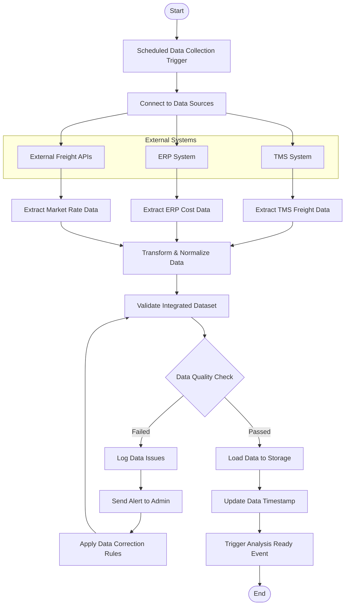
```mermaid
flowchart TD
    Start([Start]) --> A[Scheduled Data Collection Trigger]
    A --> B[Connect to Data Sources]
    
    subgraph "External Systems"
        C[TMS System]
        D[ERP System]
        E[External Freight APIs]
    end
    
    B --> C
    B --> D
    B --> E
    
    C --> F[Extract TMS Freight Data]
    D --> G[Extract ERP Cost Data]
    E --> H[Extract Market Rate Data]
    
    F --> I[Transform & Normalize Data]
    G --> I
    H --> I
    
    I --> J[Validate Integrated Dataset]
    J --> K{Data Quality Check}
    K -->|Failed| L[Log Data Issues]
    L --> M[Send Alert to Admin]
    M --> N[Apply Data Correction Rules]
    N --> J
    
    K -->|Passed| O[Load Data to Storage]
    O --> P[Update Data Timestamp]
    P --> Q[Trigger Analysis Ready Event]
    Q --> End([End])
```

##### Batch Processing Sequence

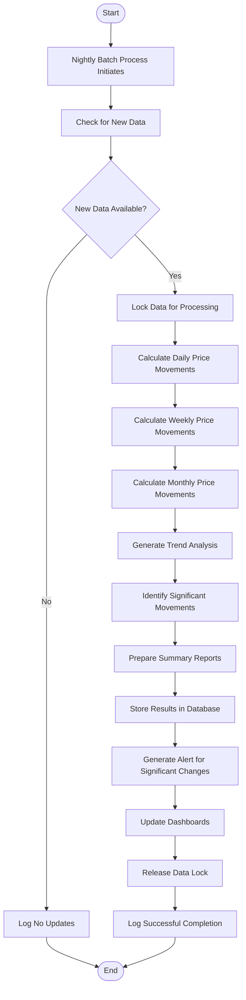
```mermaid
flowchart TD
    Start([Start]) --> A[Nightly Batch Process Initiates]
    A --> B[Check for New Data]
    B --> C{New Data Available?}
    C -->|No| D[Log No Updates]
    D --> End([End])
    
    C -->|Yes| E[Lock Data for Processing]
    E --> F[Calculate Daily Price Movements]
    F --> G[Calculate Weekly Price Movements]
    G --> H[Calculate Monthly Price Movements]
    
    H --> I[Generate Trend Analysis]
    I --> J[Identify Significant Movements]
    J --> K[Prepare Summary Reports]
    
    K --> L[Store Results in Database]
    L --> M[Generate Alert for Significant Changes]
    M --> N[Update Dashboards]
    N --> O[Release Data Lock]
    O --> P[Log Successful Completion]
    P --> End
```

### 4.2 FLOWCHART REQUIREMENTS

#### 4.2.1 Data Collection & Ingestion Process

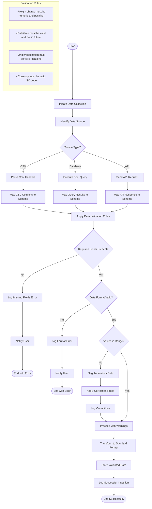
```mermaid
flowchart TD
    Start([Start]) --> A[Initiate Data Collection]
    A --> B[Identify Data Source]
    
    B --> C{Source Type?}
    C -->|CSV| D[Parse CSV Headers]
    C -->|Database| E[Execute SQL Query]
    C -->|API| F[Send API Request]
    
    D --> G[Map CSV Columns to Schema]
    E --> H[Map Query Results to Schema]
    F --> I[Map API Response to Schema]
    
    G --> J[Apply Data Validation Rules]
    H --> J
    I --> J
    
    J --> K{Required Fields Present?}
    K -->|No| L[Log Missing Fields Error]
    L --> M[Notify User]
    M --> End1([End with Error])
    
    K -->|Yes| N{Data Format Valid?}
    N -->|No| O[Log Format Error]
    O --> P[Notify User]
    P --> End2([End with Error])
    
    N -->|Yes| Q{Values in Range?}
    Q -->|No| R[Flag Anomalous Data]
    R --> S[Apply Correction Rules]
    S --> T[Log Corrections]
    T --> U[Proceed with Warnings]
    
    Q -->|Yes| U
    U --> V[Transform to Standard Format]
    V --> W[Store Validated Data]
    W --> X[Log Successful Ingestion]
    X --> End3([End Successfully])
    
    subgraph "Validation Rules"
        VR1["- Freight charge must be numeric and positive"]
        VR2["- Date/time must be valid and not in future"]
        VR3["- Origin/destination must be valid locations"]
        VR4["- Currency must be valid ISO code"]
    end
```

#### 4.2.2 Price Movement Calculation Process

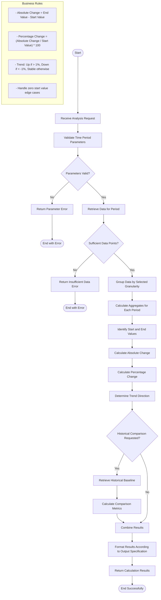
```mermaid
flowchart TD
    Start([Start]) --> A[Receive Analysis Request]
    A --> B[Validate Time Period Parameters]
    
    B --> C{Parameters Valid?}
    C -->|No| D[Return Parameter Error]
    D --> End1([End with Error])
    
    C -->|Yes| E[Retrieve Data for Period]
    E --> F{Sufficient Data Points?}
    F -->|No| G[Return Insufficient Data Error]
    G --> End2([End with Error])
    
    F -->|Yes| H[Group Data by Selected Granularity]
    H --> I[Calculate Aggregates for Each Period]
    I --> J[Identify Start and End Values]
    
    J --> K[Calculate Absolute Change]
    K --> L[Calculate Percentage Change]
    L --> M[Determine Trend Direction]
    
    M --> N{Historical Comparison Requested?}
    N -->|Yes| O[Retrieve Historical Baseline]
    O --> P[Calculate Comparison Metrics]
    P --> Q[Combine Results]
    
    N -->|No| Q
    
    Q --> R[Format Results According to Output Specification]
    R --> S[Return Calculation Results]
    S --> End3([End Successfully])
    
    subgraph BusinessRules[Business Rules]
        BR1["- Absolute Change = End Value - Start Value"]
        BR2["- Percentage Change = (Absolute Change / Start Value) * 100"]
        BR3["- Trend: Up if > 1%, Down if < -1%, Stable otherwise"]
        BR4["- Handle zero start value edge cases"]
    end
```

#### 4.2.3 Result Presentation Process

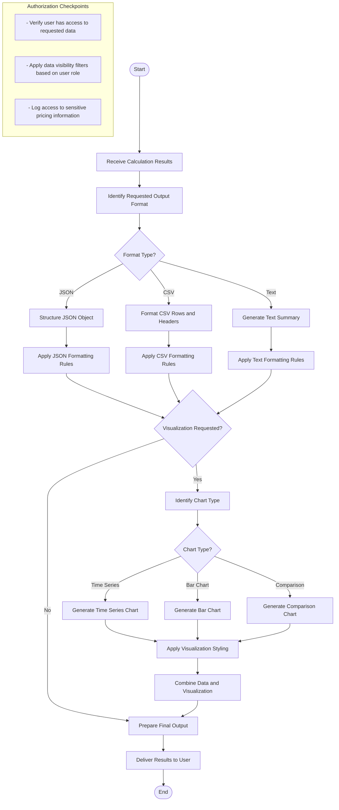
```mermaid
flowchart TD
    Start([Start]) --> A[Receive Calculation Results]
    A --> B[Identify Requested Output Format]
    
    B --> C{Format Type?}
    C -->|JSON| D[Structure JSON Object]
    C -->|CSV| E[Format CSV Rows and Headers]
    C -->|Text| F[Generate Text Summary]
    
    D --> G[Apply JSON Formatting Rules]
    E --> G1[Apply CSV Formatting Rules]
    F --> G2[Apply Text Formatting Rules]
    
    G --> H{Visualization Requested?}
    G1 --> H
    G2 --> H
    
    H -->|Yes| I[Identify Chart Type]
    I --> J{Chart Type?}
    J -->|Time Series| K[Generate Time Series Chart]
    J -->|Bar Chart| L[Generate Bar Chart]
    J -->|Comparison| M[Generate Comparison Chart]
    
    K --> N[Apply Visualization Styling]
    L --> N
    M --> N
    
    N --> O[Combine Data and Visualization]
    H -->|No| P[Prepare Final Output]
    O --> P
    
    P --> Q[Deliver Results to User]
    Q --> End([End])
    
    subgraph "Authorization Checkpoints"
        AC1["- Verify user has access to requested data"]
        AC2["- Apply data visibility filters based on user role"]
        AC3["- Log access to sensitive pricing information"]
    end
```

### 4.3 TECHNICAL IMPLEMENTATION

#### 4.3.1 State Management

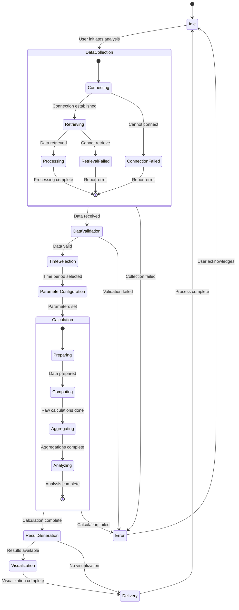
```mermaid
stateDiagram-v2
    [*] --> Idle
    
    Idle --> DataCollection: User initiates analysis
    DataCollection --> DataValidation: Data received
    DataCollection --> Error: Collection failed
    
    DataValidation --> TimeSelection: Data valid
    DataValidation --> Error: Validation failed
    
    TimeSelection --> ParameterConfiguration: Time period selected
    ParameterConfiguration --> Calculation: Parameters set
    
    Calculation --> ResultGeneration: Calculation complete
    Calculation --> Error: Calculation failed
    
    ResultGeneration --> Visualization: Results available
    ResultGeneration --> Delivery: No visualization
    Visualization --> Delivery: Visualization complete
    
    Delivery --> Idle: Process complete
    Error --> Idle: User acknowledges
    
    state DataCollection {
        [*] --> Connecting
        Connecting --> Retrieving: Connection established
        Connecting --> ConnectionFailed: Cannot connect
        Retrieving --> Processing: Data retrieved
        Retrieving --> RetrievalFailed: Cannot retrieve
        Processing --> [*]: Processing complete
        ConnectionFailed --> [*]: Report error
        RetrievalFailed --> [*]: Report error
    }
    
    state Calculation {
        [*] --> Preparing
        Preparing --> Computing: Data prepared
        Computing --> Aggregating: Raw calculations done
        Aggregating --> Analyzing: Aggregations complete
        Analyzing --> [*]: Analysis complete
    }
```

#### 4.3.2 Error Handling Flow

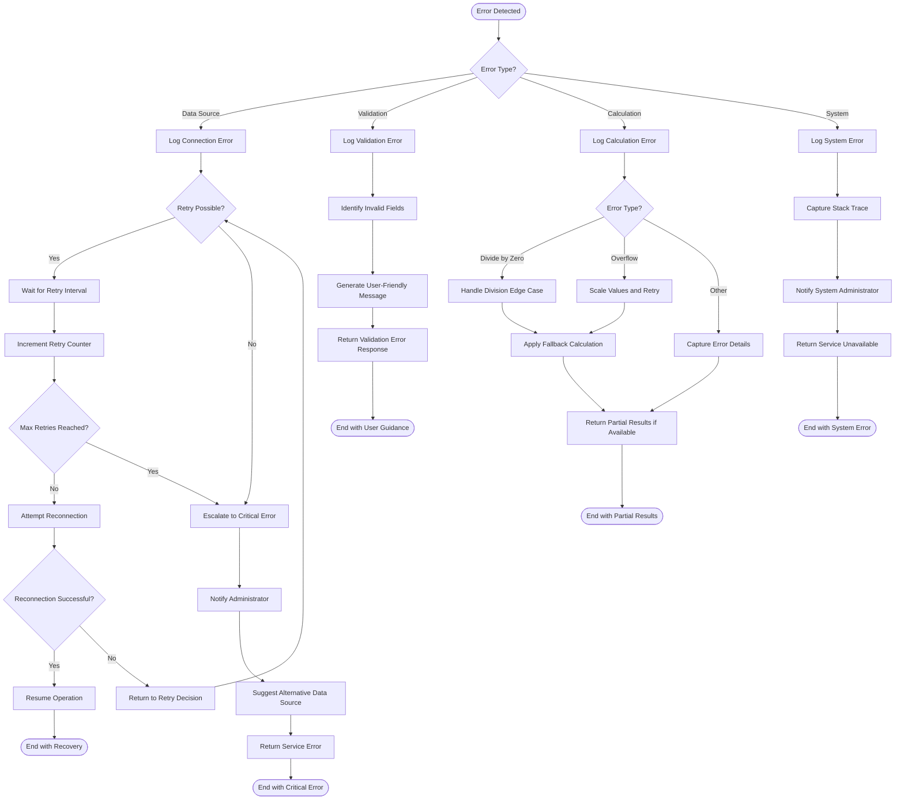
```mermaid
flowchart TD
    Start([Error Detected]) --> A{Error Type?}
    
    A -->|Data Source| B[Log Connection Error]
    B --> C{Retry Possible?}
    C -->|Yes| D[Wait for Retry Interval]
    D --> E[Increment Retry Counter]
    E --> F{Max Retries Reached?}
    F -->|No| G[Attempt Reconnection]
    G --> H{Reconnection Successful?}
    H -->|Yes| I[Resume Operation]
    H -->|No| J[Return to Retry Decision]
    J --> C
    
    F -->|Yes| K[Escalate to Critical Error]
    
    C -->|No| K
    
    A -->|Validation| L[Log Validation Error]
    L --> M[Identify Invalid Fields]
    M --> N[Generate User-Friendly Message]
    N --> O[Return Validation Error Response]
    
    A -->|Calculation| P[Log Calculation Error]
    P --> Q{Error Type?}
    Q -->|Divide by Zero| R[Handle Division Edge Case]
    Q -->|Overflow| S[Scale Values and Retry]
    Q -->|Other| T[Capture Error Details]
    
    R --> U[Apply Fallback Calculation]
    S --> U
    T --> V[Return Partial Results if Available]
    U --> V
    
    A -->|System| W[Log System Error]
    W --> X[Capture Stack Trace]
    X --> Y[Notify System Administrator]
    Y --> Z[Return Service Unavailable]
    
    K --> AA[Notify Administrator]
    AA --> BB[Suggest Alternative Data Source]
    BB --> CC[Return Service Error]
    
    O --> End1([End with User Guidance])
    V --> End2([End with Partial Results])
    Z --> End3([End with System Error])
    CC --> End4([End with Critical Error])
    I --> End5([End with Recovery])
```

### 4.4 INTEGRATION SEQUENCE DIAGRAMS

#### 4.4.1 TMS Integration Sequence

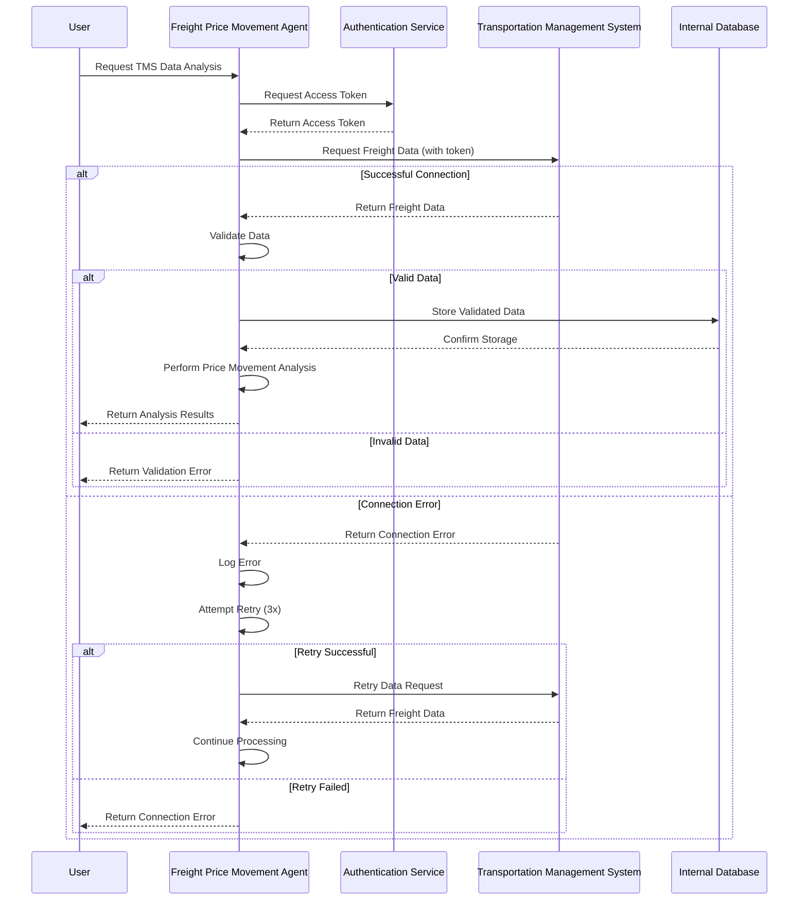
```mermaid
sequenceDiagram
    participant User
    participant Agent as Freight Price Movement Agent
    participant Auth as Authentication Service
    participant TMS as Transportation Management System
    participant DB as Internal Database
    
    User->>Agent: Request TMS Data Analysis
    Agent->>Auth: Request Access Token
    Auth-->>Agent: Return Access Token
    
    Agent->>TMS: Request Freight Data (with token)
    
    alt Successful Connection
        TMS-->>Agent: Return Freight Data
        Agent->>Agent: Validate Data
        
        alt Valid Data
            Agent->>DB: Store Validated Data
            DB-->>Agent: Confirm Storage
            Agent->>Agent: Perform Price Movement Analysis
            Agent-->>User: Return Analysis Results
        else Invalid Data
            Agent-->>User: Return Validation Error
        end
        
    else Connection Error
        TMS-->>Agent: Return Connection Error
        Agent->>Agent: Log Error
        Agent->>Agent: Attempt Retry (3x)
        
        alt Retry Successful
            Agent->>TMS: Retry Data Request
            TMS-->>Agent: Return Freight Data
            Agent->>Agent: Continue Processing
        else Retry Failed
            Agent-->>User: Return Connection Error
        end
    end
```

#### 4.4.2 Batch Processing Sequence

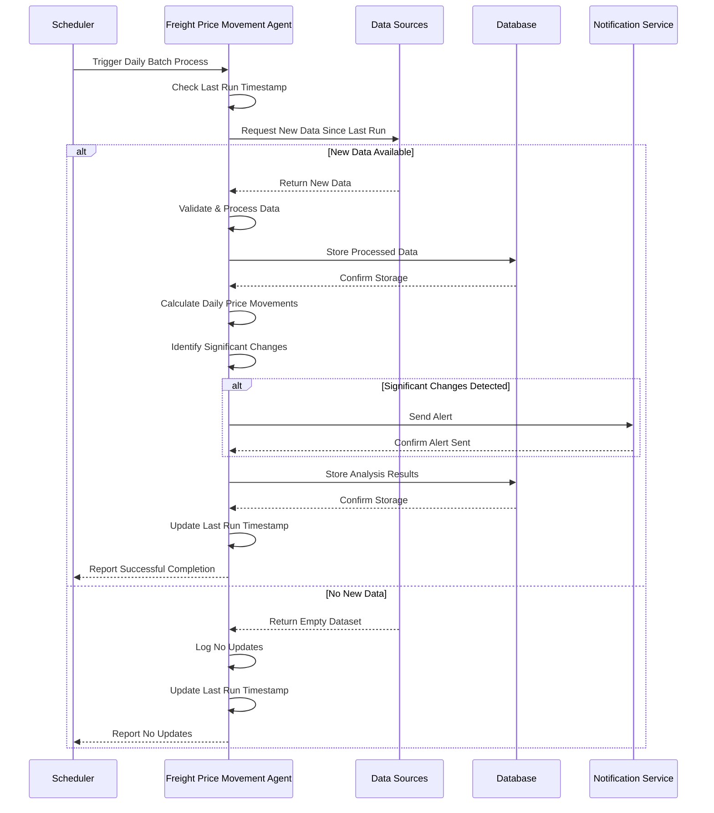
```mermaid
sequenceDiagram
    participant Scheduler
    participant Agent as Freight Price Movement Agent
    participant Sources as Data Sources
    participant DB as Database
    participant Notifier as Notification Service
    
    Scheduler->>Agent: Trigger Daily Batch Process
    Agent->>Agent: Check Last Run Timestamp
    Agent->>Sources: Request New Data Since Last Run
    
    alt New Data Available
        Sources-->>Agent: Return New Data
        Agent->>Agent: Validate & Process Data
        Agent->>DB: Store Processed Data
        DB-->>Agent: Confirm Storage
        
        Agent->>Agent: Calculate Daily Price Movements
        Agent->>Agent: Identify Significant Changes
        
        alt Significant Changes Detected
            Agent->>Notifier: Send Alert
            Notifier-->>Agent: Confirm Alert Sent
        end
        
        Agent->>DB: Store Analysis Results
        DB-->>Agent: Confirm Storage
        Agent->>Agent: Update Last Run Timestamp
        Agent-->>Scheduler: Report Successful Completion
        
    else No New Data
        Sources-->>Agent: Return Empty Dataset
        Agent->>Agent: Log No Updates
        Agent->>Agent: Update Last Run Timestamp
        Agent-->>Scheduler: Report No Updates
    end
```

### 4.5 DETAILED FEATURE FLOWS

#### 4.5.1 Time Period Selection Flow

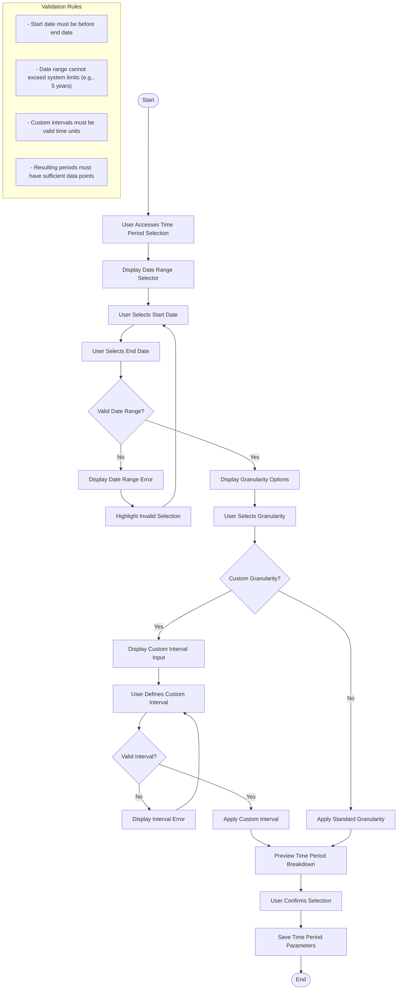
```mermaid
flowchart TD
    Start([Start]) --> A[User Accesses Time Period Selection]
    A --> B[Display Date Range Selector]
    
    B --> C[User Selects Start Date]
    C --> D[User Selects End Date]
    D --> E{Valid Date Range?}
    
    E -->|No| F[Display Date Range Error]
    F --> G[Highlight Invalid Selection]
    G --> C
    
    E -->|Yes| H[Display Granularity Options]
    H --> I[User Selects Granularity]
    
    I --> J{Custom Granularity?}
    J -->|Yes| K[Display Custom Interval Input]
    K --> L[User Defines Custom Interval]
    L --> M{Valid Interval?}
    
    M -->|No| N[Display Interval Error]
    N --> L
    
    M -->|Yes| O[Apply Custom Interval]
    J -->|No| P[Apply Standard Granularity]
    
    O --> Q[Preview Time Period Breakdown]
    P --> Q
    
    Q --> R[User Confirms Selection]
    R --> S[Save Time Period Parameters]
    S --> End([End])
    
    subgraph "Validation Rules"
        VR1["- Start date must be before end date"]
        VR2["- Date range cannot exceed system limits (e.g., 5 years)"]
        VR3["- Custom intervals must be valid time units"]
        VR4["- Resulting periods must have sufficient data points"]
    end
```

#### 4.5.2 Data Quality Management Flow

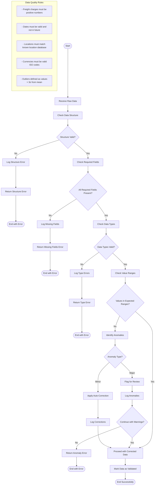
```mermaid
flowchart TD
    Start([Start]) --> A[Receive Raw Data]
    A --> B[Check Data Structure]
    
    B --> C{Structure Valid?}
    C -->|No| D[Log Structure Error]
    D --> E[Return Structure Error]
    E --> End1([End with Error])
    
    C -->|Yes| F[Check Required Fields]
    F --> G{All Required Fields Present?}
    G -->|No| H[Log Missing Fields]
    H --> I[Return Missing Fields Error]
    I --> End2([End with Error])
    
    G -->|Yes| J[Check Data Types]
    J --> K{Data Types Valid?}
    K -->|No| L[Log Type Errors]
    L --> M[Return Type Error]
    M --> End3([End with Error])
    
    K -->|Yes| N[Check Value Ranges]
    N --> O{Values in Expected Ranges?}
    O -->|No| P[Identify Anomalies]
    
    P --> Q{Anomaly Type?}
    Q -->|Minor| R[Apply Auto-Correction]
    Q -->|Major| S[Flag for Review]
    
    R --> T[Log Corrections]
    S --> U[Log Anomalies]
    
    T --> V[Proceed with Corrected Data]
    U --> W{Continue with Warnings?}
    W -->|Yes| V
    W -->|No| X[Return Anomaly Error]
    X --> End4([End with Error])
    
    O -->|Yes| V
    V --> Y[Mark Data as Validated]
    Y --> End5([End Successfully])
    
    subgraph "Data Quality Rules"
        DR1["- Freight charges must be positive numbers"]
        DR2["- Dates must be valid and not in future"]
        DR3["- Locations must match known location database"]
        DR4["- Currencies must be valid ISO codes"]
        DR5["- Outliers defined as values > 3σ from mean"]
    end
```

### 4.6 TIMING AND SLA CONSIDERATIONS

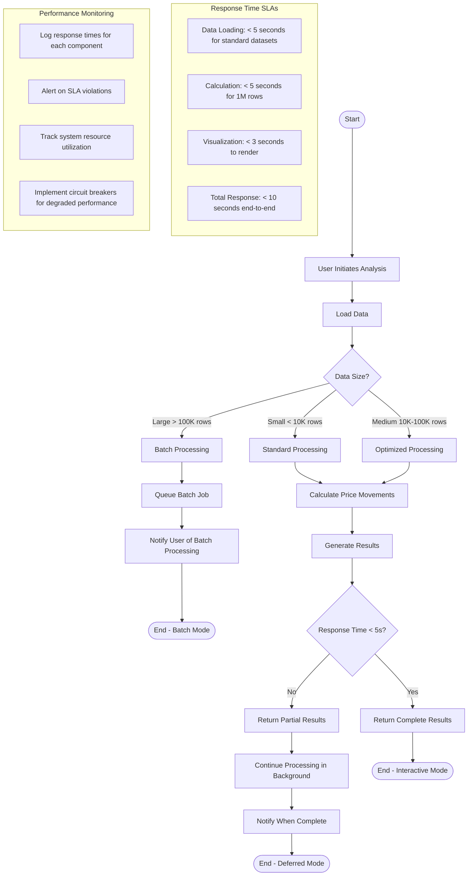
```mermaid
flowchart TD
    Start([Start]) --> A[User Initiates Analysis]
    
    subgraph "Response Time SLAs"
        SLA1["Data Loading: < 5 seconds for standard datasets"]
        SLA2["Calculation: < 5 seconds for 1M rows"]
        SLA3["Visualization: < 3 seconds to render"]
        SLA4["Total Response: < 10 seconds end-to-end"]
    end
    
    A --> B[Load Data]
    B --> C{Data Size?}
    C -->|Small < 10K rows| D[Standard Processing]
    C -->|Medium 10K-100K rows| E[Optimized Processing]
    C -->|Large > 100K rows| F[Batch Processing]
    
    D --> G[Calculate Price Movements]
    E --> G
    F --> H[Queue Batch Job]
    H --> I[Notify User of Batch Processing]
    I --> End1([End - Batch Mode])
    
    G --> J[Generate Results]
    J --> K{Response Time < 5s?}
    K -->|Yes| L[Return Complete Results]
    K -->|No| M[Return Partial Results]
    M --> N[Continue Processing in Background]
    N --> O[Notify When Complete]
    
    L --> End2([End - Interactive Mode])
    O --> End3([End - Deferred Mode])
    
    subgraph "Performance Monitoring"
        PM1["Log response times for each component"]
        PM2["Alert on SLA violations"]
        PM3["Track system resource utilization"]
        PM4["Implement circuit breakers for degraded performance"]
    end
```

## 5. SYSTEM ARCHITECTURE

### 5.1 HIGH-LEVEL ARCHITECTURE

#### 5.1.1 System Overview

The Freight Price Movement Agent follows a modular, layered architecture based on the microservices pattern to ensure separation of concerns, maintainability, and scalability. The system employs an event-driven approach for data processing pipelines while maintaining a RESTful interface for user interactions.

- **Architectural Style**: Hybrid architecture combining microservices for core processing with a layered approach for the presentation tier
- **Key Principles**: Separation of concerns, loose coupling, high cohesion, statelessness, and idempotent operations
- **System Boundaries**: Interfaces with external data sources (TMS, ERP, CSV files) on the input side and delivers processed results to users and downstream systems on the output side
- **Major Interfaces**: RESTful APIs for user interaction, event-based messaging for internal communication, and adapter-based integration for external systems

The architecture prioritizes horizontal scalability for the computation-intensive analysis engine while maintaining data consistency through a centralized data store with appropriate caching mechanisms.

#### 5.1.2 Core Components Table

| Component Name | Primary Responsibility | Key Dependencies | Critical Considerations |
|----------------|------------------------|------------------|-------------------------|
| Data Ingestion Service | Collect, validate, and normalize freight data from multiple sources | External data sources, Data Validation Library | Must handle various data formats and connection protocols |
| Data Storage Layer | Persist freight pricing data and analysis results | Database system, Caching mechanism | Data consistency, performance, and retention policies |
| Analysis Engine | Calculate price movements and identify trends | Data Storage Layer, Calculation Libraries | Computational efficiency and accuracy of calculations |
| Presentation Service | Format and deliver results in user-specified formats | Analysis Engine, Visualization Libraries | Output format flexibility and rendering performance |
| Integration Adapter | Connect with external enterprise systems | API clients, Authentication services | Security, protocol compatibility, and error handling |
| Orchestration Service | Coordinate workflow between components | All other components | Transaction management and process reliability |

#### 5.1.3 Data Flow Description

The data flow begins with the Data Ingestion Service collecting freight pricing information from various sources. This raw data undergoes validation and normalization before being persisted in the Data Storage Layer. When a user initiates an analysis, the Orchestration Service coordinates the workflow, retrieving the relevant data subset from storage and passing it to the Analysis Engine.

The Analysis Engine applies the requested calculations (absolute changes, percentage changes, trend identification) based on user-defined time periods and parameters. Results are then passed to the Presentation Service, which formats the output according to user preferences (JSON, CSV, text) and generates visualizations if requested.

Throughout this process, the system employs a publish-subscribe pattern for event notifications, allowing components to react to state changes without tight coupling. Data transformations occur primarily at the ingestion point (raw to normalized data) and at the presentation layer (analytical results to formatted output).

Key data stores include the primary relational database for structured freight data and a cache layer for frequently accessed results and reference data.

#### 5.1.4 External Integration Points

| System Name | Integration Type | Data Exchange Pattern | Protocol/Format | SLA Requirements |
|-------------|------------------|------------------------|-----------------|------------------|
| TMS Systems | Pull/Push | Scheduled batch and on-demand | REST API, SFTP/CSV | 99.5% availability, <5s response time |
| ERP Systems | Pull | Scheduled batch | JDBC, REST API | 99.5% availability, <10s response time |
| External Freight APIs | Pull | On-demand | REST API, GraphQL | 99% availability, <3s response time |
| Currency Conversion Service | Pull | On-demand | REST API | 99.9% availability, <1s response time |
| Reporting Systems | Push | Scheduled batch | REST API, SFTP/CSV | 99% availability, <30s processing time |

### 5.2 COMPONENT DETAILS

#### 5.2.1 Data Ingestion Service

- **Purpose**: Collect, validate, and normalize freight pricing data from multiple sources
- **Technologies**: Python, Apache Airflow for orchestration, Pandas for data processing
- **Key Interfaces**: 
  - Source adapters for CSV, database, and API connections
  - Data validation API
  - Event publishing interface for ingestion notifications
- **Data Persistence**: Temporary staging storage for raw data before validation
- **Scaling Considerations**: Horizontal scaling for parallel processing of multiple data sources

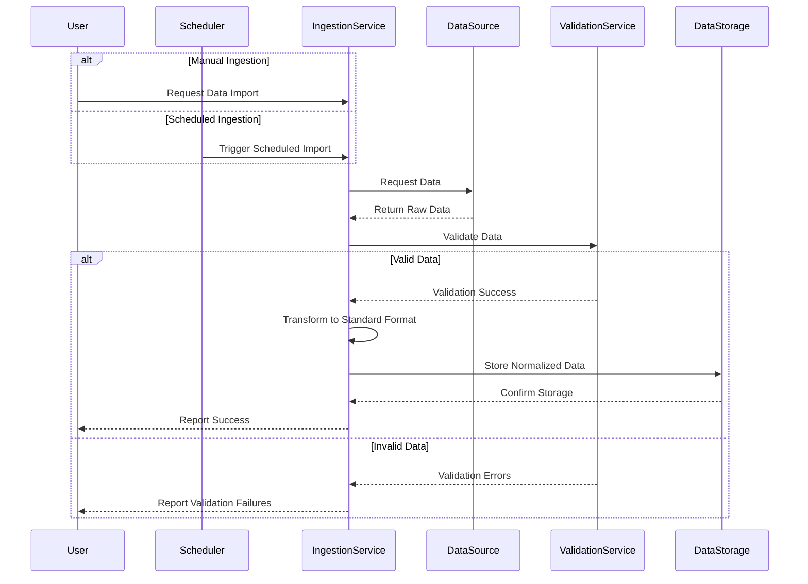
```mermaid
sequenceDiagram
    participant User
    participant Scheduler
    participant IngestionService
    participant DataSource
    participant ValidationService
    participant DataStorage
    
    alt Manual Ingestion
        User->>IngestionService: Request Data Import
    else Scheduled Ingestion
        Scheduler->>IngestionService: Trigger Scheduled Import
    end
    
    IngestionService->>DataSource: Request Data
    DataSource-->>IngestionService: Return Raw Data
    IngestionService->>ValidationService: Validate Data
    
    alt Valid Data
        ValidationService-->>IngestionService: Validation Success
        IngestionService->>IngestionService: Transform to Standard Format
        IngestionService->>DataStorage: Store Normalized Data
        DataStorage-->>IngestionService: Confirm Storage
        IngestionService-->>User: Report Success
    else Invalid Data
        ValidationService-->>IngestionService: Validation Errors
        IngestionService-->>User: Report Validation Failures
    end
```

#### 5.2.2 Data Storage Layer

- **Purpose**: Persist freight pricing data and analysis results with appropriate indexing and access patterns
- **Technologies**: PostgreSQL with TimescaleDB extension, Redis for caching
- **Key Interfaces**:
  - Data access API for CRUD operations
  - Query interface for analytical operations
  - Cache management interface
- **Data Persistence**: Relational database for structured data, time-series extension for temporal queries
- **Scaling Considerations**: Read replicas for query scaling, partitioning for large datasets

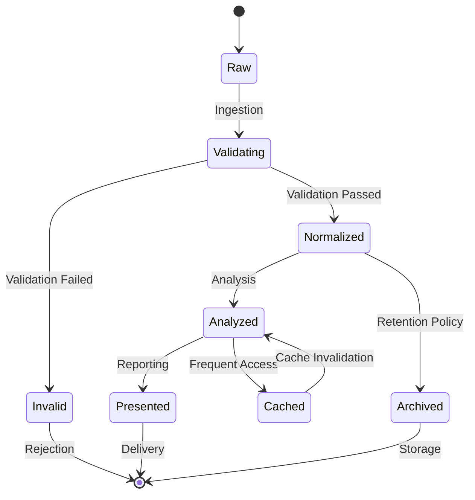
```mermaid
stateDiagram-v2
    [*] --> Raw
    Raw --> Validating: Ingestion
    Validating --> Invalid: Validation Failed
    Validating --> Normalized: Validation Passed
    Invalid --> [*]: Rejection
    Normalized --> Analyzed: Analysis
    Normalized --> Archived: Retention Policy
    Analyzed --> Presented: Reporting
    Analyzed --> Cached: Frequent Access
    Cached --> Analyzed: Cache Invalidation
    Presented --> [*]: Delivery
    Archived --> [*]: Storage
```

#### 5.2.3 Analysis Engine

- **Purpose**: Execute price movement calculations and trend analysis based on user parameters
- **Technologies**: Python, NumPy/Pandas for calculations, Scikit-learn for statistical analysis
- **Key Interfaces**:
  - Calculation API for price movement analysis
  - Parameter validation interface
  - Result generation interface
- **Data Persistence**: In-memory processing with temporary result storage
- **Scaling Considerations**: Parallel processing for large datasets, computation distribution for complex analyses

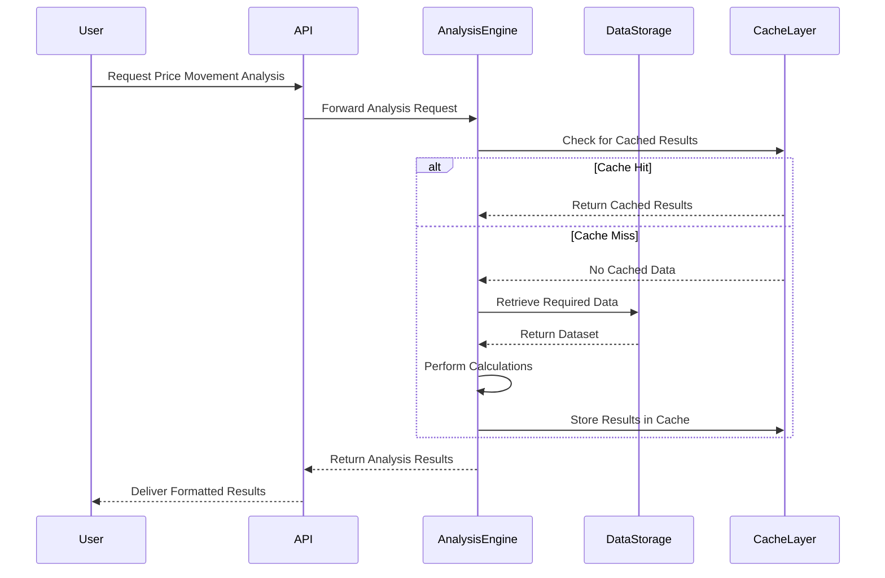
```mermaid
sequenceDiagram
    participant User
    participant API
    participant AnalysisEngine
    participant DataStorage
    participant CacheLayer
    
    User->>API: Request Price Movement Analysis
    API->>AnalysisEngine: Forward Analysis Request
    
    AnalysisEngine->>CacheLayer: Check for Cached Results
    
    alt Cache Hit
        CacheLayer-->>AnalysisEngine: Return Cached Results
    else Cache Miss
        CacheLayer-->>AnalysisEngine: No Cached Data
        AnalysisEngine->>DataStorage: Retrieve Required Data
        DataStorage-->>AnalysisEngine: Return Dataset
        AnalysisEngine->>AnalysisEngine: Perform Calculations
        AnalysisEngine->>CacheLayer: Store Results in Cache
    end
    
    AnalysisEngine-->>API: Return Analysis Results
    API-->>User: Deliver Formatted Results
```

#### 5.2.4 Presentation Service

- **Purpose**: Format and deliver analysis results according to user specifications
- **Technologies**: Flask for API endpoints, Matplotlib/Plotly for visualizations
- **Key Interfaces**:
  - Format conversion API
  - Visualization generation API
  - Delivery interface for various output methods
- **Data Persistence**: Temporary storage for generated reports and visualizations
- **Scaling Considerations**: Stateless design for horizontal scaling, rendering offloading for complex visualizations

```mermaid
stateDiagram-v2
    [*] --> ReceivingResults
    ReceivingResults --> FormattingData: Results Available
    FormattingData --> GeneratingVisualization: Visualization Requested
    FormattingData --> PreparingOutput: No Visualization
    GeneratingVisualization --> PreparingOutput: Visualization Complete
    PreparingOutput --> DeliveringResults: Output Prepared
    DeliveringResults --> [*]: Delivery Complete
```

#### 5.2.5 Integration Adapter

- **Purpose**: Facilitate communication with external enterprise systems
- **Technologies**: Python, API clients, protocol adapters
- **Key Interfaces**:
  - System-specific connectors (TMS, ERP)
  - Protocol translation layer
  - Authentication and security interface
- **Data Persistence**: Temporary storage for in-transit data
- **Scaling Considerations**: Connection pooling, retry mechanisms, circuit breakers for resilience

```mermaid
sequenceDiagram
    participant FreightAgent
    participant IntegrationAdapter
    participant AuthService
    participant ExternalSystem
    
    FreightAgent->>IntegrationAdapter: Request External Data
    IntegrationAdapter->>AuthService: Request Access Token
    AuthService-->>IntegrationAdapter: Provide Token
    
    IntegrationAdapter->>IntegrationAdapter: Format Request
    IntegrationAdapter->>ExternalSystem: Send Request with Token
    
    alt Successful Response
        ExternalSystem-->>IntegrationAdapter: Return Data
        IntegrationAdapter->>IntegrationAdapter: Transform Response
        IntegrationAdapter-->>FreightAgent: Deliver Normalized Data
    else Error Response
        ExternalSystem-->>IntegrationAdapter: Return Error
        IntegrationAdapter->>IntegrationAdapter: Apply Retry Policy
        
        alt Retry Successful
            IntegrationAdapter->>ExternalSystem: Retry Request
            ExternalSystem-->>IntegrationAdapter: Return Data
            IntegrationAdapter-->>FreightAgent: Deliver Normalized Data
        else Retry Failed
            IntegrationAdapter-->>FreightAgent: Report Integration Error
        end
    end
```

#### 5.2.6 Orchestration Service

- **Purpose**: Coordinate workflow between components and manage process state
- **Technologies**: Python, state machine framework, message broker
- **Key Interfaces**:
  - Workflow definition API
  - Process monitoring interface
  - Event subscription interface
- **Data Persistence**: Process state storage, audit logging
- **Scaling Considerations**: Distributed coordination, idempotent operations

```mermaid
stateDiagram-v2
    [*] --> Initializing
    Initializing --> CollectingData: Start Process
    CollectingData --> ValidatingData: Data Collected
    ValidatingData --> AnalyzingData: Validation Passed
    ValidatingData --> Error: Validation Failed
    AnalyzingData --> FormattingResults: Analysis Complete
    AnalyzingData --> Error: Analysis Failed
    FormattingResults --> DeliveringResults: Formatting Complete
    FormattingResults --> Error: Formatting Failed
    DeliveringResults --> Complete: Delivery Successful
    DeliveringResults --> Error: Delivery Failed
    Error --> Recovering: Recoverable Error
    Error --> Failed: Unrecoverable Error
    Recovering --> CollectingData: Retry Process
    Complete --> [*]: Process Finished
    Failed --> [*]: Process Terminated
```

### 5.3 TECHNICAL DECISIONS

#### 5.3.1 Architecture Style Decisions

| Decision Area | Selected Approach | Alternatives Considered | Rationale |
|---------------|-------------------|-------------------------|-----------|
| Overall Architecture | Microservices with API Gateway | Monolithic, Serverless | Provides modularity and independent scaling while maintaining a unified entry point |
| Data Processing | Event-driven pipeline | Batch processing, Real-time streaming | Balances responsiveness with processing efficiency for freight data analysis |
| State Management | Centralized with distributed caching | Fully distributed, Stateless | Ensures data consistency while providing performance benefits |
| Deployment Model | Containerized with orchestration | VM-based, Serverless | Offers portability, isolation, and efficient resource utilization |

The microservices architecture was selected to allow independent development, deployment, and scaling of system components. This approach enables the team to optimize each component for its specific requirements—for example, scaling the Analysis Engine for computation-intensive tasks while keeping the Presentation Service lightweight.

An event-driven approach for data processing provides the necessary flexibility to handle both scheduled batch imports and on-demand analysis requests. This pattern decouples the components, improving system resilience and maintainability.

```mermaid
graph TD
    A[Architecture Decision] --> B{System Complexity?}
    B -->|High| C{Scaling Requirements?}
    B -->|Low| D[Monolithic]
    C -->|Independent Component Scaling| E[Microservices]
    C -->|Uniform Scaling| F[Modular Monolith]
    E --> G{Data Processing Pattern?}
    G -->|Batch-oriented| H[ETL Pipeline]
    G -->|Mixed| I[Event-driven]
    G -->|Real-time| J[Stream Processing]
    I --> K[Selected Architecture]
```

#### 5.3.2 Communication Pattern Choices

| Pattern | Use Case | Benefits | Tradeoffs |
|---------|----------|----------|-----------|
| REST API | User interactions, Simple integrations | Widely understood, Stateless | Limited for real-time updates |
| Message Queue | Component communication, Event notifications | Decoupling, Resilience | Additional infrastructure |
| Webhooks | External system notifications | Real-time updates, Push model | Requires endpoint management |
| Batch File Transfer | Bulk data import/export | Efficiency for large datasets | Latency, Complex error handling |

The system employs RESTful APIs for user interactions due to their simplicity and compatibility with web interfaces. For internal component communication, a message queue pattern provides decoupling and resilience, allowing components to operate independently and recover from failures without affecting the entire system.

For external system integration, the architecture supports multiple patterns based on the capabilities of the target systems—REST APIs for modern systems, batch file transfers for legacy systems, and webhooks for event notifications.

#### 5.3.3 Data Storage Solution Rationale

| Requirement | Selected Solution | Alternatives Considered | Rationale |
|-------------|-------------------|-------------------------|-----------|
| Primary Data Store | PostgreSQL with TimescaleDB | MongoDB, MySQL, Cassandra | Strong ACID properties with specialized time-series capabilities |
| Caching Layer | Redis | Memcached, In-memory cache | Rich data structures, persistence options, and wide ecosystem |
| File Storage | Object Storage (S3) | File system, HDFS | Scalability, durability, and cost-effectiveness |
| Temporary Storage | In-memory with overflow to disk | Pure in-memory, Pure disk | Balance of performance and resource utilization |

PostgreSQL with the TimescaleDB extension was selected as the primary data store due to its robust support for time-series data—a critical requirement for freight price movement analysis. This combination provides the relational capabilities needed for structured data while optimizing for time-based queries.

Redis serves as the caching layer due to its performance characteristics and support for complex data structures, which align well with the caching needs of the Analysis Engine. The object storage solution for file management offers cost-effective scalability for CSV files and generated reports.

#### 5.3.4 Caching Strategy Justification

| Cache Type | Implementation | Use Case | Invalidation Strategy |
|------------|----------------|----------|------------------------|
| Result Cache | Redis | Frequently requested analyses | Time-based + explicit on data update |
| Reference Data Cache | In-memory | Lookup tables, conversion rates | Scheduled refresh + explicit on change |
| Query Cache | Database-level | Repeated complex queries | Automatic on data modification |
| API Response Cache | API Gateway | Repeated external API calls | TTL-based with configurable duration |

The caching strategy employs multiple layers to optimize different aspects of the system. The Result Cache stores completed analysis results to avoid redundant calculations for frequently requested time periods. Reference data caching improves performance for lookups used in calculations, such as currency conversion rates.

Query caching at the database level optimizes repeated complex queries, while API response caching reduces the load on external systems and improves response times for integration points.

```mermaid
graph TD
    A[Caching Decision] --> B{Data Type?}
    B -->|Analysis Results| C{Access Pattern?}
    B -->|Reference Data| D[In-memory Cache]
    B -->|Raw Data| E[No Cache - Direct DB]
    C -->|Frequent Repeated Requests| F[Redis Result Cache]
    C -->|Infrequent/Unique| G[No Cache]
    F --> H{Invalidation Strategy?}
    H -->|Time-sensitive| I[TTL-based]
    H -->|Accuracy-critical| J[Event-based]
    I --> K[Implement TTL Cache]
    J --> L[Implement Event Listeners]
```

#### 5.3.5 Security Mechanism Selection

| Security Aspect | Selected Mechanism | Alternatives Considered | Rationale |
|-----------------|--------------------|-----------------------|-----------|
| Authentication | OAuth 2.0 / OIDC | Basic Auth, JWT only | Industry standard with delegation support |
| Authorization | Role-based Access Control | ACL, Attribute-based | Simplicity and alignment with organizational structure |
| Data Protection | TLS 1.3 + Field-level encryption | VPN, Application-level encryption | Defense in depth without performance impact |
| API Security | Rate limiting + Input validation | API Keys only | Protection against abuse and injection attacks |

The security architecture employs OAuth 2.0 with OpenID Connect for authentication, providing a standardized approach that supports integration with enterprise identity providers. Role-based access control aligns with organizational structures while providing sufficient granularity for freight data access patterns.

For data protection, the system implements TLS 1.3 for all communications with additional field-level encryption for sensitive pricing information. API security includes rate limiting to prevent abuse and comprehensive input validation to protect against injection attacks.

### 5.4 CROSS-CUTTING CONCERNS

#### 5.4.1 Monitoring and Observability Approach

The monitoring strategy employs a multi-layered approach to ensure comprehensive visibility into system health and performance:

- **Infrastructure Monitoring**: Resource utilization, network performance, and container health
- **Application Monitoring**: Component response times, error rates, and throughput
- **Business Metrics**: Analysis request volume, data processing rates, and user engagement
- **End-User Experience**: Response times, success rates, and feature usage patterns

The system implements distributed tracing to track requests across components, allowing for performance bottleneck identification and troubleshooting of complex issues. Metrics collection occurs at regular intervals with automatic alerting for threshold violations.

| Monitoring Aspect | Implementation | Key Metrics | Alert Thresholds |
|-------------------|----------------|------------|------------------|
| Infrastructure | Prometheus + Node Exporter | CPU, Memory, Disk, Network | 80% utilization, 5min sustained |
| Application | Prometheus + Custom Exporters | Response time, Error rate, Queue depth | >5s response, >1% error rate |
| Business | Custom Dashboard | Analysis volume, Data freshness | 25% deviation from baseline |
| User Experience | Real User Monitoring | Page load time, Interaction success | >3s load time, >2% failure rate |

#### 5.4.2 Logging and Tracing Strategy

The logging framework implements structured logging with consistent formats across all components to facilitate aggregation and analysis:

- **Log Levels**: ERROR, WARN, INFO, DEBUG with appropriate usage guidelines
- **Context Enrichment**: Request IDs, user information, and component identifiers
- **Sensitive Data Handling**: Automatic redaction of PII and pricing information
- **Retention Policy**: 30 days online, 1 year archived for compliance

Distributed tracing uses OpenTelemetry to provide end-to-end visibility into request flows, with sampling rates adjusted based on traffic volume and error conditions.

| Log Category | Retention | Storage | Access Control |
|--------------|-----------|---------|---------------|
| Application Logs | 30 days | Elasticsearch | Role-based |
| Security Logs | 1 year | Secure Storage | Privileged access only |
| Audit Logs | 7 years | Compliance Archive | Compliance team access |
| Debug Logs | 7 days | Elasticsearch | Developer access |

#### 5.4.3 Error Handling Patterns

The error handling strategy follows a consistent pattern across all components to ensure proper error management and recovery:

- **Error Categorization**: Transient vs. Permanent, Recoverable vs. Non-recoverable
- **Retry Policies**: Exponential backoff for transient errors with circuit breakers
- **Fallback Mechanisms**: Graceful degradation with partial results when possible
- **User Feedback**: Clear error messages with actionable information

```mermaid
flowchart TD
    A[Error Detected] --> B{Error Type?}
    
    B -->|Validation| C[Log Detailed Error]
    C --> D[Return Validation Message]
    D --> E[User Corrective Action]
    
    B -->|Transient System| F[Log Error with Context]
    F --> G[Apply Retry Policy]
    G --> H{Retry Successful?}
    H -->|Yes| I[Continue Processing]
    H -->|No| J[Circuit Breaker Triggered]
    J --> K[Notify Operations]
    J --> L[Return Service Unavailable]
    
    B -->|Permanent System| M[Log Critical Error]
    M --> N[Notify Operations]
    N --> O[Return Error Response]
    O --> P[Suggest Alternative]
    
    B -->|Data Quality| Q[Log Data Issue]
    Q --> R{Can Process Partially?}
    R -->|Yes| S[Process Valid Subset]
    S --> T[Flag Partial Results]
    R -->|No| U[Return Data Quality Error]
```

#### 5.4.4 Authentication and Authorization Framework

The authentication and authorization framework implements a defense-in-depth approach with multiple security layers:

- **User Authentication**: OAuth 2.0 with OpenID Connect for identity verification
- **Service Authentication**: Mutual TLS for service-to-service communication
- **Authorization Model**: Role-based access control with fine-grained permissions
- **API Security**: Token validation, scope verification, and request signing

| Access Level | User Type | Permissions | Implementation |
|--------------|-----------|-------------|----------------|
| Read-Only | Analysts | View reports, Run analyses | OAuth scopes + RBAC |
| Standard | Logistics Managers | Create reports, Configure analyses | OAuth scopes + RBAC |
| Administrative | System Admins | Manage users, Configure data sources | OAuth scopes + RBAC + IP restrictions |
| System | Integration Services | API access, Batch operations | Service accounts + mTLS |

#### 5.4.5 Performance Requirements and SLAs

The system defines clear performance targets to ensure a responsive user experience and reliable operation:

- **Response Time**: 95% of interactive requests completed within 5 seconds
- **Throughput**: Support for 100 concurrent users with 1,000 requests per minute
- **Availability**: 99.9% uptime during business hours, 99.5% overall
- **Data Freshness**: Updates processed within 15 minutes of receipt

| Operation | Response Time SLA | Throughput SLA | Data Size Limit |
|-----------|-------------------|----------------|-----------------|
| Data Import | <30s for 100K records | 10 imports/minute | 10MB per file |
| Simple Analysis | <3s | 50 requests/second | 1M data points |
| Complex Analysis | <10s | 10 requests/second | 5M data points |
| Report Generation | <5s | 20 requests/second | 100 pages |

#### 5.4.6 Disaster Recovery Procedures

The disaster recovery strategy ensures business continuity through a combination of preventive and reactive measures:

- **Backup Schedule**: Hourly incremental, daily full backups with point-in-time recovery
- **Recovery Time Objective (RTO)**: 4 hours for full system restoration
- **Recovery Point Objective (RPO)**: Maximum data loss of 15 minutes
- **Failover Mechanism**: Automated for infrastructure, semi-automated for application tier

| Scenario | Recovery Procedure | RTO | RPO | Testing Frequency |
|----------|-------------------|-----|-----|-------------------|
| Infrastructure Failure | Automated failover to standby | 15 minutes | 5 minutes | Monthly |
| Data Corruption | Point-in-time recovery | 2 hours | 15 minutes | Quarterly |
| Complete System Failure | Full restoration from backups | 4 hours | 1 hour | Semi-annually |
| Regional Outage | Cross-region failover | 8 hours | 1 hour | Annually |

## 6. SYSTEM COMPONENTS DESIGN

### 6.1 DATA INGESTION MODULE

#### 6.1.1 Component Overview

The Data Ingestion Module serves as the entry point for all freight pricing data into the system. It handles the collection, validation, transformation, and storage of data from multiple sources.

| Aspect | Description |
|--------|-------------|
| Primary Function | Collection and standardization of freight pricing data |
| Input Sources | CSV files, databases, APIs, TMS/ERP systems |
| Output | Validated and normalized data in the system's standard format |
| Key Dependencies | Data validation libraries, connection adapters, storage layer |

#### 6.1.2 Subcomponents

```mermaid
graph TD
    A[Data Ingestion Module] --> B[Source Connector Factory]
    A --> C[Data Validator]
    A --> D[Data Transformer]
    A --> E[Ingestion Orchestrator]
    
    B --> B1[CSV Connector]
    B --> B2[Database Connector]
    B --> B3[API Connector]
    B --> B4[TMS/ERP Connector]
    
    C --> C1[Schema Validator]
    C --> C2[Business Rule Validator]
    C --> C3[Anomaly Detector]
    
    D --> D1[Format Standardizer]
    D --> D2[Field Mapper]
    D --> D3[Unit Converter]
    
    E --> E1[Job Scheduler]
    E --> E2[Error Handler]
    E --> E3[Audit Logger]
```

##### Source Connector Factory

Dynamically creates appropriate connectors based on the data source type.

| Connector | Responsibility | Configuration Parameters |
|-----------|----------------|--------------------------|
| CSV Connector | Parse and extract data from CSV files | File path, delimiter, encoding, header mapping |
| Database Connector | Execute queries against relational databases | Connection string, query, credentials |
| API Connector | Retrieve data from REST/SOAP APIs | Endpoint URL, authentication, request parameters |
| TMS/ERP Connector | Interface with enterprise systems | System type, connection details, data mapping |

##### Data Validator

Ensures data quality and integrity before processing.

| Validator | Responsibility | Validation Rules |
|-----------|----------------|------------------|
| Schema Validator | Verify data structure and required fields | Field presence, data types, format patterns |
| Business Rule Validator | Apply domain-specific validation | Value ranges, relationship constraints |
| Anomaly Detector | Identify outliers and suspicious data | Statistical thresholds, historical patterns |

##### Data Transformer

Converts source data into the system's standardized format.

| Transformer | Responsibility | Transformation Rules |
|-------------|----------------|---------------------|
| Format Standardizer | Normalize data formats | Date/time standardization, text normalization |
| Field Mapper | Map source fields to target schema | Field name mapping, composite field handling |
| Unit Converter | Standardize units and currencies | Currency conversion, unit standardization |

##### Ingestion Orchestrator

Coordinates the overall ingestion process and handles exceptions.

| Component | Responsibility | Key Features |
|-----------|----------------|--------------|
| Job Scheduler | Manage scheduled and on-demand ingestion | Cron-based scheduling, manual triggers |
| Error Handler | Process and recover from errors | Retry logic, fallback mechanisms |
| Audit Logger | Record ingestion activities | Operation logging, data lineage tracking |

#### 6.1.3 Data Flow

```mermaid
flowchart TD
    A[Start Ingestion] --> B{Source Type?}
    B -->|CSV| C[Load CSV File]
    B -->|Database| D[Execute Query]
    B -->|API| E[Call API Endpoint]
    
    C --> F[Extract Raw Data]
    D --> F
    E --> F
    
    F --> G[Validate Schema]
    G --> H{Schema Valid?}
    H -->|No| I[Log Validation Error]
    I --> J[Return Error]
    
    H -->|Yes| K[Apply Business Rules]
    K --> L{Rules Passed?}
    L -->|No| M[Log Business Rule Violation]
    M --> N{Critical Violation?}
    N -->|Yes| O[Abort Ingestion]
    N -->|No| P[Flag Records]
    
    L -->|Yes| Q[Check for Anomalies]
    P --> Q
    
    Q --> R{Anomalies Found?}
    R -->|Yes| S[Flag Anomalous Records]
    R -->|No| T[Proceed with Clean Data]
    S --> T
    
    T --> U[Transform to Standard Format]
    U --> V[Apply Field Mapping]
    V --> W[Convert Units/Currencies]
    
    W --> X[Store Processed Data]
    X --> Y[Log Successful Ingestion]
    Y --> Z[Return Success]
    
    O --> J
```

#### 6.1.4 Interface Specifications

##### External Interfaces

| Interface | Type | Description | Protocol/Format |
|-----------|------|-------------|----------------|
| File Import | Input | Accepts CSV files with freight data | File upload, SFTP |
| Database Connection | Input | Connects to external databases | JDBC, ODBC |
| API Integration | Input | Connects to external APIs | REST, SOAP |
| TMS/ERP Integration | Input | Connects to enterprise systems | System-specific |
| Data Storage | Output | Stores processed data | Internal API |

##### Internal Interfaces

| Interface | Purpose | Methods |
|-----------|---------|---------|
| Connector Interface | Abstract interface for all source connectors | connect(), fetchData(), disconnect() |
| Validator Interface | Abstract interface for all validators | validate(), getErrors() |
| Transformer Interface | Abstract interface for all transformers | transform(), getMetadata() |
| Orchestrator Interface | Controls the ingestion workflow | startIngestion(), pauseIngestion(), resumeIngestion() |

#### 6.1.5 Error Handling

| Error Type | Handling Strategy | Recovery Action |
|------------|-------------------|----------------|
| Connection Failure | Retry with exponential backoff | Alert after max retries, fallback to alternative source |
| Data Format Error | Log detailed error, continue with valid records | Flag affected records, provide error report |
| Validation Failure | Categorize by severity, handle accordingly | Reject critical failures, flag warnings |
| Transformation Error | Attempt partial transformation | Use default values where possible |
| Storage Failure | Cache data temporarily | Retry storage operation, alert on persistent failure |

### 6.2 ANALYSIS ENGINE

#### 6.2.1 Component Overview

The Analysis Engine is the core computational component responsible for calculating freight price movements and identifying trends based on user-defined parameters.

| Aspect | Description |
|--------|-------------|
| Primary Function | Calculate price movements and identify trends across time periods |
| Input | Normalized freight data, analysis parameters |
| Output | Calculated metrics (absolute change, percentage change, trends) |
| Key Dependencies | Data storage layer, calculation libraries, time period selection |

#### 6.2.2 Subcomponents

```mermaid
graph TD
    A[Analysis Engine] --> B[Query Builder]
    A --> C[Calculation Manager]
    A --> D[Trend Analyzer]
    A --> E[Result Compiler]
    
    B --> B1[Time Period Resolver]
    B --> B2[Filter Generator]
    B --> B3[Query Optimizer]
    
    C --> C1[Absolute Change Calculator]
    C --> C2[Percentage Change Calculator]
    C --> C3[Aggregation Processor]
    
    D --> D1[Direction Identifier]
    D --> D2[Pattern Recognizer]
    D --> D3[Anomaly Highlighter]
    
    E --> E1[Metric Formatter]
    E --> E2[Summary Generator]
    E --> E3[Result Cacher]
```

##### Query Builder

Constructs optimized data queries based on analysis parameters.

| Component | Responsibility | Key Features |
|-----------|----------------|--------------|
| Time Period Resolver | Convert user time selections to query parameters | Period normalization, timezone handling |
| Filter Generator | Create data filters based on user criteria | Route filtering, carrier filtering |
| Query Optimizer | Optimize queries for performance | Query planning, index utilization |

##### Calculation Manager

Performs the core mathematical operations for price movement analysis.

| Component | Responsibility | Calculation Methods |
|-----------|----------------|---------------------|
| Absolute Change Calculator | Calculate price differences | End value - Start value |
| Percentage Change Calculator | Calculate percentage movements | (Absolute change / Start value) * 100 |
| Aggregation Processor | Calculate statistical aggregates | Average, minimum, maximum, median |

##### Trend Analyzer

Identifies patterns and trends in the calculated price movements.

| Component | Responsibility | Analysis Techniques |
|-----------|----------------|---------------------|
| Direction Identifier | Determine trend direction | Threshold-based classification (up/down/stable) |
| Pattern Recognizer | Identify recurring patterns | Time-series pattern matching |
| Anomaly Highlighter | Detect unusual price movements | Statistical outlier detection |

##### Result Compiler

Assembles and formats the analysis results for presentation.

| Component | Responsibility | Output Formats |
|-----------|----------------|----------------|
| Metric Formatter | Format individual metrics | Numeric formatting, unit display |
| Summary Generator | Create textual summaries | Natural language generation |
| Result Cacher | Cache results for reuse | Time-based caching, invalidation rules |

#### 6.2.3 Calculation Algorithms

##### Absolute Change Calculation

```mermaid
flowchart TD
    A[Start Calculation] --> B[Retrieve Start Period Data]
    B --> C[Retrieve End Period Data]
    C --> D[Group by Required Dimensions]
    D --> E[Calculate Start Period Value]
    E --> F[Calculate End Period Value]
    F --> G[Absolute Change = End Value - Start Value]
    G --> H[Handle Special Cases]
    H --> I{Start Value = 0?}
    I -->|Yes| J[Apply Zero Start Value Rule]
    I -->|No| K[Proceed with Standard Calculation]
    J --> L[Return Results]
    K --> L
```

##### Percentage Change Calculation

```mermaid
flowchart TD
    A[Start Calculation] --> B[Calculate Absolute Change]
    B --> C{Start Value > 0?}
    C -->|Yes| D["Percentage Change = (Absolute Change / Start Value) * 100"]
    C -->|No| E{Start Value = 0 AND End Value > 0?}
    E -->|Yes| F[Set to Maximum Percentage Increase]
    E -->|No| G{Start Value = 0 AND End Value = 0?}
    G -->|Yes| H[Set to 0% Change]
    G -->|No| I[Set to Maximum Percentage Decrease]
    D --> J[Apply Rounding Rules]
    F --> J
    H --> J
    I --> J
    J --> K[Return Percentage Change]
```

##### Trend Direction Determination

```mermaid
flowchart TD
    A[Start Trend Analysis] --> B[Calculate Percentage Change]
    B --> C{Percentage Change > Threshold Up?}
    C -->|Yes| D[Set Trend = "Increasing"]
    C -->|No| E{Percentage Change < Threshold Down?}
    E -->|Yes| F[Set Trend = "Decreasing"]
    E -->|No| G[Set Trend = "Stable"]
    D --> H[Return Trend Direction]
    F --> H
    G --> H
```

#### 6.2.4 Interface Specifications

##### External Interfaces

| Interface | Type | Description | Protocol/Format |
|-----------|------|-------------|----------------|
| Analysis Request | Input | Receives analysis parameters | REST API, Internal API |
| Data Query | Input | Retrieves data from storage | Database query |
| Result Delivery | Output | Delivers analysis results | Internal API |

##### Internal Interfaces

| Interface | Purpose | Methods |
|-----------|---------|---------|
| Calculator Interface | Abstract interface for all calculators | calculate(), validate() |
| Analyzer Interface | Abstract interface for trend analyzers | analyze(), getInsights() |
| Query Interface | Builds and executes data queries | buildQuery(), executeQuery() |
| Result Interface | Formats and delivers results | format(), cache(), deliver() |

#### 6.2.5 Performance Optimization

| Optimization | Implementation | Expected Benefit |
|--------------|----------------|------------------|
| Query Optimization | Use of indexes, query planning | Faster data retrieval |
| Parallel Processing | Multi-threaded calculations | Improved throughput for large datasets |
| Result Caching | Time-based caching with invalidation | Reduced response time for repeated queries |
| Incremental Processing | Process only new/changed data | Reduced calculation time for updates |
| Materialized Views | Pre-calculated aggregates | Faster access to common metrics |

### 6.3 PRESENTATION SERVICE

#### 6.3.1 Component Overview

The Presentation Service transforms analytical results into user-friendly formats and delivers them through various channels according to user preferences.

| Aspect | Description |
|--------|-------------|
| Primary Function | Format and deliver analysis results |
| Input | Raw calculation results from Analysis Engine |
| Output | Formatted reports, visualizations, data exports |
| Key Dependencies | Analysis Engine, visualization libraries, export formatters |

#### 6.3.2 Subcomponents

```mermaid
graph TD
    A[Presentation Service] --> B[Format Converter]
    A --> C[Visualization Generator]
    A --> D[Export Manager]
    A --> E[Delivery Controller]
    
    B --> B1[JSON Formatter]
    B --> B2[CSV Formatter]
    B --> B3[Text Formatter]
    
    C --> C1[Chart Generator]
    C --> C2[Table Generator]
    C --> C3[Dashboard Composer]
    
    D --> D1[File Exporter]
    D --> D2[Email Formatter]
    D --> D3[API Response Builder]
    
    E --> E1[Web Delivery]
    E --> E2[Email Delivery]
    E --> E3[API Response Delivery]
```

##### Format Converter

Transforms raw analysis results into various structured formats.

| Component | Responsibility | Output Format |
|-----------|----------------|---------------|
| JSON Formatter | Create JSON representation | Structured JSON with metadata |
| CSV Formatter | Create CSV representation | Tabular data with headers |
| Text Formatter | Create human-readable text | Natural language summary |

##### Visualization Generator

Creates visual representations of the analysis results.

| Component | Responsibility | Visualization Types |
|-----------|----------------|---------------------|
| Chart Generator | Create data visualizations | Line charts, bar charts, trend indicators |
| Table Generator | Create tabular representations | Data tables with formatting |
| Dashboard Composer | Combine multiple visualizations | Interactive dashboards |

##### Export Manager

Handles the export of results to various file formats and destinations.

| Component | Responsibility | Export Options |
|-----------|----------------|----------------|
| File Exporter | Generate downloadable files | CSV, JSON, PDF, Excel |
| Email Formatter | Format results for email delivery | HTML email with embedded visualizations |
| API Response Builder | Structure API responses | RESTful API responses |

##### Delivery Controller

Manages the delivery of results through various channels.

| Component | Responsibility | Delivery Channels |
|-----------|----------------|-------------------|
| Web Delivery | Deliver results to web interface | Browser rendering, AJAX responses |
| Email Delivery | Send results via email | Scheduled reports, alerts |
| API Response Delivery | Return results via API | REST API responses |

#### 6.3.3 Visualization Types

##### Time Series Chart

```mermaid
flowchart TD
    A[Start Visualization] --> B[Retrieve Time Series Data]
    B --> C[Determine Chart Type]
    C --> D{Chart Type?}
    D -->|Line Chart| E[Generate Line Chart]
    D -->|Bar Chart| F[Generate Bar Chart]
    D -->|Area Chart| G[Generate Area Chart]
    
    E --> H[Apply Styling]
    F --> H
    G --> H
    
    H --> I[Add Trend Indicators]
    I --> J[Add Annotations]
    J --> K[Generate Legend]
    K --> L[Apply Responsive Design]
    L --> M[Return Visualization]
```

##### Comparison Chart

```mermaid
flowchart TD
    A[Start Comparison] --> B[Retrieve Base Period Data]
    B --> C[Retrieve Comparison Period Data]
    C --> D[Determine Comparison Type]
    
    D --> E{Comparison Type?}
    E -->|Side by Side| F[Generate Side-by-Side Bars]
    E -->|Overlay| G[Generate Overlaid Lines]
    E -->|Difference| H[Generate Difference Chart]
    
    F --> I[Add Period Labels]
    G --> I
    H --> I
    
    I --> J[Highlight Significant Changes]
    J --> K[Add Percentage Indicators]
    K --> L[Generate Legend]
    L --> M[Return Visualization]
```

##### Trend Indicator

```mermaid
flowchart TD
    A[Start Trend Indicator] --> B[Calculate Trend Direction]
    B --> C{Trend Direction?}
    C -->|Increasing| D[Generate Up Arrow]
    C -->|Decreasing| E[Generate Down Arrow]
    C -->|Stable| F[Generate Horizontal Line]
    
    D --> G[Apply Color Coding]
    E --> G
    F --> G
    
    G --> H[Add Percentage Label]
    H --> I[Add Tooltip]
    I --> J[Return Indicator]
```

#### 6.3.4 Output Format Specifications

##### JSON Output Format

```
{
  "metadata": {
    "analysis_id": "string",
    "time_period": {
      "start_date": "ISO8601 date",
      "end_date": "ISO8601 date",
      "granularity": "string"
    },
    "filters": {
      "routes": ["string"],
      "carriers": ["string"]
    },
    "generated_at": "ISO8601 datetime"
  },
  "results": {
    "absolute_change": {
      "value": number,
      "unit": "string"
    },
    "percentage_change": {
      "value": number,
      "formatted": "string"
    },
    "trend": {
      "direction": "string",
      "indicator": "string"
    },
    "aggregates": {
      "start_period": {
        "average": number,
        "minimum": number,
        "maximum": number
      },
      "end_period": {
        "average": number,
        "minimum": number,
        "maximum": number
      }
    }
  },
  "time_series": [
    {
      "timestamp": "ISO8601 datetime",
      "value": number
    }
  ]
}
```

##### CSV Output Format

| Column Name | Data Type | Description |
|-------------|-----------|-------------|
| analysis_id | String | Unique identifier for the analysis |
| start_date | Date | Start date of the analysis period |
| end_date | Date | End date of the analysis period |
| granularity | String | Time granularity used (daily, weekly, monthly) |
| route | String | Origin-destination pair |
| carrier | String | Freight carrier name |
| start_value | Number | Freight charge at the start of the period |
| end_value | Number | Freight charge at the end of the period |
| absolute_change | Number | Difference between end and start values |
| percentage_change | Number | Percentage change between periods |
| trend_direction | String | Direction of the trend (increasing, decreasing, stable) |
| average_value | Number | Average freight charge over the period |
| minimum_value | Number | Minimum freight charge over the period |
| maximum_value | Number | Maximum freight charge over the period |
| timestamp | DateTime | Generation timestamp |

##### Text Summary Format

```
Freight Price Movement Analysis
==============================
Period: [Start Date] to [End Date]
Granularity: [Granularity]
Generated: [Timestamp]

SUMMARY:
Freight charges have [increased/decreased/remained stable] by [Percentage]% 
([Absolute Change] [Currency]) over the selected period.

DETAILS:
- Starting value: [Start Value] [Currency]
- Ending value: [End Value] [Currency]
- Absolute change: [Absolute Change] [Currency]
- Percentage change: [Percentage Change]%
- Trend direction: [Trend Direction]

STATISTICS:
- Average charge: [Average] [Currency]
- Minimum charge: [Minimum] [Currency]
- Maximum charge: [Maximum] [Currency]
- Volatility: [Volatility Measure]

[Additional insights based on analysis]
```

#### 6.3.5 Responsive Design Considerations

| Device Type | Design Adaptations | Optimization Techniques |
|-------------|-------------------|-------------------------|
| Desktop | Full-featured interface with detailed visualizations | High-resolution charts, interactive elements |
| Tablet | Simplified layout with touch-friendly controls | Medium-resolution charts, touch targets |
| Mobile | Essential information with minimal visualizations | Simplified charts, progressive disclosure |
| API Clients | Raw data focus with minimal formatting | Efficient data structures, pagination |

### 6.4 INTEGRATION LAYER

#### 6.4.1 Component Overview

The Integration Layer facilitates communication between the Freight Price Movement Agent and external systems, providing standardized interfaces for data exchange and interoperability.

| Aspect | Description |
|--------|-------------|
| Primary Function | Enable seamless integration with external systems |
| Input | Connection parameters, authentication credentials, data mapping rules |
| Output | Standardized data exchange, integration status |
| Key Dependencies | External system APIs, authentication services, data transformation libraries |

#### 6.4.2 Subcomponents

```mermaid
graph TD
    A[Integration Layer] --> B[Adapter Factory]
    A --> C[Authentication Manager]
    A --> D[Data Mapper]
    A --> E[Integration Orchestrator]
    
    B --> B1[TMS Adapter]
    B --> B2[ERP Adapter]
    B --> B3[API Adapter]
    B --> B4[File System Adapter]
    
    C --> C1[Credential Manager]
    C --> C2[Token Service]
    C --> C3[Certificate Manager]
    
    D --> D1[Schema Mapper]
    D --> D2[Transformation Engine]
    D --> D3[Validation Service]
    
    E --> E1[Job Scheduler]
    E --> E2[Error Handler]
    E --> E3[Audit Logger]
```

##### Adapter Factory

Creates and manages system-specific adapters for external integrations.

| Adapter | Supported Systems | Integration Methods |
|---------|-------------------|---------------------|
| TMS Adapter | Major TMS platforms (e.g., SAP TM, Oracle TMS) | API, database, file exchange |
| ERP Adapter | Common ERP systems (e.g., SAP, Oracle, Microsoft) | API, database, file exchange |
| API Adapter | Generic REST/SOAP APIs | HTTP/HTTPS, authentication |
| File System Adapter | File-based integrations | SFTP, network shares, local files |

##### Authentication Manager

Handles secure authentication with external systems.

| Component | Responsibility | Supported Methods |
|-----------|----------------|-------------------|
| Credential Manager | Securely store and retrieve credentials | Encrypted storage, key management |
| Token Service | Manage OAuth tokens and session management | OAuth 1.0/2.0, JWT, session tokens |
| Certificate Manager | Handle certificate-based authentication | X.509 certificates, mutual TLS |

##### Data Mapper

Transforms data between external system formats and internal representation.

| Component | Responsibility | Transformation Capabilities |
|-----------|----------------|----------------------------|
| Schema Mapper | Map external schemas to internal schema | Field mapping, structure transformation |
| Transformation Engine | Apply complex transformations | Data type conversion, value transformation |
| Validation Service | Validate transformed data | Schema validation, business rule validation |

##### Integration Orchestrator

Coordinates integration processes and handles exceptions.

| Component | Responsibility | Key Features |
|-----------|----------------|--------------|
| Job Scheduler | Manage scheduled and on-demand integrations | Cron-based scheduling, event triggers |
| Error Handler | Process and recover from integration errors | Retry logic, circuit breakers |
| Audit Logger | Record integration activities | Operation logging, data exchange tracking |

#### 6.4.3 Integration Patterns

##### TMS Integration Pattern

```mermaid
sequenceDiagram
    participant FPA as Freight Price Movement Agent
    participant IL as Integration Layer
    participant Auth as Authentication Service
    participant TMS as Transportation Management System
    
    FPA->>IL: Request TMS Integration
    IL->>Auth: Request Authentication
    Auth->>TMS: Authenticate
    TMS-->>Auth: Authentication Response
    Auth-->>IL: Authentication Token
    
    IL->>TMS: Request Freight Data
    TMS-->>IL: Return Raw Data
    
    IL->>IL: Transform Data
    IL->>IL: Validate Data
    
    IL-->>FPA: Deliver Transformed Data
    
    FPA->>FPA: Process Data
    FPA->>IL: Send Analysis Results
    
    IL->>TMS: Update TMS (if required)
    TMS-->>IL: Confirmation
    IL-->>FPA: Integration Complete
```

##### ERP Integration Pattern

```mermaid
sequenceDiagram
    participant FPA as Freight Price Movement Agent
    participant IL as Integration Layer
    participant ERP as ERP System
    participant DB as Database
    
    FPA->>IL: Request ERP Integration
    IL->>ERP: Authenticate
    ERP-->>IL: Authentication Response
    
    alt Direct API Access
        IL->>ERP: Request Data via API
        ERP-->>IL: Return API Response
    else Database Access
        IL->>DB: Execute Query
        DB-->>IL: Return Query Results
    end
    
    IL->>IL: Transform Data
    IL->>IL: Validate Data
    
    IL-->>FPA: Deliver Transformed Data
    
    FPA->>FPA: Process Data
    FPA->>IL: Send Analysis Results
    
    alt Update Required
        IL->>ERP: Update ERP Data
        ERP-->>IL: Confirmation
    end
    
    IL-->>FPA: Integration Complete
```

##### File-Based Integration Pattern

```mermaid
sequenceDiagram
    participant FPA as Freight Price Movement Agent
    participant IL as Integration Layer
    participant FS as File System
    
    FPA->>IL: Request File Integration
    
    alt Import Operation
        IL->>FS: Check for New Files
        FS-->>IL: File List
        IL->>FS: Retrieve Files
        FS-->>IL: File Content
        IL->>IL: Parse Files
        IL->>IL: Transform Data
        IL->>IL: Validate Data
        IL-->>FPA: Deliver Transformed Data
    else Export Operation
        FPA->>IL: Send Data for Export
        IL->>IL: Format Data
        IL->>FS: Write Files
        FS-->>IL: Confirmation
    end
    
    IL-->>FPA: Integration Complete
```

#### 6.4.4 API Specifications

##### External API Endpoints

| Endpoint | Method | Description | Parameters | Response |
|----------|--------|-------------|------------|----------|
| /api/v1/integration/connect | POST | Establish connection to external system | system_type, connection_params | Connection status |
| /api/v1/integration/import | POST | Import data from external system | system_id, data_type, filters | Import status, record count |
| /api/v1/integration/export | POST | Export data to external system | system_id, data_type, data_payload | Export status |
| /api/v1/integration/status | GET | Check integration status | system_id, job_id | Current status, progress |

##### Internal API Interfaces

| Interface | Purpose | Methods |
|-----------|---------|---------|
| IntegrationService | Primary integration interface | connect(), import(), export(), getStatus() |
| AdapterInterface | System-specific adapter interface | initialize(), execute(), close() |
| AuthenticationInterface | Authentication interface | authenticate(), refreshToken(), validateToken() |
| DataMappingInterface | Data transformation interface | mapSchema(), transform(), validate() |

#### 6.4.5 Security Considerations

| Security Aspect | Implementation | Mitigation Strategy |
|-----------------|----------------|---------------------|
| Credential Management | Encrypted storage, key rotation | Secure vault, limited access |
| Data Transmission | TLS encryption, data signing | Strong cipher suites, certificate validation |
| Access Control | Role-based permissions, least privilege | Regular permission audits |
| Audit Logging | Comprehensive activity logging | Tamper-evident logs, retention policy |
| Error Handling | Secure error messages | No sensitive data in errors |

### 6.5 DATA STORAGE LAYER

#### 6.5.1 Component Overview

The Data Storage Layer manages the persistence, retrieval, and organization of all data within the Freight Price Movement Agent, ensuring data integrity, performance, and security.

| Aspect | Description |
|--------|-------------|
| Primary Function | Store and retrieve freight pricing data and analysis results |
| Storage Types | Relational database, cache, file storage |
| Key Requirements | Data integrity, query performance, scalability |
| Key Dependencies | Database systems, caching mechanisms, storage services |

#### 6.5.2 Data Model

```mermaid
erDiagram
    FREIGHT_DATA {
        string id PK
        datetime timestamp
        string origin
        string destination
        string carrier
        decimal freight_charge
        string currency
        string mode
        string service_level
        jsonb additional_charges
        datetime created_at
        datetime updated_at
        string source_system
        string data_quality_flag
    }
    
    TIME_PERIOD {
        string id PK
        string name
        datetime start_date
        datetime end_date
        string granularity
        boolean is_custom
        string created_by
        datetime created_at
    }
    
    ANALYSIS_RESULT {
        string id PK
        string time_period_id FK
        jsonb parameters
        jsonb results
        datetime calculated_at
        string calculated_by
        boolean is_cached
        datetime cache_expires_at
    }
    
    ROUTE {
        string id PK
        string origin
        string destination
        string mode
        decimal distance
        string status
    }
    
    CARRIER {
        string id PK
        string name
        string code
        string type
        string status
    }
    
    USER {
        string id PK
        string username
        string email
        jsonb roles
        datetime last_login
        string status
    }
    
    AUDIT_LOG {
        string id PK
        string user_id FK
        string action
        jsonb details
        datetime timestamp
        string ip_address
    }
    
    FREIGHT_DATA ||--o{ ANALYSIS_RESULT : "analyzed_in"
    TIME_PERIOD ||--o{ ANALYSIS_RESULT : "defines"
    ROUTE ||--o{ FREIGHT_DATA : "applies_to"
    CARRIER ||--o{ FREIGHT_DATA : "provided_by"
    USER ||--o{ ANALYSIS_RESULT : "created_by"
    USER ||--o{ AUDIT_LOG : "performed_by"
```

#### 6.5.3 Storage Components

##### Primary Data Store

| Component | Technology | Purpose | Key Features |
|-----------|------------|---------|-------------|
| Relational Database | PostgreSQL | Store structured freight data and analysis results | ACID compliance, indexing, partitioning |
| Time-Series Extension | TimescaleDB | Optimize time-based queries | Time-based partitioning, continuous aggregates |
| JSON Support | PostgreSQL JSONB | Store semi-structured data | Flexible schema, indexable JSON |

##### Caching Layer

| Component | Technology | Purpose | Key Features |
|-----------|------------|---------|-------------|
| In-Memory Cache | Redis | Cache frequent queries and results | Fast access, data structures, expiration |
| Query Cache | Database-level | Cache complex query results | Transparent caching, automatic invalidation |
| Application Cache | Local memory | Cache reference data | Minimal latency, thread-safe |

##### File Storage

| Component | Technology | Purpose | Key Features |
|-----------|------------|---------|-------------|
| Object Storage | S3-compatible | Store CSV files and reports | Durability, scalability, versioning |
| Temporary Storage | Local filesystem | Process uploads and downloads | Fast access, automatic cleanup |
| Archive Storage | Glacier-compatible | Long-term data retention | Cost-effective, compliance |

#### 6.5.4 Data Access Patterns

##### Query Patterns

```mermaid
flowchart TD
    A[Data Access Request] --> B{Access Type?}
    
    B -->|Read| C{Query Type?}
    B -->|Write| D{Write Type?}
    
    C -->|Point Lookup| E[Direct Key Access]
    C -->|Range Query| F[Time-Series Query]
    C -->|Aggregate Query| G[Materialized View]
    C -->|Complex Query| H[Query Builder]
    
    E --> I[Cache Check]
    F --> I
    G --> I
    H --> I
    
    I -->|Cache Hit| J[Return Cached Result]
    I -->|Cache Miss| K[Execute Database Query]
    K --> L[Cache Result]
    L --> M[Return Query Result]
    J --> M
    
    D -->|Insert| N[Validate Data]
    D -->|Update| O[Check Optimistic Lock]
    D -->|Delete| P[Check References]
    
    N --> Q[Persist to Database]
    O --> Q
    P --> Q
    
    Q --> R[Invalidate Cache]
    R --> S[Return Write Result]
```

##### Caching Strategy

```mermaid
flowchart TD
    A[Cache Strategy] --> B{Data Type?}
    
    B -->|Analysis Results| C[Time-Based Cache]
    B -->|Reference Data| D[Long-lived Cache]
    B -->|User Data| E[Session Cache]
    B -->|Raw Data| F[No Cache]
    
    C --> G{Cache Hit?}
    D --> G
    E --> G
    
    G -->|Yes| H[Return Cached Data]
    G -->|No| I[Fetch from Database]
    
    I --> J[Store in Cache]
    J --> K[Set Expiration]
    
    K --> L{Data Type?}
    L -->|Analysis Results| M[Short TTL]
    L -->|Reference Data| N[Long TTL]
    L -->|User Data| O[Session TTL]
    
    M --> P[Return Fresh Data]
    N --> P
    O --> P
    H --> P
    
    F --> Q[Direct Database Access]
    Q --> P
```

#### 6.5.5 Data Lifecycle Management

| Lifecycle Stage | Management Strategy | Retention Policy |
|-----------------|---------------------|------------------|
| Ingestion | Validation, normalization, initial storage | N/A |
| Active Use | Indexing, caching, optimization | 90 days in primary storage |
| Aging | Compression, summarization | 1 year in primary storage |
| Archival | Cold storage, reduced access | 7 years in archive storage |
| Purging | Secure deletion, anonymization | After retention period |

#### 6.5.6 Performance Optimization

| Optimization | Implementation | Expected Benefit |
|--------------|----------------|------------------|
| Indexing Strategy | B-tree indexes on query fields | Faster query execution |
| Partitioning | Time-based partitioning | Improved query performance on large datasets |
| Materialized Views | Pre-calculated aggregates | Faster access to common metrics |
| Connection Pooling | Database connection reuse | Reduced connection overhead |
| Query Optimization | Execution plan analysis | Efficient query processing |

### 6.6 ERROR HANDLING & LOGGING

#### 6.6.1 Component Overview

The Error Handling & Logging component provides comprehensive monitoring, error management, and audit capabilities across the Freight Price Movement Agent.

| Aspect | Description |
|--------|-------------|
| Primary Function | Detect, report, and manage errors; maintain system logs |
| Key Capabilities | Error classification, recovery mechanisms, comprehensive logging |
| Integration Points | All system components |
| Key Dependencies | Logging framework, monitoring tools, notification services |

#### 6.6.2 Error Classification

| Error Category | Description | Severity | Example Scenarios |
|----------------|-------------|----------|-------------------|
| Validation Errors | Issues with input data format or content | Low-Medium | Missing required fields, invalid data types |
| Processing Errors | Failures during calculation or analysis | Medium | Division by zero, algorithm failure |
| System Errors | Infrastructure or environment issues | High | Database connection failure, out of memory |
| Integration Errors | Failures in external system communication | Medium-High | API timeout, authentication failure |
| Security Errors | Security policy violations | High | Authentication failure, unauthorized access |

#### 6.6.3 Error Handling Strategy

```mermaid
flowchart TD
    A[Error Detected] --> B{Error Type?}
    
    B -->|Validation| C[Log Validation Error]
    C --> D[Return Detailed Message]
    D --> E[User Corrective Action]
    
    B -->|Processing| F[Log Processing Error]
    F --> G{Recoverable?}
    G -->|Yes| H[Apply Recovery Strategy]
    H --> I[Retry Operation]
    I --> J{Retry Successful?}
    J -->|Yes| K[Continue Processing]
    J -->|No| L[Escalate Error]
    G -->|No| L
    
    B -->|System| M[Log System Error]
    M --> N[Apply Circuit Breaker]
    N --> O[Notify Operations]
    O --> P[System Recovery]
    
    B -->|Integration| Q[Log Integration Error]
    Q --> R{Retry Possible?}
    R -->|Yes| S[Apply Backoff Strategy]
    S --> T[Retry Integration]
    T --> U{Retry Successful?}
    U -->|Yes| V[Resume Operation]
    U -->|No| W[Fallback Mechanism]
    R -->|No| W
    
    B -->|Security| X[Log Security Event]
    X --> Y[Apply Security Policy]
    Y --> Z[Security Notification]
    
    L --> AA[Return Error Response]
    W --> AA
    P --> AA
    Z --> AA
```

#### 6.6.4 Logging Framework

| Log Level | Usage | Example Content |
|-----------|-------|----------------|
| ERROR | System failures, critical issues | Stack traces, error codes, context data |
| WARN | Potential issues, degraded operation | Warning messages, performance issues |
| INFO | Normal operation events | Operation completion, state changes |
| DEBUG | Detailed diagnostic information | Variable values, execution paths |
| TRACE | Highly detailed debugging | Method entry/exit, parameter values |

##### Log Entry Structure

```
{
  "timestamp": "ISO8601 datetime",
  "level": "ERROR|WARN|INFO|DEBUG|TRACE",
  "logger": "component.subcomponent",
  "message": "Human-readable message",
  "context": {
    "request_id": "unique identifier",
    "user_id": "user identifier",
    "operation": "operation name",
    "component": "component name"
  },
  "data": {
    // Operation-specific data
  },
  "exception": {
    "type": "exception class",
    "message": "exception message",
    "stacktrace": "stack trace"
  },
  "metrics": {
    "duration_ms": 123,
    "memory_usage_kb": 456
  }
}
```

#### 6.6.5 Monitoring and Alerting

| Monitoring Aspect | Metrics | Alert Thresholds | Response |
|-------------------|---------|------------------|----------|
| Error Rate | Errors per minute, Error percentage | >1% error rate, >10 errors/min | Notification, auto-scaling |
| Performance | Response time, Processing time | >5s response time, >30s processing | Notification, circuit breaker |
| Resource Usage | CPU, Memory, Disk, Network | >80% utilization | Notification, resource allocation |
| Data Quality | Validation failures, Anomalies | >5% validation failures | Notification, data review |
| Security | Authentication failures, Access violations | >3 failures in 5 minutes | Notification, account lockout |

#### 6.6.6 Audit Logging

| Audit Category | Events Logged | Retention | Access Control |
|----------------|---------------|-----------|---------------|
| Data Access | View, export, download | 1 year | Security team |
| Data Modification | Create, update, delete | 7 years | Security team |
| Authentication | Login, logout, failed attempts | 1 year | Security team |
| Configuration | System settings changes | 7 years | Admin team |
| Integration | External system access | 1 year | Integration team |

```mermaid
sequenceDiagram
    participant User
    participant System
    participant AuditLogger
    participant Storage
    participant AlertSystem
    
    User->>System: Perform Action
    System->>AuditLogger: Log Audit Event
    AuditLogger->>AuditLogger: Format Audit Entry
    AuditLogger->>Storage: Store Audit Log
    
    alt Sensitive Action
        AuditLogger->>AlertSystem: Send Notification
        AlertSystem->>User: Notify of Action
    end
    
    System->>User: Action Response
    
    alt Compliance Review
        User->>System: Request Audit Trail
        System->>Storage: Retrieve Audit Logs
        Storage->>System: Return Audit Data
        System->>User: Present Audit Trail
    end
```

## 6.1 CORE SERVICES ARCHITECTURE

### 6.1.1 SERVICE COMPONENTS

The Freight Price Movement Agent employs a modular service-oriented architecture to ensure separation of concerns, maintainability, and scalability. While not a full microservices implementation, the system is organized into distinct service components with clear boundaries and responsibilities.

#### Service Boundaries and Responsibilities

| Service Component | Primary Responsibility | Key Functions |
|-------------------|------------------------|---------------|
| Data Ingestion Service | Collect and validate freight data from multiple sources | Source connection, data validation, normalization |
| Analysis Service | Calculate price movements and identify trends | Time period processing, change calculation, trend analysis |
| Presentation Service | Format and deliver results to users | Output formatting, visualization generation, delivery |
| Integration Service | Connect with external enterprise systems | API integration, authentication, data exchange |

#### Inter-service Communication Patterns

| Pattern | Implementation | Use Cases |
|---------|----------------|-----------|
| REST API | HTTP/JSON | User requests, simple integrations, synchronous operations |
| Message Queue | RabbitMQ | Asynchronous processing, event notifications, workload distribution |
| Shared Storage | Database/Object Store | Bulk data transfer, persistent state management |
| Direct Method Calls | In-process | Performance-critical operations within service boundaries |

```mermaid
graph TD
    Client[Client Applications] --> API[API Gateway]
    API --> DIS[Data Ingestion Service]
    API --> AS[Analysis Service]
    API --> PS[Presentation Service]
    API --> IS[Integration Service]
    
    DIS --> |Validated Data| DB[(Data Storage)]
    AS --> |Queries| DB
    AS --> |Results| DB
    PS --> |Retrieves Results| DB
    IS <--> |External Systems| ExtSys[External Systems]
    
    DIS --> |Data Ready Event| MQ[Message Queue]
    MQ --> AS
    AS --> |Analysis Complete| MQ
    MQ --> PS
```

#### Service Discovery and Load Balancing

| Mechanism | Implementation | Purpose |
|-----------|----------------|---------|
| Service Registry | Consul | Service registration, health monitoring, configuration |
| API Gateway | NGINX/Kong | Request routing, authentication, rate limiting |
| Load Balancer | NGINX/HAProxy | Traffic distribution, health checking, failover |

#### Circuit Breaker and Resilience Patterns

| Pattern | Implementation | Benefit |
|---------|----------------|---------|
| Circuit Breaker | Resilience4j | Prevent cascading failures, isolate failing services |
| Bulkhead | Thread pool isolation | Resource protection, failure containment |
| Rate Limiting | API Gateway rules | Protect services from overload, ensure fair usage |

#### Retry and Fallback Mechanisms

| Mechanism | Implementation | Scenarios |
|-----------|----------------|-----------|
| Retry with Backoff | Exponential backoff | Transient failures, network issues |
| Fallback Response | Cached results | Service unavailability, timeout conditions |
| Graceful Degradation | Feature disabling | Resource constraints, partial system failure |

```mermaid
sequenceDiagram
    participant Client
    participant Gateway as API Gateway
    participant Service as Target Service
    participant Fallback as Fallback Mechanism
    
    Client->>Gateway: Request
    Gateway->>Service: Forward Request
    
    alt Service Available
        Service->>Gateway: Response
        Gateway->>Client: Return Response
    else Service Unavailable
        Service->>Gateway: Error/Timeout
        Gateway->>Gateway: Circuit Open
        Gateway->>Fallback: Request Fallback
        Fallback->>Gateway: Fallback Response
        Gateway->>Client: Return Degraded Response
    end
```

### 6.1.2 SCALABILITY DESIGN

The Freight Price Movement Agent is designed to scale efficiently to handle increasing data volumes and user loads while maintaining performance.

#### Horizontal/Vertical Scaling Approach

| Component | Scaling Approach | Rationale |
|-----------|------------------|-----------|
| Data Ingestion Service | Horizontal | Parallel processing of multiple data sources |
| Analysis Service | Horizontal + Vertical | Computation-intensive operations benefit from both approaches |
| Presentation Service | Horizontal | Stateless design enables simple horizontal scaling |
| Database Layer | Vertical + Read Replicas | Write operations benefit from vertical scaling, reads from horizontal |

#### Auto-scaling Triggers and Rules

| Service | Scaling Metric | Threshold | Scaling Action |
|---------|---------------|-----------|----------------|
| Data Ingestion | CPU Utilization | >70% for 5 minutes | Add 1 instance, max 5 |
| Analysis | Queue Depth | >100 items for 2 minutes | Add 1 instance, max 8 |
| Presentation | Request Rate | >50 req/sec for 3 minutes | Add 1 instance, max 5 |
| All Services | CPU Utilization | <30% for 10 minutes | Remove 1 instance, min 1 |

```mermaid
graph TD
    subgraph "Auto-scaling Process"
        A[Monitor Metrics] --> B{Threshold Exceeded?}
        B -->|Yes| C[Trigger Scale-Out]
        B -->|No| D{Below Lower Threshold?}
        D -->|Yes| E[Trigger Scale-In]
        D -->|No| A
        C --> F[Add Instance]
        F --> G[Wait Cool-down Period]
        G --> A
        E --> H[Remove Instance]
        H --> G
    end
```

#### Resource Allocation Strategy

| Resource | Allocation Strategy | Optimization |
|----------|---------------------|-------------|
| CPU | Burstable instances for variable loads | Right-size based on average + peak usage |
| Memory | Sufficient for dataset processing | Monitor for memory leaks, optimize algorithms |
| Storage | Tiered approach (hot/warm/cold) | Data lifecycle management, compression |
| Network | Sufficient bandwidth for data transfer | Batch operations, compression, caching |

#### Performance Optimization Techniques

| Technique | Implementation | Benefit |
|-----------|----------------|---------|
| Caching | Redis for results and reference data | Reduced computation, faster responses |
| Query Optimization | Indexes, materialized views | Faster data retrieval |
| Batch Processing | Aggregated operations | Reduced overhead, efficient resource usage |
| Asynchronous Processing | Background jobs for heavy tasks | Improved responsiveness, better resource utilization |

#### Capacity Planning Guidelines

| Metric | Guideline | Planning Horizon |
|--------|-----------|------------------|
| Data Volume | Plan for 25% annual growth | 18 months |
| User Concurrency | Plan for 20% annual growth | 12 months |
| Storage Capacity | Maintain 30% headroom | 6 months |
| Processing Capacity | Maintain 40% headroom | 3 months |

### 6.1.3 RESILIENCE PATTERNS

The system implements multiple resilience patterns to ensure high availability and fault tolerance.

#### Fault Tolerance Mechanisms

| Mechanism | Implementation | Protection Against |
|-----------|----------------|-------------------|
| Redundancy | Multiple service instances | Single instance failures |
| Health Checks | Active and passive monitoring | Service degradation, silent failures |
| Timeout Management | Configurable timeouts | Hanging operations, resource exhaustion |
| Graceful Degradation | Feature toggles | Partial system failures |

#### Disaster Recovery Procedures

| Scenario | Recovery Procedure | RTO | RPO |
|----------|-------------------|-----|-----|
| Service Failure | Automatic failover to healthy instances | <5 minutes | 0 (no data loss) |
| Database Failure | Failover to replica, promote to primary | <15 minutes | <5 minutes |
| Region Failure | Cross-region recovery | <4 hours | <15 minutes |
| Complete System Failure | Restore from backups | <8 hours | <1 hour |

```mermaid
flowchart TD
    A[Disaster Event] --> B{Service Level?}
    B -->|Single Service| C[Automatic Failover]
    B -->|Database| D[Database Recovery]
    B -->|Region| E[Cross-Region Recovery]
    B -->|Complete System| F[Full System Restore]
    
    C --> G[Health Check Verification]
    D --> G
    E --> G
    F --> G
    
    G --> H{Recovery Successful?}
    H -->|Yes| I[Resume Normal Operation]
    H -->|No| J[Escalate to Next Level]
    J --> K[Manual Intervention]
    K --> L[Post-Incident Review]
    I --> L
```

#### Data Redundancy Approach

| Data Type | Redundancy Strategy | Implementation |
|-----------|---------------------|----------------|
| Operational Data | Multi-AZ replication | Synchronous database replication |
| Analysis Results | Cached + persisted | Redis with persistence, database backup |
| Configuration | Version-controlled | Git repository, configuration service |
| User Data | Encrypted backups | Regular snapshots, secure storage |

#### Failover Configurations

| Component | Failover Strategy | Activation Method |
|-----------|-------------------|------------------|
| Application Services | Active-active | Load balancer health checks |
| Database | Active-passive | Automated promotion of replica |
| Cache | Redis Sentinel | Automatic master election |
| Message Queue | Clustered deployment | Built-in cluster management |

#### Service Degradation Policies

| Degradation Level | Trigger | Response |
|-------------------|---------|----------|
| Minor | Non-critical service unavailable | Continue with reduced functionality |
| Moderate | Multiple non-critical services down | Disable non-essential features |
| Severe | Critical service degraded | Serve cached/static content only |
| Critical | Multiple critical services down | Maintenance mode with status updates |

```mermaid
stateDiagram-v2
    [*] --> Normal
    
    Normal --> Minor: Non-critical failure
    Minor --> Normal: Service restored
    Minor --> Moderate: Additional failures
    
    Moderate --> Minor: Service restored
    Moderate --> Severe: Critical service affected
    
    Severe --> Moderate: Critical service restored
    Severe --> Critical: Multiple critical failures
    
    Critical --> Severe: Critical service restored
    Critical --> [*]: Complete system restart
    
    state Normal {
        [*] --> FullOperation
    }
    
    state Minor {
        [*] --> ReducedFunctionality
    }
    
    state Moderate {
        [*] --> EssentialFeaturesOnly
    }
    
    state Severe {
        [*] --> CachedContentOnly
    }
    
    state Critical {
        [*] --> MaintenanceMode
    }
```

### 6.2 DATABASE DESIGN

#### 6.2.1 SCHEMA DESIGN

The Freight Price Movement Agent requires a robust database schema to store freight pricing data, analysis results, and supporting reference data. The schema is designed to optimize for time-series queries while maintaining data integrity and supporting the analytical requirements of the system.

##### Entity Relationships

```mermaid
erDiagram
    FREIGHT_DATA {
        uuid id PK
        timestamp record_date
        string origin_id FK
        string destination_id FK
        string carrier_id FK
        decimal freight_charge
        string currency_code
        string transport_mode
        string service_level
        jsonb additional_charges
        timestamp created_at
        timestamp updated_at
        string source_system
        string data_quality_flag
    }
    
    LOCATION {
        uuid id PK
        string name
        string code
        string country
        string region
        string type
        point coordinates
        boolean active
    }
    
    CARRIER {
        uuid id PK
        string name
        string code
        string type
        boolean active
    }
    
    ROUTE {
        uuid id PK
        string origin_id FK
        string destination_id FK
        string transport_mode
        decimal distance
        boolean active
    }
    
    TIME_PERIOD {
        uuid id PK
        string name
        timestamp start_date
        timestamp end_date
        string granularity
        boolean is_custom
        string created_by
        timestamp created_at
    }
    
    ANALYSIS_RESULT {
        uuid id PK
        string time_period_id FK
        jsonb parameters
        jsonb results
        timestamp calculated_at
        string calculated_by
        boolean is_cached
        timestamp cache_expires_at
    }
    
    USER {
        uuid id PK
        string username
        string email
        jsonb roles
        timestamp last_login
        string status
    }
    
    AUDIT_LOG {
        uuid id PK
        string user_id FK
        string action
        jsonb details
        timestamp timestamp
        string ip_address
    }
    
    LOCATION ||--o{ FREIGHT_DATA : "origin"
    LOCATION ||--o{ FREIGHT_DATA : "destination"
    CARRIER ||--o{ FREIGHT_DATA : "carrier"
    ROUTE ||--o{ FREIGHT_DATA : "route"
    TIME_PERIOD ||--o{ ANALYSIS_RESULT : "defines"
    USER ||--o{ ANALYSIS_RESULT : "created_by"
    USER ||--o{ AUDIT_LOG : "performed_by"
```

##### Data Models and Structures

| Entity | Purpose | Key Attributes |
|--------|---------|---------------|
| FREIGHT_DATA | Core entity storing freight pricing information | record_date, freight_charge, currency_code |
| LOCATION | Reference data for origins and destinations | name, code, country, coordinates |
| CARRIER | Reference data for freight carriers | name, code, type |
| ROUTE | Predefined origin-destination pairs | origin_id, destination_id, transport_mode |
| TIME_PERIOD | User-defined time periods for analysis | start_date, end_date, granularity |
| ANALYSIS_RESULT | Stored results of price movement analyses | parameters, results, calculated_at |
| USER | System user information | username, email, roles |
| AUDIT_LOG | Record of system actions for compliance | user_id, action, timestamp |

##### Indexing Strategy

| Table | Index Type | Columns | Purpose |
|-------|------------|---------|---------|
| FREIGHT_DATA | B-tree | record_date | Optimize time-based queries |
| FREIGHT_DATA | B-tree | (origin_id, destination_id) | Optimize route-based queries |
| FREIGHT_DATA | B-tree | carrier_id | Optimize carrier-based queries |
| FREIGHT_DATA | B-tree | (record_date, origin_id, destination_id) | Optimize combined queries |
| FREIGHT_DATA | GIN | additional_charges | Enable JSON field queries |
| ANALYSIS_RESULT | B-tree | time_period_id | Optimize result retrieval by time period |
| ANALYSIS_RESULT | GIN | parameters | Enable JSON parameter queries |
| AUDIT_LOG | B-tree | timestamp | Optimize time-based audit queries |
| AUDIT_LOG | B-tree | user_id | Optimize user-based audit queries |

##### Partitioning Approach

The FREIGHT_DATA table will be partitioned by time to optimize query performance and data management:

```mermaid
graph TD
    A[FREIGHT_DATA Master Table] --> B[Partition: Current Month]
    A --> C[Partition: Previous Month]
    A --> D[Partition: 2 Months Ago]
    A --> E[Partition: 3 Months Ago]
    A --> F[Partition: Quarterly Archives]
    F --> G[Q1 Current Year]
    F --> H[Q2 Current Year]
    F --> I[Q3 Current Year]
    F --> J[Q4 Current Year]
    A --> K[Partition: Annual Archives]
    K --> L[Previous Year]
    K --> M[2 Years Ago]
    K --> N[3+ Years Ago]
```

| Partition Type | Time Range | Retention Policy |
|----------------|------------|------------------|
| Monthly | Current month + 3 previous months | Retained in hot storage |
| Quarterly | Current year by quarter | Moved to warm storage after 3 months |
| Annual | Previous years | Moved to cold storage after 1 year |

##### Replication Configuration

The database will employ a primary-replica architecture for high availability and read scaling:

```mermaid
graph TD
    A[Primary Database] -->|Synchronous Replication| B[Replica 1: Hot Standby]
    A -->|Asynchronous Replication| C[Replica 2: Read Scaling]
    A -->|Asynchronous Replication| D[Replica 3: Analytics]
    A -->|Asynchronous Replication| E[Replica 4: Disaster Recovery]
    
    subgraph "Primary Data Center"
        A
        B
        C
    end
    
    subgraph "Secondary Data Center"
        D
        E
    end
```

| Replica | Purpose | Replication Type | Failover Priority |
|---------|---------|------------------|-------------------|
| Hot Standby | High availability | Synchronous | 1 (Automatic) |
| Read Scaling | Distribute read queries | Asynchronous | 3 (Manual) |
| Analytics | Heavy analytical queries | Asynchronous | None |
| Disaster Recovery | Cross-region backup | Asynchronous | 2 (Manual) |

##### Backup Architecture

```mermaid
graph TD
    A[Database] -->|Continuous WAL Archiving| B[WAL Archive Storage]
    A -->|Daily Full Backup| C[Daily Backup Storage]
    A -->|Weekly Full Backup| D[Weekly Backup Storage]
    A -->|Monthly Full Backup| E[Monthly Backup Storage]
    
    B -->|Point-in-Time Recovery| F[Recovery Process]
    C -->|Recent Recovery| F
    D -->|Medium-term Recovery| F
    E -->|Long-term Recovery| F
    
    F --> G[Restored Database]
```

| Backup Type | Frequency | Retention | Storage |
|-------------|-----------|-----------|---------|
| WAL Archive | Continuous | 7 days | Fast storage |
| Full Backup | Daily | 14 days | Standard storage |
| Full Backup | Weekly | 3 months | Standard storage |
| Full Backup | Monthly | 7 years | Archive storage |

#### 6.2.2 DATA MANAGEMENT

##### Migration Procedures

The system employs a structured approach to database migrations to ensure consistency and reliability:

```mermaid
flowchart TD
    A[Migration Need Identified] --> B[Create Migration Script]
    B --> C[Peer Review]
    C --> D[Test in Development]
    D --> E{Tests Pass?}
    E -->|No| B
    E -->|Yes| F[Test in Staging]
    F --> G{Tests Pass?}
    G -->|No| B
    G -->|Yes| H[Schedule Production Migration]
    H --> I[Execute Migration]
    I --> J[Verify Migration]
    J --> K{Verification Successful?}
    K -->|No| L[Execute Rollback]
    K -->|Yes| M[Update Documentation]
    L --> N[Troubleshoot]
    N --> B
    M --> O[Close Migration Task]
```

| Migration Phase | Tools | Verification Steps |
|-----------------|-------|-------------------|
| Development | Alembic/Flyway | Unit tests, schema validation |
| Staging | Alembic/Flyway | Integration tests, performance tests |
| Production | Alembic/Flyway with maintenance window | Automated verification, manual checks |

##### Versioning Strategy

| Version Component | Format | Example | Purpose |
|-------------------|--------|---------|---------|
| Schema Version | Major.Minor.Patch | 2.3.1 | Track schema evolution |
| Migration ID | Timestamp_Description | 20230615_add_carrier_type | Unique migration identifier |
| Change Log | Detailed documentation | changelog.md | Record of all schema changes |

##### Archival Policies

| Data Type | Active Retention | Archive Retention | Archive Method |
|-----------|------------------|-------------------|---------------|
| Freight Data | 1 year in primary tables | 7 years in archive tables | Quarterly archival process |
| Analysis Results | 90 days | 1 year | Monthly archival process |
| Audit Logs | 30 days | 7 years | Weekly archival process |

##### Data Storage and Retrieval Mechanisms

```mermaid
flowchart TD
    A[Data Access Request] --> B{Data Location?}
    
    B -->|Active Data| C[Query Primary Database]
    B -->|Recent Archive| D[Query Archive Tables]
    B -->|Deep Archive| E[Restore from Archive Storage]
    
    C --> F[Apply Access Controls]
    D --> F
    E --> F
    
    F --> G[Return Results]
```

| Data Tier | Storage Technology | Access Pattern | Performance Characteristics |
|-----------|-------------------|----------------|----------------------------|
| Hot Data | Main database tables | Direct SQL queries | Sub-second response time |
| Warm Data | Archive tables in main database | SQL queries with hints | 1-5 second response time |
| Cold Data | Separate archive database | Scheduled restoration | Minutes to hours for access |

##### Caching Policies

| Cache Type | Data Scope | Invalidation Strategy | Technology |
|------------|------------|----------------------|------------|
| Query Cache | Frequent analytical queries | Time-based (15 minutes) | Redis |
| Result Cache | Analysis results | Time-based (1 hour) + explicit on data update | Redis |
| Reference Data | Locations, carriers, routes | On update + daily refresh | Application memory + Redis |
| Metadata | Schema information, configurations | On change | Application memory |

#### 6.2.3 COMPLIANCE CONSIDERATIONS

##### Data Retention Rules

| Data Category | Operational Retention | Compliance Retention | Justification |
|---------------|----------------------|---------------------|---------------|
| Freight Pricing | 1 year active, 2 years warm | 7 years total | Financial record requirements |
| User Activity | 30 days active | 1 year archived | Security monitoring |
| Analysis Results | 90 days | 1 year | Business continuity |
| System Logs | 14 days | 90 days | Troubleshooting |
| Audit Logs | 30 days active | 7 years archived | Compliance requirements |

##### Backup and Fault Tolerance Policies

| Policy Area | Implementation | Recovery Metrics |
|-------------|----------------|------------------|
| Recovery Point Objective (RPO) | Continuous WAL archiving | < 5 minutes data loss |
| Recovery Time Objective (RTO) | Hot standby with automatic failover | < 15 minutes for critical systems |
| Backup Verification | Weekly restoration tests | 100% success rate required |
| Disaster Recovery | Cross-region replication | < 4 hours RTO for regional failure |

##### Privacy Controls

| Control Type | Implementation | Scope |
|--------------|----------------|-------|
| Data Encryption | TDE (Transparent Data Encryption) | All database files |
| Column Encryption | Application-level encryption | Sensitive fields (if required) |
| Data Masking | Dynamic masking for non-privileged users | PII and sensitive business data |
| Data Anonymization | Removal of identifiers in exports | Analytical exports |

##### Audit Mechanisms

```mermaid
flowchart TD
    A[Database Action] --> B[Trigger Audit Function]
    B --> C[Capture Action Details]
    C --> D[Record in Audit Log]
    D --> E[Apply Retention Policy]
    
    F[User Request] --> G[Application Logic]
    G --> H[Database Action]
    G --> I[Application Audit Log]
    I --> J[Consolidate with DB Audit]
    
    J --> K[Audit Reporting]
    K --> L[Compliance Review]
```

| Audit Level | Mechanism | Captured Information |
|-------------|-----------|---------------------|
| Database | Triggers + audit tables | DML operations, user, timestamp, old/new values |
| Application | Aspect-oriented logging | User actions, parameters, timestamps, IP address |
| System | Log monitoring | Authentication, authorization, system changes |

##### Access Controls

| Access Level | User Role | Permissions | Implementation |
|--------------|-----------|-------------|----------------|
| Read-Only | Analyst | SELECT on specific views | Role-based access control |
| Standard | Logistics Manager | SELECT, INSERT, UPDATE on operational data | Role-based + row-level security |
| Administrative | System Admin | Full access with audit | Role-based + audit logging |
| System | Service Accounts | Function-specific access | Least privilege principle |

#### 6.2.4 PERFORMANCE OPTIMIZATION

##### Query Optimization Patterns

```mermaid
flowchart TD
    A[Query Request] --> B[Query Parser]
    B --> C[Query Optimizer]
    C --> D[Execution Plan Generator]
    
    D --> E{Query Type?}
    E -->|Time Series| F[Apply Time-Series Optimizations]
    E -->|Aggregation| G[Use Materialized Views]
    E -->|Point Lookup| H[Use Index-Only Scans]
    E -->|Complex Join| I[Optimize Join Order]
    
    F --> J[Execute Query]
    G --> J
    H --> J
    I --> J
    
    J --> K[Return Results]
```

| Query Pattern | Optimization Technique | Expected Benefit |
|---------------|------------------------|------------------|
| Time-based range queries | Time-partitioned tables + indexes | 5-10x performance improvement |
| Frequent aggregations | Materialized views + incremental refresh | 10-20x performance improvement |
| Point lookups | Covering indexes | 2-3x performance improvement |
| Complex joins | Join order optimization + statistics | 3-5x performance improvement |

##### Caching Strategy

| Cache Level | Implementation | Use Cases | Invalidation |
|-------------|----------------|-----------|-------------|
| Database | PostgreSQL shared buffers | Frequent table access | Automatic |
| Application | Redis | Computed results, reference data | Time-based + explicit |
| Query | pgMemcache | Repeated identical queries | Time-based (15 minutes) |
| HTTP | API Gateway | Repeated API requests | Time-based + resource-based |

##### Connection Pooling

```mermaid
graph TD
    A[Application Instances] --> B[Connection Pool Manager]
    B --> C[Min Connections: 5]
    B --> D[Max Connections: 20]
    B --> E[Idle Timeout: 300s]
    
    B --> F[Primary Connection Pool]
    B --> G[Read Replica Pool]
    
    F --> H[Primary Database]
    G --> I[Read Replicas]
```

| Pool Configuration | Value | Rationale |
|--------------------|-------|-----------|
| Minimum Connections | 5 | Ensure immediate availability |
| Maximum Connections | 20 per instance | Prevent database connection exhaustion |
| Idle Timeout | 300 seconds | Balance between reuse and resource release |
| Validation Query | SELECT 1 | Lightweight connection validation |

##### Read/Write Splitting

| Operation Type | Database Target | Implementation |
|----------------|-----------------|----------------|
| Write Operations | Primary database | Direct routing |
| Read-only Queries | Read replicas | Round-robin load balancing |
| Analytical Queries | Analytics replica | Dedicated connection pool |
| Real-time Dashboards | Read replicas with consistency check | Eventual consistency with version check |

##### Batch Processing Approach

```mermaid
flowchart TD
    A[Batch Process Initiation] --> B[Determine Batch Size]
    B --> C[Create Processing Jobs]
    C --> D[Distribute to Workers]
    
    D --> E[Worker 1]
    D --> F[Worker 2]
    D --> G[Worker 3]
    
    E --> H[Process Batch Chunk]
    F --> H
    G --> H
    
    H --> I[Write Results]
    I --> J[Update Progress]
    J --> K{More Chunks?}
    
    K -->|Yes| H
    K -->|No| L[Finalize Batch]
    L --> M[Log Completion]
```

| Batch Process | Chunk Size | Parallelism | Scheduling |
|---------------|------------|-------------|------------|
| Data Import | 10,000 records | 4 workers | On-demand + scheduled |
| Data Archival | 50,000 records | 2 workers | Weekly off-peak |
| Index Rebuild | Table-dependent | Sequential | Monthly maintenance window |
| Statistics Update | All tables | Sequential | Daily off-peak |

#### 6.2.5 DATA FLOW DIAGRAMS

##### Data Ingestion Flow

```mermaid
flowchart TD
    A[Data Sources] --> B[Data Ingestion Service]
    
    B --> C{Source Type?}
    C -->|CSV| D[CSV Parser]
    C -->|API| E[API Client]
    C -->|Database| F[DB Connector]
    
    D --> G[Data Validation]
    E --> G
    F --> G
    
    G --> H{Valid?}
    H -->|No| I[Error Handling]
    I --> J[Error Log]
    
    H -->|Yes| K[Data Transformation]
    K --> L[Staging Area]
    
    L --> M[Data Quality Check]
    M --> N{Quality OK?}
    
    N -->|No| O[Flag for Review]
    O --> P[Review Queue]
    
    N -->|Yes| Q[Load to Database]
    Q --> R[FREIGHT_DATA Table]
    Q --> S[Update Metadata]
    
    R --> T[Update Materialized Views]
    S --> U[Trigger Analysis Jobs]
```

##### Analysis Data Flow

```mermaid
flowchart TD
    A[User Request] --> B[Analysis Service]
    B --> C[Parameter Validation]
    
    C --> D{Parameters Valid?}
    D -->|No| E[Return Error]
    
    D -->|Yes| F[Check Result Cache]
    F --> G{Cache Hit?}
    
    G -->|Yes| H[Return Cached Result]
    
    G -->|No| I[Query Builder]
    I --> J[Execute Database Query]
    
    J --> K[FREIGHT_DATA]
    K --> L[Process Results]
    
    L --> M[Calculate Metrics]
    M --> N[Format Results]
    
    N --> O[Cache Results]
    O --> P[Return Results]
    H --> P
```

##### Replication and Backup Flow

```mermaid
flowchart TD
    A[Primary Database] -->|Synchronous| B[Hot Standby]
    A -->|Asynchronous| C[Read Replica 1]
    A -->|Asynchronous| D[Read Replica 2]
    A -->|Asynchronous| E[DR Replica]
    
    A -->|WAL Shipping| F[WAL Archive]
    A -->|Daily| G[Daily Backup]
    A -->|Weekly| H[Weekly Backup]
    A -->|Monthly| I[Monthly Backup]
    
    F --> J[Short-term Archive]
    G --> K[Medium-term Archive]
    H --> L[Long-term Archive]
    I --> M[Compliance Archive]
    
    J --> N[Point-in-time Recovery]
    K --> O[Recent Restore]
    L --> P[Historical Restore]
    M --> Q[Compliance Restore]
    
    B -->|Failover| R[Promotion to Primary]
    R --> S[Rebuild Replication]
```

## 6.3 INTEGRATION ARCHITECTURE

### 6.3.1 API DESIGN

The Freight Price Movement Agent exposes and consumes APIs to enable seamless integration with external systems and services. The API design follows REST principles to ensure simplicity, scalability, and interoperability.

#### Protocol Specifications

| Aspect | Specification | Details |
|--------|--------------|---------|
| Protocol | HTTPS | All API communications use TLS 1.2+ |
| Format | JSON | Request/response payloads use JSON format |
| Status Codes | Standard HTTP | 2xx success, 4xx client error, 5xx server error |
| Idempotency | Supported | Idempotency keys for non-idempotent operations |

#### Authentication Methods

| Method | Use Case | Implementation |
|--------|----------|----------------|
| OAuth 2.0 | Primary authentication | Authorization code flow for user access |
| API Keys | System integration | Static keys with scope limitations |
| JWT | Session management | Short-lived tokens with claims-based authorization |

```mermaid
sequenceDiagram
    participant Client
    participant AuthServer as Authorization Server
    participant API as Freight Price API
    
    Client->>AuthServer: Request access token
    AuthServer->>Client: Return access token
    Client->>API: API request with token
    API->>API: Validate token
    API->>Client: Return response
```

#### Authorization Framework

| Access Level | Description | Permissions |
|--------------|-------------|-------------|
| Read-only | View freight data and analyses | GET operations only |
| Standard | Create and manage analyses | GET, POST operations |
| Administrative | Full system access | All operations including configuration |

#### Rate Limiting Strategy

| Limit Type | Threshold | Time Window | Response |
|------------|-----------|-------------|----------|
| Per API Key | 100 requests | 1 minute | 429 Too Many Requests |
| Per IP Address | 50 requests | 1 minute | 429 Too Many Requests |
| Burst Allowance | 20 additional requests | 1 minute | Allowed with warning header |

#### Versioning Approach

| Aspect | Approach | Example |
|--------|----------|---------|
| URI Path | Major version in path | `/api/v1/freight/analysis` |
| Headers | Minor version in header | `Accept-Version: 1.2` |
| Deprecation | Grace period | Minimum 6 months notice before removal |

#### Documentation Standards

| Documentation | Tool/Format | Purpose |
|---------------|-------------|---------|
| API Reference | OpenAPI 3.0 | Machine-readable API specification |
| Developer Guide | Markdown | Implementation guidance and examples |
| Changelog | Markdown | Version history and breaking changes |

### 6.3.2 MESSAGE PROCESSING

The system implements asynchronous message processing for data ingestion, analysis, and notification workflows to ensure scalability and resilience.

#### Event Processing Patterns

| Pattern | Implementation | Use Case |
|---------|----------------|----------|
| Publish-Subscribe | RabbitMQ topics | Data ingestion notifications |
| Request-Reply | RabbitMQ RPC | Synchronous analysis requests |
| Event Sourcing | Event store | Audit trail and system state |

```mermaid
graph TD
    A[Data Source] -->|Publish| B[Message Broker]
    B -->|Subscribe| C[Data Ingestion Service]
    C -->|Publish| B
    B -->|Subscribe| D[Analysis Service]
    D -->|Publish| B
    B -->|Subscribe| E[Notification Service]
```

#### Message Queue Architecture

| Queue | Purpose | Message Properties |
|-------|---------|-------------------|
| data-ingestion | New data notifications | Persistent, TTL: 24 hours |
| analysis-requests | Analysis job requests | Persistent, Priority: 1-10 |
| analysis-results | Completed analysis results | Persistent, TTL: 1 hour |
| notifications | User and system notifications | Non-persistent, TTL: 1 hour |

#### Stream Processing Design

| Stream | Source | Processing | Sink |
|--------|--------|------------|------|
| Freight Data | TMS/ERP systems | Validation, normalization | Data storage |
| Price Changes | Analysis engine | Trend detection, anomaly detection | Notification system |
| User Activity | API gateway | Aggregation, pattern detection | Monitoring system |

```mermaid
graph LR
    A[Data Sources] -->|Raw Data| B[Stream Processor]
    B -->|Validated Data| C[Data Storage]
    B -->|Anomalies| D[Alert System]
    C -->|Historical Data| E[Analysis Engine]
    E -->|Results| F[Result Stream]
    F -->|Notifications| G[User Interface]
```

#### Batch Processing Flows

| Batch Process | Schedule | Input | Output |
|---------------|----------|-------|--------|
| Data Import | Hourly | CSV files, API data | Normalized data records |
| Historical Analysis | Daily (off-peak) | Previous day's data | Trend reports |
| Data Archival | Monthly | Aged data | Archived records |

```mermaid
sequenceDiagram
    participant Scheduler
    participant BatchProcessor
    participant DataSource
    participant DataStorage
    participant AnalysisEngine
    
    Scheduler->>BatchProcessor: Trigger batch job
    BatchProcessor->>DataSource: Request data chunk
    DataSource->>BatchProcessor: Return data chunk
    BatchProcessor->>BatchProcessor: Process data
    BatchProcessor->>DataStorage: Store processed data
    
    loop Until complete
        BatchProcessor->>DataSource: Request next chunk
        DataSource->>BatchProcessor: Return next chunk
        BatchProcessor->>BatchProcessor: Process data
        BatchProcessor->>DataStorage: Store processed data
    end
    
    BatchProcessor->>AnalysisEngine: Trigger analysis
    AnalysisEngine->>DataStorage: Retrieve data
    AnalysisEngine->>AnalysisEngine: Perform analysis
    AnalysisEngine->>DataStorage: Store results
    BatchProcessor->>Scheduler: Report completion
```

#### Error Handling Strategy

| Error Type | Handling Approach | Recovery Action |
|------------|-------------------|----------------|
| Transient | Retry with backoff | Exponential backoff, max 3 retries |
| Persistent | Dead letter queue | Manual review and reprocessing |
| Data Quality | Validation failure queue | Automated correction or manual review |
| System | Circuit breaker | Fallback to degraded mode |

### 6.3.3 EXTERNAL SYSTEMS

The Freight Price Movement Agent integrates with various external systems to collect data, share results, and enhance functionality.

#### Third-party Integration Patterns

| Pattern | Implementation | Use Case |
|---------|----------------|----------|
| API Client | REST/SOAP clients | TMS/ERP data retrieval |
| Webhook Consumer | Event handlers | Real-time notifications |
| File Transfer | SFTP client | Batch data exchange |
| Database Link | JDBC/ODBC | Direct database access |

```mermaid
graph TD
    subgraph "Freight Price Movement Agent"
        A[Integration Layer]
        B[Adapter Factory]
        C[Data Processor]
    end
    
    subgraph "External Systems"
        D[TMS]
        E[ERP]
        F[Rate APIs]
        G[Reporting Tools]
    end
    
    A --- B
    B --- C
    
    B -->|REST API| D
    B -->|Database Link| E
    B -->|REST API| F
    C -->|Webhook| G
```

#### Legacy System Interfaces

| Legacy System | Interface Type | Data Exchange | Transformation |
|---------------|----------------|---------------|----------------|
| Mainframe TMS | File-based | Batch CSV files | ETL pipeline |
| Legacy ERP | Database views | Scheduled queries | Data mapping |
| Custom systems | Proprietary API | XML messages | Message translator |

#### API Gateway Configuration

| Gateway Feature | Implementation | Purpose |
|-----------------|----------------|---------|
| Request Routing | Path-based routing | Direct requests to appropriate services |
| Authentication | Token validation | Centralized auth enforcement |
| Rate Limiting | Token bucket algorithm | Prevent API abuse |
| Request Transformation | Request/response mapping | Protocol adaptation |

```mermaid
graph LR
    A[Clients] --> B[API Gateway]
    B --> C[Authentication Service]
    B --> D[Rate Limiter]
    B --> E[Request Router]
    
    E --> F[Data Service]
    E --> G[Analysis Service]
    E --> H[Reporting Service]
    
    F --> I[Data Storage]
    G --> I
    H --> I
```

#### External Service Contracts

| Service | Contract Type | Version Control | Testing Approach |
|---------|---------------|-----------------|------------------|
| TMS API | OpenAPI specification | Semantic versioning | Contract-based testing |
| ERP Integration | Interface definition | Change management | Integration testing |
| Rate APIs | Service level agreement | Compatibility matrix | Compliance testing |

### 6.3.4 INTEGRATION FLOWS

#### Data Collection Integration Flow

```mermaid
sequenceDiagram
    participant User
    participant Agent as Freight Price Movement Agent
    participant TMS as Transportation Management System
    participant ERP as Enterprise Resource Planning
    participant CSV as CSV Files
    
    User->>Agent: Configure data source
    
    alt TMS Integration
        Agent->>TMS: Authenticate
        TMS->>Agent: Authentication response
        Agent->>TMS: Request freight data
        TMS->>Agent: Return freight data
    else ERP Integration
        Agent->>ERP: Authenticate
        ERP->>Agent: Authentication response
        Agent->>ERP: Execute data query
        ERP->>Agent: Return query results
    else CSV Import
        User->>Agent: Upload CSV file
        Agent->>Agent: Parse and validate CSV
    end
    
    Agent->>Agent: Normalize data
    Agent->>Agent: Validate data quality
    Agent->>Agent: Store processed data
    Agent->>User: Confirm data collection
```

#### Analysis Request Flow

```mermaid
sequenceDiagram
    participant User
    participant API as API Gateway
    participant Auth as Auth Service
    participant Analysis as Analysis Service
    participant DB as Data Storage
    participant Cache as Cache Service
    
    User->>API: Request price movement analysis
    API->>Auth: Validate token
    Auth->>API: Token validation result
    
    API->>Analysis: Forward analysis request
    Analysis->>Cache: Check for cached results
    
    alt Cache Hit
        Cache->>Analysis: Return cached results
        Analysis->>API: Return analysis from cache
        API->>User: Deliver results
    else Cache Miss
        Cache->>Analysis: No cached data
        Analysis->>DB: Query required data
        DB->>Analysis: Return dataset
        Analysis->>Analysis: Perform calculations
        Analysis->>Cache: Store results in cache
        Analysis->>API: Return analysis results
        API->>User: Deliver results
    end
```

#### External System Notification Flow

```mermaid
sequenceDiagram
    participant Agent as Freight Price Movement Agent
    participant Queue as Message Queue
    participant Notifier as Notification Service
    participant Email as Email Service
    participant Webhook as Webhook Sender
    participant External as External System
    
    Agent->>Agent: Complete significant analysis
    Agent->>Queue: Publish notification event
    Queue->>Notifier: Deliver notification message
    
    alt Email Notification
        Notifier->>Email: Send email notification
        Email->>External: Deliver to recipient
    else Webhook Notification
        Notifier->>Webhook: Trigger webhook
        Webhook->>External: POST notification payload
        External->>Webhook: Acknowledge receipt
    end
    
    Notifier->>Queue: Acknowledge message processing
```

### 6.3.5 API SPECIFICATIONS

#### Core API Endpoints

| Endpoint | Method | Purpose | Request Parameters |
|----------|--------|---------|-------------------|
| `/api/v1/data/import` | POST | Import freight data | Source type, credentials, filters |
| `/api/v1/analysis/price-movement` | POST | Calculate price movements | Time period, granularity, filters |
| `/api/v1/results/{id}` | GET | Retrieve analysis results | Result ID, format |
| `/api/v1/export/{id}` | GET | Export analysis results | Result ID, format |

#### Authentication API

| Endpoint | Method | Purpose | Request Parameters |
|----------|--------|---------|-------------------|
| `/api/v1/auth/token` | POST | Obtain access token | Credentials, scope |
| `/api/v1/auth/refresh` | POST | Refresh access token | Refresh token |
| `/api/v1/auth/revoke` | POST | Revoke token | Token |

#### Integration API

| Endpoint | Method | Purpose | Request Parameters |
|----------|--------|---------|-------------------|
| `/api/v1/integration/connect` | POST | Configure integration | System type, connection details |
| `/api/v1/integration/status` | GET | Check integration status | Integration ID |
| `/api/v1/integration/sync` | POST | Trigger manual sync | Integration ID, parameters |

### 6.3.6 EXTERNAL DEPENDENCIES

| Dependency | Purpose | Integration Method | Criticality |
|------------|---------|-------------------|-------------|
| TMS Systems | Source of freight data | REST API, Database | High |
| ERP Systems | Source of cost data | REST API, Database | High |
| Currency Conversion API | Exchange rate data | REST API | Medium |
| Email Service | Notifications | SMTP | Low |
| Reporting Tools | Result visualization | Webhooks, API | Low |

```mermaid
graph TD
    subgraph "Core System"
        A[Freight Price Movement Agent]
    end
    
    subgraph "Critical Dependencies"
        B[TMS Systems]
        C[ERP Systems]
    end
    
    subgraph "Supporting Services"
        D[Currency Conversion API]
        E[Email Service]
        F[Reporting Tools]
    end
    
    A <-->|Data Collection| B
    A <-->|Cost Data| C
    A -->|Rate Conversion| D
    A -->|Notifications| E
    A -->|Visualization| F
```

## 6.4 SECURITY ARCHITECTURE

### 6.4.1 AUTHENTICATION FRAMEWORK

The Freight Price Movement Agent implements a comprehensive authentication framework to ensure that only authorized users and systems can access the application and its data.

#### Identity Management

| Component | Implementation | Purpose |
|-----------|----------------|---------|
| User Registry | LDAP/Active Directory integration | Central user identity store |
| Service Accounts | Dedicated system identities | Machine-to-machine authentication |
| Identity Federation | SAML 2.0 / OpenID Connect | Enterprise SSO integration |

#### Authentication Methods

| Method | Use Case | Security Controls |
|--------|----------|-------------------|
| Username/Password | Standard user login | Password policies, account lockout |
| API Keys | System integration | Key rotation, scope limitation |
| OAuth 2.0 Tokens | Mobile/web clients | Short expiration, refresh tokens |

#### Session Management

| Aspect | Implementation | Security Measure |
|--------|----------------|------------------|
| Session Creation | Upon successful authentication | Secure random session identifiers |
| Session Storage | Server-side with client cookie reference | Prevents client-side manipulation |
| Session Timeout | 30 minutes of inactivity | Reduces unauthorized access risk |
| Session Termination | Explicit logout or timeout | Complete session destruction |

#### Token Handling

```mermaid
sequenceDiagram
    participant User
    participant Client
    participant AuthServer as Authentication Server
    participant API as Freight Price API
    
    User->>Client: Login Request
    Client->>AuthServer: Authentication Request
    AuthServer->>AuthServer: Validate Credentials
    AuthServer->>Client: Issue Access & Refresh Tokens
    Client->>API: Request with Access Token
    API->>API: Validate Token
    API->>Client: Protected Resource
    
    Note over Client,API: When Access Token Expires
    
    Client->>AuthServer: Request with Refresh Token
    AuthServer->>Client: New Access Token
    Client->>API: Request with New Access Token
    API->>Client: Protected Resource
```

| Token Type | Lifetime | Storage | Renewal |
|------------|----------|---------|---------|
| Access Token | 15 minutes | Client memory | Via refresh token |
| Refresh Token | 24 hours | HTTP-only secure cookie | Re-authentication |
| API Key | 90 days | Secure storage | Manual rotation |

#### Password Policies

| Policy | Requirement | Enforcement |
|--------|-------------|-------------|
| Complexity | Min 12 chars, mixed case, numbers, symbols | Registration and change validation |
| History | No reuse of last 10 passwords | Password change validation |
| Expiration | 90 days | Forced change prompt |
| Failed Attempts | Account lockout after 5 failures | Temporary lockout with escalation |

### 6.4.2 AUTHORIZATION SYSTEM

The authorization system controls what authenticated users can access and what actions they can perform within the Freight Price Movement Agent.

#### Role-Based Access Control

| Role | Description | Access Level |
|------|-------------|-------------|
| Viewer | Read-only access to reports and analyses | View freight data and analyses |
| Analyst | Create and run analyses | Viewer + create/modify analyses |
| Data Manager | Manage data sources and imports | Analyst + data import/export |
| Administrator | Full system access | All functions including user management |

#### Permission Management

```mermaid
graph TD
    A[Permission System] --> B[Resource Types]
    A --> C[Operations]
    A --> D[Roles]
    
    B --> B1[Data Sources]
    B --> B2[Analysis Results]
    B --> B3[Reports]
    B --> B4[System Settings]
    
    C --> C1[Read]
    C --> C2[Create]
    C --> C3[Update]
    C --> C4[Delete]
    C --> C5[Execute]
    
    D --> D1[Viewer]
    D --> D2[Analyst]
    D --> D3[Data Manager]
    D --> D4[Administrator]
    
    D1 --> P1[Role-Permission Mapping]
    D2 --> P1
    D3 --> P1
    D4 --> P1
    
    P1 --> E[Access Decision]
```

| Permission | Viewer | Analyst | Data Manager | Administrator |
|------------|--------|---------|--------------|---------------|
| View Analysis | ✓ | ✓ | ✓ | ✓ |
| Create Analysis | ✗ | ✓ | ✓ | ✓ |
| Manage Data Sources | ✗ | ✗ | ✓ | ✓ |
| Configure System | ✗ | ✗ | ✗ | ✓ |

#### Resource Authorization

| Resource Type | Authorization Approach | Granularity |
|---------------|------------------------|-------------|
| Freight Data | Role + Data Filters | Origin/Destination/Carrier |
| Analysis Results | Role + Ownership | Creator + Shared |
| System Configuration | Role-based only | Global settings |

#### Policy Enforcement Points

```mermaid
flowchart TD
    A[User Request] --> B[API Gateway]
    B --> C[Authentication Check]
    C -->|Authenticated| D[Authorization Check]
    C -->|Unauthenticated| E[Reject Request]
    
    D -->|Authorized| F[Resource Access]
    D -->|Unauthorized| G[Access Denied]
    
    F --> H[Data Access Control]
    H -->|Permitted| I[Return Resource]
    H -->|Filtered| J[Return Partial Resource]
    
    I --> K[Audit Logging]
    J --> K
    G --> K
    E --> K
```

| Enforcement Point | Implementation | Protection |
|-------------------|----------------|------------|
| API Gateway | Token validation, role check | Perimeter defense |
| Service Layer | Method-level authorization | Business logic protection |
| Data Layer | Row-level security | Data segregation |

#### Audit Logging

| Event Type | Data Captured | Retention |
|------------|--------------|-----------|
| Authentication | User ID, timestamp, IP, success/failure | 90 days |
| Authorization | User ID, resource, action, result | 90 days |
| Data Access | User ID, data accessed, timestamp | 1 year |
| Configuration Changes | User ID, changes made, timestamp | 7 years |

### 6.4.3 DATA PROTECTION

The data protection framework ensures that sensitive freight pricing information is properly secured throughout its lifecycle.

#### Encryption Standards

| Data State | Encryption Standard | Implementation |
|------------|---------------------|----------------|
| Data at Rest | AES-256 | Transparent database encryption |
| Data in Transit | TLS 1.2+ | HTTPS for all communications |
| Sensitive Fields | AES-256 | Application-level field encryption |
| Backups | AES-256 | Encrypted backup files |

#### Key Management

```mermaid
graph TD
    A[Key Management System] --> B[Key Generation]
    A --> C[Key Storage]
    A --> D[Key Rotation]
    A --> E[Key Backup]
    
    B --> F[Cryptographically Secure RNG]
    C --> G[Hardware Security Module]
    C --> H[Software Vault]
    D --> I[Automatic Rotation Schedule]
    E --> J[Secure Backup Storage]
    
    K[Application] --> L[Key Usage]
    L --> M[Encryption Operations]
    L --> N[Decryption Operations]
    
    A --> L
```

| Key Type | Storage | Rotation | Access Control |
|----------|---------|----------|----------------|
| Database Encryption | HSM | Annual | System only |
| API Keys | Secure vault | Quarterly | Administrator |
| TLS Certificates | Certificate store | Annual | System only |

#### Data Masking Rules

| Data Type | Masking Rule | Example |
|-----------|--------------|---------|
| Freight Rates | Last 2 digits masked for non-owners | $1,2XX.XX |
| Contract IDs | Partial masking | ABC-XXX-789 |
| Customer Names | Role-based visibility | ACME Corp → "Customer A" |

#### Secure Communication

| Communication Path | Protection Mechanism | Additional Controls |
|-------------------|----------------------|---------------------|
| Client to API | TLS 1.2+, Certificate Pinning | HTTP Security Headers |
| Service to Service | Mutual TLS | IP Whitelisting |
| Database Connection | TLS, Encrypted Credentials | Connection Pooling |
| External APIs | TLS, Signed Requests | Request Throttling |

#### Compliance Controls

| Regulation | Control Implementation | Verification |
|------------|------------------------|-------------|
| GDPR (if applicable) | Data minimization, consent tracking | Annual audit |
| SOC 2 | Access controls, encryption, monitoring | External assessment |
| Internal Policy | Data classification, retention policies | Quarterly review |

### 6.4.4 SECURITY ZONES

The Freight Price Movement Agent implements a defense-in-depth approach with clearly defined security zones.

```mermaid
graph TD
    subgraph "Public Zone"
        A[End Users]
        B[External Systems]
    end
    
    subgraph "DMZ"
        C[Load Balancer]
        D[API Gateway]
        E[WAF]
    end
    
    subgraph "Application Zone"
        F[Web Servers]
        G[Application Servers]
        H[Integration Services]
    end
    
    subgraph "Data Zone"
        I[Database Servers]
        J[Cache Servers]
        K[Storage]
    end
    
    A --> C
    B --> C
    C --> D
    D --> E
    E --> F
    F --> G
    G --> H
    G --> J
    H --> I
    G --> I
    I --> K
    J --> I
```

| Zone | Components | Access Controls | Monitoring |
|------|------------|-----------------|------------|
| Public | End users, external systems | None | Traffic analysis |
| DMZ | Load balancer, API gateway, WAF | Network ACLs | IDS/IPS |
| Application | Web/app servers, services | Firewall, authentication | Log analysis |
| Data | Databases, storage | Strict firewall, encryption | Access auditing |

### 6.4.5 THREAT MITIGATION

The system implements specific controls to address common security threats.

| Threat | Mitigation Strategy | Implementation |
|--------|---------------------|----------------|
| SQL Injection | Parameterized queries | ORM with prepared statements |
| XSS | Output encoding | Content Security Policy |
| CSRF | Anti-forgery tokens | Per-session tokens |
| Brute Force | Rate limiting, account lockout | Failed attempt tracking |
| Data Exfiltration | Data loss prevention | Volume limits, monitoring |

### 6.4.6 SECURITY MONITORING

```mermaid
flowchart TD
    A[Security Events] --> B[Log Collection]
    B --> C[SIEM System]
    C --> D[Correlation Engine]
    D --> E{Alert Condition?}
    E -->|Yes| F[Security Alert]
    F --> G[Incident Response]
    E -->|No| H[Archive]
    
    I[System Monitoring] --> J[Performance Metrics]
    J --> K[Anomaly Detection]
    K --> L{Anomaly Detected?}
    L -->|Yes| M[Security Review]
    M --> N{Security Issue?}
    N -->|Yes| F
    N -->|No| O[Performance Alert]
    L -->|No| P[Normal Operation]
```

| Monitoring Type | Tools | Alert Thresholds |
|-----------------|-------|------------------|
| Authentication | Log analysis | 5+ failures in 10 minutes |
| Authorization | Access logs | 3+ denied attempts in 5 minutes |
| API Usage | API gateway metrics | Unusual volume or patterns |
| Data Access | Database audit logs | Off-hours access, bulk retrieval |

### 6.4.7 SECURITY COMPLIANCE MATRIX

| Security Control | Implementation | Compliance Requirement |
|------------------|----------------|------------------------|
| Access Control | RBAC + MFA | SOC 2 CC6.1, CC6.2 |
| Data Encryption | TLS + AES-256 | SOC 2 CC6.7, CC6.8 |
| Audit Logging | Comprehensive event logging | SOC 2 CC7.2 |
| Vulnerability Management | Regular scanning and patching | SOC 2 CC7.1 |

## 6.5 MONITORING AND OBSERVABILITY

### 6.5.1 MONITORING INFRASTRUCTURE

The Freight Price Movement Agent implements a comprehensive monitoring infrastructure to ensure system reliability, performance, and visibility into operational status.

#### Metrics Collection

| Component | Collection Method | Metrics Type | Collection Interval |
|-----------|-------------------|-------------|---------------------|
| Application Services | Prometheus Client | Performance, Business | 15 seconds |
| Database | Database Exporter | Resource, Performance | 30 seconds |
| API Gateway | Built-in Metrics | Traffic, Latency | 15 seconds |
| Infrastructure | Node Exporter | CPU, Memory, Disk, Network | 30 seconds |

The metrics collection architecture follows a pull-based model where Prometheus scrapes metrics endpoints exposed by each component. This approach provides consistent collection patterns across the system while allowing for component-specific instrumentation.

#### Log Aggregation

| Log Source | Format | Retention | Aggregation Tool |
|------------|--------|-----------|------------------|
| Application Logs | Structured JSON | 30 days | Elasticsearch |
| System Logs | Syslog | 14 days | Elasticsearch |
| Access Logs | Combined Log Format | 90 days | Elasticsearch |
| Audit Logs | Structured JSON | 1 year | Secure Storage |

Logs are collected using Filebeat agents deployed alongside each service, which ship logs to a centralized Elasticsearch cluster. The log pipeline includes parsing, enrichment with metadata, and indexing for efficient search and analysis.

#### Distributed Tracing

```mermaid
graph TD
    A[User Request] --> B[API Gateway]
    B -->|Trace ID: abc123| C[Data Ingestion Service]
    C -->|Trace ID: abc123| D[Database]
    C -->|Trace ID: abc123| E[Analysis Service]
    E -->|Trace ID: abc123| D
    E -->|Trace ID: abc123| F[Presentation Service]
    F -->|Trace ID: abc123| G[User Response]
    
    H[Trace Collector] --> I[Trace Storage]
    I --> J[Trace Analysis]
    
    B -.->|Export Spans| H
    C -.->|Export Spans| H
    D -.->|Export Spans| H
    E -.->|Export Spans| H
    F -.->|Export Spans| H
```

The system implements distributed tracing using OpenTelemetry to track request flows across service boundaries. Each request is assigned a unique trace ID that propagates through all components, enabling end-to-end visibility into request processing.

| Tracing Aspect | Implementation | Purpose |
|----------------|----------------|---------|
| Instrumentation | OpenTelemetry SDK | Automatic and manual span creation |
| Sampling | Adaptive sampling (100% for errors) | Balance between visibility and overhead |
| Visualization | Jaeger UI | Trace exploration and performance analysis |

#### Alert Management

```mermaid
flowchart TD
    A[Prometheus] -->|Evaluates Rules| B{Alert Condition?}
    B -->|Yes| C[Alert Manager]
    B -->|No| D[Continue Monitoring]
    
    C -->|Route Alert| E{Severity?}
    
    E -->|Critical| F[PagerDuty]
    E -->|Warning| G[Email]
    E -->|Info| H[Slack]
    
    F -->|Notify| I[On-Call Engineer]
    G -->|Notify| J[Team Lead]
    H -->|Notify| K[Development Team]
    
    I -->|Acknowledge| L[Incident Response]
    J -->|Review| L
    K -->|Investigate| L
    
    L --> M[Resolution]
    M --> N[Post-Mortem]
```

The alert management system uses Prometheus AlertManager to handle alert routing, grouping, and notification. Alerts are classified by severity and routed to appropriate channels based on urgency and impact.

| Alert Severity | Response Time | Notification Channel | Escalation Path |
|----------------|---------------|---------------------|-----------------|
| Critical | 15 minutes | PagerDuty, SMS | On-call → Team Lead → Manager |
| Warning | 4 hours | Email, Slack | Team Lead → Development Team |
| Info | 24 hours | Slack | Development Team |

#### Dashboard Design

The monitoring system includes purpose-built dashboards for different stakeholders:

1. **Operational Dashboard**: Real-time system health and performance
2. **Business Dashboard**: Freight analysis metrics and usage patterns
3. **Executive Dashboard**: SLA compliance and high-level system status
4. **Developer Dashboard**: Detailed component metrics for troubleshooting

```mermaid
graph TD
    subgraph "Operational Dashboard"
        A1[System Health]
        A2[Service Status]
        A3[Resource Utilization]
        A4[Error Rates]
    end
    
    subgraph "Business Dashboard"
        B1[Analysis Volume]
        B2[Data Processing Rates]
        B3[User Activity]
        B4[Feature Usage]
    end
    
    subgraph "Executive Dashboard"
        C1[SLA Compliance]
        C2[System Availability]
        C3[Key Business Metrics]
        C4[Incident Summary]
    end
    
    subgraph "Developer Dashboard"
        D1[Service Performance]
        D2[Database Metrics]
        D3[API Latency]
        D4[Log Explorer]
    end
    
    E[Grafana] --> A1
    E --> A2
    E --> A3
    E --> A4
    E --> B1
    E --> B2
    E --> B3
    E --> B4
    E --> C1
    E --> C2
    E --> C3
    E --> C4
    E --> D1
    E --> D2
    E --> D3
    E --> D4
```

### 6.5.2 OBSERVABILITY PATTERNS

#### Health Checks

The system implements multi-level health checks to provide comprehensive visibility into component status:

| Health Check Type | Implementation | Check Frequency | Purpose |
|-------------------|----------------|----------------|---------|
| Liveness Probe | HTTP endpoint (/health/live) | 30 seconds | Detect crashed or deadlocked services |
| Readiness Probe | HTTP endpoint (/health/ready) | 30 seconds | Verify service can handle requests |
| Dependency Check | HTTP endpoint (/health/dependencies) | 60 seconds | Verify external dependencies |
| Deep Health Check | HTTP endpoint (/health/deep) | 5 minutes | Comprehensive system verification |

Health check endpoints return standardized responses with component status, version information, and dependency health. These checks are used by both the monitoring system and infrastructure components (load balancers, orchestrators) to make routing and scaling decisions.

#### Performance Metrics

Key performance metrics are collected and monitored to ensure the system meets its performance requirements:

| Metric Category | Key Metrics | Purpose | Target |
|-----------------|------------|---------|--------|
| Response Time | p50, p95, p99 latency | User experience | p95 < 5s |
| Throughput | Requests/second, Records processed/minute | System capacity | 100 req/s |
| Resource Utilization | CPU, Memory, Disk, Network | Resource planning | < 80% |
| Error Rate | Errors/minute, Error percentage | System reliability | < 1% |

Performance metrics are collected at both the system level and for individual operations, allowing for detailed analysis of performance bottlenecks and optimization opportunities.

#### Business Metrics

Business metrics provide visibility into the functional aspects of the system:

| Metric | Description | Business Value |
|--------|-------------|---------------|
| Analysis Count | Number of price movement analyses performed | Usage tracking |
| Data Volume | Amount of freight data processed | Capacity planning |
| Price Change Magnitude | Average percentage change in freight prices | Business insight |
| User Engagement | Active users, feature usage | Adoption tracking |

These metrics help stakeholders understand how the system is being used and the value it provides to the business.

#### SLA Monitoring

The system tracks compliance with defined Service Level Agreements (SLAs):

| SLA Category | Metric | Target | Measurement Method |
|--------------|--------|--------|-------------------|
| Availability | Uptime percentage | 99.9% | Synthetic probes |
| Performance | Response time (p95) | < 5 seconds | Real user monitoring |
| Reliability | Error rate | < 1% | Application metrics |
| Data Freshness | Time since last update | < 15 minutes | Data pipeline metrics |

SLA compliance is tracked over time and reported through dedicated dashboards and periodic reports.

#### Capacity Tracking

```mermaid
flowchart TD
    A[Capacity Metrics Collection] --> B[Current Usage Analysis]
    B --> C[Trend Projection]
    C --> D{Threshold Approaching?}
    
    D -->|Yes| E[Generate Capacity Alert]
    D -->|No| F[Update Capacity Dashboard]
    
    E --> G[Capacity Planning Review]
    G --> H[Resource Allocation Decision]
    
    H -->|Scale Up| I[Provision Additional Resources]
    H -->|Optimize| J[Performance Tuning]
    
    I --> K[Verify Capacity]
    J --> K
    K --> A
    F --> A
```

The system tracks resource utilization trends to proactively identify capacity constraints:

| Capacity Metric | Warning Threshold | Critical Threshold | Tracking Period |
|-----------------|-------------------|-------------------|-----------------|
| CPU Utilization | 70% | 85% | 7-day trend |
| Memory Usage | 75% | 90% | 7-day trend |
| Storage Capacity | 70% | 85% | 30-day trend |
| Database Connections | 60% | 80% | Real-time |

Capacity metrics are used to trigger alerts before resources become constrained, allowing for proactive scaling and optimization.

### 6.5.3 INCIDENT RESPONSE

#### Alert Routing

The alert routing system ensures that notifications reach the appropriate responders based on the nature and severity of the incident:

```mermaid
flowchart TD
    A[Alert Triggered] --> B{Component Type?}
    
    B -->|Application| C[Development Team]
    B -->|Infrastructure| D[Operations Team]
    B -->|Database| E[Database Team]
    B -->|Integration| F[Integration Team]
    
    C --> G{Severity?}
    D --> G
    E --> G
    F --> G
    
    G -->|Critical| H[Primary On-Call]
    G -->|Warning| I[Team Channel]
    G -->|Info| J[Team Dashboard]
    
    H --> K[Incident Response Process]
    I --> L[Scheduled Review]
    J --> M[Daily Standup Review]
```

| Alert Category | Primary Responder | Secondary Responder | Notification Channel |
|----------------|-------------------|---------------------|---------------------|
| Data Ingestion | Data Team On-Call | Integration Team | PagerDuty + Slack |
| Analysis Engine | Development Team On-Call | Performance Team | PagerDuty + Slack |
| API/Presentation | Frontend Team On-Call | Development Team | PagerDuty + Slack |
| Infrastructure | Operations Team On-Call | Cloud Team | PagerDuty + Slack |

#### Escalation Procedures

The escalation process ensures that incidents receive appropriate attention based on their impact and duration:

| Escalation Level | Trigger | Responders | Communication |
|------------------|---------|------------|--------------|
| Level 1 | Initial alert | Primary on-call | Team channel |
| Level 2 | Unresolved after 30 minutes | Team lead + secondary on-call | Incident channel |
| Level 3 | Unresolved after 1 hour | Engineering manager + adjacent teams | Incident bridge |
| Level 4 | Unresolved after 2 hours | Director + stakeholders | Executive notification |

For critical incidents affecting system availability or data integrity, the escalation timeline is accelerated with level 2 engagement starting immediately.

#### Runbooks

The system includes detailed runbooks for common incident scenarios:

| Incident Type | Runbook | Key Recovery Steps |
|---------------|---------|-------------------|
| Data Ingestion Failure | DI-RB-001 | Verify source connectivity, check validation logs, restart ingestion |
| Analysis Engine Overload | AE-RB-001 | Check resource utilization, scale services, implement throttling |
| Database Performance | DB-RB-001 | Check query patterns, analyze locks, optimize or kill problematic queries |
| API Gateway Errors | API-RB-001 | Check authentication services, verify rate limits, restart gateway |

Runbooks are maintained in a central knowledge base and regularly reviewed and updated based on incident learnings.

#### Post-Mortem Processes

```mermaid
flowchart TD
    A[Incident Resolved] --> B[Schedule Post-Mortem]
    B --> C[Collect Data]
    C --> D[Conduct Post-Mortem Meeting]
    D --> E[Document Findings]
    E --> F[Identify Action Items]
    F --> G[Assign Responsibilities]
    G --> H[Track Implementation]
    H --> I[Verify Effectiveness]
    I --> J[Update Runbooks]
    J --> K[Share Learnings]
```

The post-mortem process follows a blameless approach focused on system improvement:

1. **Timeline reconstruction**: Establish what happened and when
2. **Root cause analysis**: Identify contributing factors and underlying causes
3. **Impact assessment**: Document business and user impact
4. **Response evaluation**: Review the effectiveness of detection and response
5. **Improvement identification**: Develop specific, actionable improvements

#### Improvement Tracking

Improvements identified through post-mortems and operational reviews are tracked to completion:

| Improvement Category | Tracking Method | Review Frequency | Success Criteria |
|----------------------|-----------------|------------------|------------------|
| System Reliability | JIRA tickets | Bi-weekly | Reduced incident frequency |
| Detection Capability | Monitoring backlog | Monthly | Reduced MTTD |
| Response Efficiency | Runbook updates | Quarterly | Reduced MTTR |
| Process Improvements | Team OKRs | Quarterly | Measurable process metrics |

### 6.5.4 MONITORING METRICS MATRIX

#### Core Application Metrics

| Metric Name | Description | Collection Method | Alert Threshold |
|-------------|-------------|-------------------|----------------|
| api_request_duration_seconds | API request latency in seconds | Histogram | p95 > 5s |
| api_request_rate | Requests per second by endpoint | Counter | > 100/s or < 1/s |
| api_error_rate | Percentage of requests resulting in errors | Gauge | > 1% |
| data_ingestion_duration_seconds | Time to ingest data batch | Histogram | p95 > 30s |
| data_ingestion_records_processed | Number of records processed | Counter | N/A (tracking) |
| data_ingestion_error_rate | Percentage of records with errors | Gauge | > 5% |
| analysis_duration_seconds | Time to complete analysis | Histogram | p95 > 5s |
| analysis_request_rate | Analysis requests per minute | Counter | > 50/min |
| cache_hit_ratio | Percentage of cache hits | Gauge | < 70% |
| database_query_duration_seconds | Database query execution time | Histogram | p95 > 1s |

#### Infrastructure Metrics

| Metric Name | Description | Collection Method | Alert Threshold |
|-------------|-------------|-------------------|----------------|
| cpu_utilization_percent | CPU usage percentage | Gauge | > 80% for 5min |
| memory_utilization_percent | Memory usage percentage | Gauge | > 85% for 5min |
| disk_utilization_percent | Disk space usage percentage | Gauge | > 85% |
| disk_io_utilization_percent | Disk I/O utilization | Gauge | > 80% for 5min |
| network_in_bytes | Network inbound traffic | Counter | N/A (tracking) |
| network_out_bytes | Network outbound traffic | Counter | N/A (tracking) |
| service_availability_percent | Service uptime percentage | Gauge | < 99.9% |

#### Business Metrics

| Metric Name | Description | Collection Method | Alert Threshold |
|-------------|-------------|-------------------|----------------|
| analysis_count_total | Total number of analyses performed | Counter | N/A (tracking) |
| active_users_count | Number of active users | Gauge | < 70% of baseline |
| data_volume_bytes | Volume of data processed | Counter | N/A (tracking) |
| feature_usage_count | Usage count by feature | Counter | N/A (tracking) |

### 6.5.5 ALERT DEFINITIONS

```mermaid
flowchart TD
    A[Alert Definition] --> B[Alert Rule]
    B --> C[Evaluation Interval]
    B --> D[For Duration]
    B --> E[Severity]
    
    F[Alert Triggered] --> G[Alert Manager]
    G --> H[Grouping]
    G --> I[Routing]
    G --> J[Inhibition]
    G --> K[Silencing]
    
    I --> L[Notification Channel]
    L --> M[PagerDuty]
    L --> N[Email]
    L --> O[Slack]
    
    P[Alert Resolution] --> Q[Auto-resolve]
    P --> R[Manual resolve]
```

#### Critical Alerts

| Alert Name | Condition | Duration | Severity | Response |
|------------|-----------|----------|----------|----------|
| ServiceDown | service_availability_percent < 90% | 1m | Critical | Immediate response required |
| HighErrorRate | api_error_rate > 5% | 5m | Critical | Investigate API errors |
| DatabaseUnavailable | database_health != 1 | 1m | Critical | Check database connectivity |
| DataIngestionFailure | data_ingestion_success != 1 | 15m | Critical | Verify data sources |

#### Warning Alerts

| Alert Name | Condition | Duration | Severity | Response |
|------------|-----------|----------|----------|----------|
| HighCPUUsage | cpu_utilization_percent > 80% | 15m | Warning | Check for resource contention |
| HighMemoryUsage | memory_utilization_percent > 85% | 15m | Warning | Check for memory leaks |
| SlowAPIResponses | api_request_duration_seconds{quantile="0.95"} > 3s | 10m | Warning | Investigate performance |
| LowCacheHitRatio | cache_hit_ratio < 70% | 30m | Warning | Review caching strategy |

#### Info Alerts

| Alert Name | Condition | Duration | Severity | Response |
|------------|-----------|----------|----------|----------|
| HighDataVolume | data_volume_bytes > historical_avg * 1.5 | 1h | Info | Monitor system performance |
| LowUserActivity | active_users_count < baseline * 0.7 | 1d | Info | Check for usage issues |
| StorageGrowing | disk_utilization_percent increasing rate | 1d | Info | Plan capacity increase |

### 6.5.6 SLA MONITORING DASHBOARD

```mermaid
graph TD
    subgraph "SLA Dashboard"
        A1[System Availability]
        A2[Response Time Compliance]
        A3[Error Rate Compliance]
        A4[Data Freshness]
        
        B1[Daily Trend]
        B2[Weekly Trend]
        B3[Monthly Trend]
        
        C1[Current Incidents]
        C2[Recent Violations]
        C3[Compliance History]
    end
    
    A1 --- B1
    A1 --- B2
    A1 --- B3
    A1 --- C1
    A1 --- C2
    A1 --- C3
    
    A2 --- B1
    A2 --- B2
    A2 --- B3
    A2 --- C1
    A2 --- C2
    A2 --- C3
    
    A3 --- B1
    A3 --- B2
    A3 --- B3
    A3 --- C1
    A3 --- C2
    A3 --- C3
    
    A4 --- B1
    A4 --- B2
    A4 --- B3
    A4 --- C1
    A4 --- C2
    A4 --- C3
```

| SLA Metric | Target | Current | Status |
|------------|--------|---------|--------|
| System Availability | 99.9% | 99.95% | ✅ |
| Response Time (p95) | < 5s | 3.2s | ✅ |
| Error Rate | < 1% | 0.3% | ✅ |
| Data Freshness | < 15min | 8min | ✅ |

The SLA dashboard provides real-time visibility into compliance with service level agreements, with historical trends and detailed breakdowns by component and time period.

### 6.5.7 MONITORING ARCHITECTURE DIAGRAM

```mermaid
graph TD
    subgraph "Application Layer"
        A1[Data Ingestion Service]
        A2[Analysis Service]
        A3[Presentation Service]
        A4[Integration Service]
    end
    
    subgraph "Infrastructure Layer"
        B1[Application Servers]
        B2[Database Servers]
        B3[Cache Servers]
        B4[Load Balancers]
    end
    
    subgraph "Monitoring Layer"
        C1[Prometheus]
        C2[Elasticsearch]
        C3[Jaeger]
        C4[AlertManager]
        C5[Grafana]
    end
    
    subgraph "Notification Layer"
        D1[PagerDuty]
        D2[Email]
        D3[Slack]
    end
    
    A1 -.->|Metrics| C1
    A2 -.->|Metrics| C1
    A3 -.->|Metrics| C1
    A4 -.->|Metrics| C1
    
    B1 -.->|Metrics| C1
    B2 -.->|Metrics| C1
    B3 -.->|Metrics| C1
    B4 -.->|Metrics| C1
    
    A1 -.->|Logs| C2
    A2 -.->|Logs| C2
    A3 -.->|Logs| C2
    A4 -.->|Logs| C2
    
    B1 -.->|Logs| C2
    B2 -.->|Logs| C2
    B3 -.->|Logs| C2
    B4 -.->|Logs| C2
    
    A1 -.->|Traces| C3
    A2 -.->|Traces| C3
    A3 -.->|Traces| C3
    A4 -.->|Traces| C3
    
    C1 -->|Alerts| C4
    C4 -->|Notifications| D1
    C4 -->|Notifications| D2
    C4 -->|Notifications| D3
    
    C1 -->|Metrics| C5
    C2 -->|Logs| C5
    C3 -->|Traces| C5
    
    C5 -->|Dashboards| E[Users]
```

The monitoring architecture implements a multi-layered approach with specialized tools for different observability signals:

1. **Metrics**: Prometheus collects and stores time-series metrics from all components
2. **Logs**: Elasticsearch provides centralized log storage and analysis
3. **Traces**: Jaeger enables distributed tracing for request flows
4. **Alerts**: AlertManager handles alert routing and notification
5. **Visualization**: Grafana provides unified dashboards across all data sources

This architecture provides comprehensive visibility into system behavior while maintaining separation of concerns between different observability signals.

## 6.6 TESTING STRATEGY

### 6.6.1 TESTING APPROACH

#### 6.6.1.1 Unit Testing

| Aspect | Approach | Details |
|--------|----------|---------|
| Testing Framework | Pytest | Primary framework for Python unit tests with pytest-cov for coverage reporting |
| Test Organization | Module-based | Tests organized to mirror application structure with test_*.py files |
| Mocking Strategy | pytest-mock | Mock external dependencies and services to isolate unit functionality |
| Code Coverage | 85% minimum | All core calculation and business logic must have 90%+ coverage |

The unit testing approach will focus on isolated testing of individual components, particularly the critical calculation functions in the Analysis Engine. Each unit test will verify a specific function or method against known inputs and expected outputs.

```mermaid
flowchart TD
    A[Unit Test Suite] --> B{Component Type}
    B -->|Calculation Logic| C[Parameterized Tests]
    B -->|Data Processing| D[Input/Output Tests]
    B -->|Utility Functions| E[Function Tests]
    
    C --> F[Test with Multiple Datasets]
    D --> G[Test Edge Cases]
    E --> H[Test Function Behavior]
    
    F --> I[Verify Calculation Accuracy]
    G --> J[Verify Error Handling]
    H --> K[Verify Expected Results]
    
    I --> L[Report Coverage]
    J --> L
    K --> L
```

Test data management will utilize fixtures and parameterized tests to ensure comprehensive coverage of edge cases, including:
- Zero values in start or end periods
- Missing data points
- Extreme price fluctuations
- Various time period combinations

#### 6.6.1.2 Integration Testing

| Aspect | Approach | Details |
|--------|----------|---------|
| Service Integration | Component-based | Test interactions between major system components |
| API Testing | Contract-based | Verify API endpoints against OpenAPI specification |
| Database Testing | Repository pattern | Test data access patterns with test database |
| External Services | Service virtualization | Mock external APIs and services with defined behaviors |

Integration tests will verify the correct interaction between system components, focusing on data flow and transformation across boundaries. These tests will use a dedicated test database with predefined datasets.

```mermaid
flowchart TD
    A[Integration Test Suite] --> B[Data Ingestion Tests]
    A --> C[Analysis Engine Tests]
    A --> D[Presentation Layer Tests]
    A --> E[API Endpoint Tests]
    
    B --> F[Test Data Source Connectors]
    C --> G[Test End-to-End Calculation]
    D --> H[Test Output Formatting]
    E --> I[Test API Contract Compliance]
    
    F --> J[Verify Data Transformation]
    G --> K[Verify Analysis Results]
    H --> L[Verify Output Formats]
    I --> M[Verify Response Structure]
```

The integration testing environment will use Docker containers to provide isolated, reproducible test environments with:
- PostgreSQL database with TimescaleDB extension
- Redis for caching
- Mocked external services

#### 6.6.1.3 End-to-End Testing

| Aspect | Approach | Details |
|--------|----------|---------|
| E2E Scenarios | User journey-based | Test complete workflows from data ingestion to result presentation |
| Performance Testing | Load and stress tests | Verify system performance under various load conditions |
| Security Testing | OWASP-based | Test for common vulnerabilities and security issues |
| Data Validation | Comprehensive checks | Verify data integrity throughout the processing pipeline |

End-to-end tests will simulate real user scenarios, covering the entire process from data ingestion to result presentation. These tests will use realistic datasets and verify the correctness of the entire system.

Key E2E test scenarios include:
1. Complete data ingestion from CSV file to analysis results
2. Time period selection and analysis with various granularities
3. Export of results in different formats
4. Performance under load with large datasets

```mermaid
sequenceDiagram
    participant User
    participant API
    participant DataIngestion
    participant AnalysisEngine
    participant DataStorage
    participant Presentation
    
    User->>API: Upload CSV Data
    API->>DataIngestion: Process Data
    DataIngestion->>DataStorage: Store Validated Data
    DataIngestion->>API: Confirm Import
    API->>User: Data Import Complete
    
    User->>API: Request Analysis
    API->>AnalysisEngine: Execute Analysis
    AnalysisEngine->>DataStorage: Retrieve Data
    DataStorage->>AnalysisEngine: Return Dataset
    AnalysisEngine->>AnalysisEngine: Calculate Price Movements
    AnalysisEngine->>DataStorage: Store Results
    AnalysisEngine->>API: Analysis Complete
    
    User->>API: Request Results
    API->>Presentation: Format Results
    Presentation->>DataStorage: Retrieve Results
    DataStorage->>Presentation: Return Results
    Presentation->>API: Formatted Output
    API->>User: Deliver Results
```

### 6.6.2 TEST AUTOMATION

| Aspect | Implementation | Details |
|--------|----------------|---------|
| CI/CD Integration | GitHub Actions | Automated test execution on pull requests and merges |
| Test Triggers | Event-based | Tests triggered by code changes, scheduled runs, and manual triggers |
| Parallel Execution | pytest-xdist | Run tests in parallel to reduce execution time |
| Test Reporting | JUnit XML + HTML | Generate structured reports for CI/CD and human review |

The test automation strategy will integrate with the CI/CD pipeline to ensure continuous quality validation:

```mermaid
flowchart TD
    A[Code Change] --> B[Trigger CI Pipeline]
    B --> C[Static Analysis]
    C --> D[Unit Tests]
    D --> E{Pass?}
    E -->|No| F[Fail Build]
    E -->|Yes| G[Integration Tests]
    G --> H{Pass?}
    H -->|No| F
    H -->|Yes| I[E2E Tests]
    I --> J{Pass?}
    J -->|No| F
    J -->|Yes| K[Performance Tests]
    K --> L{Pass?}
    L -->|No| F
    L -->|Yes| M[Security Tests]
    M --> N{Pass?}
    N -->|No| F
    N -->|Yes| O[Deploy to Staging]
    O --> P[Smoke Tests]
    P --> Q{Pass?}
    Q -->|No| F
    Q -->|Yes| R[Ready for Production]
```

Failed test handling will include:
- Immediate notification to the development team
- Detailed failure reports with context and test data
- Automatic retry for potentially flaky tests (maximum 3 attempts)
- Test quarantine process for consistently failing tests

### 6.6.3 QUALITY METRICS

| Metric | Target | Measurement Method |
|--------|--------|-------------------|
| Code Coverage | 85% overall, 90% for core logic | pytest-cov reports |
| Test Success Rate | 100% | CI/CD pipeline reports |
| Performance Thresholds | Response time < 5s for standard operations | Performance test results |
| Security Compliance | Zero high/critical vulnerabilities | Security scan reports |

Quality gates will be implemented at various stages of the development and deployment process:

```mermaid
flowchart LR
    A[Development] --> B{Unit Test Coverage}
    B -->|< 85%| C[Reject]
    B -->|>= 85%| D{Code Quality}
    D -->|Fails| C
    D -->|Passes| E{Integration Tests}
    E -->|Fail| C
    E -->|Pass| F{Performance Tests}
    F -->|Fail| C
    F -->|Pass| G{Security Scan}
    G -->|Fail| C
    G -->|Pass| H[Approve]
```

Documentation requirements for testing include:
- Test plans for each major component
- Test case documentation with expected inputs/outputs
- Test environment setup instructions
- Performance test scenarios and acceptance criteria

### 6.6.4 TEST ENVIRONMENT ARCHITECTURE

The testing strategy requires multiple environments to support different testing needs:

```mermaid
graph TD
    subgraph "Development Environment"
        A[Local Dev Environment]
        B[Unit Tests]
        C[Component Tests]
    end
    
    subgraph "CI/CD Environment"
        D[Automated Test Pipeline]
        E[Integration Tests]
        F[E2E Tests]
        G[Performance Tests]
    end
    
    subgraph "Staging Environment"
        H[Pre-Production]
        I[User Acceptance Tests]
        J[Smoke Tests]
        K[Security Tests]
    end
    
    A --> D
    D --> H
```

| Environment | Purpose | Configuration |
|-------------|---------|---------------|
| Development | Local testing during development | Docker-based with minimal resources |
| CI/CD | Automated testing in pipeline | Containerized with scaled-down resources |
| Staging | Pre-production validation | Production-like with realistic data volumes |

### 6.6.5 SPECIALIZED TESTING

#### 6.6.5.1 Performance Testing

| Test Type | Objective | Success Criteria |
|-----------|-----------|------------------|
| Load Testing | Verify system performance under expected load | Response time < 5s with 100 concurrent users |
| Stress Testing | Identify breaking points and failure modes | Graceful degradation under extreme load |
| Endurance Testing | Verify system stability over time | No resource leaks over 24-hour operation |

Performance tests will use JMeter to simulate various load scenarios:

```mermaid
graph TD
    A[Performance Test Suite] --> B[Data Ingestion Performance]
    A --> C[Analysis Engine Performance]
    A --> D[API Endpoint Performance]
    
    B --> E[Test with Various Data Volumes]
    C --> F[Test with Different Time Periods]
    D --> G[Test with Concurrent Requests]
    
    E --> H[Measure Throughput]
    F --> I[Measure Response Time]
    G --> J[Measure Concurrency Limits]
```

#### 6.6.5.2 Security Testing

| Test Type | Objective | Tools |
|-----------|-----------|-------|
| Vulnerability Scanning | Identify known vulnerabilities | OWASP ZAP, Bandit |
| Authentication Testing | Verify access control mechanisms | Custom test scripts |
| Data Protection | Verify encryption and data security | Manual testing, encryption verification |

Security testing will follow OWASP guidelines and focus on:
- Input validation and sanitization
- Authentication and authorization
- Data encryption and protection
- API security
- Dependency vulnerability scanning

#### 6.6.5.3 Data Quality Testing

| Test Type | Objective | Approach |
|-----------|-----------|----------|
| Data Validation | Verify data integrity during processing | Compare input/output checksums |
| Calculation Accuracy | Verify correctness of price movement calculations | Known dataset with pre-calculated results |
| Edge Case Handling | Verify system behavior with extreme data | Specialized test datasets |

Data quality tests will use reference datasets with known characteristics to verify the system's ability to handle various data scenarios correctly.

### 6.6.6 TEST DATA MANAGEMENT

```mermaid
flowchart TD
    A[Test Data Sources] --> B{Data Type}
    B -->|Reference Data| C[Static Test Data]
    B -->|Transaction Data| D[Generated Test Data]
    B -->|Edge Cases| E[Specialized Test Data]
    
    C --> F[Version Control]
    D --> G[Data Generation Scripts]
    E --> H[Documented Test Cases]
    
    F --> I[Test Data Repository]
    G --> I
    H --> I
    
    I --> J[Test Execution]
```

| Data Category | Management Approach | Storage |
|---------------|---------------------|---------|
| Reference Data | Version-controlled static datasets | Git repository |
| Generated Data | Parameterized data generation | Generated during test execution |
| Production Samples | Anonymized production data | Secure storage with access controls |

Test data will include:
- Small datasets for unit and integration testing
- Medium datasets for functional testing
- Large datasets for performance testing
- Specialized datasets for edge cases and error conditions

### 6.6.7 TESTING TOOLS AND FRAMEWORKS

| Category | Tools | Purpose |
|----------|-------|---------|
| Unit Testing | Pytest, pytest-mock, pytest-cov | Core unit testing framework and utilities |
| API Testing | Requests, Postman, pytest-httpx | HTTP client testing and API validation |
| Performance Testing | JMeter, Locust | Load and stress testing |
| Security Testing | OWASP ZAP, Bandit, Safety | Vulnerability scanning and security validation |
| CI/CD Integration | GitHub Actions, Docker | Automated test execution |

The testing tools have been selected to align with the technology stack and provide comprehensive coverage of all testing requirements.

### 6.6.8 TEST EXECUTION FLOW

```mermaid
sequenceDiagram
    participant Dev as Developer
    participant CI as CI/CD Pipeline
    participant Test as Test Runner
    participant Report as Test Reporter
    participant QA as Quality Gate
    
    Dev->>CI: Push Code Changes
    CI->>Test: Trigger Test Execution
    Test->>Test: Run Unit Tests
    Test->>Report: Generate Unit Test Report
    Report->>QA: Submit Results
    QA->>QA: Evaluate Unit Test Quality Gate
    
    alt Quality Gate Passed
        QA->>Test: Proceed to Integration Tests
        Test->>Test: Run Integration Tests
        Test->>Report: Generate Integration Test Report
        Report->>QA: Submit Results
        QA->>QA: Evaluate Integration Test Quality Gate
        
        alt Quality Gate Passed
            QA->>Test: Proceed to E2E Tests
            Test->>Test: Run E2E Tests
            Test->>Report: Generate E2E Test Report
            Report->>QA: Submit Results
            QA->>QA: Evaluate E2E Test Quality Gate
            
            alt Quality Gate Passed
                QA->>CI: All Tests Passed
                CI->>Dev: Build Successful
            else Quality Gate Failed
                QA->>CI: E2E Tests Failed
                CI->>Dev: Build Failed
            end
        else Quality Gate Failed
            QA->>CI: Integration Tests Failed
            CI->>Dev: Build Failed
        end
    else Quality Gate Failed
        QA->>CI: Unit Tests Failed
        CI->>Dev: Build Failed
    end
```

### 6.6.9 RISK-BASED TESTING STRATEGY

| Risk Area | Testing Focus | Priority |
|-----------|--------------|----------|
| Calculation Accuracy | Extensive unit testing of calculation logic | High |
| Data Integrity | Validation testing throughout the pipeline | High |
| Performance with Large Datasets | Scalability and performance testing | Medium |
| External System Integration | Mock-based integration testing | Medium |

The testing strategy prioritizes high-risk areas with more comprehensive test coverage and frequent execution, while maintaining adequate coverage for medium and lower-risk areas.

## 7. USER INTERFACE DESIGN

### 7.1 OVERVIEW

The Freight Price Movement Agent requires a clean, intuitive user interface that enables logistics professionals to easily analyze freight price movements. The UI follows a data-centric design approach with an emphasis on clarity, efficiency, and actionable insights.

| Design Principle | Implementation |
|------------------|----------------|
| Clarity | Clean layout with clear visual hierarchy |
| Efficiency | Minimal clicks to perform common tasks |
| Consistency | Uniform patterns for similar operations |
| Responsiveness | Adapts to different screen sizes |
| Accessibility | WCAG 2.1 AA compliance |

### 7.2 USER PERSONAS

#### 7.2.1 Primary Personas

| Persona | Description | Key UI Requirements |
|---------|-------------|---------------------|
| Logistics Manager | Oversees freight operations and budgeting | Dashboard view, cost summaries, export options |
| Supply Chain Analyst | Performs detailed cost analysis | Advanced filtering, comparison views, data visualization |
| Procurement Specialist | Negotiates with carriers | Historical trends, carrier comparisons, rate benchmarking |

### 7.3 WIREFRAMES

#### 7.3.1 Login Screen

```
+--------------------------------------------------------------+
|                                                              |
|                  FREIGHT PRICE MOVEMENT AGENT                |
|                                                              |
|  +------------------------------------------------------+    |
|  |                                                      |    |
|  |  [@] Username: [.................................]   |    |
|  |                                                      |    |
|  |  [@] Password: [.................................]   |    |
|  |                                                      |    |
|  |                     [    Login    ]                  |    |
|  |                                                      |    |
|  |  [?] Forgot Password                                 |    |
|  |                                                      |    |
|  +------------------------------------------------------+    |
|                                                              |
|  [!] Please contact your administrator if you need access    |
|                                                              |
+--------------------------------------------------------------+
```

#### 7.3.2 Main Dashboard

```
+--------------------------------------------------------------+
| FREIGHT PRICE MOVEMENT AGENT           [@User] [=] [?] [x]   |
+--------------------------------------------------------------+
| [#] DASHBOARD                                                |
| [#] DATA SOURCES                                             |
| [#] ANALYSIS                                                 |
| [#] REPORTS                                                  |
| [#] SETTINGS                                                 |
+--------------------------------------------------------------+
|                                                              |
|  FREIGHT PRICE MOVEMENT DASHBOARD                            |
|                                                              |
|  +------------------------+  +-------------------------+     |
|  | RECENT PRICE CHANGES   |  | PRICE TREND (30 DAYS)  |     |
|  | Last 7 days            |  |                        |     |
|  |                        |  |      /\                |     |
|  | Ocean: +3.2% [↑]       |  |     /  \    /\        |     |
|  | Air:   -1.5% [↓]       |  |    /    \__/  \__     |     |
|  | Road:  +0.8% [↑]       |  |   /               \   |     |
|  | Rail:  +0.2% [→]       |  |  /                 \  |     |
|  |                        |  |                        |     |
|  | [View Details]         |  | [View Full Chart]      |     |
|  +------------------------+  +-------------------------+     |
|                                                              |
|  +------------------------+  +-------------------------+     |
|  | SAVED ANALYSES         |  | ALERTS                 |     |
|  |                        |  |                        |     |
|  | • Q2 Ocean Freight     |  | [!] Significant price  |     |
|  |   Last updated: Today  |  |     increase detected  |     |
|  |                        |  |     on APAC routes     |     |
|  | • Air vs Ocean 2023    |  |                        |     |
|  |   Last updated: 3d ago |  | [!] 3 data sources     |     |
|  |                        |  |     need updating      |     |
|  | [+ New Analysis]       |  |                        |     |
|  +------------------------+  +-------------------------+     |
|                                                              |
+--------------------------------------------------------------+
```

#### 7.3.3 Data Source Management

```
+--------------------------------------------------------------+
| FREIGHT PRICE MOVEMENT AGENT           [@User] [=] [?] [x]   |
+--------------------------------------------------------------+
| [#] DASHBOARD                                                |
| [#] DATA SOURCES                                             |
| [#] ANALYSIS                                                 |
| [#] REPORTS                                                  |
| [#] SETTINGS                                                 |
+--------------------------------------------------------------+
|                                                              |
|  DATA SOURCES                                [+ Add Source]  |
|                                                              |
|  +------------------------------------------------------+    |
|  | FILTER: [...................] [Apply] [Clear]        |    |
|  +------------------------------------------------------+    |
|                                                              |
|  +------------------------------------------------------+    |
|  | Name          | Type   | Last Update | Status  | Actions |
|  |---------------|--------|-------------|---------|---------|
|  | TMS Export    | CSV    | Today       | Active  | [=][x]  |
|  | ERP Database  | DB     | 1 day ago   | Active  | [=][x]  |
|  | Carrier API   | API    | 3 days ago  | Warning | [=][x]  |
|  | Legacy System | CSV    | 10 days ago | Inactive| [=][x]  |
|  | Market Rates  | API    | Today       | Active  | [=][x]  |
|  +------------------------------------------------------+    |
|                                                              |
|  [< Previous]                 Page 1 of 1         [Next >]   |
|                                                              |
+--------------------------------------------------------------+
```

#### 7.3.4 Add/Edit Data Source

```
+--------------------------------------------------------------+
| FREIGHT PRICE MOVEMENT AGENT           [@User] [=] [?] [x]   |
+--------------------------------------------------------------+
| [#] DASHBOARD                                                |
| [#] DATA SOURCES                                             |
| [#] ANALYSIS                                                 |
| [#] REPORTS                                                  |
| [#] SETTINGS                                                 |
+--------------------------------------------------------------+
|                                                              |
|  ADD DATA SOURCE                                             |
|                                                              |
|  +------------------------------------------------------+    |
|  | SOURCE DETAILS                                       |    |
|  |                                                      |    |
|  | Name:        [..................................]    |    |
|  |                                                      |    |
|  | Source Type: [v] CSV File                           |    |
|  |                                                      |    |
|  | Description: [..................................]    |    |
|  |              [..................................]    |    |
|  +------------------------------------------------------+    |
|                                                              |
|  +------------------------------------------------------+    |
|  | CONNECTION DETAILS                                   |    |
|  |                                                      |    |
|  | Upload File: [.....................] [Browse] [^]    |    |
|  |                                                      |    |
|  | Date Format: [v] YYYY-MM-DD                         |    |
|  |                                                      |    |
|  | Field Mapping:                                       |    |
|  |   Freight Charge: [v] price                         |    |
|  |   Currency:       [v] currency_code                 |    |
|  |   Origin:         [v] origin                        |    |
|  |   Destination:    [v] destination                   |    |
|  |   Date/Time:      [v] quote_date                    |    |
|  |                                                      |    |
|  | [Test Connection]                                    |    |
|  +------------------------------------------------------+    |
|                                                              |
|  [Cancel]                                    [Save Source]   |
|                                                              |
+--------------------------------------------------------------+
```

#### 7.3.5 Analysis Configuration

```
+--------------------------------------------------------------+
| FREIGHT PRICE MOVEMENT AGENT           [@User] [=] [?] [x]   |
+--------------------------------------------------------------+
| [#] DASHBOARD                                                |
| [#] DATA SOURCES                                             |
| [#] ANALYSIS                                                 |
| [#] REPORTS                                                  |
| [#] SETTINGS                                                 |
+--------------------------------------------------------------+
|                                                              |
|  NEW PRICE MOVEMENT ANALYSIS                                 |
|                                                              |
|  +------------------------------------------------------+    |
|  | TIME PERIOD SELECTION                                |    |
|  |                                                      |    |
|  | Start Date: [2023-01-01] [📅]                        |    |
|  | End Date:   [2023-03-31] [📅]                        |    |
|  |                                                      |    |
|  | Granularity: ( ) Daily   (•) Weekly   ( ) Monthly    |    |
|  |              ( ) Custom: [........]                  |    |
|  +------------------------------------------------------+    |
|                                                              |
|  +------------------------------------------------------+    |
|  | DATA FILTERS                                         |    |
|  |                                                      |    |
|  | Data Source: [v] All Sources                         |    |
|  |                                                      |    |
|  | Origin:      [v] All Origins                         |    |
|  |                                                      |    |
|  | Destination: [v] All Destinations                    |    |
|  |                                                      |    |
|  | Carrier:     [v] All Carriers                        |    |
|  |                                                      |    |
|  | [+ Add Filter]                                       |    |
|  +------------------------------------------------------+    |
|                                                              |
|  +------------------------------------------------------+    |
|  | ANALYSIS OPTIONS                                     |    |
|  |                                                      |    |
|  | [x] Calculate absolute change                        |    |
|  | [x] Calculate percentage change                      |    |
|  | [x] Identify trend direction                         |    |
|  | [ ] Compare to historical baseline                   |    |
|  |     Baseline period: [............] [📅]             |    |
|  |                                                      |    |
|  | Output Format: (•) JSON  ( ) CSV  ( ) Text Summary   |    |
|  |                                                      |    |
|  | [x] Include visualization                            |    |
|  +------------------------------------------------------+    |
|                                                              |
|  [Cancel]                                  [Run Analysis]    |
|                                                              |
+--------------------------------------------------------------+
```

#### 7.3.6 Analysis Results

```
+--------------------------------------------------------------+
| FREIGHT PRICE MOVEMENT AGENT           [@User] [=] [?] [x]   |
+--------------------------------------------------------------+
| [#] DASHBOARD                                                |
| [#] DATA SOURCES                                             |
| [#] ANALYSIS                                                 |
| [#] REPORTS                                                  |
| [#] SETTINGS                                                 |
+--------------------------------------------------------------+
|                                                              |
|  ANALYSIS RESULTS                      [Save] [Export] [📊]  |
|                                                              |
|  +------------------------------------------------------+    |
|  | SUMMARY                                              |    |
|  |                                                      |    |
|  | Time Period: Jan 01, 2023 - Mar 31, 2023 (Weekly)   |    |
|  | Data Sources: All Sources                            |    |
|  | Filters: All Origins, All Destinations, All Carriers |    |
|  |                                                      |    |
|  | Overall Change: +5.2% [↑]                           |    |
|  | Absolute Change: +$245.00 USD                       |    |
|  +------------------------------------------------------+    |
|                                                              |
|  +------------------------------------------------------+    |
|  | PRICE MOVEMENT CHART                                 |    |
|  |                                                      |    |
|  |    $                                                 |    |
|  | 5000|                                                |    |
|  |     |                          /\                    |    |
|  | 4800|                         /  \                   |    |
|  |     |                    /\  /    \                  |    |
|  | 4600|                   /  \/      \                 |    |
|  |     |           /\/\   /            \                |    |
|  | 4400|          /    \ /              \               |    |
|  |     |         /      v                \              |    |
|  | 4200|        /                         \             |    |
|  |     |       /                           \            |    |
|  | 4000|______/                             \___        |    |
|  |     |                                                |    |
|  |      Jan    Jan    Feb    Feb    Mar    Mar    Mar  |    |
|  |      01     15     01     15     01     15     31   |    |
|  |                                                      |    |
|  +------------------------------------------------------+    |
|                                                              |
|  +------------------------------------------------------+    |
|  | DETAILED RESULTS                                     |    |
|  |                                                      |    |
|  | Week      | Price (USD) | Abs Change | % Change     |    |
|  |-----------|-------------|------------|--------------|    |
|  | Jan 01-07 | $4,120.00   | -          | -            |    |
|  | Jan 08-14 | $4,150.00   | +$30.00    | +0.7% [↑]    |    |
|  | Jan 15-21 | $4,320.00   | +$170.00   | +4.1% [↑]    |    |
|  | ...       | ...         | ...        | ...          |    |
|  | Mar 25-31 | $4,365.00   | -$85.00    | -1.9% [↓]    |    |
|  +------------------------------------------------------+    |
|                                                              |
|  [< Back to Analysis]                    [New Analysis]      |
|                                                              |
+--------------------------------------------------------------+
```

#### 7.3.7 Saved Reports

```
+--------------------------------------------------------------+
| FREIGHT PRICE MOVEMENT AGENT           [@User] [=] [?] [x]   |
+--------------------------------------------------------------+
| [#] DASHBOARD                                                |
| [#] DATA SOURCES                                             |
| [#] ANALYSIS                                                 |
| [#] REPORTS                                                  |
| [#] SETTINGS                                                 |
+--------------------------------------------------------------+
|                                                              |
|  SAVED REPORTS                          [+ Create Report]    |
|                                                              |
|  +------------------------------------------------------+    |
|  | FILTER: [...................] [Apply] [Clear]        |    |
|  +------------------------------------------------------+    |
|                                                              |
|  +------------------------------------------------------+    |
|  | Name           | Created    | Last Run  | Actions    |    |
|  |----------------|------------|-----------|------------|    |
|  | Q1 Ocean Rates | 2023-04-01 | Today     | [▶][=][x]  |    |
|  | APAC Air Cargo | 2023-03-15 | Yesterday | [▶][=][x]  |    |
|  | EU Road Freight| 2023-02-28 | 1 week ago| [▶][=][x]  |    |
|  | US Rail vs Road| 2023-01-10 | 1 month   | [▶][=][x]  |    |
|  +------------------------------------------------------+    |
|                                                              |
|  [< Previous]                 Page 1 of 1         [Next >]   |
|                                                              |
+--------------------------------------------------------------+
```

#### 7.3.8 Settings

```
+--------------------------------------------------------------+
| FREIGHT PRICE MOVEMENT AGENT           [@User] [=] [?] [x]   |
+--------------------------------------------------------------+
| [#] DASHBOARD                                                |
| [#] DATA SOURCES                                             |
| [#] ANALYSIS                                                 |
| [#] REPORTS                                                  |
| [#] SETTINGS                                                 |
+--------------------------------------------------------------+
|                                                              |
|  SETTINGS                                                    |
|                                                              |
|  +------------------------------------------------------+    |
|  | USER PREFERENCES                                     |    |
|  |                                                      |    |
|  | Display Name: [John Smith........................]   |    |
|  | Email:        [john.smith@company.com............]   |    |
|  | Default Currency: [v] USD                            |    |
|  | Date Format:      [v] MM/DD/YYYY                     |    |
|  | Theme:            ( ) Light   (•) Dark   ( ) System  |    |
|  |                                                      |    |
|  | [Change Password]                                    |    |
|  +------------------------------------------------------+    |
|                                                              |
|  +------------------------------------------------------+    |
|  | NOTIFICATIONS                                        |    |
|  |                                                      |    |
|  | [x] Email notifications                              |    |
|  | [ ] SMS notifications                                |    |
|  | [x] In-app notifications                             |    |
|  |                                                      |    |
|  | Notify me about:                                     |    |
|  | [x] Significant price changes (>5%)                  |    |
|  | [x] Data source updates                              |    |
|  | [ ] System maintenance                               |    |
|  +------------------------------------------------------+    |
|                                                              |
|  +------------------------------------------------------+    |
|  | SYSTEM SETTINGS (Admin Only)                         |    |
|  |                                                      |    |
|  | Data Retention: [v] 3 years                          |    |
|  | Refresh Interval: [v] 24 hours                       |    |
|  | API Rate Limit: [100....] requests per minute        |    |
|  |                                                      |    |
|  | [Manage Users]  [System Logs]  [Backup/Restore]      |    |
|  +------------------------------------------------------+    |
|                                                              |
|  [Cancel]                                      [Save]        |
|                                                              |
+--------------------------------------------------------------+
```

### 7.4 INTERACTION DESIGN

#### 7.4.1 Navigation Flow

```mermaid
graph TD
    A[Login] --> B[Dashboard]
    B --> C[Data Sources]
    B --> D[Analysis]
    B --> E[Reports]
    B --> F[Settings]
    
    C --> C1[View Data Sources]
    C --> C2[Add Data Source]
    C --> C3[Edit Data Source]
    
    D --> D1[New Analysis]
    D --> D2[Saved Analyses]
    D --> D3[Analysis Results]
    
    E --> E1[View Reports]
    E --> E2[Create Report]
    E --> E3[Run Report]
    
    F --> F1[User Preferences]
    F --> F2[Notifications]
    F --> F3[System Settings]
```

#### 7.4.2 Key User Flows

##### Analysis Creation Flow

```mermaid
sequenceDiagram
    participant User
    participant UI as User Interface
    participant System
    
    User->>UI: Navigate to Analysis
    UI->>User: Display Analysis Options
    User->>UI: Select "New Analysis"
    UI->>User: Show Analysis Configuration
    
    User->>UI: Set Time Period
    User->>UI: Configure Data Filters
    User->>UI: Select Analysis Options
    User->>UI: Click "Run Analysis"
    
    UI->>System: Submit Analysis Request
    System->>UI: Processing Indicator
    System->>UI: Return Analysis Results
    
    UI->>User: Display Results Summary
    UI->>User: Show Visualization
    UI->>User: Present Detailed Results
    
    User->>UI: Optional: Save Analysis
    User->>UI: Optional: Export Results
```

##### Data Source Management Flow

```mermaid
sequenceDiagram
    participant User
    participant UI as User Interface
    participant System
    
    User->>UI: Navigate to Data Sources
    UI->>User: Display Data Sources List
    User->>UI: Click "Add Source"
    UI->>User: Show Data Source Form
    
    User->>UI: Enter Source Details
    User->>UI: Configure Connection
    User->>UI: Map Data Fields
    User->>UI: Click "Test Connection"
    
    UI->>System: Test Connection Request
    System->>UI: Connection Test Results
    UI->>User: Display Test Results
    
    User->>UI: Click "Save Source"
    UI->>System: Save Data Source
    System->>UI: Confirmation
    UI->>User: Return to Data Sources List
```

### 7.5 RESPONSIVE DESIGN

The UI will adapt to different screen sizes with the following breakpoints:

| Device | Screen Width | Layout Adjustments |
|--------|--------------|-------------------|
| Desktop | > 1200px | Full layout with side-by-side panels |
| Laptop | 992px - 1199px | Optimized spacing, maintained side-by-side |
| Tablet | 768px - 991px | Stacked panels, simplified navigation |
| Mobile | < 767px | Single column, collapsible sections, hamburger menu |

#### 7.5.1 Mobile View Example (Dashboard)

```
+----------------------------------+
| FREIGHT PRICE AGENT      [=][?] |
+----------------------------------+
| [@User]                         |
+----------------------------------+
|                                 |
| DASHBOARD                       |
|                                 |
| +------------------------------+ |
| | RECENT PRICE CHANGES        | |
| | Last 7 days                 | |
| |                             | |
| | Ocean: +3.2% [↑]            | |
| | Air:   -1.5% [↓]            | |
| | Road:  +0.8% [↑]            | |
| | Rail:  +0.2% [→]            | |
| |                             | |
| | [View Details]              | |
| +------------------------------+ |
|                                 |
| +------------------------------+ |
| | PRICE TREND (30 DAYS)       | |
| |                             | |
| |      /\                     | |
| |     /  \    /\              | |
| |    /    \__/  \__           | |
| |   /               \         | |
| |  /                 \        | |
| |                             | |
| | [View Full Chart]           | |
| +------------------------------+ |
|                                 |
| +------------------------------+ |
| | SAVED ANALYSES              | |
| |                             | |
| | • Q2 Ocean Freight          | |
| |   Last updated: Today       | |
| |                             | |
| | • Air vs Ocean 2023         | |
| |   Last updated: 3d ago      | |
| |                             | |
| | [+ New Analysis]            | |
| +------------------------------+ |
|                                 |
| +------------------------------+ |
| | ALERTS                      | |
| |                             | |
| | [!] Significant price       | |
| |     increase detected       | |
| |     on APAC routes          | |
| |                             | |
| | [!] 3 data sources          | |
| |     need updating           | |
| |                             | |
| +------------------------------+ |
|                                 |
+----------------------------------+
| [#] [#] [#] [#] [#]             |
+----------------------------------+
```

### 7.6 VISUAL DESIGN ELEMENTS

#### 7.6.1 Color Palette

| Element | Color | Hex Code | Usage |
|---------|-------|----------|-------|
| Primary | Deep Blue | #1A5276 | Headers, primary buttons |
| Secondary | Teal | #148F77 | Secondary actions, highlights |
| Background | Light Gray | #F8F9F9 | Page background |
| Text | Dark Gray | #2C3E50 | Primary text |
| Accent | Orange | #E67E22 | Alerts, important notifications |
| Success | Green | #27AE60 | Positive indicators, confirmations |
| Warning | Amber | #F39C12 | Warnings, cautions |
| Danger | Red | #C0392B | Errors, critical alerts |

#### 7.6.2 Typography

| Element | Font | Size | Weight | Usage |
|---------|------|------|--------|-------|
| Page Title | Open Sans | 24px | Bold | Main page headers |
| Section Header | Open Sans | 18px | Semi-bold | Section titles |
| Body Text | Open Sans | 14px | Regular | General content |
| Small Text | Open Sans | 12px | Regular | Secondary information |
| Button Text | Open Sans | 14px | Semi-bold | Action buttons |

#### 7.6.3 Icons and Symbols

| Icon | Symbol | Meaning |
|------|--------|---------|
| [↑] | Up arrow | Increasing trend |
| [↓] | Down arrow | Decreasing trend |
| [→] | Right arrow | Stable/no significant change |
| [📅] | Calendar | Date selection |
| [📊] | Chart | Visualization |
| [!] | Exclamation | Alert/warning |
| [?] | Question mark | Help/information |
| [+] | Plus sign | Add new item |
| [x] | X | Close/delete |
| [=] | Equals/hamburger | Menu/settings |
| [@] | At symbol | User/profile |
| [▶] | Play/triangle | Run/execute |

### 7.7 ACCESSIBILITY CONSIDERATIONS

| Requirement | Implementation |
|-------------|----------------|
| Color Contrast | Minimum 4.5:1 ratio for normal text, 3:1 for large text |
| Keyboard Navigation | Full functionality available via keyboard |
| Screen Reader Support | Semantic HTML with ARIA attributes |
| Text Resizing | UI supports 200% text size without loss of content |
| Focus Indicators | Visible focus state for all interactive elements |
| Alternative Text | All images and icons include descriptive alt text |
| Error Identification | Clear error messages with suggestions for correction |

### 7.8 COMPONENT LIBRARY

#### 7.8.1 Form Elements

| Component | Visual Representation | Usage |
|-----------|----------------------|-------|
| Text Input | [...................] | Single-line text entry |
| Dropdown | [Option v] | Selection from predefined options |
| Checkbox | [x] Label | Boolean selection |
| Radio Button | (•) Label | Single selection from options |
| Date Picker | [2023-04-01] [📅] | Date selection |
| Button | [Button Text] | Action trigger |
| Toggle | [ON ⚪️ ] | Binary state toggle |

#### 7.8.2 Data Visualization Components

| Component | Purpose | Implementation |
|-----------|---------|----------------|
| Line Chart | Time series data | Chart.js responsive line charts |
| Bar Chart | Comparative data | Chart.js responsive bar charts |
| Trend Indicator | Direction visualization | Custom CSS with directional arrows |
| Data Table | Detailed numeric data | Responsive tables with sorting/filtering |
| Summary Cards | Key metrics at a glance | Styled card components with icons |

### 7.9 INTERACTION PATTERNS

| Pattern | Implementation | Example |
|---------|----------------|---------|
| Form Submission | Client-side validation with server confirmation | Analysis configuration form |
| Data Filtering | Real-time filtering with visual feedback | Data source list filtering |
| Progressive Disclosure | Collapsible sections, "show more" options | Detailed analysis results |
| Drag and Drop | Intuitive movement of elements | Report builder components |
| Tooltips | Contextual help on hover | Field explanations, chart data points |
| Notifications | Non-intrusive alerts with dismissal option | System alerts, confirmation messages |

### 7.10 SYMBOL KEY

```
ICON/SYMBOL LEGEND:
[?] - Help/Information
[$] - Financial/Payment information
[i] - Information
[+] - Add/Create new item
[x] - Close/Delete
[<] [>] - Navigation (previous/next)
[^] - Upload
[#] - Menu/Dashboard item
[@] - User/Profile
[!] - Alert/Warning
[=] - Settings/Menu
[*] - Favorite/Important
[📅] - Calendar/Date selection
[📊] - Chart/Visualization
[▶] - Run/Execute
[↑] - Increasing trend
[↓] - Decreasing trend
[→] - Stable/No significant change

UI COMPONENTS:
[ ] - Checkbox (unchecked)
[x] - Checkbox (checked)
( ) - Radio button (unchecked)
(•) - Radio button (checked)
[Button] - Action button
[...] - Text input field
[====] - Progress bar
[Option v] - Dropdown menu
```

## 8. INFRASTRUCTURE

### 8.1 DEPLOYMENT ENVIRONMENT

#### 8.1.1 Target Environment Assessment

The Freight Price Movement Agent requires a robust, scalable infrastructure to support its data processing and analysis capabilities. Based on the requirements, a cloud-based deployment is recommended to provide flexibility, scalability, and cost efficiency.

| Environment Aspect | Recommendation | Justification |
|-------------------|----------------|---------------|
| Environment Type | Cloud-based | Provides scalability for handling variable data volumes and processing demands |
| Geographic Distribution | Multi-region | Ensures data locality and compliance with regional regulations |
| Redundancy Level | High availability | Critical for business operations relying on freight pricing data |

**Resource Requirements:**

| Resource Type | Minimum Requirements | Recommended | Scaling Considerations |
|--------------|----------------------|-------------|------------------------|
| Compute | 4 vCPUs per service | 8 vCPUs per service | Scale based on concurrent analysis requests |
| Memory | 8 GB RAM per service | 16 GB RAM per service | Scale based on dataset size |
| Storage | 100 GB SSD | 500 GB SSD + Object Storage | Increases with historical data retention |
| Network | 1 Gbps | 10 Gbps | Scales with data ingestion volume |

**Compliance and Regulatory Requirements:**

The infrastructure must support:
- Data residency requirements for freight pricing information
- Encryption of sensitive pricing data at rest and in transit
- Audit logging for all data access and modifications
- Retention policies aligned with business and regulatory needs

#### 8.1.2 Environment Management

**Infrastructure as Code (IaC) Approach:**

```mermaid
flowchart TD
    A[Infrastructure Repository] --> B[IaC Templates]
    B --> C{Environment}
    C -->|Development| D[Dev Environment]
    C -->|Testing| E[Staging Environment]
    C -->|Production| F[Production Environment]
    G[CI/CD Pipeline] --> B
    H[Configuration Repository] --> I[Configuration Management]
    I --> D
    I --> E
    I --> F
```

| IaC Component | Technology | Purpose |
|---------------|------------|---------|
| Infrastructure Definition | Terraform | Define cloud resources, networking, and security |
| Configuration Management | Ansible | Configure application components and dependencies |
| Secret Management | HashiCorp Vault | Securely store and distribute credentials |

**Environment Promotion Strategy:**

```mermaid
flowchart LR
    A[Development] -->|Automated Tests| B[Staging]
    B -->|Performance Tests| C[Production]
    D[Feature Branch] -->|PR/Merge| A
    E[Hotfix] -->|Emergency Path| B
```

| Environment | Purpose | Promotion Criteria |
|-------------|---------|-------------------|
| Development | Feature development, unit testing | All unit tests pass, code review approved |
| Staging | Integration testing, performance testing | All integration tests pass, performance benchmarks met |
| Production | Live operation | Staging validation complete, change approval received |

**Backup and Disaster Recovery Plans:**

```mermaid
flowchart TD
    A[Production Data] -->|Continuous| B[Point-in-Time Backups]
    A -->|Daily| C[Full Backups]
    B --> D{Disaster Event}
    C --> D
    D -->|Minor Issue| E[Restore from Point-in-Time]
    D -->|Major Outage| F[Restore to Secondary Region]
    F --> G[Failover to Secondary]
    E --> H[Validate Restoration]
    G --> H
    H --> I[Return to Normal Operation]
```

| Recovery Aspect | Target | Implementation |
|-----------------|--------|----------------|
| Recovery Point Objective (RPO) | < 15 minutes | Continuous backup with point-in-time recovery |
| Recovery Time Objective (RTO) | < 4 hours | Automated recovery procedures with regular testing |
| Backup Retention | 30 days online, 1 year archived | Tiered storage strategy with lifecycle policies |

### 8.2 CLOUD SERVICES

#### 8.2.1 Cloud Provider Selection

Amazon Web Services (AWS) is recommended as the primary cloud provider for the Freight Price Movement Agent due to its comprehensive service offerings, global presence, and robust support for data-intensive applications.

| Selection Criteria | AWS Capability | Benefit |
|--------------------|----------------|---------|
| Global Presence | Multiple regions worldwide | Data locality and compliance |
| Data Services | Comprehensive database offerings | Optimized for time-series data |
| Scalability | Auto-scaling capabilities | Handles variable workloads efficiently |
| Security | Advanced security features | Protects sensitive freight pricing data |

#### 8.2.2 Core Services Required

```mermaid
graph TD
    subgraph "Compute Layer"
        A[AWS ECS/Fargate]
        B[AWS Lambda]
    end
    
    subgraph "Data Layer"
        C[Amazon RDS PostgreSQL]
        D[Amazon ElastiCache]
        E[Amazon S3]
    end
    
    subgraph "Networking Layer"
        F[Amazon VPC]
        G[Application Load Balancer]
        H[API Gateway]
    end
    
    subgraph "Security Layer"
        I[AWS IAM]
        J[AWS KMS]
        K[AWS WAF]
    end
    
    subgraph "Monitoring Layer"
        L[Amazon CloudWatch]
        M[AWS X-Ray]
    end
    
    A --> C
    A --> D
    A --> E
    B --> C
    B --> E
    G --> A
    H --> B
    F --> A
    F --> C
    F --> D
    I --> A
    I --> B
    I --> C
    J --> C
    J --> E
    K --> G
    K --> H
    A --> L
    B --> L
    C --> L
    A --> M
```

| Service | Version/Type | Purpose |
|---------|--------------|---------|
| Amazon ECS/Fargate | Latest | Container orchestration for application services |
| Amazon RDS | PostgreSQL 13 with TimescaleDB | Primary database for freight pricing data |
| Amazon ElastiCache | Redis 6.x | Caching layer for frequent queries |
| Amazon S3 | Standard | Storage for CSV files and analysis results |
| AWS Lambda | Latest | Serverless functions for event-driven processing |

#### 8.2.3 High Availability Design

```mermaid
graph TD
    subgraph "Region 1 - Primary"
        A1[Availability Zone 1]
        A2[Availability Zone 2]
        A3[Availability Zone 3]
        
        A1 --- B1[Application Cluster]
        A2 --- B2[Application Cluster]
        A3 --- B3[Application Cluster]
        
        B1 --- C1[Database Primary]
        B2 --- C2[Database Replica]
        B3 --- C3[Database Replica]
        
        D1[Load Balancer]
        D1 --> B1
        D1 --> B2
        D1 --> B3
    end
    
    subgraph "Region 2 - DR"
        E1[Availability Zone 1]
        E2[Availability Zone 2]
        
        E1 --- F1[Application Cluster]
        E2 --- F2[Application Cluster]
        
        F1 --- G1[Database Replica]
        F2 --- G2[Database Replica]
        
        H1[Load Balancer]
        H1 --> F1
        H1 --> F2
    end
    
    C1 -.->|Replication| G1
    I[Route 53] --> D1
    I -.->|Failover| H1
```

| Availability Component | Implementation | Recovery Mechanism |
|------------------------|----------------|-------------------|
| Multi-AZ Deployment | Services deployed across 3 AZs | Automatic failover within region |
| Database Redundancy | RDS Multi-AZ with read replicas | Automatic failover for database primary |
| Cross-Region Replication | Database and object replication | Manual or automated regional failover |
| Load Balancing | Application Load Balancer | Health checks and automatic routing |

#### 8.2.4 Cost Optimization Strategy

| Strategy | Implementation | Expected Savings |
|----------|----------------|------------------|
| Right-sizing | Regular resource utilization analysis | 20-30% |
| Reserved Instances | 1-year commitment for baseline capacity | 40-60% vs on-demand |
| Spot Instances | For batch processing workloads | 60-90% vs on-demand |
| Storage Tiering | S3 lifecycle policies for aging data | 50-70% for archived data |

**Estimated Monthly Infrastructure Costs:**

| Component | Specification | Estimated Cost (USD) |
|-----------|---------------|----------------------|
| Compute (ECS/Fargate) | 8 vCPU, 16GB RAM × 6 tasks | $750-950 |
| Database (RDS) | db.m5.xlarge Multi-AZ | $600-800 |
| Caching (ElastiCache) | cache.m5.large × 2 | $200-300 |
| Storage (S3 + RDS) | 500GB RDS, 1TB S3 | $150-250 |
| Data Transfer | 1TB outbound | $80-120 |
| Other Services | Load Balancer, CloudWatch, etc. | $200-300 |
| **Total Estimated Monthly Cost** | | **$1,980-2,720** |

#### 8.2.5 Security and Compliance Considerations

| Security Aspect | Implementation | Purpose |
|-----------------|----------------|---------|
| Network Isolation | VPC with private subnets | Restrict direct access to resources |
| Access Control | IAM roles with least privilege | Limit permissions to required actions |
| Data Encryption | KMS for encryption at rest | Protect sensitive freight pricing data |
| API Security | WAF, API Gateway authorization | Prevent unauthorized access and abuse |
| Compliance Monitoring | AWS Config, CloudTrail | Track and audit configuration changes |

### 8.3 CONTAINERIZATION

#### 8.3.1 Container Platform Selection

Docker is selected as the containerization platform for the Freight Price Movement Agent due to its industry-standard adoption, robust ecosystem, and seamless integration with orchestration platforms.

| Aspect | Selection | Justification |
|--------|-----------|---------------|
| Container Runtime | Docker | Industry standard with broad support |
| Image Registry | Amazon ECR | Tight integration with AWS services |
| Build Tool | Docker Buildkit | Optimized multi-stage builds |
| Scanning Tool | Trivy | Comprehensive vulnerability scanning |

#### 8.3.2 Base Image Strategy

```mermaid
flowchart TD
    A[Base Images] --> B[Python 3.9 Slim]
    A --> C[PostgreSQL 13 with TimescaleDB]
    A --> D[Redis 6.x Alpine]
    
    B --> E[Application Layer Images]
    E --> F[Data Ingestion Service]
    E --> G[Analysis Service]
    E --> H[Presentation Service]
    
    C --> I[Database Layer Images]
    D --> J[Cache Layer Images]
    
    F --> K[Final Tagged Images]
    G --> K
    H --> K
    I --> K
    J --> K
    
    K --> L[Image Registry]
```

| Image Type | Base Image | Optimization Strategy |
|------------|------------|----------------------|
| Application Services | python:3.9-slim | Multi-stage builds, minimal dependencies |
| Database | postgres:13 with timescaledb extension | Official image with required extensions |
| Cache | redis:6-alpine | Alpine-based for minimal footprint |

#### 8.3.3 Image Versioning Approach

| Versioning Component | Format | Example | Purpose |
|----------------------|--------|---------|---------|
| Semantic Version | MAJOR.MINOR.PATCH | 1.2.3 | Application version |
| Build Identifier | Build number or timestamp | 20230615-1 | Unique build identifier |
| Environment Tag | Environment name | prod, staging, dev | Deployment target |
| Full Image Tag | app:version-build-env | app:1.2.3-20230615-1-prod | Complete image identifier |

#### 8.3.4 Build Optimization Techniques

| Technique | Implementation | Benefit |
|-----------|----------------|---------|
| Multi-stage Builds | Separate build and runtime stages | Smaller final images |
| Layer Caching | Optimize Dockerfile for cache utilization | Faster builds |
| Dependency Caching | Use BuildKit cache mounts for pip | Efficient dependency installation |
| Image Scanning | Integrate Trivy in CI pipeline | Early vulnerability detection |

#### 8.3.5 Security Scanning Requirements

| Scan Type | Tool | Frequency | Action on Finding |
|-----------|------|-----------|-------------------|
| Vulnerability Scanning | Trivy | Every build | Block on critical/high vulnerabilities |
| Secret Detection | git-secrets | Pre-commit, CI | Block on any detected secrets |
| Compliance Checking | Dockle | Every build | Warning on best practice violations |
| Runtime Security | Falco | Continuous | Alert on suspicious container activity |

### 8.4 ORCHESTRATION

#### 8.4.1 Orchestration Platform Selection

Amazon ECS with Fargate is selected as the orchestration platform for the Freight Price Movement Agent, providing a managed container orchestration service that eliminates the need to provision and manage servers.

| Selection Criteria | ECS/Fargate Capability | Benefit |
|--------------------|------------------------|---------|
| Management Overhead | Fully managed service | Reduced operational burden |
| Integration | Native AWS service integration | Seamless connectivity with other AWS services |
| Scaling | Automated task scaling | Efficient resource utilization |
| Security | IAM integration | Fine-grained access control |

#### 8.4.2 Cluster Architecture

```mermaid
graph TD
    subgraph "ECS Cluster"
        A[Service: Data Ingestion]
        B[Service: Analysis Engine]
        C[Service: Presentation]
        D[Service: Integration]
        
        A -->|Tasks| A1[Task 1]
        A -->|Tasks| A2[Task 2]
        B -->|Tasks| B1[Task 1]
        B -->|Tasks| B2[Task 2]
        B -->|Tasks| B3[Task 3]
        C -->|Tasks| C1[Task 1]
        C -->|Tasks| C2[Task 2]
        D -->|Tasks| D1[Task 1]
    end
    
    subgraph "Load Balancing"
        E[Application Load Balancer]
        F[Target Group: Data Ingestion]
        G[Target Group: Analysis]
        H[Target Group: Presentation]
        I[Target Group: Integration]
        
        E --> F
        E --> G
        E --> H
        E --> I
        
        F --> A
        G --> B
        H --> C
        I --> D
    end
    
    subgraph "Service Discovery"
        J[Cloud Map]
        J --- A
        J --- B
        J --- C
        J --- D
    end
```

| Service Component | Task Configuration | Scaling Policy |
|-------------------|-------------------|----------------|
| Data Ingestion | 2 tasks, 2 vCPU, 4GB RAM | CPU utilization > 70% |
| Analysis Engine | 3 tasks, 4 vCPU, 8GB RAM | Queue depth > 10 messages |
| Presentation | 2 tasks, 2 vCPU, 4GB RAM | Request count > 50/minute |
| Integration | 1 task, 2 vCPU, 4GB RAM | CPU utilization > 70% |

#### 8.4.3 Service Deployment Strategy

```mermaid
flowchart TD
    A[New Version Available] --> B[Create New Task Definition]
    B --> C[Update ECS Service]
    C --> D{Deployment Type}
    
    D -->|Rolling Update| E[Gradually Replace Tasks]
    D -->|Blue/Green| F[Deploy to New Target Group]
    
    E --> G[Health Check New Tasks]
    F --> H[Health Check New Target Group]
    
    G -->|Healthy| I[Continue Replacement]
    G -->|Unhealthy| J[Roll Back to Previous Version]
    
    H -->|Healthy| K[Switch Production Traffic]
    H -->|Unhealthy| L[Maintain Current Target Group]
    
    I --> M[Deployment Complete]
    K --> M
    J --> N[Deployment Failed]
    L --> N
```

| Deployment Strategy | Service Type | Rollback Mechanism |
|---------------------|--------------|-------------------|
| Rolling Update | Non-critical services | Automatic rollback on health check failure |
| Blue/Green | Critical user-facing services | Traffic shifting with validation period |

#### 8.4.4 Auto-scaling Configuration

| Service | Scaling Metric | Scale Out Threshold | Scale In Threshold | Min Tasks | Max Tasks |
|---------|----------------|---------------------|-------------------|-----------|-----------|
| Data Ingestion | CPU Utilization | > 70% for 3 minutes | < 30% for 10 minutes | 2 | 10 |
| Analysis Engine | Queue Depth | > 10 messages | < 2 messages for 5 minutes | 3 | 20 |
| Presentation | Request Count | > 50 requests/minute | < 10 requests/minute for 10 minutes | 2 | 10 |
| Integration | CPU Utilization | > 70% for 3 minutes | < 30% for 10 minutes | 1 | 5 |

#### 8.4.5 Resource Allocation Policies

| Resource | Allocation Strategy | Optimization Technique |
|----------|---------------------|------------------------|
| CPU | Burstable performance | Right-size based on average load plus headroom |
| Memory | Fixed allocation | Based on dataset size and processing requirements |
| Network | Shared ENI | Optimize for container communication patterns |
| Storage | Ephemeral for containers, persistent for data | Use EFS for shared persistent storage needs |

### 8.5 CI/CD PIPELINE

#### 8.5.1 Build Pipeline

```mermaid
flowchart TD
    A[Code Repository] -->|Commit/PR| B[Trigger Build]
    B --> C[Static Code Analysis]
    C -->|Pass| D[Unit Tests]
    C -->|Fail| E[Notify Developer]
    
    D -->|Pass| F[Build Container Images]
    D -->|Fail| E
    
    F --> G[Vulnerability Scan]
    G -->|Pass| H[Push to Registry]
    G -->|Fail| E
    
    H --> I[Tag Images]
    I --> J[Trigger Deployment Pipeline]
```

| Pipeline Stage | Tool | Purpose | Quality Gate |
|----------------|------|---------|-------------|
| Static Analysis | SonarQube | Code quality checks | No critical/high issues |
| Unit Testing | pytest | Verify component functionality | 100% test pass, 85% coverage |
| Container Build | Docker BuildKit | Create application images | Build success |
| Security Scan | Trivy | Vulnerability detection | No critical vulnerabilities |

**Dependency Management:**

| Dependency Type | Management Approach | Versioning Strategy |
|-----------------|---------------------|---------------------|
| Python Packages | Poetry | Locked versions with quarterly updates |
| System Packages | Minimal base images | Regular security updates |
| Third-party APIs | Versioned API clients | Compatibility testing before updates |

#### 8.5.2 Deployment Pipeline

```mermaid
flowchart TD
    A[Artifact Repository] -->|Trigger Deployment| B[Select Environment]
    
    B -->|Development| C[Deploy to Dev]
    B -->|Staging| D[Deploy to Staging]
    B -->|Production| E[Deploy to Production]
    
    C --> F[Run Integration Tests]
    F -->|Pass| G[Dev Deployment Complete]
    F -->|Fail| H[Rollback Dev Deployment]
    
    D --> I[Run Performance Tests]
    I -->|Pass| J[Staging Deployment Complete]
    I -->|Fail| K[Rollback Staging Deployment]
    
    E --> L[Canary Deployment]
    L --> M[Monitor Canary Health]
    M -->|Healthy| N[Complete Production Rollout]
    M -->|Unhealthy| O[Rollback Production Deployment]
```

| Deployment Strategy | Environment | Implementation | Validation |
|---------------------|-------------|----------------|------------|
| Direct Deployment | Development | Immediate replacement | Integration tests |
| Blue/Green | Staging | Parallel environments | Performance tests |
| Canary | Production | Gradual traffic shifting | Health metrics, error rates |

**Rollback Procedures:**

```mermaid
flowchart TD
    A[Deployment Issue Detected] --> B{Issue Type}
    
    B -->|Application Error| C[Rollback to Previous Version]
    B -->|Infrastructure Issue| D[Restore from Infrastructure Snapshot]
    B -->|Data Issue| E[Restore from Database Backup]
    
    C --> F[Update Task Definition]
    F --> G[Force New Deployment]
    
    D --> H[Apply Previous Terraform State]
    
    E --> I[Execute Data Recovery Procedure]
    
    G --> J[Verify Rollback Success]
    H --> J
    I --> J
    
    J -->|Success| K[Resume Normal Operation]
    J -->|Failure| L[Escalate to Emergency Response]
```

| Rollback Scenario | Procedure | Recovery Time Target |
|-------------------|-----------|----------------------|
| Application Issue | Revert to previous task definition | < 5 minutes |
| Configuration Issue | Apply previous parameter values | < 10 minutes |
| Database Issue | Point-in-time recovery | < 30 minutes |
| Infrastructure Issue | Apply previous infrastructure state | < 60 minutes |

#### 8.5.3 Environment Promotion Workflow

```mermaid
flowchart LR
    A[Development] -->|Automated Tests| B{Integration Tests}
    B -->|Pass| C[Staging]
    B -->|Fail| A
    
    C -->|Performance Tests| D{Performance Criteria}
    D -->|Pass| E[Production]
    D -->|Fail| C
    
    F[Hotfix] -->|Critical Issue| G{Emergency Tests}
    G -->|Pass| E
    G -->|Fail| F
```

| Promotion Stage | Criteria | Approval Process |
|-----------------|----------|------------------|
| Dev to Staging | All integration tests pass | Automatic |
| Staging to Production | Performance tests meet SLAs | Manual approval |
| Hotfix to Production | Critical fix verification | Emergency approval process |

### 8.6 INFRASTRUCTURE MONITORING

#### 8.6.1 Resource Monitoring Approach

```mermaid
graph TD
    subgraph "Monitoring Infrastructure"
        A[CloudWatch]
        B[X-Ray]
        C[CloudTrail]
        D[AWS Config]
    end
    
    subgraph "Monitored Resources"
        E[ECS Services]
        F[RDS Database]
        G[ElastiCache]
        H[Load Balancers]
        I[API Gateway]
    end
    
    subgraph "Alerting & Dashboards"
        J[CloudWatch Alarms]
        K[SNS Notifications]
        L[CloudWatch Dashboards]
        M[Grafana]
    end
    
    E --> A
    F --> A
    G --> A
    H --> A
    I --> A
    
    E --> B
    I --> B
    
    A --> J
    J --> K
    A --> L
    A --> M
    B --> M
```

| Monitoring Component | Tool | Metrics Collected | Alert Threshold |
|----------------------|------|-------------------|-----------------|
| Infrastructure | CloudWatch | CPU, Memory, Disk, Network | > 80% utilization |
| Application | Custom Metrics | Request rate, Error rate, Latency | > 1% error rate, > 5s latency |
| Database | Enhanced Monitoring | Query performance, Connections | Slow queries, High connection count |
| API | API Gateway Metrics | Request count, Latency, Errors | > 1% error rate, > 3s latency |

#### 8.6.2 Performance Metrics Collection

| Metric Category | Key Metrics | Collection Interval | Retention Period |
|-----------------|------------|---------------------|------------------|
| System | CPU, Memory, Disk, Network | 1 minute | 15 days |
| Application | Request count, Error rate, Latency | 1 minute | 15 days |
| Database | Query execution time, Connection count | 1 minute | 15 days |
| Business | Analysis count, Data volume | 5 minutes | 90 days |

#### 8.6.3 Cost Monitoring and Optimization

| Cost Aspect | Monitoring Approach | Optimization Strategy |
|-------------|---------------------|------------------------|
| Compute | Resource utilization tracking | Right-sizing, Auto-scaling |
| Storage | Volume growth monitoring | Lifecycle policies, Storage class optimization |
| Data Transfer | Transfer patterns analysis | Optimize cross-AZ traffic, Compression |
| Idle Resources | Utilization alarms | Automatic shutdown of non-production resources |

#### 8.6.4 Security Monitoring

| Security Aspect | Monitoring Approach | Response Plan |
|-----------------|---------------------|---------------|
| Access Attempts | CloudTrail + GuardDuty | Alert on suspicious patterns |
| Configuration Changes | AWS Config | Compliance checking, Drift detection |
| Vulnerability Management | Amazon Inspector | Regular scanning, Prioritized remediation |
| Network Traffic | VPC Flow Logs | Anomaly detection, Traffic analysis |

#### 8.6.5 Compliance Auditing

| Compliance Requirement | Auditing Mechanism | Reporting Frequency |
|------------------------|-------------------|---------------------|
| Access Control | IAM Access Analyzer | Weekly |
| Data Protection | Encryption verification | Monthly |
| Change Management | CloudTrail analysis | Daily |
| Resource Configuration | AWS Config rules | Continuous |

### 8.7 NETWORK ARCHITECTURE

```mermaid
graph TD
    subgraph "Public Internet"
        A[End Users]
        B[External Systems]
    end
    
    subgraph "AWS Cloud"
        subgraph "VPC"
            subgraph "Public Subnets"
                C[Application Load Balancer]
                D[NAT Gateway]
                E[API Gateway]
            end
            
            subgraph "Private Subnets - Application Tier"
                F[ECS Services]
                G[Lambda Functions]
            end
            
            subgraph "Private Subnets - Data Tier"
                H[RDS Database]
                I[ElastiCache]
            end
            
            J[S3 Buckets]
            K[VPC Endpoints]
        end
    end
    
    A --> C
    B --> E
    C --> F
    E --> G
    F --> H
    F --> I
    F --> K
    G --> K
    K --> J
    F --> D
    G --> D
    D --> L[Internet Gateway]
```

| Network Component | Purpose | Security Controls |
|-------------------|---------|-------------------|
| Public Subnets | Host internet-facing resources | Network ACLs, Security Groups |
| Private Subnets - Application | Host application services | Security Groups, No direct internet access |
| Private Subnets - Data | Host data storage services | Security Groups, No direct internet access |
| NAT Gateway | Outbound internet access for private resources | Source/destination checking |
| VPC Endpoints | Private access to AWS services | IAM policies, Endpoint policies |

**Network Security Controls:**

| Security Control | Implementation | Purpose |
|------------------|----------------|---------|
| Security Groups | Service-specific rules | Control traffic between services |
| Network ACLs | Subnet-level filtering | Additional defense layer |
| WAF | Rules on ALB and API Gateway | Protect against common web exploits |
| GuardDuty | VPC flow log analysis | Detect suspicious network activity |

### 8.8 DISASTER RECOVERY PLAN

#### 8.8.1 Recovery Objectives

| Recovery Aspect | Target | Strategy |
|-----------------|--------|----------|
| Recovery Point Objective (RPO) | < 15 minutes | Continuous backup with point-in-time recovery |
| Recovery Time Objective (RTO) | < 4 hours | Automated recovery procedures |
| Minimum Business Continuity | Read-only access to recent data | Replicated read-only database |

#### 8.8.2 Disaster Recovery Workflow

```mermaid
flowchart TD
    A[Disaster Event] --> B{Severity Assessment}
    
    B -->|Minor - Single Component| C[Component Recovery]
    B -->|Major - Region Failure| D[Regional Failover]
    
    C --> C1[Identify Failed Component]
    C1 --> C2[Execute Component Recovery]
    C2 --> C3[Verify Component Health]
    C3 --> C4[Resume Normal Operation]
    
    D --> D1[Activate DR Region]
    D1 --> D2[Verify Data Consistency]
    D2 --> D3[Switch DNS to DR Region]
    D3 --> D4[Verify Application Functionality]
    D4 --> D5[Operate in DR Mode]
    
    D5 --> E{Primary Region Restored?}
    E -->|Yes| F[Plan Return to Primary]
    E -->|No| D5
    
    F --> F1[Sync Data Back to Primary]
    F1 --> F2[Verify Primary Readiness]
    F2 --> F3[Switch Traffic Back to Primary]
    F3 --> F4[Resume Normal Operation]
```

| Disaster Scenario | Recovery Procedure | Estimated Recovery Time |
|-------------------|-------------------|-------------------------|
| Single Service Failure | Automatic service restart | < 5 minutes |
| Database Failure | Automatic failover to standby | < 15 minutes |
| Availability Zone Failure | Automatic redistribution to healthy AZs | < 30 minutes |
| Region Failure | Manual or automated cross-region failover | < 4 hours |

#### 8.8.3 Backup Strategy

| Data Type | Backup Method | Frequency | Retention |
|-----------|--------------|-----------|-----------|
| Database | Automated snapshots | Daily | 35 days |
| Database | Point-in-time recovery | Continuous | 7 days |
| Application State | S3 versioning | On change | 90 days |
| Configuration | Infrastructure as Code | On change | Indefinite (version control) |

#### 8.8.4 Recovery Testing

| Test Type | Frequency | Scope | Success Criteria |
|-----------|-----------|-------|------------------|
| Component Recovery | Monthly | Individual service restoration | < 5 minute recovery |
| Database Failover | Quarterly | Database cluster failover | < 15 minute recovery, no data loss |
| Regional Failover | Semi-annually | Complete DR exercise | < 4 hour recovery, minimal data loss |

### 8.9 MAINTENANCE PROCEDURES

#### 8.9.1 Routine Maintenance

| Maintenance Task | Frequency | Impact | Procedure |
|------------------|-----------|--------|-----------|
| Security Patching | Monthly | Minimal (rolling updates) | Automated deployment during maintenance window |
| Database Optimization | Weekly | None | Automated vacuum and index maintenance |
| Backup Verification | Monthly | None | Restore test to isolated environment |
| Performance Tuning | Quarterly | None | Analysis and configuration adjustments |

#### 8.9.2 Scaling Procedures

| Scaling Scenario | Trigger | Procedure | Validation |
|------------------|---------|-----------|------------|
| Vertical Scaling | Performance degradation | Increase task size, verify performance | Load testing |
| Horizontal Scaling | Increased concurrency | Adjust auto-scaling parameters | Concurrency testing |
| Storage Scaling | > 70% capacity | Increase storage allocation | I/O performance testing |
| Database Scaling | > 70% CPU or storage | Upgrade instance class or storage | Query performance testing |

#### 8.9.3 Version Upgrade Process

```mermaid
flowchart TD
    A[New Version Available] --> B[Test in Development]
    B -->|Pass| C[Deploy to Staging]
    C -->|Pass| D[Schedule Production Upgrade]
    
    D --> E[Pre-Upgrade Backup]
    E --> F[Deploy to Production]
    F --> G[Verify Functionality]
    G -->|Success| H[Monitor Post-Upgrade]
    G -->|Issues| I[Rollback to Previous Version]
    
    H -->|Stable| J[Upgrade Complete]
    I --> K[Troubleshoot Issues]
    K --> L[Reschedule Upgrade]
```

| Upgrade Component | Strategy | Downtime Requirement |
|-------------------|----------|----------------------|
| Application Services | Blue/Green deployment | Zero downtime |
| Database | Minor version: In-place upgrade | Minimal (seconds to minutes) |
| Database | Major version: Blue/Green with replication | Minimal (connection switchover) |
| Infrastructure | Terraform apply with validation | Zero to minimal |

## APPENDICES

### A.1 ADDITIONAL TECHNICAL INFORMATION

#### A.1.1 Data Retention Policies

| Data Type | Active Retention | Archive Retention | Purge Policy |
|-----------|------------------|-------------------|--------------|
| Raw Freight Data | 1 year | 7 years | Automated purge after retention period |
| Analysis Results | 90 days | 1 year | Automated purge after retention period |
| System Logs | 30 days | 90 days | Automated purge after retention period |
| Audit Logs | 90 days | 7 years | Automated purge after retention period |

#### A.1.2 Supported Currency Conversions

The system supports currency conversion for freight charges using the following approach:

| Component | Implementation | Update Frequency |
|-----------|----------------|------------------|
| Exchange Rate Source | Currency Conversion API | Daily |
| Historical Rates | Stored with original data | N/A (preserved) |
| Conversion Timing | At analysis time | On-demand |

#### A.1.3 Time Zone Handling

```mermaid
flowchart TD
    A[Time Data] --> B{Time Zone Specified?}
    B -->|Yes| C[Use Specified Time Zone]
    B -->|No| D[Use System Default: UTC]
    C --> E[Store with Time Zone Information]
    D --> E
    E --> F[Normalize to UTC for Calculations]
    F --> G[Convert to User Preference for Display]
```

#### A.1.4 Supported File Formats for Import/Export

| Format | Import Support | Export Support | Size Limitations |
|--------|---------------|----------------|------------------|
| CSV | Full | Full | 100MB per file |
| JSON | Full | Full | 50MB per file |
| Excel (XLSX) | Basic | Full | 20MB per file |
| XML | Limited | Limited | 50MB per file |

### A.2 GLOSSARY

| Term | Definition |
|------|------------|
| Freight Charge | The cost associated with transporting goods from origin to destination, typically excluding insurance and other ancillary services. |
| Price Movement | The change in freight charges over a specified time period, expressed as absolute value and/or percentage. |
| Origin | The starting location from which freight is transported. |
| Destination | The final delivery location for transported freight. |
| Granularity | The level of detail or time interval used for analysis (e.g., daily, weekly, monthly). |
| Baseline Period | A historical time period used as a reference point for comparison with current data. |
| Time Series | A sequence of data points indexed in time order, typically used for trend analysis. |
| Absolute Change | The numerical difference between two values (end value minus start value). |
| Percentage Change | The relative change between two values, expressed as a percentage of the start value. |
| Trend Direction | The general movement pattern of freight prices (increasing, decreasing, or stable). |
| Data Quality Flag | An indicator that marks potential issues with data integrity or reliability. |

### A.3 ACRONYMS

| Acronym | Expanded Form |
|---------|---------------|
| API | Application Programming Interface |
| CSV | Comma-Separated Values |
| ERP | Enterprise Resource Planning |
| TMS | Transportation Management System |
| JSON | JavaScript Object Notation |
| REST | Representational State Transfer |
| SOAP | Simple Object Access Protocol |
| ETL | Extract, Transform, Load |
| SLA | Service Level Agreement |
| MTTD | Mean Time To Detect |
| MTTR | Mean Time To Recover |
| RPO | Recovery Point Objective |
| RTO | Recovery Time Objective |
| IAM | Identity and Access Management |
| VPC | Virtual Private Cloud |
| WAF | Web Application Firewall |
| TDE | Transparent Data Encryption |
| RBAC | Role-Based Access Control |
| ACID | Atomicity, Consistency, Isolation, Durability |
| WCAG | Web Content Accessibility Guidelines |
| CI/CD | Continuous Integration/Continuous Deployment |
| IaC | Infrastructure as Code |
| TLS | Transport Layer Security |
| JWT | JSON Web Token |
| OIDC | OpenID Connect |
| SFTP | Secure File Transfer Protocol |
| JDBC | Java Database Connectivity |
| ODBC | Open Database Connectivity |

### A.4 PERFORMANCE BENCHMARKS

| Operation | Dataset Size | Expected Response Time | Memory Usage |
|-----------|--------------|------------------------|--------------|
| Data Import | 10,000 records | < 30 seconds | < 500MB |
| Data Import | 100,000 records | < 5 minutes | < 1GB |
| Simple Analysis | 10,000 records | < 2 seconds | < 200MB |
| Simple Analysis | 1,000,000 records | < 10 seconds | < 1GB |
| Complex Analysis | 10,000 records | < 5 seconds | < 500MB |
| Complex Analysis | 1,000,000 records | < 30 seconds | < 2GB |

### A.5 SUPPORTED BROWSERS AND DEVICES

| Browser/Device | Minimum Version | Optimized Experience |
|----------------|-----------------|----------------------|
| Chrome | 90+ | Yes |
| Firefox | 88+ | Yes |
| Safari | 14+ | Yes |
| Edge | 90+ | Yes |
| iOS Devices | iOS 14+ | Responsive design |
| Android Devices | Android 10+ | Responsive design |
| Desktop | N/A | Full feature support |

### A.6 THIRD-PARTY INTEGRATION DETAILS

```mermaid
graph TD
    A[Freight Price Movement Agent] --> B[TMS Integration]
    A --> C[ERP Integration]
    A --> D[External Rate APIs]
    A --> E[Reporting Tools]
    
    B --> B1[SAP TM]
    B --> B2[Oracle TMS]
    B --> B3[JDA TMS]
    
    C --> C1[SAP ERP]
    C --> C2[Oracle ERP]
    C --> C3[Microsoft Dynamics]
    
    D --> D1[Freightos Baltic Index]
    D --> D2[World Container Index]
    D --> D3[Custom Rate Sources]
    
    E --> E1[Tableau]
    E --> E2[Power BI]
    E --> E3[Custom Reporting]
```

### A.7 CALCULATION FORMULAS

#### A.7.1 Absolute Change Calculation

```
Absolute Change = End Value - Start Value
```

Where:
- End Value = Freight charge at the end of the selected time period
- Start Value = Freight charge at the start of the selected time period

#### A.7.2 Percentage Change Calculation

```
Percentage Change = (Absolute Change / Start Value) * 100
```

Special cases:
- If Start Value = 0 and End Value > 0: Report as "New rate established"
- If Start Value = 0 and End Value = 0: Report as "No change (0%)"
- If Start Value > 0 and End Value = 0: Report as "-100%"

#### A.7.3 Trend Direction Determination

```
If Percentage Change > +1%: Trend = "Increasing"
If Percentage Change < -1%: Trend = "Decreasing"
If -1% ≤ Percentage Change ≤ +1%: Trend = "Stable"
```