# Component Diagram

## Introduction

This document provides a comprehensive view of the Freight Price Movement Agent's component architecture, illustrating how different modules interact to deliver the system's functionality.

## High-Level Architecture

The following diagram provides a high-level view of the Freight Price Movement Agent system architecture, showing the main components and their relationships:

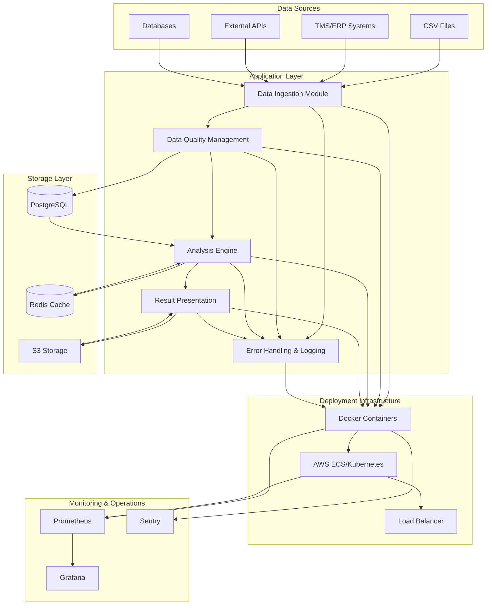

## Component Details

### Data Ingestion Module

Responsible for collecting, validating, and normalizing freight pricing data from multiple sources.

Subcomponents:
- Source Connector Factory
- Data Validator
- Data Transformer
- Ingestion Orchestrator

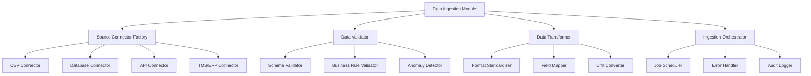

### Analysis Engine

Core computational component responsible for calculating freight price movements and identifying trends based on user-defined parameters.

Subcomponents:
- Query Builder
- Calculation Manager
- Trend Analyzer
- Result Compiler

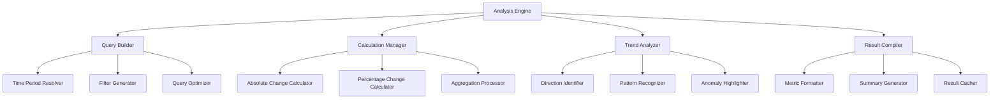

### Presentation Service

Transforms analytical results into user-friendly formats and delivers them through various channels according to user preferences.

Subcomponents:
- Format Converter
- Visualization Generator
- Export Manager
- Delivery Controller

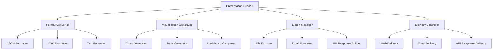

### Integration Layer

Facilitates communication between the Freight Price Movement Agent and external systems, providing standardized interfaces for data exchange and interoperability.

Subcomponents:
- Adapter Factory
- Authentication Manager
- Data Mapper
- Integration Orchestrator

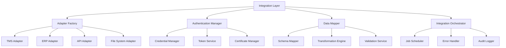

### Data Storage Layer

Manages the persistence, retrieval, and organization of all data within the Freight Price Movement Agent, ensuring data integrity, performance, and security.

Subcomponents:
- Primary Data Store
- Caching Layer
- File Storage

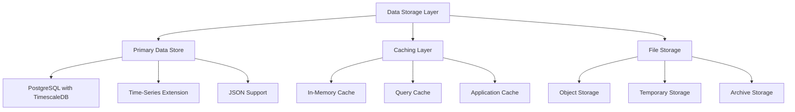

### Error Handling & Logging

Provides comprehensive monitoring, error management, and audit capabilities across the Freight Price Movement Agent.

Subcomponents:
- Error Classification
- Error Handling Strategy
- Logging Framework
- Audit Logging

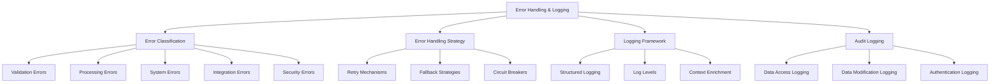

## Interaction Diagrams

### Data Flow Diagram

Illustrates how data flows through the system from ingestion to presentation.

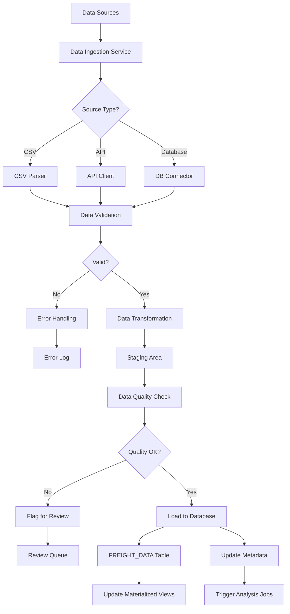

### Analysis Sequence Diagram

Shows the sequence of operations during a price movement analysis.

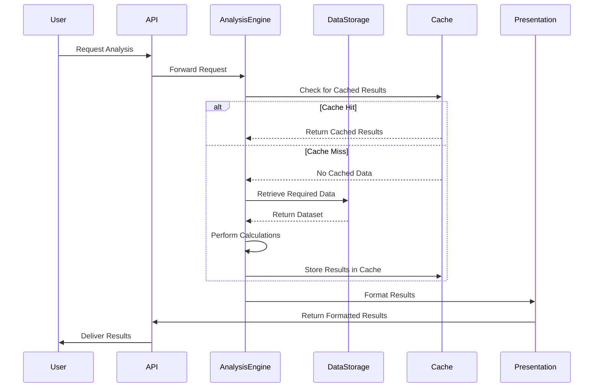

### Integration Pattern Diagram

Illustrates how the system integrates with external systems.

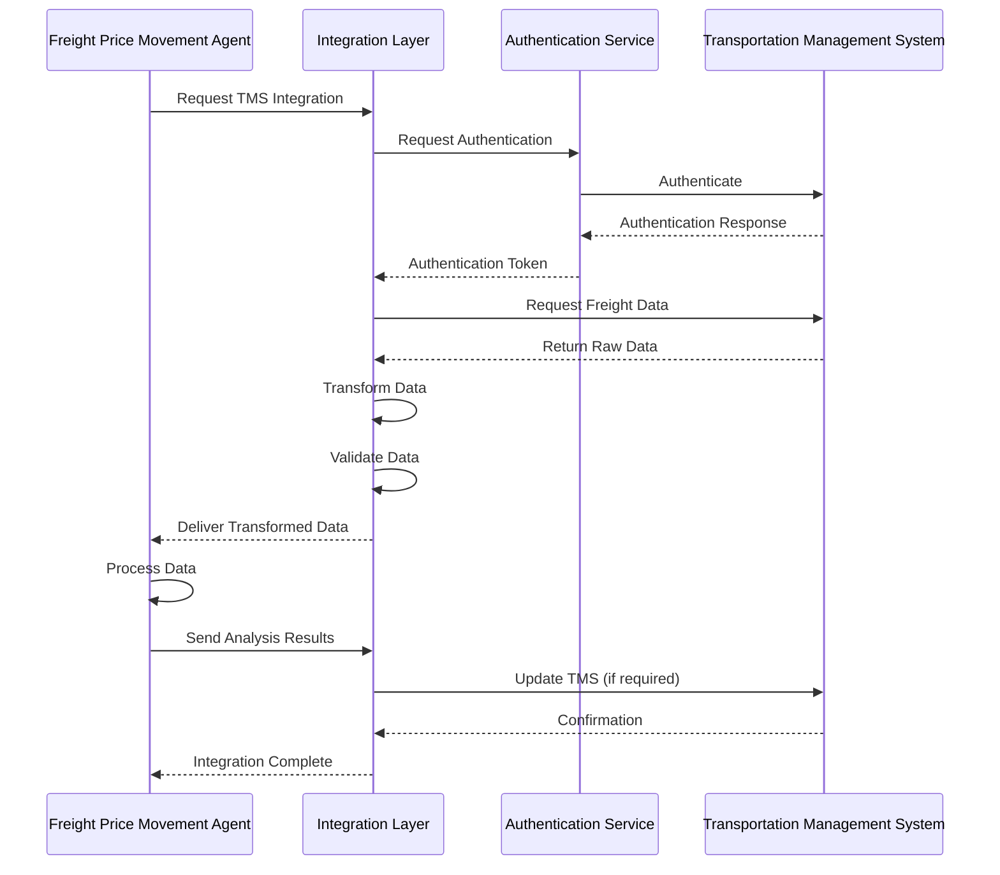

## Deployment Architecture

The following diagram illustrates how the system components are deployed to the infrastructure.

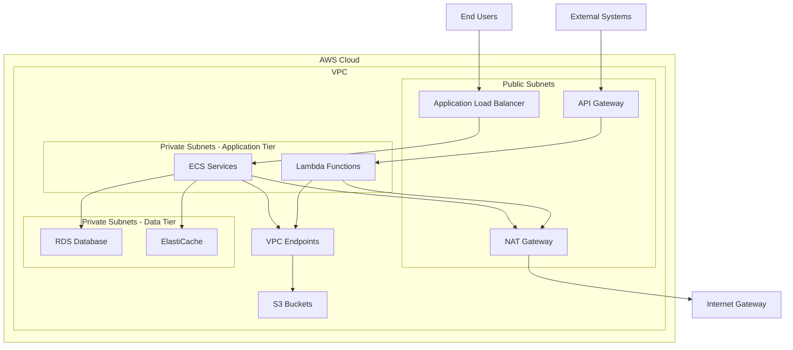

## Conclusion

This component diagram provides a comprehensive view of the Freight Price Movement Agent's architecture. The modular design ensures separation of concerns, maintainability, and scalability, while the integration patterns enable seamless communication with external systems. The deployment architecture leverages cloud infrastructure to provide high availability and performance.