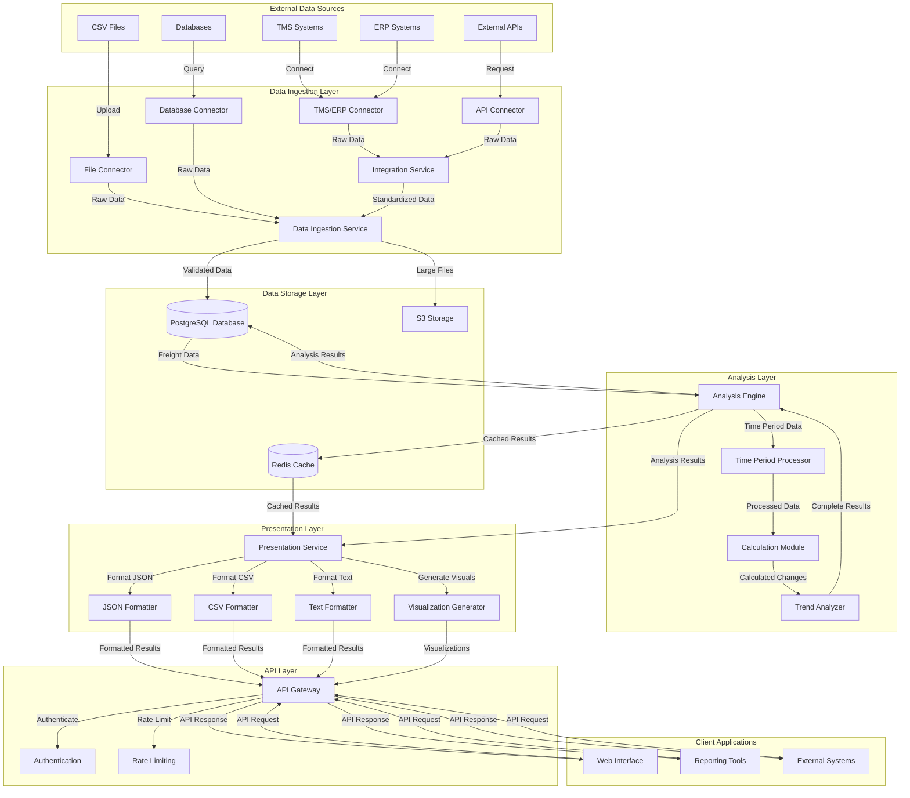
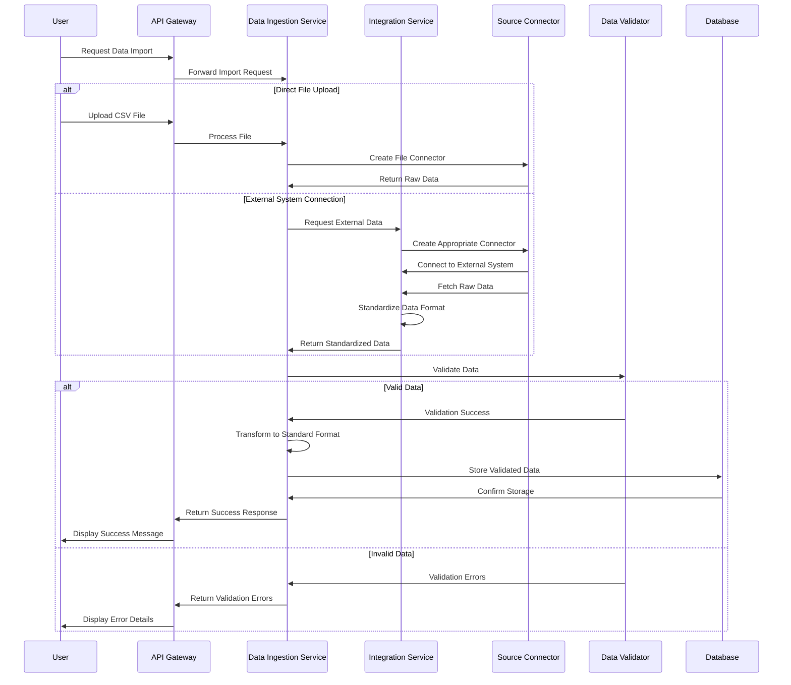
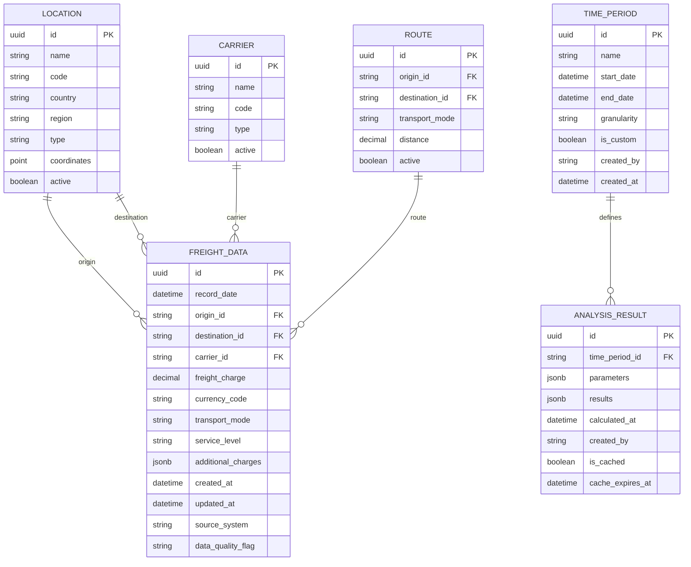
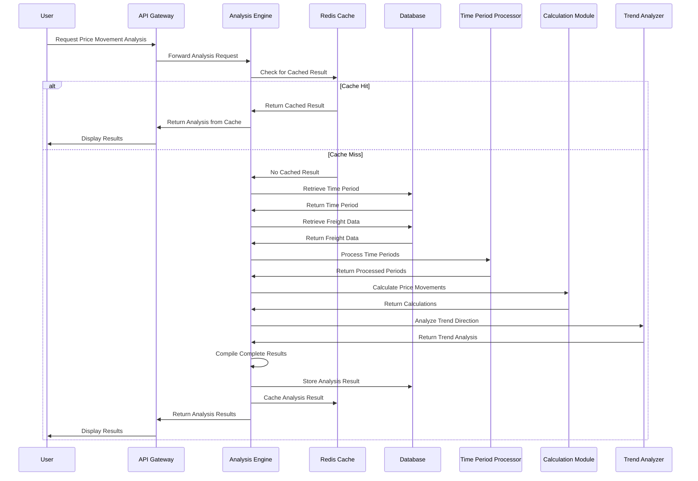
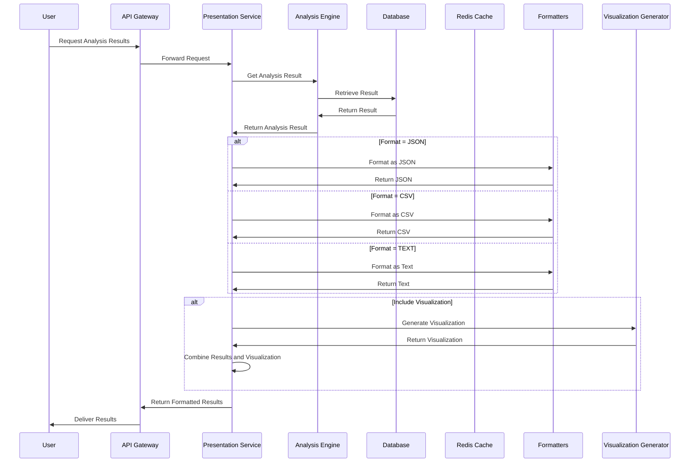
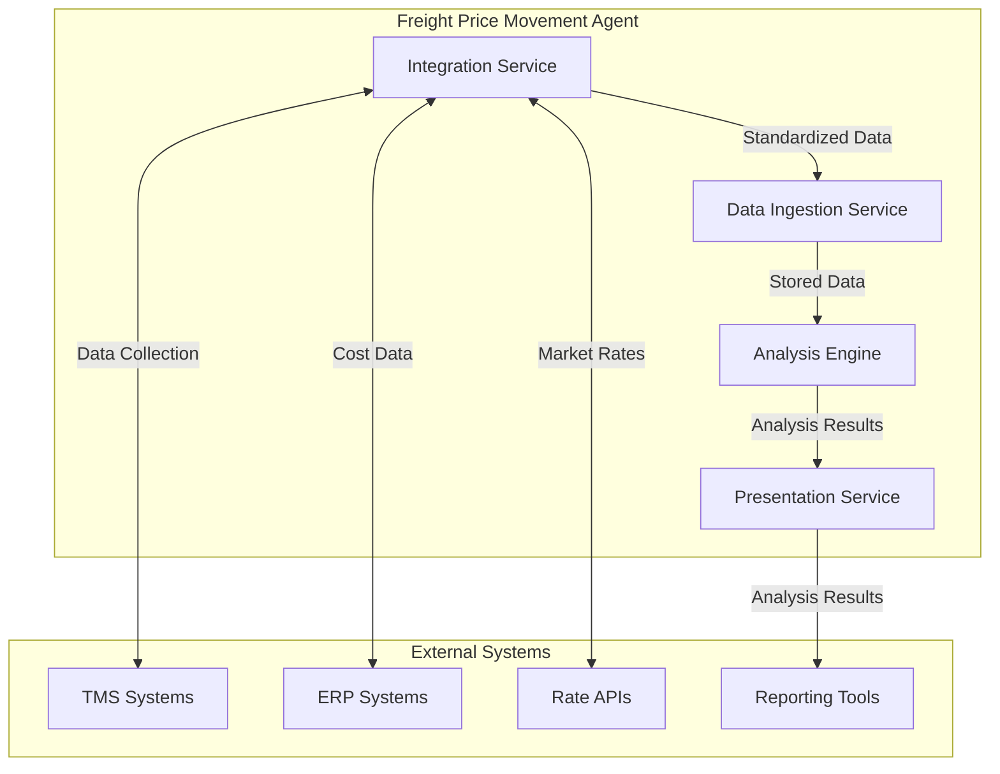
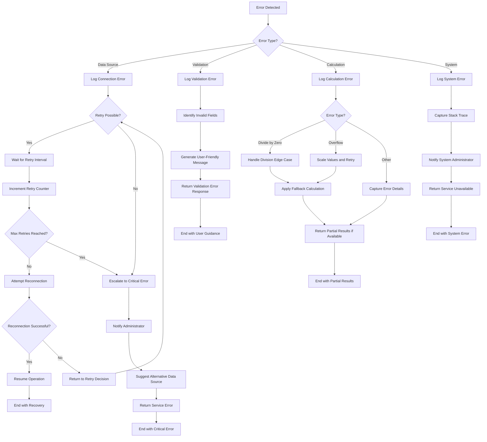
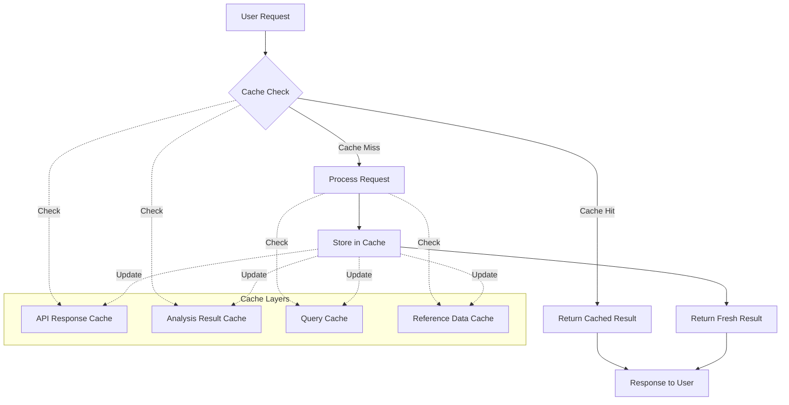
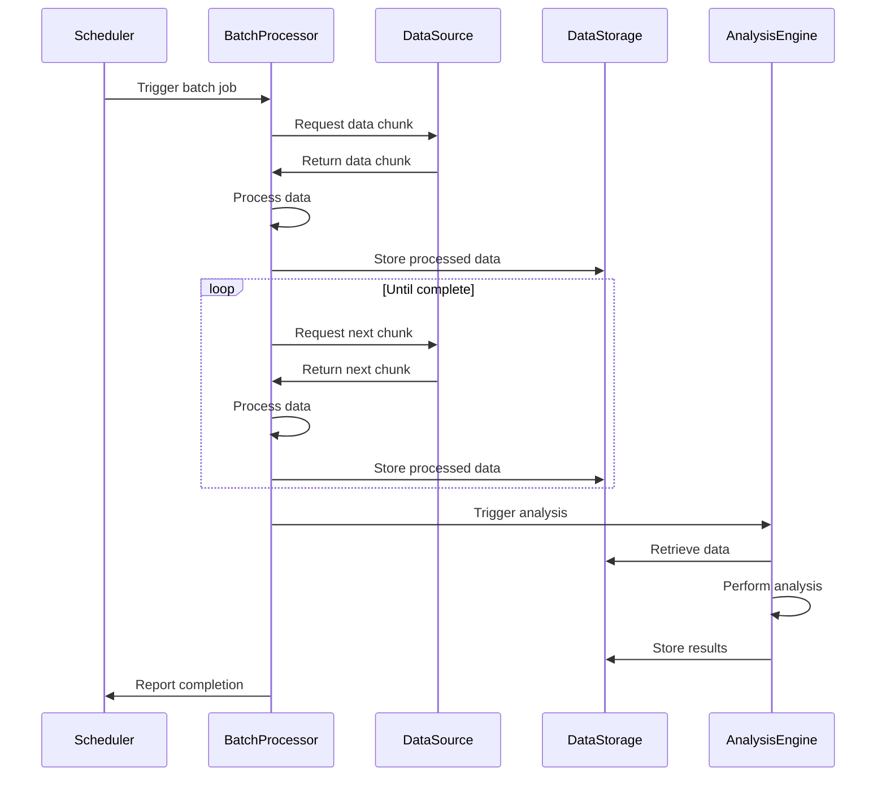
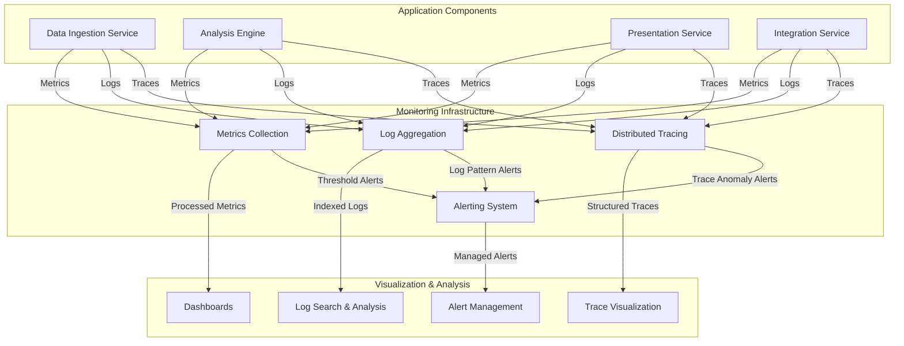

# Data Flow Architecture

## Introduction

This document describes the data flow architecture of the Freight Price Movement Agent system. It details how freight pricing data moves through the system from initial ingestion from various sources, through analysis processing, to final presentation to users. Understanding these data flows is essential for developers, system administrators, and integrators working with the system.

## High-Level Data Flow Overview

The Freight Price Movement Agent implements a multi-stage data flow architecture with clear boundaries between ingestion, processing, analysis, and presentation layers. Data flows through the system in a logical progression, with each component responsible for a specific transformation or operation on the data.

### Core Data Flow Diagram



### Key Data Flow Stages

1. **Data Ingestion**: External data is collected, validated, and normalized
2. **Data Storage**: Normalized data is persisted in the database
3. **Analysis Processing**: Stored data is analyzed to calculate price movements
4. **Result Presentation**: Analysis results are formatted for delivery
5. **API Delivery**: Formatted results are delivered to clients via API

## Data Ingestion Flow

The data ingestion process is responsible for collecting freight pricing data from various sources, validating it, transforming it to a standard format, and storing it in the database for analysis.

### Ingestion Process Flow



### Data Source Types

The system supports multiple data source types, each with its own connector implementation:

1. **CSV Files**: Direct upload or SFTP retrieval of CSV files
2. **TMS Systems**: Connection to Transportation Management Systems via API
3. **ERP Systems**: Connection to Enterprise Resource Planning systems
4. **External APIs**: Connection to third-party freight rate APIs
5. **Databases**: Direct connection to external databases

### Data Validation Rules

All ingested data undergoes validation to ensure quality and consistency:

1. **Schema Validation**: Ensures required fields are present
2. **Type Validation**: Verifies data types (e.g., numeric freight charges)
3. **Range Validation**: Checks values are within expected ranges
4. **Relationship Validation**: Verifies referential integrity
5. **Business Rule Validation**: Applies domain-specific validation rules

### Data Transformation

Raw data from various sources is transformed into a standardized format:

1. **Field Mapping**: Source fields are mapped to standard schema
2. **Data Type Conversion**: Values are converted to appropriate types
3. **Unit Standardization**: Units are standardized (e.g., currencies)
4. **Date Normalization**: Dates are converted to standard format
5. **Null Handling**: Missing values are handled according to rules

## Data Storage Architecture

The system employs a multi-tiered storage architecture to efficiently manage freight pricing data and analysis results.

### Database Schema



### Storage Tiers

The system uses multiple storage tiers for different data types and access patterns:

1. **PostgreSQL Database**: Primary storage for structured freight data and analysis results
2. **TimescaleDB Extension**: Time-series optimization for freight data
3. **Redis Cache**: High-speed caching for frequent queries and analysis results
4. **S3 Object Storage**: Storage for large files, exports, and backups

### Data Partitioning

Freight data is partitioned by time to optimize query performance:

1. **Monthly Partitions**: Current month + 3 previous months in hot storage
2. **Quarterly Partitions**: Current year by quarter in warm storage
3. **Annual Partitions**: Previous years in cold storage

### Caching Strategy

The system implements a multi-level caching strategy:

1. **Analysis Result Cache**: Completed analysis results cached for 60 minutes
2. **Query Cache**: Frequent database queries cached for 15 minutes
3. **Reference Data Cache**: Locations, carriers, and routes cached in application memory
4. **API Response Cache**: Common API responses cached at the API gateway level

## Analysis Engine Data Flow

The Analysis Engine is responsible for processing freight data to calculate price movements across specified time periods.

### Analysis Process Flow



### Calculation Algorithms

The Analysis Engine implements several key calculation algorithms:

1. **Absolute Change Calculation**:
   ```
   Absolute Change = End Value - Start Value
   ```

2. **Percentage Change Calculation**:
   ```
   Percentage Change = (Absolute Change / Start Value) * 100
   ```
   With special handling for zero start values.

3. **Trend Direction Determination**:
   ```
   If Percentage Change > +1%: Trend = "Increasing"
   If Percentage Change < -1%: Trend = "Decreasing"
   If -1% ≤ Percentage Change ≤ +1%: Trend = "Stable"
   ```

### Time Period Processing

Time periods are processed according to the specified granularity:

1. **Daily**: Each day is processed as a separate period
2. **Weekly**: Data is aggregated by week
3. **Monthly**: Data is aggregated by month
4. **Custom**: User-defined intervals are applied

### Analysis Result Structure

The analysis result contains the following key components:

1. **Metadata**: Analysis parameters, time period, filters
2. **Price Movement Metrics**: Start value, end value, absolute change, percentage change
3. **Trend Information**: Direction, indicators, patterns
4. **Time Series Data**: Data points for each period in the analysis
5. **Aggregated Statistics**: Min, max, average, standard deviation

## Presentation Layer Data Flow

The Presentation Layer transforms raw analysis results into user-friendly formats for delivery to clients.

### Presentation Process Flow



### Output Formats

The system supports multiple output formats for analysis results:

1. **JSON Format**: Structured data for API consumers and web applications
2. **CSV Format**: Tabular data for spreadsheet applications
3. **Text Format**: Human-readable summaries for reports and notifications
4. **Visualization**: Charts and graphs for visual representation of trends

### JSON Output Structure

```json
{
  "metadata": {
    "analysis_id": "string",
    "time_period": {
      "start_date": "ISO8601 date",
      "end_date": "ISO8601 date",
      "granularity": "string"
    },
    "filters": {
      "routes": ["string"],
      "carriers": ["string"]
    },
    "generated_at": "ISO8601 datetime"
  },
  "results": {
    "absolute_change": {
      "value": number,
      "unit": "string"
    },
    "percentage_change": {
      "value": number,
      "formatted": "string"
    },
    "trend": {
      "direction": "string",
      "indicator": "string"
    },
    "aggregates": {
      "start_period": {
        "average": number,
        "minimum": number,
        "maximum": number
      },
      "end_period": {
        "average": number,
        "minimum": number,
        "maximum": number
      }
    }
  },
  "time_series": [
    {
      "timestamp": "ISO8601 datetime",
      "value": number
    }
  ]
}
```

### Visualization Types

The system generates several types of visualizations for analysis results:

1. **Line Charts**: Time series visualization of freight charges
2. **Bar Charts**: Comparative visualization of different periods
3. **Trend Indicators**: Visual representation of trend direction
4. **Comparison Charts**: Side-by-side comparison of different analyses

## External System Integration

The system integrates with various external systems for data exchange and interoperability.

### Integration Flow Diagram



### TMS Integration

Integration with Transportation Management Systems:

1. **Data Retrieval**: Freight rates, shipment details, carrier information
2. **Authentication**: OAuth 2.0, API keys, or custom authentication
3. **Connection Methods**: REST API, SOAP API, or database connection
4. **Supported Systems**: SAP TM, Oracle TMS, JDA TMS, and others

### ERP Integration

Integration with Enterprise Resource Planning systems:

1. **Data Retrieval**: Cost data, vendor information, accounting codes
2. **Authentication**: System-specific authentication methods
3. **Connection Methods**: API, database, or file-based integration
4. **Supported Systems**: SAP ERP, Oracle ERP, Microsoft Dynamics, and others

### API Integration

Integration with external freight rate APIs:

1. **Data Retrieval**: Market rates, benchmark data, historical trends
2. **Authentication**: API keys, OAuth, or custom tokens
3. **Connection Methods**: REST API with JSON or XML formats
4. **Supported APIs**: Freightos Baltic Index, World Container Index, and others

## Error Handling and Recovery

The system implements comprehensive error handling and recovery mechanisms throughout the data flow.

### Error Handling Flow



### Error Categories

The system handles several categories of errors:

1. **Data Source Errors**: Connection failures, authentication issues, timeout errors
2. **Validation Errors**: Schema violations, data type mismatches, business rule violations
3. **Calculation Errors**: Division by zero, numeric overflow, algorithm failures
4. **System Errors**: Resource exhaustion, component failures, unexpected exceptions

### Retry Mechanisms

The system implements retry mechanisms for transient errors:

1. **Exponential Backoff**: Increasing delay between retry attempts
2. **Circuit Breaker**: Preventing repeated failures by temporarily disabling problematic connections
3. **Fallback Options**: Alternative data sources or calculation methods when primary options fail

### Data Recovery

The system includes data recovery mechanisms:

1. **Transaction Rollback**: Database transactions ensure data consistency
2. **Partial Results**: Returning available results when complete processing fails
3. **Data Correction**: Automated correction of minor data issues
4. **Audit Logging**: Comprehensive logging for troubleshooting and recovery

## Caching and Performance Optimization

The system employs various caching and optimization techniques to ensure high performance and responsiveness.

### Caching Architecture



### Cache Types and TTLs

The system implements multiple cache types with different time-to-live (TTL) values:

1. **Analysis Result Cache**: 60 minutes TTL, invalidated on data updates
2. **Query Cache**: 15 minutes TTL, automatic invalidation on data changes
3. **Reference Data Cache**: 24 hours TTL, explicit invalidation on updates
4. **API Response Cache**: 5 minutes TTL, varies by endpoint

### Database Optimization

Database performance is optimized through several techniques:

1. **Indexing Strategy**: B-tree indexes on frequently queried fields
2. **Partitioning**: Time-based partitioning for efficient queries
3. **Query Optimization**: Execution plan analysis and optimization
4. **Connection Pooling**: Efficient reuse of database connections

### Computational Optimization

Computational performance is optimized through:

1. **Vectorized Operations**: Using NumPy for efficient calculations
2. **Parallel Processing**: Multi-threaded calculations for large datasets
3. **Incremental Processing**: Processing only new or changed data
4. **Materialized Views**: Pre-calculated aggregates for common metrics

## Batch Processing Flows

The system supports batch processing for scheduled operations and large dataset handling.

### Batch Processing Sequence



### Scheduled Operations

The system supports several scheduled batch operations:

1. **Data Import**: Scheduled import from external systems
2. **Historical Analysis**: Periodic analysis of historical data
3. **Data Archival**: Moving aged data to archive storage
4. **Report Generation**: Scheduled generation of standard reports

### Batch Processing Optimization

Batch processing is optimized through several techniques:

1. **Chunking**: Processing data in manageable chunks
2. **Parallel Processing**: Distributing work across multiple workers
3. **Resource Management**: Scheduling batch jobs during off-peak hours
4. **Progress Tracking**: Monitoring and reporting batch job progress

### Failure Handling

Batch processing includes robust failure handling:

1. **Checkpointing**: Saving progress at regular intervals
2. **Resumable Jobs**: Ability to resume from the last successful checkpoint
3. **Partial Success**: Processing valid records while logging invalid ones
4. **Notification**: Alerting administrators of batch job failures

## Monitoring and Observability

The system includes comprehensive monitoring and observability features to track data flow and system health.

### Monitoring Architecture



### Key Metrics

The system tracks several key metrics for data flow monitoring:

1. **Ingestion Metrics**: Records processed, validation errors, processing time
2. **Analysis Metrics**: Analyses performed, calculation time, cache hit ratio
3. **Storage Metrics**: Database size, query performance, cache utilization
4. **API Metrics**: Request rate, response time, error rate

### Log Aggregation

The system implements centralized log aggregation:

1. **Application Logs**: Component-specific operational logs
2. **Data Flow Logs**: Tracking data movement between components
3. **Error Logs**: Detailed error information with context
4. **Audit Logs**: Security and compliance-related events

### Distributed Tracing

The system implements distributed tracing to track requests across components:

1. **End-to-End Tracing**: Following requests from API to database and back
2. **Component Spans**: Measuring time spent in each component
3. **Dependency Tracking**: Monitoring external system interactions
4. **Error Correlation**: Linking errors across components

## Conclusion

This document has provided a comprehensive overview of the data flow architecture in the Freight Price Movement Agent system. Understanding these data flows is essential for effective development, maintenance, and troubleshooting of the system.

The multi-stage architecture with clear separation between ingestion, storage, analysis, and presentation layers ensures a modular, maintainable system that can scale to meet the needs of freight price analysis. The various optimization techniques, error handling mechanisms, and monitoring capabilities ensure reliable operation and high performance.