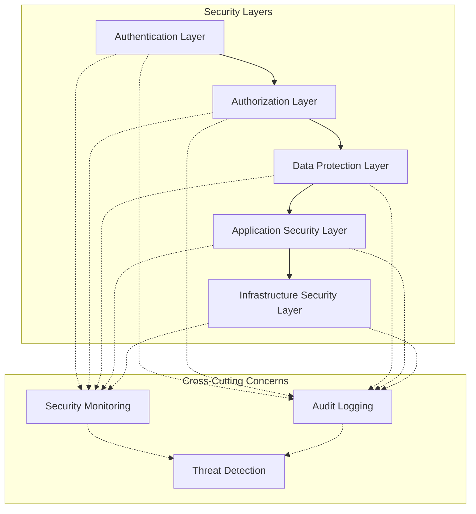
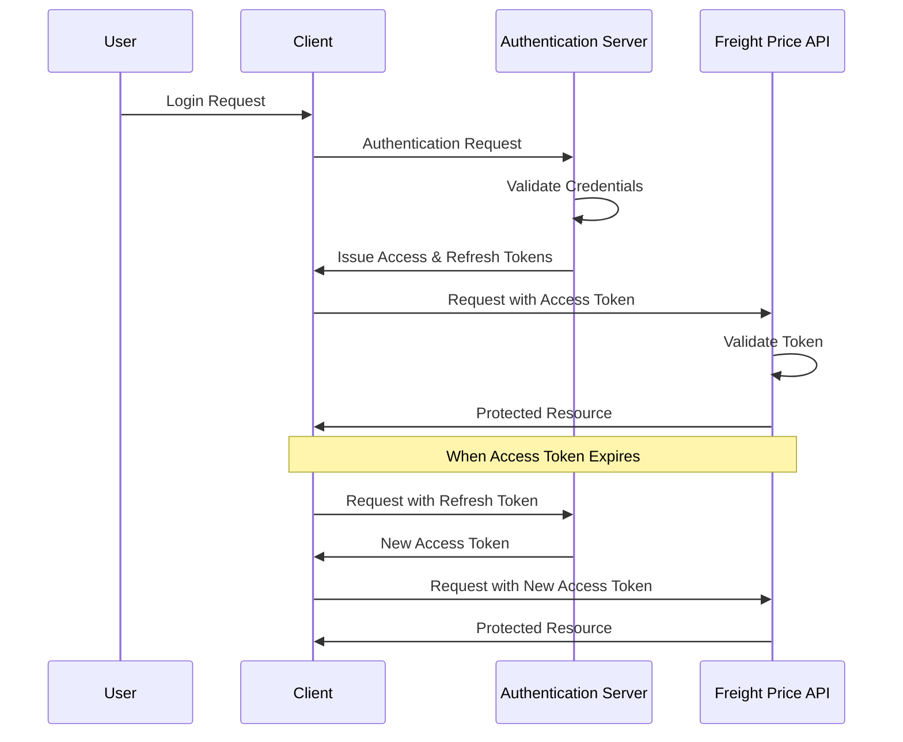
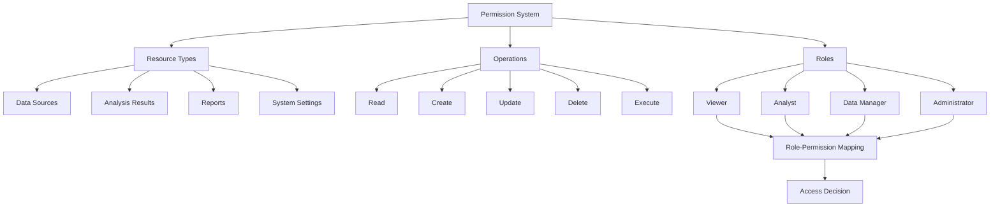
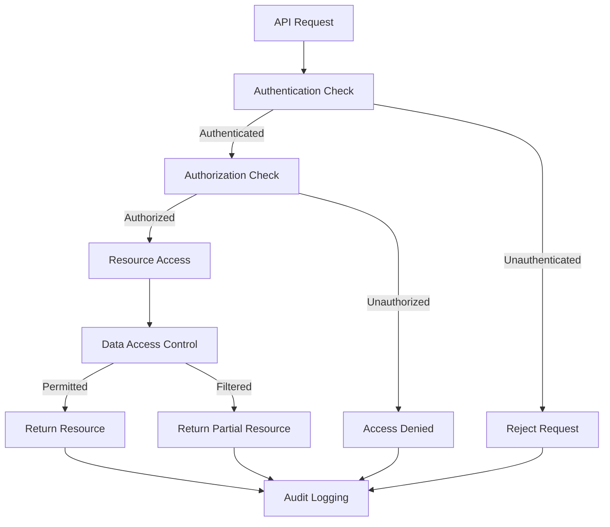
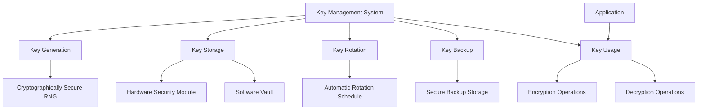
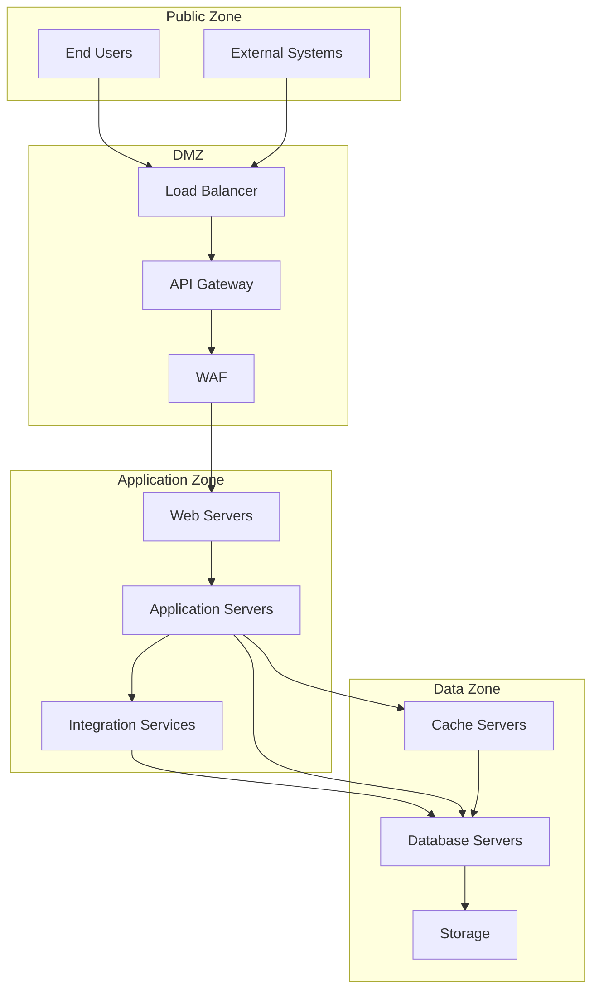
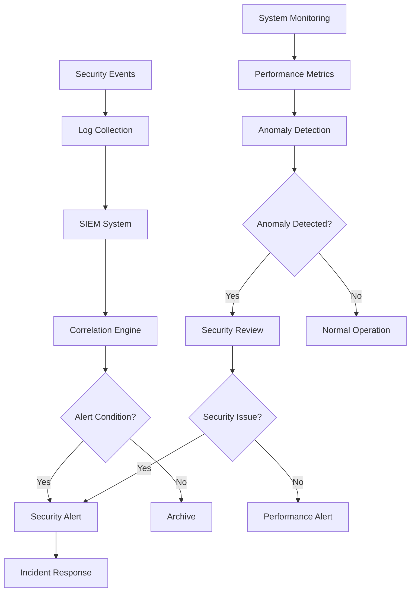

# Security Architecture

## Introduction

This document describes the security architecture of the Freight Price Movement Agent system. It details the security mechanisms implemented to protect sensitive freight pricing data, ensure proper authentication and authorization, and maintain the integrity and confidentiality of the system.

Security is a critical aspect of the Freight Price Movement Agent, as it handles sensitive pricing information that could provide competitive advantages if compromised. The security architecture follows a defense-in-depth approach, implementing multiple layers of security controls to protect against various threats.

## Security Architecture Overview

The Freight Price Movement Agent implements a comprehensive security architecture that addresses authentication, authorization, data protection, network security, and monitoring. The architecture follows industry best practices and standards, including OWASP guidelines and OAuth 2.0 specifications.

### Security Principles

The security architecture is built on the following core principles:

1. **Defense in Depth**: Multiple layers of security controls to protect against various threats
2. **Least Privilege**: Users and components have only the permissions necessary to perform their functions
3. **Secure by Default**: Security is built into the system from the ground up, not added as an afterthought
4. **Zero Trust**: All requests are authenticated and authorized, regardless of source
5. **Privacy by Design**: Data protection measures are integrated into the system architecture
6. **Continuous Monitoring**: Security events are continuously monitored and analyzed
7. **Fail Secure**: System fails in a secure state when errors occur

### Security Standards Compliance

The Freight Price Movement Agent security architecture is designed to comply with the following standards and frameworks:

1. **OWASP Top 10**: Protection against common web application vulnerabilities
2. **OAuth 2.0 / OpenID Connect**: Industry standard for authentication and authorization
3. **NIST Cybersecurity Framework**: Risk management and security best practices
4. **SOC 2**: Controls for security, availability, processing integrity, confidentiality, and privacy
5. **GDPR**: Data protection and privacy requirements (where applicable)

## Authentication Framework

The Freight Price Movement Agent implements a robust authentication framework based on OAuth 2.0 and OpenID Connect standards. This framework provides secure user authentication, token management, and session handling.

### Authentication Methods

The system supports multiple authentication methods to accommodate different use cases:

1. **Username/Password**: Standard user login with secure password policies
2. **OAuth 2.0 / OIDC**: Support for enterprise identity providers
3. **API Keys**: Long-lived tokens for system-to-system integration
4. **JWT Tokens**: Short-lived tokens for API authentication

### Token Management

The system implements a comprehensive token management strategy:

1. **Access Tokens**: Short-lived JWT tokens (15 minutes) for API authentication
2. **Refresh Tokens**: Longer-lived tokens (24 hours) for obtaining new access tokens
3. **Token Storage**: Secure storage with HTTP-only cookies for refresh tokens
4. **Token Validation**: Signature verification, expiration checking, and type validation
5. **Token Revocation**: Ability to revoke tokens before expiration

Tokens are generated using industry-standard cryptographic algorithms (HMAC-SHA256) and include claims for user identity, permissions, expiration time, and token type.

### Session Management

User sessions are managed securely to prevent unauthorized access:

1. **Session Creation**: Sessions are created upon successful authentication
2. **Session Identification**: Unique session IDs generated using cryptographically secure methods
3. **Session Storage**: Server-side session storage with client-side reference
4. **Session Expiration**: Automatic expiration after 30 minutes of inactivity
5. **Session Termination**: Explicit logout or timeout
6. **Concurrent Sessions**: Support for multiple active sessions with visibility and control

### Password Policies

The system enforces strong password policies to prevent unauthorized access:

1. **Complexity Requirements**: Minimum 12 characters with mixed case, numbers, and symbols
2. **Password Storage**: Secure hashing using bcrypt with appropriate work factor
3. **Password Expiration**: 90-day password rotation policy
4. **Password History**: Prevention of password reuse (last 10 passwords)
5. **Failed Attempts**: Account lockout after 5 failed attempts
6. **Password Reset**: Secure password reset process with time-limited tokens

### Multi-Factor Authentication

The system supports multi-factor authentication (MFA) for additional security:

1. **Time-based One-Time Passwords (TOTP)**: Compatible with standard authenticator apps
2. **Email Verification**: One-time codes sent via email
3. **SMS Verification**: One-time codes sent via SMS (where available)
4. **MFA Enforcement**: Configurable MFA requirements based on user role and risk level

## Authorization System

The Freight Price Movement Agent implements a comprehensive authorization system to control access to resources and functionality. The system uses role-based access control (RBAC) with fine-grained permissions.

### Role-Based Access Control

Access control is implemented using a role-based approach:

1. **User Roles**: Predefined roles with associated permissions
   - Viewer: Read-only access to reports and analyses
   - Analyst: Create and run analyses
   - Data Manager: Manage data sources and imports
   - Administrator: Full system access

2. **Role Assignment**: Users are assigned one or more roles
3. **Role Hierarchy**: Roles can inherit permissions from other roles
4. **Default Role**: New users are assigned a default role with minimal permissions

### Permission Management

Permissions are managed at a granular level:

1. **Resource Types**: Data sources, analyses, reports, system settings
2. **Operations**: Read, create, update, delete, execute
3. **Permission Assignment**: Permissions are assigned to roles
4. **Permission Checking**: All operations check for required permissions

| Permission | Viewer | Analyst | Data Manager | Administrator |
|------------|--------|---------|--------------|---------------|
| View Analysis | ✓ | ✓ | ✓ | ✓ |
| Create Analysis | ✗ | ✓ | ✓ | ✓ |
| Manage Data Sources | ✗ | ✗ | ✓ | ✓ |
| Configure System | ✗ | ✗ | ✗ | ✓ |

### Data Access Control

Access to data is controlled at multiple levels:

1. **Row-Level Security**: Users can only access authorized data rows
2. **Column-Level Security**: Sensitive columns can be restricted based on user role
3. **Data Filters**: Automatic application of data filters based on user context
4. **Data Ownership**: Users have full access to data they create
5. **Data Sharing**: Explicit sharing of data with other users or groups

### API Authorization

API endpoints are protected by authorization checks:

1. **Endpoint Protection**: All endpoints require authentication
2. **Permission Verification**: Endpoints check for required permissions
3. **Scope-Based Access**: API tokens are issued with specific scopes
4. **Rate Limiting**: Prevents abuse through request rate limits

## Data Protection

The Freight Price Movement Agent implements comprehensive data protection measures to ensure the confidentiality, integrity, and availability of sensitive freight pricing data.

### Encryption Standards

Data is protected using strong encryption standards:

1. **Data at Rest**: AES-256 encryption for database and file storage
2. **Data in Transit**: TLS 1.2+ for all communications
3. **Sensitive Fields**: Field-level encryption for highly sensitive data
4. **Encryption Key Management**: Secure key storage and rotation

All encryption implementations use industry-standard algorithms and libraries with proper key sizes and modes of operation.

### Key Management

Encryption keys are managed securely:

1. **Key Generation**: Keys are generated using cryptographically secure random number generators
2. **Key Storage**: Keys are stored in a secure key management system
3. **Key Rotation**: Regular rotation of encryption keys
4. **Key Access Control**: Strict access controls for encryption keys

### Data Classification

Data is classified according to sensitivity:

1. **Public Data**: Information that can be freely shared
2. **Internal Data**: Information for internal use only
3. **Confidential Data**: Sensitive business information
4. **Restricted Data**: Highly sensitive information

Each classification level has associated handling requirements and protection measures.

### Data Masking and Anonymization

Sensitive data is protected through masking and anonymization:

1. **Data Masking**: Partial obfuscation of sensitive data (e.g., last digits of prices)
2. **Data Anonymization**: Removal of identifying information for analytical use
3. **Pseudonymization**: Replacement of identifiers with pseudonyms
4. **Role-Based Visibility**: Different levels of data visibility based on user role

### Data Lifecycle Management

Data is protected throughout its lifecycle:

1. **Data Creation**: Secure input handling and validation
2. **Data Storage**: Encrypted storage with access controls
3. **Data Usage**: Controlled access and audit logging
4. **Data Archival**: Secure long-term storage
5. **Data Deletion**: Secure deletion with verification

Retention policies ensure that data is kept only as long as necessary for business and compliance purposes.

## Security Zones

The Freight Price Movement Agent implements a defense-in-depth approach with clearly defined security zones. Each zone has specific security controls and trust boundaries.

### Network Security Zones

The system is divided into multiple security zones:

1. **Public Zone**: Internet-facing components (load balancers, WAF)
2. **DMZ**: Semi-trusted zone for API gateways and public services
3. **Application Zone**: Protected zone for application services
4. **Data Zone**: Highly protected zone for databases and storage

### Trust Boundaries

Trust boundaries are established between security zones:

1. **External Boundary**: Between public internet and DMZ
2. **DMZ Boundary**: Between DMZ and application zone
3. **Data Boundary**: Between application zone and data zone

All traffic crossing trust boundaries is authenticated, authorized, and inspected.

### Network Controls

Network security is enforced through multiple controls:

1. **Firewalls**: Traffic filtering between security zones
2. **Network ACLs**: Subnet-level access control
3. **Security Groups**: Instance-level access control
4. **Private Subnets**: No direct internet access for sensitive components
5. **VPC Endpoints**: Private access to cloud services
6. **VPN/Direct Connect**: Secure access for administrators

### Container Security

Containerized components have additional security measures:

1. **Image Scanning**: Vulnerability scanning of container images
2. **Minimal Base Images**: Reduced attack surface
3. **Non-Root Execution**: Containers run as non-privileged users
4. **Read-Only Filesystems**: Prevent runtime modifications
5. **Resource Limits**: Prevent resource exhaustion attacks
6. **Network Policies**: Fine-grained container network controls

## Threat Mitigation

The Freight Price Movement Agent implements specific controls to address common security threats and vulnerabilities.

### OWASP Top 10 Mitigations

The system implements controls for the OWASP Top 10 vulnerabilities:

1. **Injection**: Parameterized queries, input validation, ORM
2. **Broken Authentication**: Secure authentication framework, MFA
3. **Sensitive Data Exposure**: Encryption, data classification
4. **XML External Entities**: Safe XML parsing, input validation
5. **Broken Access Control**: RBAC, permission checks
6. **Security Misconfiguration**: Secure defaults, configuration management
7. **Cross-Site Scripting**: Output encoding, Content Security Policy
8. **Insecure Deserialization**: Safe deserialization libraries, input validation
9. **Using Components with Known Vulnerabilities**: Dependency scanning, regular updates
10. **Insufficient Logging & Monitoring**: Comprehensive logging, security monitoring

### API Security

API endpoints are protected against common threats:

1. **Authentication**: All endpoints require authentication
2. **Authorization**: Permission checks for all operations
3. **Rate Limiting**: Prevents abuse and DoS attacks
4. **Input Validation**: All inputs are validated
5. **Output Encoding**: Prevents injection in responses
6. **CORS Policy**: Restricts cross-origin requests
7. **Security Headers**: Implements security-related HTTP headers

### Denial of Service Protection

The system is protected against denial of service attacks:

1. **Rate Limiting**: Limits requests per client
2. **Connection Limits**: Prevents connection exhaustion
3. **Resource Quotas**: Limits resource consumption
4. **Timeouts**: Prevents long-running operations
5. **Circuit Breakers**: Prevents cascading failures
6. **CDN/Edge Protection**: Absorbs large-scale attacks

### Malware Protection

The system is protected against malware:

1. **File Scanning**: Uploaded files are scanned for malware
2. **Content Type Validation**: Ensures files match declared types
3. **File Size Limits**: Prevents resource exhaustion
4. **Execution Prevention**: Uploaded files cannot be executed
5. **Sandbox Processing**: Files are processed in isolated environments

## Security Monitoring

The Freight Price Movement Agent implements comprehensive security monitoring to detect and respond to security events.

### Logging and Auditing

Security-relevant events are logged and audited:

1. **Authentication Events**: Login attempts, failures, logouts
2. **Authorization Events**: Access attempts, permission checks
3. **Data Access Events**: Data retrieval, modification
4. **Administrative Actions**: Configuration changes, user management
5. **System Events**: Component status, resource utilization

Logs are stored securely with tamper protection and appropriate retention periods.

### Intrusion Detection

The system implements intrusion detection mechanisms:

1. **Network-based Detection**: Monitoring of network traffic for suspicious patterns
2. **Host-based Detection**: Monitoring of system activities for suspicious behavior
3. **Application-level Detection**: Monitoring of application behavior for anomalies
4. **User Behavior Analytics**: Detection of unusual user activities
5. **Signature-based Detection**: Matching against known attack patterns
6. **Anomaly-based Detection**: Identification of deviations from normal behavior

### Alert Management

Security alerts are managed through a structured process:

1. **Alert Generation**: Security events trigger alerts based on rules
2. **Alert Prioritization**: Alerts are prioritized based on severity and impact
3. **Alert Notification**: Alerts are sent to appropriate personnel
4. **Alert Investigation**: Alerts are investigated to determine validity
5. **Alert Resolution**: Valid alerts are addressed through incident response
6. **Alert Closure**: Alerts are closed when resolved

### Incident Response

Security incidents are handled through a defined process:

1. **Preparation**: Incident response plans and resources are in place
2. **Detection**: Security events are detected and classified
3. **Containment**: The impact of incidents is limited
4. **Eradication**: The root cause of incidents is eliminated
5. **Recovery**: Normal operations are restored
6. **Lessons Learned**: Incidents are analyzed to improve security

### Vulnerability Management

Vulnerabilities are managed through a structured process:

1. **Vulnerability Scanning**: Regular scanning for known vulnerabilities
2. **Penetration Testing**: Periodic testing to identify vulnerabilities
3. **Dependency Scanning**: Checking for vulnerabilities in dependencies
4. **Vulnerability Tracking**: Tracking of identified vulnerabilities
5. **Vulnerability Remediation**: Addressing vulnerabilities through patches or mitigations
6. **Vulnerability Verification**: Confirming that vulnerabilities have been addressed

## Compliance and Governance

The Freight Price Movement Agent implements security governance and compliance measures to ensure alignment with regulatory requirements and industry standards.

### Security Policies

The system is governed by comprehensive security policies:

1. **Information Security Policy**: Overall security governance
2. **Access Control Policy**: Rules for system access
3. **Data Protection Policy**: Requirements for data security
4. **Password Policy**: Standards for password management
5. **Incident Response Policy**: Procedures for security incidents
6. **Change Management Policy**: Controls for system changes

### Compliance Framework

The system is designed to support compliance with relevant standards:

1. **SOC 2**: Controls for security, availability, processing integrity, confidentiality, and privacy
2. **GDPR**: Data protection and privacy requirements (where applicable)
3. **Industry-specific Regulations**: Compliance with logistics industry standards
4. **Internal Compliance**: Alignment with organizational security requirements

### Security Assessment

The system undergoes regular security assessments:

1. **Risk Assessment**: Identification and evaluation of security risks
2. **Vulnerability Assessment**: Scanning for technical vulnerabilities
3. **Penetration Testing**: Simulated attacks to identify weaknesses
4. **Security Audit**: Review of security controls and compliance
5. **Code Review**: Security-focused review of application code

### Security Documentation

Security is documented comprehensively:

1. **Security Architecture**: Documentation of security design
2. **Threat Model**: Analysis of potential threats and mitigations
3. **Control Matrix**: Mapping of security controls to requirements
4. **Security Procedures**: Step-by-step security processes
5. **Security Training**: Materials for user security awareness

## Secure Development Lifecycle

The Freight Price Movement Agent is developed following a secure development lifecycle (SDLC) to ensure security is integrated throughout the development process.

### Security Requirements

Security requirements are defined early in the development process:

1. **Functional Security Requirements**: Security features and capabilities
2. **Non-functional Security Requirements**: Security properties and constraints
3. **Compliance Requirements**: Regulatory and standard compliance
4. **Threat Modeling**: Identification of potential threats and mitigations

### Secure Design

Security is integrated into the system design:

1. **Security Architecture**: Design of security controls and mechanisms
2. **Secure Design Patterns**: Use of established secure design patterns
3. **Attack Surface Reduction**: Minimization of potential attack vectors
4. **Defense in Depth**: Multiple layers of security controls
5. **Secure Defaults**: Security enabled by default

### Secure Implementation

Security is enforced during implementation:

1. **Secure Coding Standards**: Guidelines for secure code development
2. **Code Review**: Security-focused review of code changes
3. **Static Analysis**: Automated code scanning for vulnerabilities
4. **Dependency Management**: Control of third-party components
5. **Security Testing**: Verification of security controls

### Security Testing

Security is verified through comprehensive testing:

1. **Unit Testing**: Testing of individual security controls
2. **Integration Testing**: Testing of security control interactions
3. **Penetration Testing**: Simulated attacks to identify weaknesses
4. **Fuzz Testing**: Testing with invalid, unexpected, or random data
5. **Security Regression Testing**: Verification that security issues don't recur

### Security Deployment

Security is maintained during deployment:

1. **Secure Configuration**: Deployment with secure configuration
2. **Infrastructure as Code**: Automated, consistent infrastructure deployment
3. **Secrets Management**: Secure handling of credentials and secrets
4. **Deployment Verification**: Confirmation of security controls
5. **Continuous Monitoring**: Ongoing security monitoring

## Conclusion

The security architecture of the Freight Price Movement Agent provides a comprehensive approach to protecting sensitive freight pricing data and ensuring the integrity and availability of the system. By implementing multiple layers of security controls, following industry best practices, and maintaining continuous monitoring, the system achieves a strong security posture.

Security is an ongoing process, and the security architecture will evolve to address new threats and requirements. Regular security assessments, updates to security controls, and continuous improvement of security processes will ensure that the system remains secure throughout its lifecycle.

## Appendix A: Security Control Matrix

| Security Control | Implementation | Compliance Requirement |
|------------------|----------------|------------------------|
| Access Control | RBAC + MFA | SOC 2 CC6.1, CC6.2 |
| Data Encryption | TLS + AES-256 | SOC 2 CC6.7, CC6.8 |
| Audit Logging | Comprehensive event logging | SOC 2 CC7.2 |
| Vulnerability Management | Regular scanning and patching | SOC 2 CC7.1 |
| Authentication | OAuth 2.0 / OIDC with JWT | SOC 2 CC6.1 |
| Authorization | Role-based permissions | SOC 2 CC6.1 |
| Network Security | Firewalls, ACLs, Security Groups | SOC 2 CC6.6 |
| Incident Response | Defined incident handling process | SOC 2 CC7.3, CC7.4, CC7.5 |

## Appendix B: Security Terminology

| Term | Definition |
|------|------------|
| Authentication | The process of verifying the identity of a user or system |
| Authorization | The process of determining if a user or system has permission to access a resource |
| Encryption | The process of encoding data to prevent unauthorized access |
| Hashing | A one-way function that converts data into a fixed-length string |
| JWT | JSON Web Token, a compact, URL-safe means of representing claims between two parties |
| MFA | Multi-Factor Authentication, requiring two or more verification factors |
| OAuth 2.0 | An authorization framework that enables third-party applications to obtain limited access to a user's account |
| OIDC | OpenID Connect, an identity layer on top of OAuth 2.0 |
| RBAC | Role-Based Access Control, a method of regulating access based on roles |
| TLS | Transport Layer Security, a protocol for secure communication over a network |