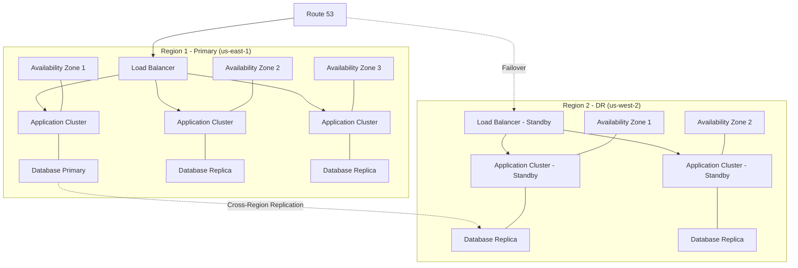
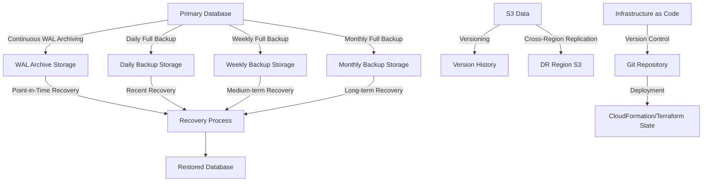
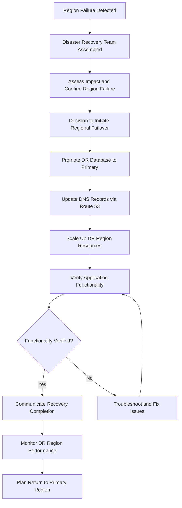
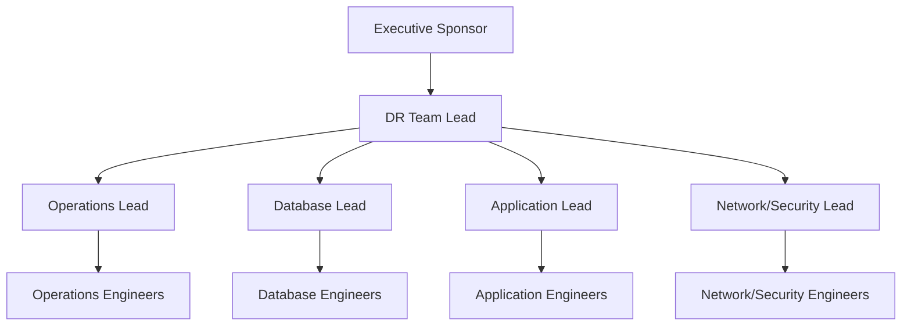
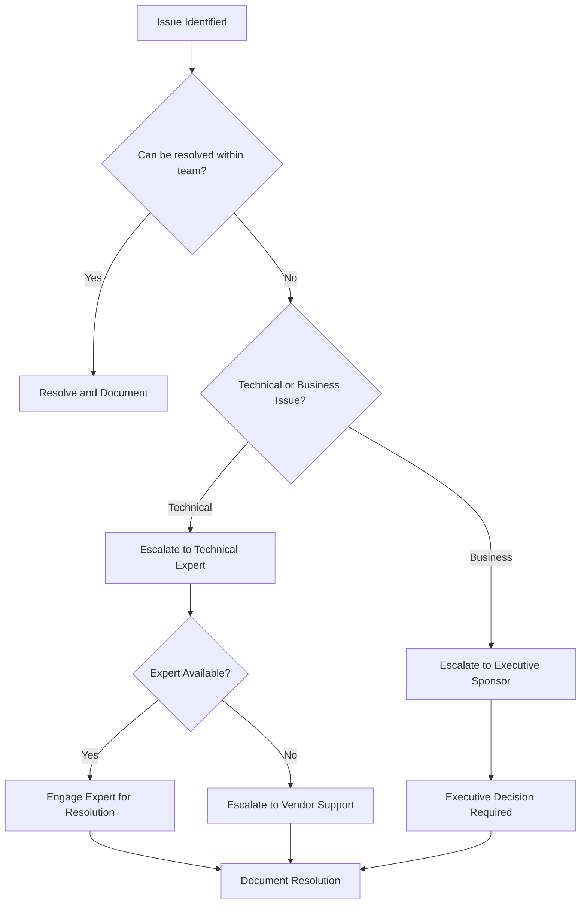
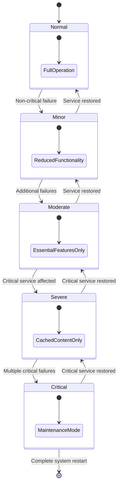
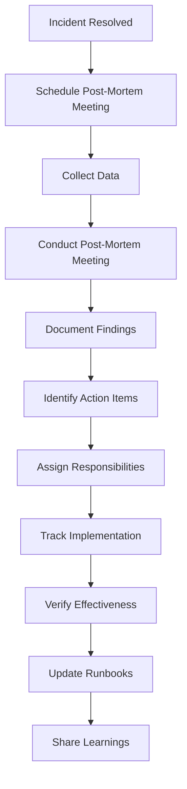

# Freight Price Movement Agent - Disaster Recovery Plan

## 1. Introduction

### 1.1 Purpose and Scope

This document outlines the comprehensive disaster recovery strategy for the Freight Price Movement Agent system. It defines the procedures, responsibilities, and technical configurations necessary to recover from various disaster scenarios, ranging from individual component failures to complete system outages.

The disaster recovery plan covers:
- All production environments of the Freight Price Movement Agent
- Critical data components including freight pricing information
- Application services and infrastructure components
- Integration points with external systems
- Recovery procedures, testing methodologies, and validation processes

This plan does not cover:
- Development or testing environments
- Non-critical ancillary systems
- Business continuity planning beyond technical recovery

### 1.2 Recovery Objectives

The Freight Price Movement Agent has established the following recovery objectives:

| Recovery Aspect | Target | Implementation |
|-----------------|--------|----------------|
| Recovery Point Objective (RPO) | < 15 minutes | Continuous backup with point-in-time recovery |
| Recovery Time Objective (RTO) | < 4 hours | Automated recovery procedures with regular testing |
| Minimum Business Continuity | Read-only access to recent data | Replicated read-only database |

These objectives are designed to minimize both data loss and system downtime while balancing technical feasibility and cost considerations.

### 1.3 Disaster Classification

Disasters are classified into the following categories based on severity and impact:

| Level | Classification | Description | Examples | Recovery Lead |
|-------|---------------|-------------|----------|---------------|
| 1 | Minor Incident | Single component failure with minimal impact | Application service crash, temporary API timeout | Service Engineer |
| 2 | Service Disruption | Multiple component failures or service degradation | Database performance issues, elevated error rates | Operations Lead |
| 3 | Major Outage | Critical service unavailability | Primary database failure, availability zone outage | DR Team Lead |
| 4 | Complete Failure | Total system unavailability | Region-wide AWS outage, catastrophic data corruption | CTO + DR Team |

## 2. Disaster Recovery Architecture

### 2.1 Multi-Region Deployment

The Freight Price Movement Agent employs a multi-region architecture to ensure high availability and disaster recovery capabilities:



The multi-region architecture includes:
- Primary production region (us-east-1) with three availability zones
- Disaster recovery region (us-west-2) with two availability zones
- Automated replication between regions
- DNS-based failover capability via Route 53

### 2.2 Data Redundancy Strategy

Data redundancy is implemented through multiple layers to ensure resilience against various failure scenarios:

| Data Type | Primary Redundancy | Cross-Region Redundancy | Recovery Mechanism |
|-----------|-------------------|-------------------------|---------------------|
| Operational Data | Multi-AZ database with synchronous replication | Asynchronous cross-region replication | Automatic failover within region, manual promotion across regions |
| Application State | Stateless design with persistent storage | Cross-region replication of persistent data | No special recovery needed due to stateless design |
| Object Storage | S3 with cross-region replication | Versioning and replication to DR region | Automatic with S3 durability guarantees |
| Configuration | Version-controlled IaC | Deployed to both regions | Re-application of infrastructure templates |

### 2.3 Backup Infrastructure

The backup infrastructure provides multiple recovery options with varying granularity and retention periods:



Key components of the backup infrastructure include:
- Continuous Write-Ahead Log (WAL) archiving for point-in-time recovery
- Scheduled full backups at daily, weekly, and monthly intervals
- S3 versioning and replication for object storage durability
- Version-controlled infrastructure as code for configuration recovery

## 3. Backup Procedures

### 3.1 Backup Types and Schedule

The Freight Price Movement Agent implements a comprehensive backup strategy with the following components:

| Backup Type | Frequency | Retention | Storage Location | Encryption |
|-------------|-----------|-----------|------------------|------------|
| Database - WAL Archiving | Continuous | 7 days | S3 + Glacier | AES-256 |
| Database - Full Snapshot | Daily | 35 days | RDS Automated Backups | AES-256 |
| Database - Full Snapshot | Weekly | 3 months | S3 + Glacier | AES-256 |
| Database - Full Snapshot | Monthly | 7 years | S3 + Glacier | AES-256 |
| Application Data | Daily | 90 days | S3 Cross-Region | AES-256 |
| Configuration | On change | Indefinite | Git + S3 | AES-256 |

All backups are automated using AWS native services or scheduled scripts, with monitoring to ensure successful completion.

### 3.2 Backup Verification

Backup verification is a critical component of ensuring recoverability:

1. **Automated Verification**: 
   - All backups undergo automated integrity checks upon completion
   - SHA-256 checksums are computed and stored with the backup
   - Backup logs are monitored for completion status

2. **Scheduled Restoration Tests**:
   - Monthly: Database restore test to isolated environment
   - Quarterly: Full application restore test in isolated environment
   - Results documented in the DR testing log

3. **Verification Procedures**:
   - Database backups: Restore to test instance, verify schema and query functionality
   - Application backups: Restore to test environment, verify basic functionality
   - Configuration: Deploy to test environment, verify infrastructure creation

### 3.3 Backup Retention Policy

Retention policies balance regulatory requirements, business needs, and storage costs:

| Data Type | Active Retention | Archive Retention | Purge Policy |
|-----------|------------------|-------------------|--------------|
| Freight Data | 1 year in primary storage | 7 years in archive storage | Automated purge after retention period |
| Analysis Results | 90 days in primary storage | 1 year in archive storage | Automated purge after retention period |
| System Logs | 30 days in CloudWatch | 90 days in S3 | Automated purge after retention period |
| Audit Logs | 90 days in primary storage | 7 years in archive storage | Automated purge after retention period |

Retention policies are enforced through:
- Automated lifecycle policies on S3 storage
- RDS automated backup retention settings
- Custom scripts for specialized retention requirements
- Regular compliance audits to verify retention policy implementation

## 4. Recovery Procedures

### 4.1 Component Failure Recovery

#### 4.1.1 Application Service Recovery

For individual application service failures:

1. **Detection**:
   - CloudWatch alarms monitor service health
   - ECS health checks detect container failures

2. **Automatic Recovery**:
   - ECS task restart for unhealthy containers
   - Auto Scaling Group replacement of unhealthy instances

3. **Manual Recovery Procedure**:
   ```
   1. Identify failed service through CloudWatch dashboard
   2. Check ECS service logs for error details
   3. If automatic recovery failed:
      a. Force new deployment: aws ecs update-service --force-new-deployment
      b. Verify new task starts successfully
      c. Monitor logs for proper initialization
   4. Validate service health through endpoint checks
   5. Document incident in the operations log
   ```

#### 4.1.2 Database Recovery

For database component failures:

1. **Detection**:
   - RDS monitoring detects database issues
   - Application health checks report database connectivity problems

2. **Automatic Recovery**:
   - RDS Multi-AZ automatic failover for instance failures
   - Self-healing for minor database issues

3. **Manual Recovery Procedure**:
   ```
   1. Identify database issue through RDS monitoring dashboard
   2. For connection issues:
      a. Verify security group and networking configuration
      b. Check credential validity and rotation status
   3. For performance issues:
      a. Identify problematic queries through Performance Insights
      b. Apply optimization or throttling as necessary
   4. For corruption issues:
      a. Initiate point-in-time recovery to last known good state
      b. Follow database restoration procedure
   5. Validate database health through application tests
   6. Document incident in the operations log
   ```

### 4.2 Availability Zone Failure

In case of AWS Availability Zone failure:

1. **Detection**:
   - AWS Health Dashboard alerts
   - Multiple component failures in the same AZ
   - CloudWatch alarms for cross-AZ metrics

2. **Automatic Recovery**:
   - Load balancers automatically route traffic to healthy AZs
   - RDS Multi-AZ failover activates if primary is in the affected AZ
   - ECS services redistribute tasks to healthy AZs

3. **Manual Recovery Procedure**:
   ```
   1. Confirm AZ issue through AWS Health Dashboard
   2. Verify automatic recovery mechanisms:
      a. Check load balancer routing health
      b. Verify database failover completion
      c. Confirm ECS task redistribution
   3. If any service is still impacted:
      a. Update ECS service to exclude affected AZ
      b. Force new deployments of affected services
   4. Monitor application health during recovery
   5. Document incident and AWS response in the operations log
   ```

### 4.3 Regional Failover

For complete AWS region failure, manual regional failover is required:



Detailed Regional Failover Procedure:

```
1. Disaster Recovery Team Assembly
   a. Notify DR team through on-call system
   b. Establish communication channel on emergency Slack channel
   c. Assign roles according to DR team structure

2. Assessment and Decision
   a. Confirm region outage through AWS Health Dashboard
   b. Assess current replication status and potential data loss
   c. DR Lead makes failover decision based on expected RTO/RPO impact

3. Execute Regional Failover
   a. Database Promotion:
      - Verify replication status: aws rds describe-db-instances
      - Stop replication and promote DR database: aws rds promote-read-replica
      - Verify promotion completion: aws rds describe-db-instances
   
   b. DNS Failover:
      - Update Route 53 failover record: aws route53 change-resource-record-sets
      - Verify DNS propagation using dig or similar tools
   
   c. Application Scaling:
      - Scale up ECS services in DR region: aws ecs update-service --desired-count
      - Verify service health: aws ecs describe-services
   
   d. Verification:
      - Run application health checks across all critical paths
      - Verify data access and integrity
      - Test critical business functions

4. Post-Failover Activities
   a. Communication:
      - Notify all stakeholders of failover completion
      - Provide estimated impact and recovery details
   
   b. Monitoring:
      - Implement enhanced monitoring on DR region
      - Monitor application performance and error rates
   
   c. Documentation:
      - Record detailed failover timeline and actions
      - Document any issues encountered during failover
```

### 4.4 Complete System Recovery

For catastrophic failures requiring complete system rebuild:

```
1. Assessment and Planning
   a. Identify most recent valid backups for all components
   b. Develop recovery sequence based on dependencies
   c. Estimate recovery time and communicate to stakeholders

2. Infrastructure Deployment
   a. Deploy base infrastructure using Terraform:
      - Execute: terraform init && terraform apply
      - Verify successful infrastructure deployment
   
   b. Configure networking and security components:
      - Verify VPC, subnets, and security groups
      - Establish required connectivity between components

3. Database Restoration
   a. Create new database instance:
      - aws rds restore-db-instance-from-snapshot
   
   b. Apply transaction logs for point-in-time recovery:
      - aws rds restore-db-instance-to-point-in-time
   
   c. Verify database restoration:
      - Connect to database and verify schema
      - Validate data integrity through sample queries

4. Application Deployment
   a. Deploy application containers:
      - Update ECS task definitions if needed
      - Deploy ECS services: aws ecs create-service
   
   b. Configure application settings:
      - Update parameter store values
      - Verify configuration is complete
   
   c. Verify application functionality:
      - Execute test scenarios across all critical paths
      - Verify integration with external systems

5. Recovery Validation
   a. Execute validation checklist (see Section 8.1)
   b. Verify data integrity (see Section 8.2)
   c. Validate system performance (see Section 8.3)

6. Documentation and Communication
   a. Document complete recovery process
   b. Communicate recovery status to all stakeholders
   c. Initiate post-mortem process
```

## 5. Disaster Recovery Testing

### 5.1 Testing Schedule

Regular DR testing ensures recovery procedures remain effective and team members maintain familiarity with recovery processes:

| Test Type | Frequency | Participants | Notification |
|-----------|-----------|--------------|-------------|
| Component Recovery | Monthly | Service Engineers | Scheduled in advance |
| Database Failover | Quarterly | Operations Team | Scheduled in advance |
| Regional Failover | Semi-annually | Full DR Team | Scheduled in advance |
| Surprise Drill | Annually | Full DR Team | No advance notice |

### 5.2 Test Types

#### 5.2.1 Component Recovery Tests

Tests the ability to recover from individual component failures:

- **Scope**: Single application service, database instance, or infrastructure component
- **Procedure**:
  1. Simulate component failure (stop task, terminate instance)
  2. Verify automatic recovery mechanisms function correctly
  3. If necessary, execute manual recovery procedures
  4. Document recovery time and any issues encountered
- **Success Criteria**: Recovery within 5 minutes with no data loss

#### 5.2.2 Database Failover Tests

Tests the ability to recover from database failures:

- **Scope**: Primary database instance and failover mechanisms
- **Procedure**:
  1. Initiate forced failover of RDS instance
  2. Verify standby promotion completes successfully
  3. Validate application connectivity to new primary
  4. Measure downtime during failover process
- **Success Criteria**: Failover completes within 3 minutes with minimal application impact

#### 5.2.3 Regional Failover Tests

Tests the ability to recover from a complete region failure:

- **Scope**: Full application stack across regions
- **Procedure**:
  1. Simulate primary region failure by isolating services
  2. Execute regional failover procedure
  3. Verify application functionality in DR region
  4. Document failover time and any issues encountered
- **Success Criteria**: Failover completes within RTO (4 hours) with data loss within RPO (15 minutes)

### 5.3 Test Documentation

All DR tests must be thoroughly documented:

- **Test Plan**:
  - Objectives and scope
  - Test scenario details
  - Recovery procedures to be tested
  - Roles and responsibilities
  - Success criteria

- **Test Results**:
  - Actual timeline of events
  - Recovery metrics (actual RTO/RPO)
  - Issues encountered
  - Deviations from procedures
  - Recommendations for improvement

- **Test Report Template**:
  ```
  Test ID: [Unique Identifier]
  Date: [Test Date]
  Type: [Component/Database/Regional]
  Participants: [Team Members]
  
  Scenario: [Description of test scenario]
  
  Timeline:
  - [Time]: [Action/Event]
  - [Time]: [Action/Event]
  ...
  
  Results:
  - Recovery Time: [Actual time to recovery]
  - Data Loss: [Amount of data loss, if any]
  - Issues: [List of issues encountered]
  
  Procedure Effectiveness:
  - [Assessment of procedure clarity and effectiveness]
  - [Identification of missing steps or unclear instructions]
  
  Improvement Recommendations:
  - [Specific recommendation 1]
  - [Specific recommendation 2]
  ...
  
  Sign-off:
  [DR Team Lead]: [Signature/Date]
  ```

## 6. Roles and Responsibilities

### 6.1 Disaster Recovery Team

The DR team structure ensures clear accountability during recovery operations:



| Role | Primary Responsibilities | Secondary Responsibilities |
|------|--------------------------|----------------------------|
| DR Team Lead | Overall recovery coordination, communication with executives | Decision-making authority for failover operations |
| Operations Lead | Infrastructure recovery coordination | Documentation and timeline tracking |
| Database Lead | Database recovery operations | Data integrity verification |
| Application Lead | Application recovery and verification | User impact assessment |
| Network/Security Lead | Network connectivity and security controls | External communication system setup |
| Executive Sponsor | Resource allocation, business decisions | External communication to key clients |

### 6.2 Communication Plan

Effective communication is critical during disaster recovery:

- **Primary Communication Channel**: Dedicated Slack channel (#disaster-recovery)
- **Backup Communication Channel**: Conference bridge (details in Appendix A)
- **External Communication**: Updates via status page (status.freightpriceagent.com)

Communication Cadence:
1. Initial notification within 15 minutes of disaster declaration
2. Status updates every 30 minutes during active recovery
3. Major milestone announcements as they occur
4. Recovery completion notification with impact summary

### 6.3 Escalation Procedures

Issues during recovery operations should be escalated according to this process:



Escalation Contact List:

| Escalation Level | Time Threshold | Contacts |
|------------------|----------------|----------|
| Level 1 | Initial | DR Team Lead |
| Level 2 | After 30 minutes unresolved | Technical Leads + CTO |
| Level 3 | After 60 minutes unresolved | Executive Sponsor + External Support |

## 7. Service Degradation Policies

### 7.1 Degradation Levels

The system can operate in various degraded states to maintain critical functionality:



| Degradation Level | Trigger | Response | User Impact |
|-------------------|---------|----------|-------------|
| Minor | Non-critical service unavailable | Continue with reduced functionality | Limited feature availability |
| Moderate | Multiple non-critical services down | Disable non-essential features | Multiple features unavailable |
| Severe | Critical service degraded | Serve cached/static content only | Read-only mode, limited data currency |
| Critical | Multiple critical services down | Maintenance mode with status updates | System unavailable with status updates |

### 7.2 Feature Prioritization

During degraded operation, features are prioritized as follows:

| Priority | Feature Category | Examples |
|----------|------------------|----------|
| Critical | Core data access | Viewing existing freight data and analysis results |
| High | Basic analysis | Viewing pre-calculated price movements |
| Medium | New analysis | Creating new price movement analyses |
| Low | Reporting | Generating and exporting reports |
| Lowest | Administrative | User management, configuration updates |

Deployment Configuration:
- Feature flags control feature availability during degradation
- Configuration parameters in AWS Parameter Store define degradation levels
- Automated scaling policies adjust resource allocation to prioritized services

### 7.3 User Communication

Communication to users during service degradation follows these guidelines:

| Degradation Level | Communication Method | Message Content | Frequency |
|-------------------|----------------------|-----------------|-----------|
| Minor | In-app notification | Affected feature, estimated resolution | Once on feature access |
| Moderate | Banner notification | List of unavailable features, estimated resolution | Persistent with updates every 2 hours |
| Severe | Email + banner notification | System limitations, alternative access methods, estimated resolution | Immediate notification, updates every hour |
| Critical | Email + SMS + status page | System unavailability, estimated resolution time, alternative processes | Immediate notification, updates every 30 minutes |

Example Message Templates:

- **Minor**: "The report export feature is currently unavailable. Our team is working to restore functionality by [TIME]. Please try again later."

- **Moderate**: "Several features are temporarily unavailable due to system maintenance, including [FEATURE LIST]. Critical data access remains available. We expect to restore full functionality by [TIME]."

- **Severe**: "The Freight Price Movement Agent is currently operating in read-only mode. You can view existing data, but new analyses cannot be created at this time. Our technical team is actively working to restore full service by [TIME]."

- **Critical**: "The Freight Price Movement Agent is temporarily unavailable due to a technical issue. Our team is working urgently to restore service. We expect to resolve this issue by [TIME]. For urgent assistance, please contact your account representative."

## 8. Recovery Validation

### 8.1 Validation Checklist

After recovery operations, comprehensive validation ensures the system is functioning correctly:

**Core Functionality Validation:**
- [ ] User authentication and authorization
- [ ] Data ingestion from all configured sources
- [ ] Price movement analysis calculation
- [ ] Results display and visualization
- [ ] Data export in all supported formats
- [ ] Integration with external systems

**Technical Component Validation:**
- [ ] Application services health checks
- [ ] Database connectivity and query performance
- [ ] Cache operation and hit rates
- [ ] Message queue processing
- [ ] Scheduled jobs execution
- [ ] Monitoring and alerting systems

**Security Validation:**
- [ ] TLS/SSL certificates validity
- [ ] Security group and network ACL configuration
- [ ] IAM permissions and role assignments
- [ ] Data encryption (at rest and in transit)
- [ ] Logging and audit trail functionality

### 8.2 Data Integrity Verification

Data integrity verification ensures that recovered data is complete and accurate:

```
1. Database Integrity Checks:
   a. Run schema validation: Compare schema against reference
   b. Execute integrity checks: Verify constraints, indexes, and relationships
   c. Run sampling queries: Verify row counts match expected values
   
2. Application Data Validation:
   a. Verify recent transactions: Sample last 24 hours of data
   b. Check critical reference data: Verify lookup tables and configuration
   c. Validate data relationships: Test key business logic dependencies
   
3. Analysis Result Verification:
   a. Re-run sample analyses: Compare results with pre-disaster outputs
   b. Verify calculation accuracy: Run known-result test cases
   c. Check visualization rendering: Ensure charts and graphs display correctly
```

Automated Data Integrity Tests:
- Consistency checks on key tables
- Row count verification against last known state
- Sample data comparisons with backup snapshots
- Referential integrity verification

### 8.3 Performance Validation

Performance validation ensures the recovered system meets performance requirements:

| Performance Aspect | Validation Method | Acceptance Criteria |
|--------------------|-------------------|---------------------|
| Response Time | Synthetic transactions | 95% of requests < 5 seconds |
| Database Performance | Query execution time monitoring | Average query time within 10% of baseline |
| API Throughput | Load testing tool | Handling 100 concurrent requests with stable response time |
| Data Ingestion Rate | Test data import | Processing 100,000 records in under 5 minutes |
| End-to-End Analysis | Test analysis execution | Complete analysis within 10 seconds for standard dataset |

Performance validation scripts are maintained in the repository at `/ops/scripts/performance-validation/` and should be executed as part of the recovery validation process.

## 9. Post-Incident Procedures

### 9.1 Post-Mortem Analysis

Following any disaster recovery operation, a thorough post-mortem analysis must be conducted:



The post-mortem should follow a blameless approach focused on system improvement:

1. **Timeline reconstruction**: 
   - Document what happened and when
   - Include all actions taken during recovery
   - Note decision points and reasoning

2. **Root cause analysis**:
   - Identify the primary cause of the incident
   - Document contributing factors
   - Analyze why existing controls didn't prevent the incident

3. **Impact assessment**:
   - Quantify system downtime
   - Assess data loss, if any
   - Document business impact (e.g., user disruption, financial effects)

4. **Response evaluation**:
   - Evaluate effectiveness of detection mechanisms
   - Analyze response time and efficiency
   - Identify gaps in recovery procedures

5. **Improvement identification**:
   - Develop specific, actionable improvements
   - Prioritize based on impact and feasibility
   - Assign owners and deadlines

### 9.2 Documentation Updates

Recovery documentation should be updated based on lessons learned:

1. **Procedure Updates**:
   - Revise recovery procedures to address gaps
   - Update checklists with new validation steps
   - Clarify ambiguous instructions

2. **Architecture Documentation**:
   - Update recovery architecture diagrams
   - Revise dependency documentation
   - Update contact information and escalation paths

3. **Run Books**:
   - Add new troubleshooting steps
   - Update command references
   - Include screenshots or examples where helpful

Documentation updates should follow the standard change management process, including peer review and approval.

### 9.3 Improvement Implementation

Improvements identified during post-mortem analysis should be implemented systematically:

```
1. Categorize Improvements:
   a. Immediate fixes (can be implemented within 1 week)
   b. Short-term improvements (can be implemented within 1 month)
   c. Long-term improvements (requiring significant planning)
   
2. Create Implementation Plan:
   a. Define specific tasks for each improvement
   b. Assign resources and set deadlines
   c. Establish success criteria for verification
   
3. Track Implementation:
   a. Regular status updates in team meetings
   b. Documentation of completed improvements
   c. Verification testing for critical changes
   
4. Validate Effectiveness:
   a. Conduct targeted DR tests for implemented improvements
   b. Verify metrics show expected improvement
   c. Collect feedback from team members
```

Implementation tracking should use the standard project management tools with dedicated tags for disaster recovery improvements.

## 10. Appendices

### Appendix A: Contact Information

#### A.1 Disaster Recovery Team

| Role | Primary Contact | Secondary Contact | Contact Method |
|------|----------------|-------------------|----------------|
| DR Team Lead | Jane Smith | John Doe | Phone: +1-555-1234, Email: dr-lead@example.com |
| Operations Lead | Alex Johnson | Sarah Williams | Phone: +1-555-2345, Email: ops-lead@example.com |
| Database Lead | Miguel Rodriguez | Lisa Chen | Phone: +1-555-3456, Email: db-lead@example.com |
| Application Lead | Priya Patel | David Wilson | Phone: +1-555-4567, Email: app-lead@example.com |
| Network/Security Lead | Thomas Brown | Emma Davis | Phone: +1-555-5678, Email: sec-lead@example.com |

#### A.2 External Support Contacts

| Service | Provider | Support Level | Contact Information |
|---------|----------|--------------|---------------------|
| AWS Support | Amazon Web Services | Enterprise | Portal: aws.amazon.com/support, Phone: +1-888-555-1000, Case Priority: Critical |
| Database Support | PostgreSQL Experts Inc. | Premium | Email: emergency@postgresqlexperts.com, Phone: +1-888-555-2000 |
| Network Support | NetOps Partners | 24x7 | Email: support@netopspartners.com, Phone: +1-888-555-3000 |

### Appendix B: Recovery Checklists

#### B.1 Database Recovery Checklist

```
[ ] 1. Identify the type of database failure
[ ] 2. If instance failure:
    [ ] a. Verify automatic failover has occurred
    [ ] b. If not, initiate manual failover
    [ ] c. Update connection parameters if necessary
[ ] 3. If data corruption:
    [ ] a. Stop application services to prevent further damage
    [ ] b. Identify point-in-time for recovery
    [ ] c. Initiate point-in-time recovery process
    [ ] d. Verify restored database integrity
[ ] 4. If performance issue:
    [ ] a. Check for blocking queries and terminate if necessary
    [ ] b. Verify resource utilization and scale if needed
    [ ] c. Apply performance optimization if appropriate
[ ] 5. Validate recovery:
    [ ] a. Connect to database and run test queries
    [ ] b. Verify replication is functioning
    [ ] c. Check for any data loss
[ ] 6. Restore application connectivity:
    [ ] a. Update connection parameters if changed
    [ ] b. Restart application services
    [ ] c. Monitor for successful connections
[ ] 7. Document the incident:
    [ ] a. Record timeline of events
    [ ] b. Document recovery procedure used
    [ ] c. Note any deviations from standard procedure
```

#### B.2 Regional Failover Checklist

```
[ ] 1. Confirm primary region failure
    [ ] a. Verify through AWS Health Dashboard
    [ ] b. Check multiple services to confirm region-wide issue
    [ ] c. Attempt to access resources through AWS CLI
[ ] 2. Declare disaster and assemble DR team
    [ ] a. Notify all team members via PagerDuty
    [ ] b. Establish communication on #disaster-recovery Slack channel
    [ ] c. Assign roles according to DR plan
[ ] 3. Assess replication status
    [ ] a. Check database replication lag
    [ ] b. Verify S3 replication status
    [ ] c. Document potential data loss
[ ] 4. Execute database failover
    [ ] a. Stop replication to DR region database
    [ ] b. Promote DR region read replica to primary
    [ ] c. Verify database is writable in DR region
[ ] 5. Update DNS configuration
    [ ] a. Update Route 53 failover record
    [ ] b. Verify DNS propagation
    [ ] c. Test connectivity using updated DNS
[ ] 6. Scale up DR region resources
    [ ] a. Increase ECS service desired count
    [ ] b. Adjust auto-scaling group parameters
    [ ] c. Verify resource scaling
[ ] 7. Verify application functionality
    [ ] a. Run application health checks
    [ ] b. Verify critical business functions
    [ ] c. Test external integrations
[ ] 8. Communicate status
    [ ] a. Update status page
    [ ] b. Send notification to users
    [ ] c. Brief executive team
[ ] 9. Monitor DR region performance
    [ ] a. Watch for resource constraints
    [ ] b. Monitor error rates
    [ ] c. Track response times
[ ] 10. Document failover
    [ ] a. Record timeline of events
    [ ] b. Document all actions taken
    [ ] c. Note any issues encountered
```

### Appendix C: System Dependencies

#### C.1 Critical Dependencies

| System | Dependency Type | Impact if Unavailable | Workaround |
|--------|----------------|----------------------|------------|
| AWS RDS | Database | Complete system failure | None - critical dependency |
| AWS S3 | Object storage | Cannot process new data files | Temporarily store files locally |
| AWS ECS | Container orchestration | Cannot deploy new services | Manually run containers on EC2 |
| Route 53 | DNS | Difficulty accessing system | Direct IP access for emergency management |
| TMS API | External integration | Cannot ingest TMS data | Use CSV import as alternative |
| ERP API | External integration | Cannot ingest ERP data | Use CSV import as alternative |

#### C.2 Dependency Recovery Order

The correct order of dependency recovery is crucial for system restoration:

1. Networking infrastructure (VPC, subnets, security groups)
2. Database services (RDS)
3. Object storage (S3)
4. Caching services (ElastiCache)
5. Container orchestration (ECS)
6. Load balancing (ALB/NLB)
7. Application services
8. External integrations

This order ensures that core infrastructure is available before dependent services are started, minimizing failed dependencies during recovery.